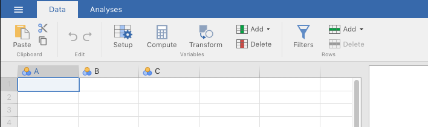
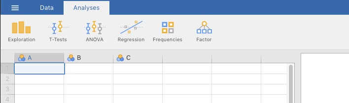
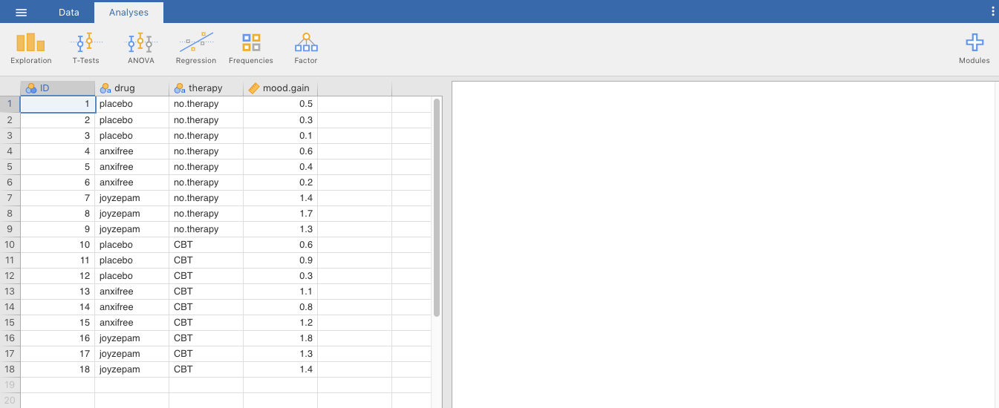
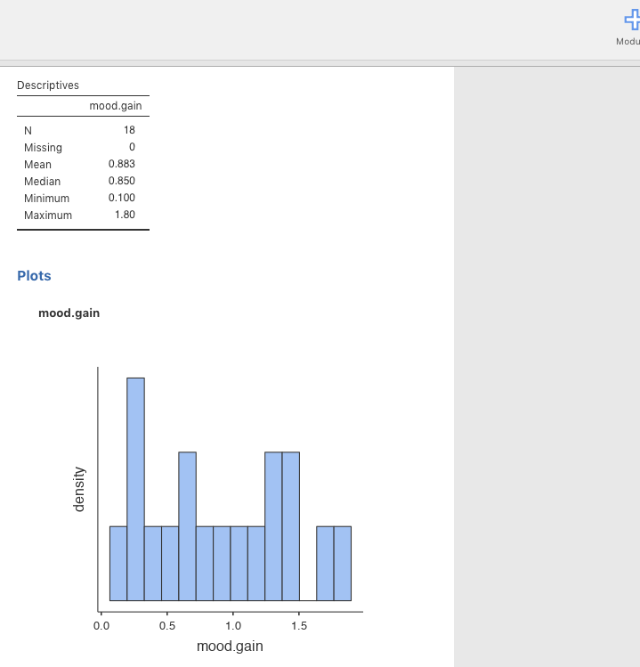
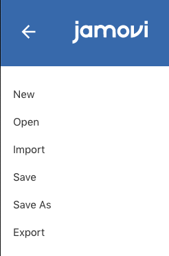
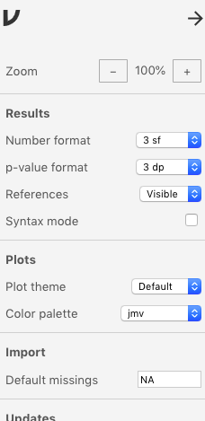
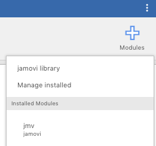
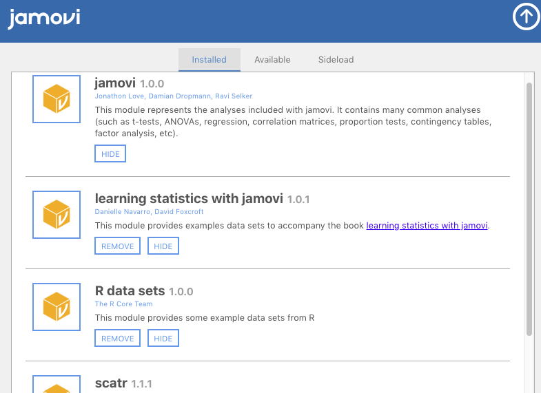

# (PART) Basics {-}

# Getting used to jamovi {#GettingUsedtoJamovi}

This short chapter will introduce you to jamovi [@jamovi]. 

As noted in the last chapter, [jamovi](https://www.jamovi.org/) (first letter is lowercase) is free statistical-analysis software that is built on top of a wildly popular, free, statistically-centered, programming language called R [@R-base]. The difference is that jamovi consists of a GUI, whereas R is command-line software. That is, jamovi is point-and-click with easy-to-use pull-down menus, whereas R involves typing code on a blank screen. R is rapidly changing the face of data science, but it can be very intimidating at first because of its command-line nature and, what many (even seasoned programmers) feel to be, unusual programming syntax. jamovi is a much easier program to use, and it is explicitly designed to be manageable for beginners.

## Downloading and installing {#DownloadingAndInstallingJamovi}

This is easy. Just go to the [main jamovi website](https://www.jamovi.org/), find the **download** tab, choose your operating system, then download and install. 

## Navigation {#NavigatingJamovi}

jamovi is laid out such that your data, your **input**, is always on the left in a spreadsheet format (like Excel), and whatever analyses you apply to those data, your **output**, is always on the right.

There are four tabs in the uppermost menu bar. They are as follows:

The **Data** tab in Figure \@ref(fig:DataTab) below shows you a set of options on how to manipulate data within the spreadsheet. 

<br/>

```{r DataTab, fig.cap="The data tab.", echo=F, out.width="600px"}

``` 

<br/>

The **Analyses** tab in Figure \@ref(fig:AnalysesTab) below shows you options for different statistical analyses you can run on the data that you have in the spreadsheet. 

<br/>

```{r AnalysesTab, fig.cap="The analyses tab.", echo=F, out.width="600px"}

```

<br/>

The window that occupies most of the right side of the interface is where output goes. It will be blank until you do something. I'm going to open a data set that will be used in sections below for various pedagogical reasons. I'm just going to calculate the mean for the variable called *mood.gain*.

In Figure \@ref(fig:BlankOutput) below, we have not yet done anything to the data, so the output window on the right is blank.

<br/>

```{r BlankOutput, fig.cap="Data with no analyses performed (blank window on left).", echo=F, out.width="600px"}

```

<br/>

But Figure \@ref(fig:DummyOutput) below shows what you see in that same window after asking for descriptive statistics and a histogram (commands you haven't learned how to execute yet) of the *mood.gain* variable.

<br/>

```{r DummyOutput, fig.cap="Basic descriptive statistics.", echo=F, out.width="600px"}

```

<br/>

- There is a **Basic operations**^[We don't know the official name of this.] menu on the far left that is triggered by clicking the three horizontal lines, or $(\equiv)$. See Figure \@ref(fig:BasicOperationsMenu) below. Clicking this will make some file operations slide in from the left. These are things like saving the .omv file with a name, importing data, exporting data, etc. Note that to get out of this menu option, you just need to click the big arrow. This is true for any sub-menu in jamovi.

<br/>

```{r BasicOperationsMenu, fig.cap="The basic operations menu.", echo=F, out.width="300px"}

```

<br/>

- There is a **Preferences**^[Same here. There seems to be no official name.] menu on the far right. See Figure \@ref(fig:PreferencesTab) below. To activate it click the three vertical dots $(\vdots)$. There are settings in here. You may want to change the color scheme, or round numbers to a certain number of decimals, etc. You can set these preferences here.

<br/>

```{r PreferencesTab, fig.cap="The preferences menu.", echo=F, out.width="300px"}

```

<br/>

- Finally, there is a tab labeled **Modules** on the far right when you are under **Analyses** (there is a **plus sign** "+" to identify it as well). To understand what is going on with this tab, you first have to understand that when you downloaded jamovi, you downloaded it in its base form. The base form is what the authors of the software believe will carry you through basic analyses without overloading the software and making it unnecessarily large to download and install. However, many users will want or need to carry out specific analyses that the software authors consider either unusual or extra. They provide this extra functionality in the form of modules. They are written by either the jamovi team, or in many cases, avid users of jamovi (you can do so as well, if you're so inclined).

If you click this tab, and then select **jamovi library**, you will see a pop-up menu consisting of the available modules that are either already **Installed** (the upper-left tab) or **Available** for download (the middle tab). Do not worry about tab on the upper right, **Sideload**, unless you want to write and test your own module. See Figure \@ref(fig:ModulesTabs) below.

<br/>

```{r ModulesTabs, fig.cap="Modules in jamovi.", echo=F, out.width="200px"}


```

<br/>

You might notice that one module is installed by default. This is the base **jamovi** module that comes with the software. However, there are some other modules you will need installed for this class. They are as follows:

- **learning statistics with jamovi**. This module contains the data sets for your main textbook by @lsj. Theses data sets will subsequently become available under the **File Operations** icon (the three horizontal lines in the uppermost menu bar), where you navigate to **Open** > **Data Library** > **learning statistics with jamovi**, where you will then see a list of the data sets.

- **scatr**. This module lets you make nicer scatterplots than are offered in the base module. Scatterplots are relevant to Chapters \@ref(DataVisualization), \@ref(CorrAndLinearReg), and \@ref(WritingResultsSections). Once installed, you will find the **scatr** menu under the **Analyses** view, under **Exploration** > **scatr**.

- **R data Sets**. This module loads the sample data sets that come with R. You will be using one or more of these data sets in this lab manual.

<br/>

## Outside help on basics {#OutsideHelpOnBasics}

### Overall introduction {#OutsideHelpOnOveralIntroduction}

[datalab.cc's general introductory tutorial on jamovi](https://datalab.cc/tools/jamovi) is a nice overview of jamovi. Choose video #1, called **Welcome**. If you are at Texas A&M University, you can also go to the *Howdy!* portal and search for jamovi in the *LinkedIn Learning* tutorials. In fact, all of  datalab.cc's tutorials on jamovi are available there.

<br/>

### Downloading and installing {#OutsideHelpOnDownloadingAndInstalling}

Here are some tutorials on how to download and install jamovi:
  - the [jamovi User Guide](https://www.jamovi.org/user-manual.html#installation)
  - the [datalab.cc video tutorial](https://datalab.cc/tools/jamovi) on how to do this. Scroll to video #2, **Installing jamovi**.
  - @lsj, Chapter 3, Section 1 (3.1)

<br/>

### Navigating {#OutsideHelpOnNavigating}

- [datalab.cc's video tutorial on navigating jamovi](https://datalab.cc/tools/jamovi). Scroll to video #3, **Navigating jamovi**
- [the jamovi user guide](https://www.jamovi.org/user-manual.html#getting-started)

<br/>

### Modules {#OutsideHelpOnModules}

[datalab.cc's video tutorial on jamovi modules](https://datalab.cc/tools/jamovi). Scroll to video #7, **jamovi modules**.

<br/>

## Conclusion {#ConclusionOfBasics}

Now that you are somewhat familiar with the layout of jamovi, it's time to learn how to work with data. This is the topic of the next chapter.