# Basic data operations {#BasicDataOperations}

This chapter helps you through a number of issues that have to do with data entry, opening it, exploring it, importing it. exporting it, modifying it, etc. The best way to learn in this chapter is to follow along in each section using jamovi on your own computer. There are also some extra practice exercises at the end of the chapter.

<br/>

## Entering data manually {#Manualling}

Okay, about the only people who enter data manually anymore are students who are learning about statistical analysis software.^[In some cases, presumably, data might be collected on paper, and have to be entered manually. And there might be people digitizing certain, important data from analog to digital for archiving purposes. But overall, these sorts of tasks are rare nowadays in psychology.] Nonetheless, entering data manually is a great exercise in getting to know any statistical-analysis software, like jamovi. In fact, there is one case where entering data manually serves a unique purpose in jamovi. We'll get to that at the end of this chapter since it is not critical.

When you start jamovi, or open a *new* document [i.e., $(\equiv)$ > *New*], you will see three default variable names, **A**, **B**, and **C**, in the the three leftmost columns of the spreadsheet (jamovi expects you to change these variable names). There is also a tiny, grayed-out column on the far left that gives you the row number of the spreadsheet. The default scale of measurement for variables A, B, and C is nominal (categorical). To see this, just double-click A, B, or C. See Figure \@ref(fig:DefaultVarView) 

<br/>

```{r DefaultVarView, fig.cap="Default view of variables in jamovi.", echo=F, out.width="600px"}
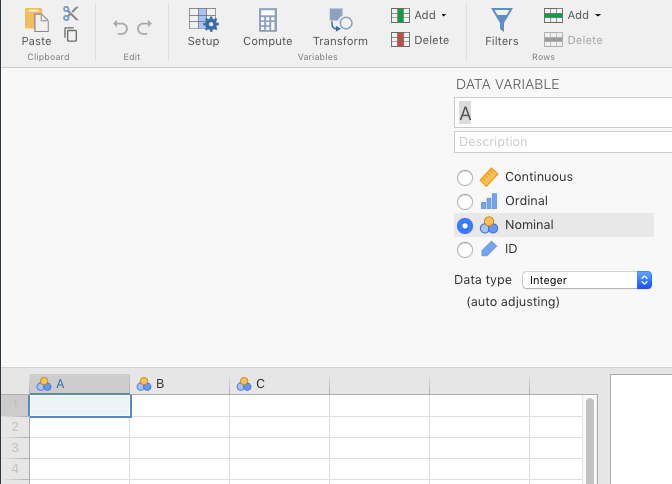
```

<br/>

As long as you're doing this, you might as well save this file as YOUR.LASTNAME_YOUR.FIRSTNAME_jamoviPractice.omv,^[.omv being the native file extension for jamovi files] or something like that.

The point of saving the file this way is to emphasize a few things:

1. jamovi is a desktop application (not a cloud-based program), so you actually do need to save files on your hard drive  
2. You should always use meaningful file names so that you can idenfity what's in them later on  
3. You should have your name in the title of almost any document that you share with your instructor or TA (receiving 22 documents that are all titled "MyJamoviPractice.omv" can be pretty frustrating)  

Back to the task at hand...

When you double-click on the variable name (or single-click, followed by **Data** > **Setup**), you'll see the details of that variable. The topmost box will be the official variable name. This variable name should be short enough to keep you from having to type out really long names repeatedly (e.g., use **Eighth Grade Aggression** instead of **the aggression measurements of kids in the eighth grade**), but not so short that the meaning of the variable becomes opaque (e.g., use **Eighth Grade Aggression** instead of **8GA**). ^[You might have noticed (or eventually notice) that some researchers (like me) use underscores (_) instead of blank spaces in variable names (periods are also common). This is because in many statistical programming languages like R, spaces in variable names can be problematic and cause errors. You can use spaces in jamovi though, and it works out better for graphics. Just don't use too many words.]

The next box down, **Description**, is an alternative description for the variable. This is basically for the researcher's notes. Be as descriptive as you like. It won't be output to any graphics or analyses.

Below that on the left, you'll see a vertical series of 4 buttons. These define the scale of measurement that the variable represents. We only use **nominal**, **continuous**, and **ID** in this class. Implicit in **continuous** are two levels: **interval** and **ratio**. Using the drop-down box to the right of the button selections, interval data should technically be coded as **integer**, and ratio data should be coded as **decimal**. See Figure \@ref(fig:EighthGradeAggr) for an example.

<br/>

```{r EighthGradeAggr, fig.cap="Re-labeling and changing the scale of measurement.", echo=F, out.width="600px"}
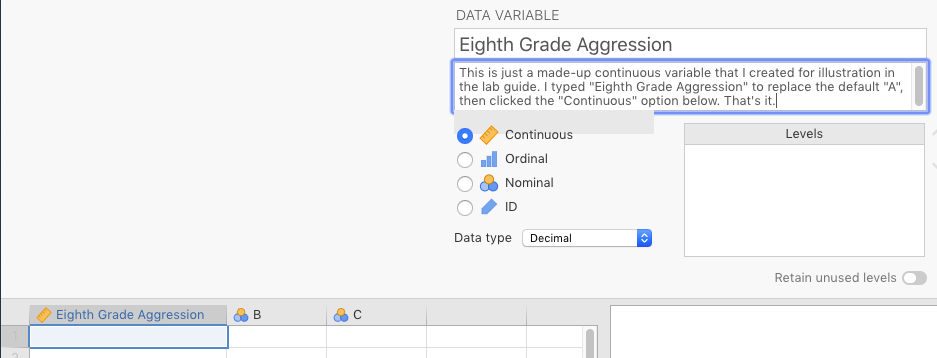
```

<br/>

The **ID** variable is just an anonymous substitute for a participant's name. It's either a pseudonym (a fake name, like *AAB* or *Los Angeles* or *frogma*) or a number, but for analysis purposes, it's just a unique label, not a number.

If one or more of your variables is nominal, then you will need to define the levels, which appear in the box to the right, labeled **Levels**. But the levels won't appear there magically, if you have a variable **Sex** with two levels (with 0 for female and 1 for male), then first you'll need to type in the numbers you need in that column directly in the spreadsheet. These numbers will then appear automatically as the levels in the **Setup** window for that variable. 

This is where you'll need to double-click the box for 0, and type over it with **female**, and then do the same for 1, and replace it with **male** (don't do this in the spreadsheet, but rather here, in the **DATA VARIABLE** box). What you do here matters for several functions that you will carry out later, particularly graphics. So it's a good idea to get this right, and to to be consistent for any nominal variable you have.

In Figure \@ref(fig:SexZeroOneVar) below, we've created the variable **Sex**, made it **Nominal**/**Integer** and coded 0s as **male** and 1s as **female**.^[Yes, we reversed them from how they were described above, just to show you that the number-label associations are wholly arbitrary]

<br/>

```{r SexZeroOneVar, fig.cap="Assigning values to factors.", echo=F, out.width="600px"}
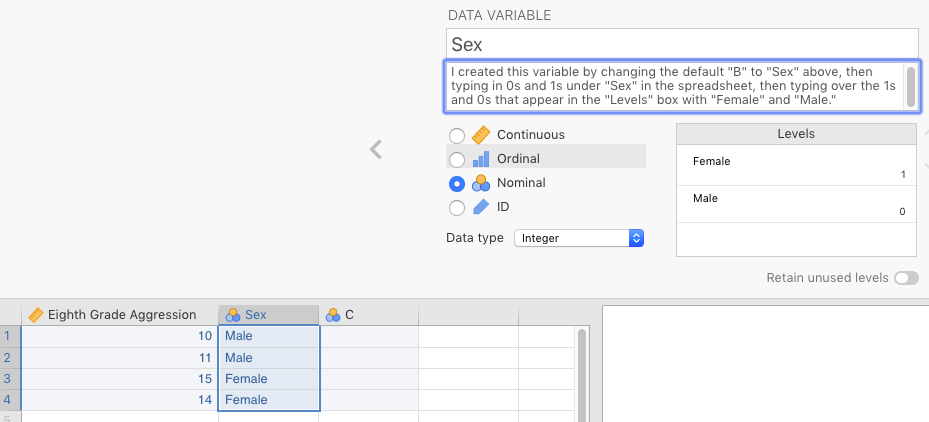
```

<br/>

Now that that's done, if you start entering the real data manually in the spreadsheet, one of three things will happen.

1. If your data is continuous, and you enter a number, it will stay as that number. Note however, that the maximum number of decimal places that jamovi will display (irrespective of how many you enter) is defined under preferences, or $(\vdots)$   >   **Results** > **Number format**.  
2. If your data is nominal, with numbers representing levels (e.g., 0 = female), then as you enter a number in the spreadsheet (say 1, under **Sex**), that cell will turn into **male** as soon as you enter a 1 in there. Underlyingly, it is a 1, but jamovi is displaying it as **male** to you.  
3. If you have your nominal variable coded as text, then you can just type in the level in here (e.g., **female**). 

jamovi can deal with both (2) and (3) above for analysis, but method (3) is not really recommended as it's much more likely that you'll accidentally introduce a new, unwanted level through misspelling (e.g., **famale**). See Figure \@ref(fig:BadLevelThruMisspell) below for an example of this, which you might not notice browsing through the spreadsheet.

That said, when using method (2), it's a good idea to make sure that in the drop-down menu under *Data type* you choose *text*. Otherwise, you will get some confusing (albeit harmless) statistics when carry out *descriptives* (the topic of Chapter \@ref(DescriptiveStats)).

<br/>

```{r BadLevelThruMisspell, fig.cap="Relative difficulty in seeing a bad level when the data is entered as text.", echo=F, out.width="600px"}
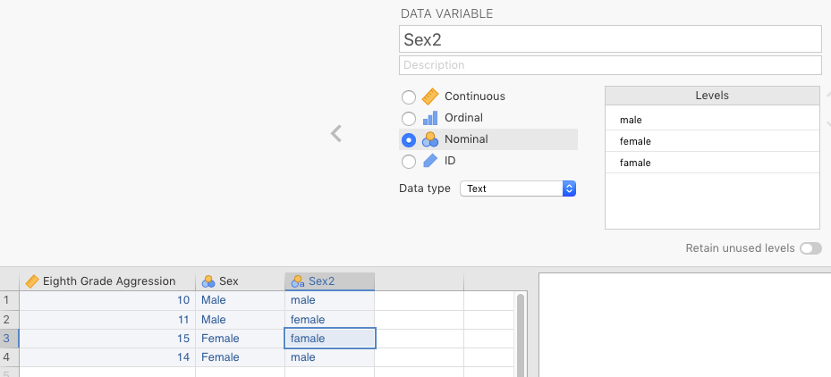
```

<br/>

In contrast, if you make a mistake and enter a 2 instead of a 0 or a 1 for **Sex**, you'll see a 2 there. It will stand out like a sore thumb. See Figure \@ref(fig:BadLevelThruNumber) for an example of this.

<br/>

```{r BadLevelThruNumber, fig.cap="Relative ease in seeing a bad level when the data is entered as a number.", echo=F, out.width="600px"}
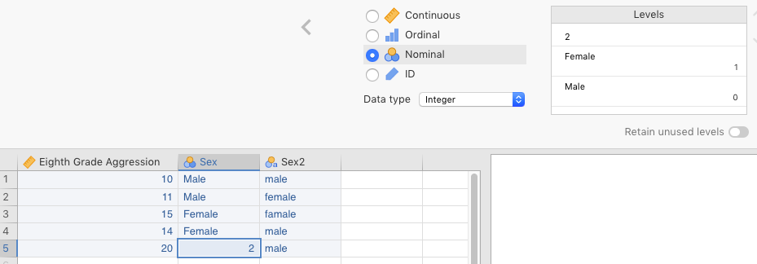
```

<br/>

You can find a practice exercise for this section below: *Practice Exercise* \@ref(PracManualing).

Now on to something much simpler, but also much more reflective of what you will actually be doing with data: Opening existing data files.

<br/>

## Opening data files {#Opening}

This really isn't so much about how to open files (something we assume you all learned back in elementary school), as it is about what files are available to open in jamovi in order to get used to how data looks and works in the software.

jamovi comes with a few sample data sets pre-installed. They can be found by clicking $(\equiv)$ > **Open** and choose one of the four default sample data sets.

If you haven't already done so, you should also install the module for the main textbook for the class [@lsj]. To install it go to **Analyses** > **Modules (+)** > **jamovi library** > **Available** > **learning statistics with jamovi** > **Install**. As noted above, you'll find the sample data sets (all from Psychology) under $(\equiv)$ > **Open** > **learning statistics with jamovi**. The main textbook will refer to these data sets throughout the course. You can see this step in Figure \@ref(fig:OpenLsjDatasets) below. Also, in contrast to the four default data sets in jamovi, not all the data sets from @lsj are native-jamovi .omv files; some of them have different file extensions, like .csv. We'll get to that, especially under \@ref(Importing). Finally, you should also install the module called **R data sets**, as you will work with one or more of these in this lab manual.

<br/>

```{r OpenLsjDatasets, fig.cap="Finding sample spreadsheet data in jamovi.", echo=F, out.width="600px"}
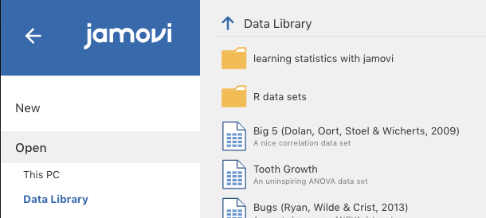
```

<br/>

``` {block2, type = ".rmdnote"}
**NOTE**: jamovi will keep opening up new windows as you open new data sets. You can close any one of them by clicking the red button in the upper, left-hand side of the jamovi window (on a Mac) or the x symbol in the upper, right-hand side (on Windows).^[We are not yet sure how this is done in Linux or ChromeOS yet] However, if you want to keep jamovi up and running, make sure you have at least one other jamovi window active. The easiest way to do this is to go to $(\equiv)$ > **New** before you close the data set you are working on. Otherwise, you will need to re-start jamovi. Much like SPSS, jamovi assumes that if you do not have a data file open, then you do not want software program open either.^[One trick is just to keep a blank, *New* data file open at all times. This is useful if you keep accidentally closing jamovi down.]

```

<br/>

## Importing data {#Importing}

jamovi is not data-collection software.^[Nor are SPSS, SAS, Stata, R, or any data-analysis software, with the two notable exceptions of MATLAB and Python, which can be used to write programs that collect data.] This means that when the data file is not given to you from within jamovi (e.g., sample data sets), you will need to get the data from wherever you collected it into jamovi. This is known as **importing data**.

There are a variety of ways that this might take place, but two of them are far more common than others: 
- importing data from a proprietary data format
- importing data from a non-proprietary delimited text file

<br/>

A proprietary data format is primarily one generated by commercial software. For instance, SPSS stores its data in .sav files. SAS stores its data in .sas7bdat files^[Yes, that's the weirdest file extension in the history of computers.] and Stata in .dta files. Usually, jamovi will open these directly as it uses powerful R packages, like [*haven*](https://cran.r-project.org/web/packages/haven/index.html), that know how to open these files. Just click $(\equiv)$ > **Open** > **This PC** > **Browse** and find the file that you need to open (it needs to be downloaded on your computer already).

But the most convenient and reliable way to transfer data from computer to computer and software to software is through an intermediate data-file structure known as a delimited text file. This is a plain-text file that can be opened by pretty much any software (free or commercial) that reads text files in any way. A plain-text file is really the simplest of file formats. But a delimited text file is a special case: It takes data that is in table format, and converts it into plain text, where rows from your data frame usually correspond to new lines, and column boundaries from within rows in the data frame are converted into specific characters, like commas, semicolons, or tabs. The top-most row often, but not always, contains the variable names (the *header*). An example of such a file can be seen in [the jamovi Quickstart Guide](https://www.jamoviguide.com/loadData.html#file-format). 

We converted the data set from @lsj called *Clinical Trial* into both comma-delimited and tab-delimited files. When you open them up with a simple text editor like *Notepad* or *Text Edit*, you'll see something like Figure \@ref(fig:ClinicalTrialAsCsv) below. It is in raw, plain-text, comma-separated (.csv) format on the left, and in its tab-delimited format (.txt or .tsv) on the right.^[You can't see the tabs because tabs aren't normally meant to be seen by computer users, but rest assured: they're there.]

<br/>

```{r ClinicalTrialAsCsv, fig.show="hold", out.width="50%", fig.align="left", fig.cap="Examples of comma-delimited (left) and tab-delimited (right) files", echo=F}
knitr::include_graphics(c("images/BasicDataPrep/ClinicalTrialAsCsv.png", "images/BasicDataPrep/ClinicalTrialAsTab.png"))
```

<br/>

jamovi opens delimited text files just as easily as proprietary data files. In Excel, there's generally a wizard that you have to get through to import delimited files. In contrast, jamovi imports them straight up, no wizards.

Just click $(\equiv)$ > **Open** > **This PC** > **Browse** and find the delimited file. jamovi will do its best to import the data. It pretty much always works unless there is something wrong with the data file itself. You can try this yourself by opening the data set **booksales**, located at the top of the data sets available from @lsj. Just go to $(\equiv)$ > **Open** > **Data library**, and look for **booksales** at the top. It's a comma-delimited text file. It opens up quite easily. However, you will need to go in and change the data types for a few variables. It seems to treat numbers as nominal data.

Beware however, that jamovi will sometimes import defective delimited files and assume that they're not defective. This results in a bad data set. You often need to check your visually. If you data set is large, then you can use descriptive statistics (covered in Chapter \@ref(Descriptive Stats)) to find evidence of this kind of problem. To illustrate this, we deliberately distorted a file containing reaction times, and then imported it through jamovi. In this case, we removed the commas from the very last line of data. The results can be seen below in Figure \@ref(fig:BadReactionTimeImport) below.

<br/>

```{r BadReactionTimeImport, fig.cap="jamovi importing a bad comma-delimited file, where the final line of data had its commas removed.", echo=F, out.width="600px"}
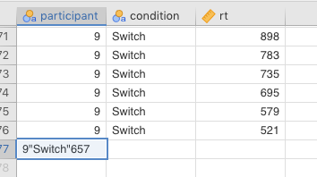
```

<br/>

As you can see, there were supposed to be 3 columns of data: an *ID* variable (*participant*), a *condition* variable, and the dependent (outcome) variable *rt* (reaction time). But since the commas were removed from the last line, jamovi thought that all three variables were really just one, and assigned that value to *participant*. You should always be on the lookout for such data-import errors in your own work.

For practice on importing data, go to *Practice Exercise* \@ref(PracticeImporting), but you might want to wait until you read the next section, as well as do the practice exercise for exporting. The reason is that you will be importing data that you export (from Google Sheets, or manually) for those exercises.

<br/>

## Exporting data {#Exporting}

All statistical software (e.g., SPSS, SAS), all spreadsheet programs (e.g., Excel, Google Sheets), and all database software (e.g., MS Access, SQL, Filemaker) will export their native tables/data frames into delimited text file formats. Crucially for those of you collecting your own data in groups, Google Forms also does this (as long as you have already collected some data). You should take advantage of exporting your data into delimited text files in all cases ***except*** when you are absolutely positive that your colleague has the exact same software as you do (e.g., you both have jamovi, or SPSS, or SAS, etc.). 

The comma-delimited file usually has a specific .csv extension (meaning "**c**omma-**s**eparated **v**alues"). Tab-delimited files use a .tsv or just .txt extension.

<br/>

```{block2, type="rmdnote", echo=T}
**NOTE**: There is something you should understand about these delimited text files however. This is ultimately not that important, but may help to eliminate some confusion down the road. Delimited text files are non-proprietary (not owned by any particular company). So like we said, just about any software can open them and read them as they are supposed to be read. 

Moreover, the file extensions that go with them (e.g., .csv, .tsv) are simply informal user conventions that serve as "clues" for your computer and/or software as to how to open them. So a .csv extension tells your software that it is likely (but not assured) that this is a delimited file with commas acting as delimiters. The less-universal .tsv extension tells your software to guess similarly, but to expect tabs instead. 

All this helps explain a common phenomenon that many novice data analysts find confusing. Specifically, many data-collection software programs say that they will export to Microsoft Excel, and do so with an .xls file extension. Then when you open it with Excel (which your computer will probably do automatically if Excel is installed), Excel tells you that it is not actually an Excel file after all, and that you have to import it as a delimited text file. 

This is confusing until you realize that what these software programs are doing is creating a valid, text-delimited file, but arbitrarily pasting an .xls extension to the end of of the file name. The extension tells your computer to use Excel specifically to open it (and Excel can do so), but since it is not actually a proprietary Excel file, Excel will instead sent it through a delimited-file import procedures. 

You can actually try this trick yourself by clicking any delimited text file that you have created, and changing the extension to .xls. Then double-click it. If you have Excel installed, your computer will probably call up Excel to open it, but then Excel will have to import it.

Presumably, these data-collection software programs do this so that people do not have to figure out which program to use to open these files. This is useful for novices, but  a little annoying for experts.
```

<br/>

One thing you want to make sure of is that you don't have any of these special delimiters ***inside*** the values of your delimited file. This will split up your data in places you don't want it to split. For this reason, linguists, for instance, often avoid comma-delimited files since a lot of language data has commas in it (e.g., passages scraped from the Web). Linguists would prefer something like tabs, or something never used in natural text, like pipes.^[The pipe is the $(\mid)$ character, which is on the same key as the backslash $(\backslash)$. This key is located above your computer's *enter*/*return* key and below the *delete*/*backspace* key at the upper-right of the [QWERTY](https://en.wikipedia.org/wiki/QWERTY) keyboard layout (the default in the US)]

You also have to be careful receiving data from countries that use commas to indicate decimals instead of periods. Finally, you can also create your own delimiters (e.g., the pipe, or semicolons), but you will need to inform your colleagues what your non-standard delimiter is before you share the file with them. Data-analysis software programs always have options do deal with these sorts of anomalies.

For practice on this, go to Practice Exercise \@ref(PracticeExporting). And don't forget to follow that exercise with the practice exercise on importing data (*Practice Exercise* \@ref(PracticeImporting)).

<br/>

## Manipulating data {#ManipulatingData}

The three main types of data manipulation that you can carry out in jamovi are *transforming*, *computing*, and *filtering*. We will only cover the latter two here. Data *transforming* in jamovi is for creating formulas that can be applied to multiple variables. It is a bit beyond the scope of this class, but a nice tutorial from datalab.cc can be found [here](https://datalab.cc/tools/jamovi) as video #15.

<br/>

### Computing new variables {#ComputingNewVariables}

We are going to show you three different ways to compute new variables in this section:

- Recoding new variables based on the values in existing variables
- Generating random variables
- Creating data transformations

<br/>

#### Recoding new variables {#RecodingNewVariables}

You can add a new variable to a data set, based on variables that you already have. One of the most common reasons to do this is if you have one or more other variables already in your data set that you want to derive alternative information from in order to change your analysis or make it simpler.^[Another common reason is if you want to create a new variable that is the sum or average of two or more other variables.] For instance, you may have a variable called *ClassLevel* that has the following four levels: *Freshman*, *Sophomore*, *Junior*, and *Senior*. But it is possible that you'd want to create a new variable called *ClassLevelStatus* (for lack of a better term), with the following two levels: *Upperclassman* and *Underclassman*.^[Pardon the apparent sexism. There seems to be no way to say this without making it sound like socio-economic status (e.g., "Upperclassperson")]

Doing something like this is pretty simple. As illustrated in Section \@ref(Manualling), you can create an  artificial data set with, say, 4 observations each of *Freshman* through *Senior* under a variable called *ClassLevel*. But now we want to create a new variable called *ClassLevelStatus*.

We started by going to the *Data* tab in jamovi, double-clicking the header of a blank variable, and clicking the *$f_{x}$ NEW COMPUTED VARIABLE* icon in the middle of the list. We gave the new variable the name *ClassLevelStatus* (the default was a letter, like *D*). 

You should now have something that looks similar to Figure \@ref(fig:ChangingLevelsOfClassLevelNoFormula) below.

<br/>

```{r ChangingLevelsOfClassLevelNoFormula, fig.cap="Initial window when computing a new variable based on an old variable", echo=F, out.width="600px"}
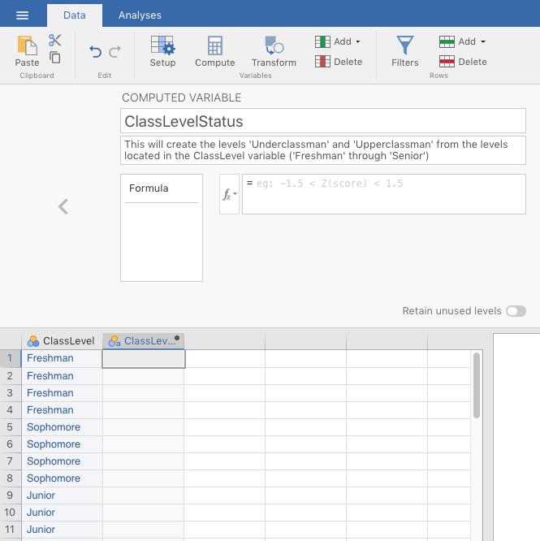
```

<br/>

To create the new variable, we needed a nested **if-then-else** formula.^[This is very common. Microsoft Excel also allows you to do this. In fact, the syntax is identical in Excel as the form is nearly universal.] We could have clicked the $f_{x}$ drop-down box and find the *IF()* function under the *Logical:* heading. But we needed something more complex. The syntax for what we needed is below. We just typed this in to the box next to $f_{x}$.

>IF(ClassLevel=='Freshman','Underclassman',IF(ClassLevel=='Sophomore','Underclassman',IF(ClassLevel=='Junior','Upperclassman',IF(ClassLevel=='Senior','Upperclassman','error'))))

<br/>

You can interpret this formula in plain English as follows:

- If the value of *ClassLevel* is *Freshman*,
  -Then place the value **Under**_classman_ here, under the current variable (*ClassLevelStatus*).
    - (Else) If that's not the case, then check to see if the level is *Sophomore*;
      - If it is, then also put *Underclassman* here.
        - (Else) If that's not the case, then check to see if the level is *Junior*;
          - If it is, then put **Upper**_classman_ here.
            - (Else) If that's not the case, then check to see if the level is *Senior*;
              - If it is, then also put *Upperclassman* here.
- (Else) If none of those are true, then put *error* here.

After we did this, jamovi looked like the Figure \@ref(fig:ChangingLevelsOfClassLevelWithFormula) below.

<br/>

```{r ChangingLevelsOfClassLevelWithFormula, fig.cap="Computed-variable window after the nested if-then-else formula was added.", echo=F, out.width="600px"}
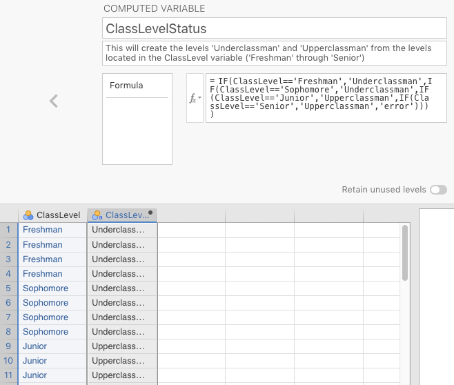
```

<br/>

Note the new values that populated the *ClassLevelStatus* variable in the spreadsheet.

What's going on is that the basic formula is if-then-else, but the *else* part of the formula can be replaced with another *if* statement. This is nesting, and it is very, very useful for recoding variables.

<br/>

```{block2, type="rmdnote", echo=T}
**NOTE**: You might be wondering why we need two equals signs (==) in the computed variable, and not just a single equals sign (=). Recall that jamovi is based on R. In R, two equals signs are used for evaluating particular values. In this case, it can be interpreted as "where it is equal to." In contrast, a single equals sign (=) is used for various other, common operations, including the creation of variables, the assignment of arguments to functions, etc.

In addition, the exclamation mark (!) means **NOT** in R and jamovi. So != means "where it is **not** equal to." Thus, the equivalent for our purposes would be =ClassLevel != 'Freshman' (i.e., "if the value is NOT 'freshman', then...").

For numerical variables you can also use the symbols < for "less than", > for "greater than", <= for "less than or equal to" etc.

Your main textbook [@lsj] covers this in Section 6.2.

You might also have noticed the weird sequence of closing parentheses at the end of the formula. This is due to the fact that each IF() statement must have both opening and closing parentheses. The open throughout the formula, but only close at the end. They are actually embedded, like If(IF(IF(IF))), similar to those Russian dolls.
```

<br/>

#### Generating random data {#Randoming}

As noted above, there is a special case of manual data entry that you might find yourself doing for this lab. Many software programs can generate data randomly [e.g., the RAND() and RANDBETWEEN() functions in Microsoft Excel]. In jamovi, this can be done quite easily.

Go to the **Data** tab. Then create a new variable by double-clicking at the top of a blank column. You will see a small menu appear with **NEW DATA VARIABLE**, **NEW COMPUTED VARIABLE**, and **NEW TRANSFORMED VARIABLE**. See Figure \@ref(fig:NewVarIcons), below, for a depiction of what you should see.

<br/>

```{r NewVarIcons, fig.cap="Options for creating new variables.", echo=F, out.width="400px"}
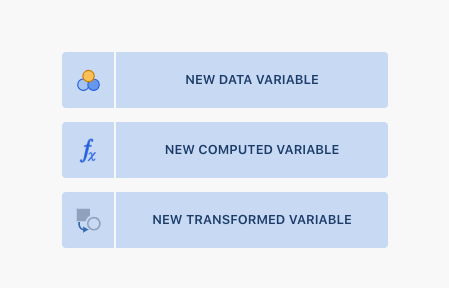
```

<br/>

Click the middle one: **NEW COMPUTED VARIABLE**. Give the new variable an appropriate name. The example we have chosen **Random Normal**, which means that it's going to result in numbers generated randomly from a normal distribution that we define with a user-specified mean and standard deviation. There is a small box labeled $(f~x~)$. Click it and scroll down to the bottom of the **Functions** window where it finally says **Simulation**. See Figure \@ref(fig:RandomNormal1), below, for a depiction of what you should see.

<br/>

```{r RandomNormal1, fig.cap="Finding the formula for a random normal distribution", echo=F, out.width="600px"}
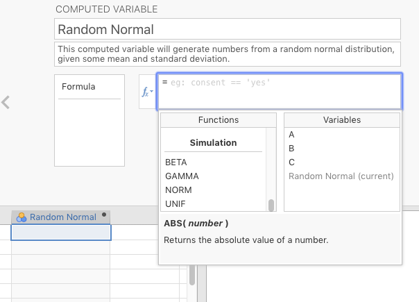
```

<br/>

Double-click **NORM**, and then look in the box to the right of $f_{x}$, and you'll see the following formula: =NORM(). Between the parentheses, type in two numbers separated by a comma. The number to the left of the comma will be the mean of your randomly generated data, and the number to the right of the comma will the standard deviation of that data. For illustration purposes (see below), we have chosen the mean to be 65, and the standard deviation to be 16. You can choose whatever values you want. Press the ENTER/RETURN key.

Once you do that, start typing in numbers (or names, or whatever) in one of the other default columns (you can rename it "ID" later, if you were so interested). You can also skip rows (as we did to illustrate). Then look what happens under the variable **Random Normal**. You should see random numbers being put into the cells between the topmost row with a value, and the bottom-most row with a value. These are randomly generated by jamovi. The results of this little simulation here can be seen below in Figure \@ref(fig:RandomNormal2) below.

<br/>

```{r RandomNormal2, fig.cap="Inserting the formula and observations for a random, normal distribution with a mean of 65, and a standard deviation of 16.", echo=F, out.width="600px"}
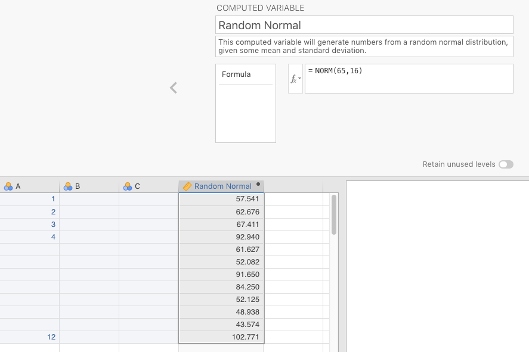
```

<br/>

You will get some actual practice doing this in a later exercise (Section \@ref(PairedSamplesChicoAdvancedData)).

<br/>

#### Data transformations {#DataTransformations}

Sometimes variables have inherently non-normal distributions. This makes them difficult (though not impossible) to analyze because there's an important assumption that applies across all the types of statistics that we do in this class (with the notable exception of chi-square in Chapter \@ref(CategoricalDataAnalysis)). This assumption is that the residuals (or deviations) or normally distributed. These are the distances of each observed value from the model (in the case, the model is the mean).^[This might be slightly confusing, but the *normality* assumption, the assumption of a normal distribution, is not technically about the outcome variable itself, but rather about the residuals/deviations that are left over **after** a statistical model has been applied.] If you measure all these distances, and put them in, say, a histogram, you should see a normal distribution (i.e., a bell curve). If you don't see a bell curve, then you often apply a transformation.

For instance, reaction-time data is almost always skewed positively. The reason for this is that although you can take almost as long as you want to press a button in response to a stimulus, it is very difficult for you to respond faster than, say, 300 milliseconds (in the easiest of tasks). This means that really fast responders will have many reaction times near the low end, clustering around 300 ms, but a few at the high end (for a confusing stimulus; or perhaps they got distracted; there are many reasons, actually).

A solution that is typically applied in reaction-time analyses is the log transformation (or a square-root transformation, or a reciprocal transformation; there are several transformations available).

<br/>

##### Log transformations {#LogTransformations}

If you've forgotten what logarithms are, they are (in base 10) the value you need to exponentiate 10 by in order to reach the number in question. Thus, the logarithm of 1000 is 3 since $10^3=1,000$. The log of 100 is 2 $(10^2=100)$, and the log of 10,000 is 4 $(10^4=10,000)$. You may have noticed that by doing this, extreme values get "pulled in" to the left. So a reaction time of 532 milliseconds (ms) is 2.726 $(10^{2.726}=532)$, and a reaction time of 2,345 ms is 3.37 $(10^{3.37}=2,345)$. So 2.726 and 3.37 are much closer to each other than 532 and 2,345.

Below is some raw reaction-time data.^[courtesy of the R package *trimr*.] Our only purpose here is to show you the positive skew in a histogram, and how applying a logarithm to the data brings in the skew.

<br/>

```{r, echo=FALSE, message=FALSE, warning=FALSE}
library(trimr)
data(exampleData)
dat <- exampleData %>% 
  dplyr::filter(condition=='Switch') %>%
  dplyr::select(-accuracy, -condition)
rm(exampleData)
detach("package:trimr", unload=TRUE)
write.table(dat,"datasets/BasicDataPrep_RTdata.csv", sep=",", row.names = FALSE)
```

<br/>

```{r, echo=FALSE, message=FALSE, warning=FALSE}
jmv::descriptives(
    data = dat,
    vars = rt,
    hist = TRUE,
    n = FALSE,
    missing = FALSE,
    mean = FALSE,
    median = FALSE,
    min = FALSE,
    max = FALSE)
```

<br/>

Clearly, the reaction-time data is extremely skewed, with some reaction times as high as 8,000 ms (8 seconds!).

Now we will apply a log transformation to the data.

For those at Texas A&M, this data set is located in eCampus as *BasicDataPrep_RTdata.csv*.

When the data is opened, we changed the *participant* variable to the variable time *ID*. The variable to the right of that was the raw reaction times (*rt*). We double-clicked the column to the right of that, and then clicked the icon above labeled *$f_{x}$ NEW COMPUTED VARIABLE* (not *TRANSFORMED*, ironically).

It automatically gets a letter name (e.g., *C*), but we changed that to *log10_rt* (for rt with a base-10 log transformation).

Just to the right $f_{x}$ symbol, you can see a small down triangle $(\blacktriangledown)$. We clicked that and searched down for *LOG10*^[You will also see *LN* there, which is a natural-log transformation, where the base isn't 10, but rather the irrational base *e*, or 2.718281... To be sure, the natural log has special mathematical properties, which you can read about [here](https://en.wikipedia.org/wiki/Natural_logarithm), but we have never seen it make a difference in the log transformations of reaction-time data.] and double-clicked it. The formula for the transformation appears in the box to the right. Inside the parentheses we typed *rt* (since that was the variable we were applying the log transformation to). We then pressed enter, and watched as the new, logged values appeared in the new column.

Most of what we have described above appears in Figure \@ref(fig:Log10TransformParameters) below.

<br/>

```{r Log10TransformParameters, fig.cap="Parameter settings to apply a log transformation (base 10) to positively skewed data.", echo=F, out.width="600px"}
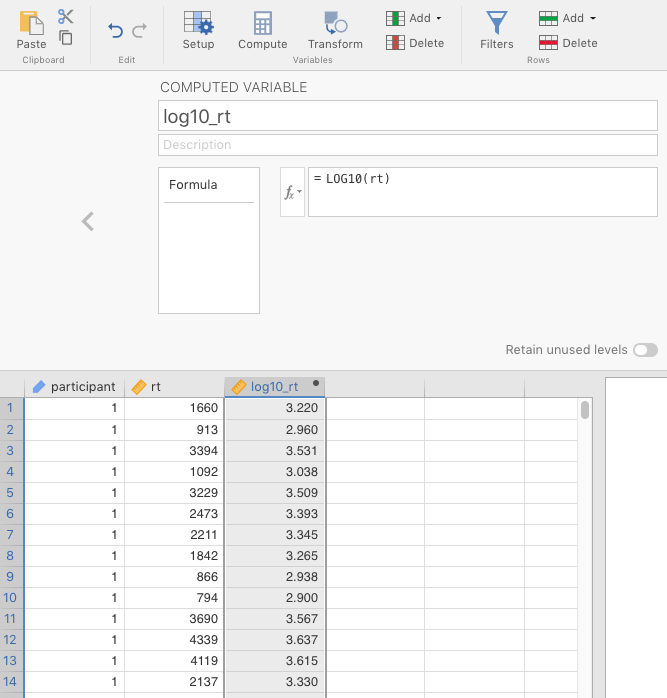
```

<br/>

Now, we can create of histogram of the new, logged reaction-time variable. It is still slightly skewed to the right, but it is much better than before.

<br/>

```{r, echo=FALSE, warning=FALSE, message=FALSE}
dat$log10_rt <- log10(dat$rt)
```

```{r, echo=FALSE, warning=FALSE, message=FALSE}
jmv::descriptives(
    data = dat,
    vars = log10_rt,
    hist = TRUE,
    n = FALSE,
    missing = FALSE,
    mean = FALSE,
    median = FALSE,
    min = FALSE,
    max = FALSE)
```

<br/>

##### *z*-scores {#ZScores}

That said, it is probably warranted to remove a few outliers. The main textbook @lsj covers outliers in Chapter 5, and in Chapter 12, but they deserve some more attention here. Using the same procedure as above, we will generate *z*-scores for the data.

What are *z*-scores?

*Z*-scores are used to re-cast raw scores of any interval or continuous variable into standard-deviation units. One advantage of this is that you *standardize* the scores. We're not being tautological here.^[Well, maybe a little.] Rather, think of how standardized parts revolutionized manufacturing. Instead of each, say, wheelwright making wheels to their own dimensions, societies could invent standards that all manufacturers must follow. This made the world much easier to live in because you could get a wheel in one town, move to a different county or country, and replace the wheel there. You couldn't do that before.

Standardizes scores (*z*-scores) are kind of the same thing. Whereas before you could not compare, say, raw IQ scores to raw cumulative school grades, standardizes scores let you do just that, as all continuous or interval scores can be converted into a scale where 0 means the mean, whole integers refer to the number of standard deviations, and the polarity refer to whether that particular is above (+) or below (-) the mean. For example, a *z*-score of 0 means average (the mean, $\overline x$); a *z*-score of 1 means "located at one standard deviation above the mean;" and a *z*-score of -1.75 means "located at 1.75 standard deviations below the mean."

In jamovi, we calculate *z*-scores by clicking on a new, blank column, selecting $f_{x}$ *NEW COMPUTED VARIABLE*, naming the new variable something like *log_rt_zscores* clicking the $f_{x}$ box and scrolling down to the function *Z*, double-clicking it, followed by double-clicking *log10_rt* (under the right-hand column *Variables*) to place it in between the parentheses (or just typing the variable name there). This can be seen in Figure \@ref(fig:CalculatingZScoresStart) below.

<br/>

```{r CalculatingZScoresStart, fig.cap="Parameter settings to calculate z-scores on the log transformation of the reaction-time data.", echo=F, out.width="600px"}
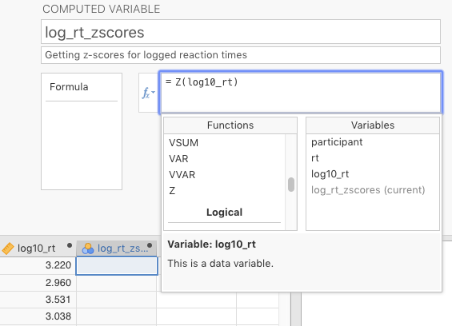
```

<br/>

After pressing <enter> the *z*-scores are calculated for that column. It's that simple.

Now let's go back to the problem of extreme observations (i.e., outliers).

A conservative approach to filtering extreme observations is to remove observations with *z*-scores more extreme than 2 or 2.5 (positive or negative). These correspond to values that are beyond 2 or 2.5 standard deviations away from the mean, so they comprise about 5% or 1% of the observations, respectively.^[Technically, the area below a normal curve at and beyond a *z*-score of +2 is 2.275%. We often use a *z*-score of 2 as a cutoff since it is easier than remembering 1.96, which is the *z*-score beyond which 2.5% of the observations should occur under a normal distribution. Multiplied by 2 for the two sides of the distribution, this comes to 5% of the data. The same is true of using a *z*-score of 2.5. It is easier than remembering 2.57, which, if used as a cutoff, will cut off 1% of the data (only 0.5% of the scores lie beyond 2.57 standard deviations above the mean; multiplied by two equals 1%). Ultimately, cutting off 5% or 1% of the extreme values using *z*-scores of 1.96 and 2.57, respectively, is really just as arbitrary as using *z*-scores of 2 and 2.5 to cut off 4.55% or 1.242% of the data, respectively. The results are really just about the same anyway. It's just easier to remember 2 and 2.5 than 1.96 and 2.57.] You can see why in the histogram below.

<br/>

```{r, echo=FALSE, message=FALSE, warning=FALSE}
colors <- c(rep("red",2), rep("blue",2.5), rep("orange",3))
dat <- dat %>% dplyr::mutate(log_rt_zscores = scale(log10_rt))
hstg <- ggplot2::ggplot(dat, ggplot2::aes(log_rt_zscores))
hstg +
  ggplot2::ggtitle("Histogram with extreme values shaded in pink") +
  ggplot2::geom_histogram(color="black", fill="blue", alpha=.5) +
  ggplot2::annotate("rect", xmin=2, xmax=2.5, ymin=0, ymax=1000, fill="red", alpha=.25) +
  ggplot2::annotate("rect", xmin=2.5, xmax=4, ymin=0, ymax=1000, fill="red", alpha=.5) +
  ggplot2::annotate("rect", xmin=-3, xmax=-2, ymin=0, ymax=1000, fill="red", alpha=.25) +
  ggplot2::annotate("text", x = 2.25, y = 500, label = "z-scores greater than 2", angle=90) +
  ggplot2::annotate("text", x = 3, y = 500, label = "z-scores greater than 2.5", angle=90) +
  ggplot2::annotate("text", x = -2.5, y = 500, label = "z-scores less than 2", angle=90) +
  ggplot2::scale_x_continuous(breaks = seq(-3, 4, 1), lim = c(-3, 4))
```

<br/>

```{block2, type="rmdnote", echo=T}
**NOTE**: Often, researchers do not *remove* extreme values, but rather *trim* them (or *windsorize* them). These approaches change the raw values to scores lying at the extremes, but they do not remove the observations altogether. The decision about which approach to use depends on the study at hand and the tradition of the particular field the study is in.
```

<br/>

Below, we will show you how to remove these outliers, after we show you how to remove observations from reluctant participants.

<br/>

```{block2, type="rmdnote", echo=T}
If you wanted to trim outliers instead of deleting them, you would need to compute a new variable as similar to what was demonstrated in Section \@ref(DataTransformations) above, not use the filtering procedure demonstrated below.
```

<br/>

### Filtering data {#FilteringData}

Just like R, unless you tell jamovi otherwise, it will analyze ***all*** the observations (rows) in your data. All good statistical software does this.^[Spreadsheets like Microsoft Excel do **not** do this necessarily, which is one reason why they can be so dangerous for data analysis. This deficiency is **exactly** what caused the "Excel error heard around the world." (you can Google that phrase)] In order to restrict the analysis to certain rows, you need what is called a ***filter***.

For instance, it is common to have a question at the end of a survey that asks the participant whether they are still comfortable with the researcher(s) using the data they provided for general analysis. The questions could be as simple as "Is it still okay to use your data for analysis? Remember, your data will be completely anonymized, and so in no way will it be traceable back to your identity." Some people are not comfortable with having their data analyzed, and so they answer, "No." Researchers need to filter these observations out.

It is easy enough to create such a data set, so we will do so using the technique learned above in Section \@ref(Randoming). We opened a new file in jamovi [$(\equiv)$ > *File* > *New*]. Under column *A*, we typed in a 1 in the first cell, and changed the variable type to *ID*, and renamed the variable *ID*. For variable *B*, we renamed it *Consent* (with variable type set to *Nominal* and *text*). Then we typed in *Yes* in the first cell. Finally, we deleted variable *C*, and double-clicked on a blank variable and chose *NEW COMPUTED VARIABLE*. We renamed that to *rt*, and then applied the NORM() function to the first cell (see Section \@ref(Randoming) above). We arbitrarily set the mean to 615 ms, and the standard deviation to 112 [hence, NORM(615,112)].

We then typed in "20" in row 20 under *ID*. Under *Consent* we copied-and-pasted *Yes* from row 1 all the way down to row 18. But for the cells in rows 19 and 20, we typed *No*. This would mean that fake participants 19 and 20 did not consent to have their data used. 

So then we needed to filter them out.

This was easy to do. The filter function is located under the *Data* tab. Once there, we just clicked the icon labeled *Filters* (at the upper-right). The icon looks like a funnel, half full of liquid. There's a box there labeled *ROW FILTERS*. In the box under *Filter 1*, labeled $f_{x}$, we typed in the following (the first "=" sign is provided by jamovi):

>Consent=='Yes'

<br/>

This filter equation could be read as follows, like a command to jamovi: "Create a new variable called "Filter 1. For this variable, look under the variable *Consent* and return **only** the rows that have *Yes* as a value in the cell; filter out the others. You can see this below in Figure \@ref(fig:FilterOnFakeNoConsents)

<br/>

```{r FilterOnFakeNoConsents, fig.cap="Results of applying filter (Consent=='Yes') to fabricated lack-of-consent data.", echo=F, out.width="600px"}
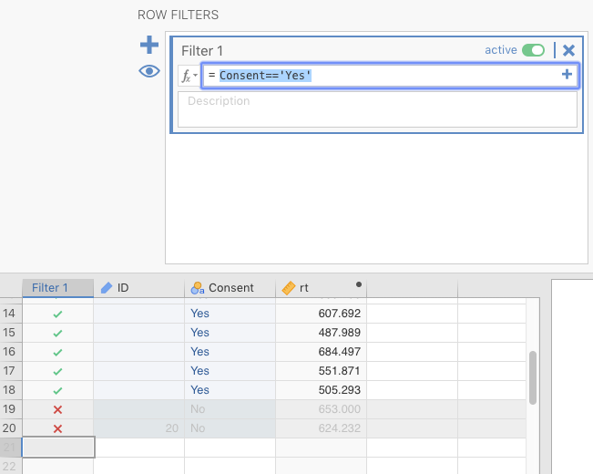
```

<br/>

In the figure (or your own jamovi file, if you are following along), note the green check marks $(\color{green}\checkmark)$ versus red *times* or *X* symbols $(\color{red}\times)$ in the new filter variable that appears on the left under the new variable called *Filter 1*. This means that any subsequent analysis of our variables would be restricted to the observations with green check marks, and those with red Xs will be excluded. That is, the analysis would only apply to people who had consented to have their data analyzed.^[If you click the "eye" symbol, it will hide the rows with $\color{red}\times$'s in them. Click it back, however, before you proceed below, assuming you are following along.]

<br/>

```{r, echo=FALSE, warning=FALSE, message=FALSE}
FilterData <- readRDS("datasets/BasicDataPrep_FilterData.rds")
FilterData2 <- FilterData %>% dplyr::filter(`Filter 1`==1)
rm(FilterData)
jmv::descriptives(
    data = FilterData2,
    vars = rt,
    median = FALSE,
    min = FALSE,
    max = FALSE)
```

<br/>

If you do a simple *Descriptives* procedure (see Section \@ref(DescriptivesInJamovi) in the next chapter), you can see that N=18 (as above) since the procedure did not analyze the observations that were filtered out (i.e., #19 and #20).

To remove the logged reaction-time outliers described in Section \@ref(DataTransformations) above, you would simple repeat the filter above, but the formula in the $f_{x}$ box would be as follows (for deleting observations greater than 2.5 standard deviations from the mean). In this case, we are not using the *z*-score column we created; rather, we're calculating the *z*-score within the filter formula.

>"-2.5 < Z(log10_rt) < 2.5"

<br/>

This can be read as follows: "Filter **in** any values of log10_rt where the *z*-score of that variable is not only greater than -2.5, but also less than +2.5" (i.e., filter **out** the more extreme values that are either less than or equal to -2.5 or greater than or equal to +2.5). You can see this jamovi filter in Figure \@ref(fig:FilterOnExtremeRTs) below.

<br/>

```{r FilterOnExtremeRTs, fig.cap="Results of applying filter to extreme (logged) reaction times.", echo=F, out.width="600px"}
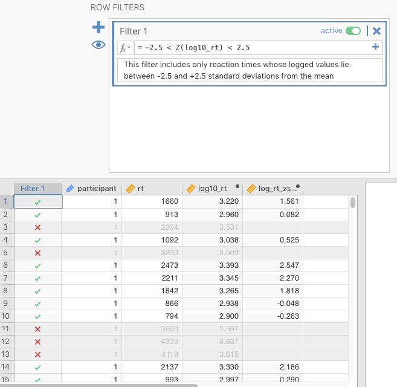
```

<br/>

## General note: Understanding *tidy*-ness {#GeneralNoteUnderstandingTidyness}

This final section (before covering outside tutorials) is about understanding how data ought to be organized for easy analysis. As such, it's less about how you prepare data in jamovi, and more about how you should structure data in general, irrespective of the software you are using.

Often, when working with data, researchers find themselves dealing with data that was entered in such a way that it can't be analyzed statistically. This is usually data entered by people who are not used to doing statistical analyses. 

You might fear that each statistical software program has its own way of organizing data for analysis, but we're happy to tell you that your fears would be unjustified. As luck would have it (*skill*, not *luck*, actually), these programs are written by some very smart people, and they have converged on one way of organizing data: *tidy* format.^[Note that this is not true for spreadsheets like Microsoft Excel and Google Sheets. [Spreadsheet programs](https://en.wikipedia.org/wiki/Spreadsheet) like Lotus 1-2-3 were originally designed for accountants, and because of that, they offer so much flexibility and power that proper data storage and statistical analysis can quickly become problematic. Spreadsheets also astoundingly opaque when you share it with someone else (it's notoriously difficult to unpack a developed spreadsheet). Nonetheless, because of their apparent simplicity and rapid learning curve, many people use spreadsheets to store data, and even analyze it there. One humorous/not-so-humorous example of a major mistake using spreadsheets was the "Excel Error Heard around the World," (Google this) caught in 2013 by the (at-the-time) 28-year-old Thomas Herndon. That said, spreadsheets can be useful for some things in data analysis, but one must be extremely careful. A better alternative is usually a delimited-file editor like [CommaChameleon](http://comma-chameleon.io/)]. (Text-delimited files are covered in more detail in the next section) This universal data format has come to be known as [tidy](https://en.wikipedia.org/wiki/Tidy_data) data format, a term we can probably trace back to Hadley Wickham, head programmer at RStudio [@tidy-data].

The briefest description is that in a tidy data set, all of the following are true:

- all columns are variables (outcome, predictor, or ID variables; but sometimes things like *filters* or even comments);
- all rows are observations (or cases): people, rats, etc.; and 
- each cell is one datum^[It's not usually recommended nowadays to use the singular form for *data* (lest you sound pedantic or ostentatious, since it really has fallen out of normal usage), but in this case it's justified.] for that observation on that variable, with no data summaries. 

<br/>

Anything other than the tidy data structure above will usually cause problems with data analysis, something that is true across statistical-analysis software.

You will not have to worry too much about having non-tidy data sets in this class because, at least for your class projects, Google Forms automatically exports data in tidy format. The sample data sets from jamovi and the class textbook are all tidy.

But if you find yourself handling data as a professional some day, even if you are not doing statistics yourself, please remember *tidy* data format. This is especially true if you are preparing data for other data scientists (e.g., statisticians) to use. They will appreciate your efforts to make their lives easier.

<br/>

## Outside help on basic data preparation {#OutsideHelpOnBasicDataOperations}

[datalab.cc](https://datalab.cc/tools/jamovi) has a general introduction to this part of data analysis. Go to video #9 (*Wrangling Data*) to see this. As noted previously, at Texas A&M, you can find it under the *LinkedIn Learning* tutorials through the *Howdy!* portal.

<br/>

### Entering and adjusting data {#OutsideHelpOnEnteringData}

You should know that for a good overview of what is covered above, you can go to [datalab.cc's videos](https://datalab.cc/tools/jamovi) #10 and #12 (**Entering data** and **Variable types & labels**, respectively).

<br/>

### Opening data {#OutsideHelpOnOpeningData}

For further orientation as to how to do what we just explained above, watch the video from the [*Sample data* tutorial from datalab.cc](https://datalab.cc/tools/jamovi). Scroll to video #4.

<br/>

### Importing data {#OutsideHelpOnImportingData}

Here is the datalab.cc video tutorial on [importing data](https://datalab.cc/tools/jamovi). Go to video #11. Or [here](https://www.lynda.com/jamovi-tutorials/Importing-data/5016725/5035745-4.html?org=tamu.edu) for Texas A&M students.

Your main textbook [@lsj] also covers this in Sections 3.4 and 3.5.

<br/>

### Recoding variables {#OutsideHelpOnRecodingVariables}

There is no tutorial at [datalab.cc](https://datalab.cc/tools/jamovi), *per se*, for re-coding variables in the way described above in Section \@ref(ComputingNewVariables). However, it does have a nice tutorial on how to average two or more variables into a third. This is extremely useful sometimes. This video is #13. Texas A&M students can find it [here](https://www.lynda.com/jamovi-tutorials/Computing-variables/5016725/5035747-4.html?org=tamu.edu).

Your main textbook [@lsj] covers this in a way not covered here. Specifically, it outlines how to convert a numeric variable to a discrete, nominal variable using formulas.^[This practice is possible, but generally frowned upon since it necessarily involves the loss of information.] This is Section 6.3.2 of the textbook.

There is also a tutorial on how to create a *transform*. Transforms in jamovi are saved functions that allow you to create new variables quickly according to the parameters of the function. This is usually most useful in large data sets with many variables. Go to [datalab.cc](https://datalab.cc/tools/jamovi) and scroll to videos #15. At Texas A&M, you can find it [here](https://www.lynda.com/jamovi-tutorials/Transforming-scores-categories/5016725/2213133-4.html?org=tamu.edu). The jamovi blog [@jamoviblog] also has a tutorial on this [here](https://blog.jamovi.org/2018/10/23/transforming-variables.html).

The jamovi blog also covers data transforms [here](https://blog.jamovi.org/2018/10/23/transforming-variables.html)

Finally, your textbooks also covers this in Section 6.3.3.

<br/>

### Generating random data {#OutsideHelpOnGeneratingRandomData}

There is nothing on datalab.cc. However, the jamovi blog has a short blog post on it (a mention, mostly) [here](https://blog.jamovi.org/2017/11/28/jamovi-formulas.html#simulation).

<br/>

### Transforming variables {#OutsideHelpOnTransormingVariables}

Go to [datalab.cc](https://datalab.cc/tools/jamovi) and scroll to video #14 to learn how to transform your data into *z*-scores. This is really the same kind of procedure (using *$f_{x}$ NEW COMPUTED VARIABLE*) as in Section \@ref(DataTransformations) above, and video #13, mentioned above in Section \@ref(OutsideHelpOnRecodingVariables). This can be found at Texas A&M [here](https://www.lynda.com/jamovi-tutorials/Computing-Z-score/5016725/2211168-4.html?org=tamu.edu). 

The jamovi blog also has a post on computed variables [here](https://blog.jamovi.org/2017/11/28/jamovi-formulas.html)

Finally, your main textbook [@lsj] covers this in section 3.3.2. And it covers logarithms and exponentials in Section 6.4.

<br/>

### Filtering data {#OutsideHelpOnFilteringData}

Go to [datalab.cc](https://datalab.cc/tools/jamovi) and scroll down to video #16. At Texas A&M, go [here](https://www.lynda.com/jamovi-tutorials/Filtering-rows/5016725/5035748-4.html?org=tamu.edu).

The jamovi blog [@jamoviblog] also has an introduction to filters [here](https://blog.jamovi.org/2018/04/25/jamovi-filters.html).

Your main textbook [@lsj] covers this in Section 6.5.

<br/>

## Practice Exercises {#BasicDataPreprationPracticeExercises}

### Practice entering data {#PracManualing}

Here is some practice, Exercise \@ref(BasicDataOperations)A, *Manually Entering data*.

<br/>

#### The data

The textbook by @lsj includes a data set about a clinical trial involving 18 participants divided into two treatment groups (Cognitive Behavioral Therapy [CBT] vs. no therapy [no.therapy]). Within each of these groups of nine, three had been taking a drug called **anxifree**, three had been taking a drug called **joyzepam**, and three a placebo. The outcome variable is **mood.gain**, which is some measure of improvement of mood over some time period. The complete data set is displayed below Table \@ref(tab:tables-ClinTrial). You will have to use the scroll bar to see the entire data set.

<br/>

```{r tables-ClinTrial, echo=F , message=F}
ClinTrial <- readRDS("datasets/DescStats_ClinicalTrial.rds")
knitr::kable(ClinTrial, caption="A clinical-trial data set.") %>%
  kable_styling(full_width = FALSE) %>%
  scroll_box(width = "500px", height = "200px")
```

<br/>

Your task is to enter this data manually into a new spreadsheet in jamovi. You'll need to assign levels to the numbers you use for the two nominal variables. Do not enter them as text.

First, open a new spreadsheet in jamovi by clicking $(\equiv)$ > **New**. Then save it with a reasonable name, like *P301.Exercise_*\@ref(PracManualing)*.omv*.

<br/>

#### The **ID** variable {#PracticeManuallingID}

Second, double-click on the variable named **A**, and change the name to **ID**. You can provide a description if you like (this is good for remembering what your variables mean). Click **ID** as the variable type, and leave the box below that as **Integer**. Finally, type in 1-18 in the first 18 rows, respectively. You should have something like the results depicted in Figure \@ref(fig:PracEnterID), below.

<br/>

```{r PracEnterID, fig.cap="Entering an ID variable.", echo=F, out.width="600px"}
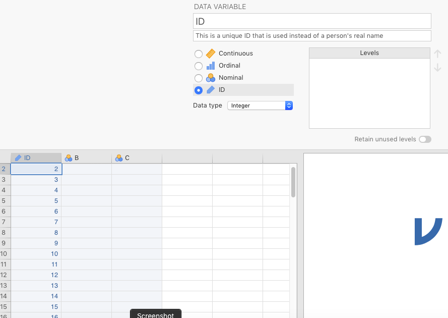
```

<br/>

#### The **drug** variable {#PracticeManuallingDrug}

Third, prepare the variable **drug** with its three levels: **anxifree**, **joyzepam**, and **placebo**. Do this by double-clicking on the default variable **B**, and renaming it **drug**. The data type should remain **nominal**. Associate each of the levels of the **drug** variable with an integer, associations that will be arbitrary. We have chosen 0 for **placebo**, 1 for **anxifree**, and 2 for **joyzepam** (but you can use whatever integers to refer to whatever levels you like, as long as you don't repeat them within the same variable). Then, for the first three rows (IDs 1-3) under **drug**, type in 0; for IDs 4-6 type in 1; and for IDs 7-9, type in 2. You should see something like Figure \@ref(fig:PracEnterDrug1) below.

<br/>

```{r PracEnterDrug1, fig.cap="Entering the drug variable.", echo=F, out.width="600px"}
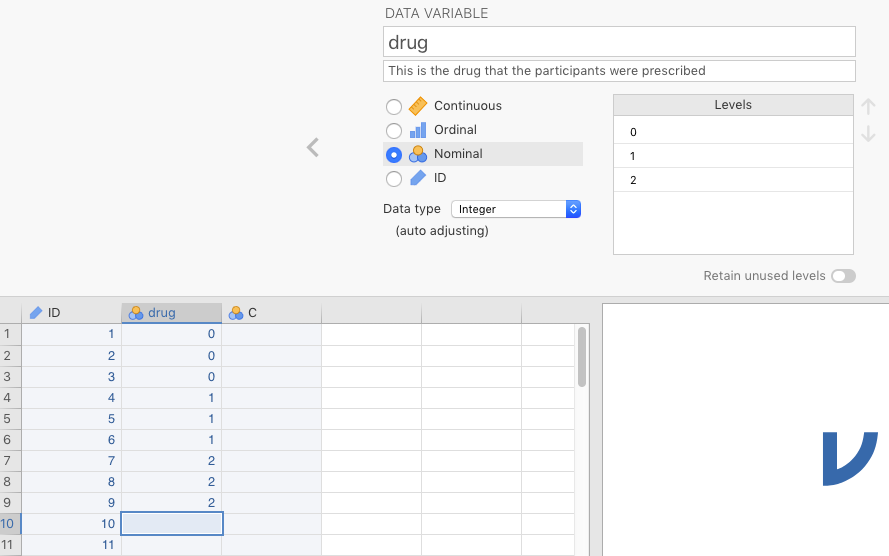
```

<br/>

Once you have done this, you can replace the numbers in the **Levels** box with the names of the levels. Start with selecting 0, and typing over it with **placebo**. After this first step, you should see something like Figure \@ref(fig:PracEnterDrug2) below.

<br/>

```{r PracEnterDrug2, fig.cap="Start assigning labels to integer levels in a nominal variable.", echo=F, out.width="600px"}
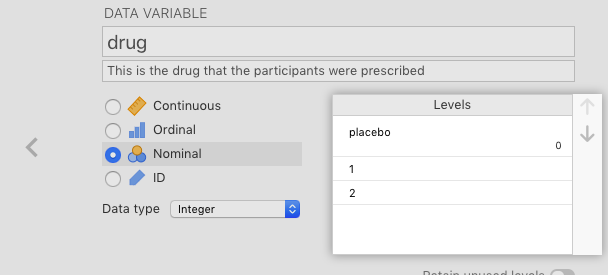
```

<br/>

Then, change overwrite 1 with **anxifree** and 2 with **joyzepam**. Click anywhere in the spreadsheet and you should see all the numbers disappear, replaced by the appropriate levels. Your results should look like what's depicted in Figure \@ref(fig:PracEnterDrug3).

<br/>

```{r PracEnterDrug3, fig.cap="Complete assigning labels to integer levels in a nominal variable.", echo=F, out.width="600px"}
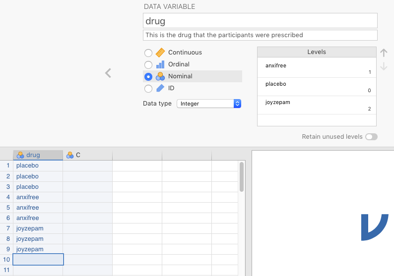
```

<br/>

The last thing you need to do for the variable **drug** is type in the last nine integer values under **drug** (do **not** type in labels at this point). In this case, the same sequence of integers is repeated as above: that is, three 0s, followed by three 1s, and then three 2s. As you do this, you should see the labels fill in automatically, as in Figure \@ref(fig:PracEnterDrug4) below.

<br/>

```{r PracEnterDrug4, fig.cap="Fill in the rest of the values under the variable.", echo=F, out.width="400px"}
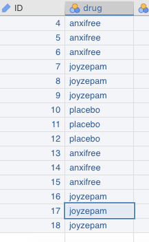
```

<br/>

#### The **therapy** variable {#PracticeManuallingTherapy}

Fourth, prepare the variable **therapy**. This is another nominal variable. There are two levels for the variable: **no.therapy** and **CBT** (which stands for **Cognitive Behavioral Therapy**). We will leave doing this to you since it is straightforwardly the same procedure as for **drug**, above. But pay close attention to Table \@ref(tab:tables-ClinTrial).

<br/>

#### The **mood.gain** variable {#PracticeManuallingMoodGain}

Fifth, you need to enter the data for **mood.gain**. When you click this fourth, blank column, a little menu with three options will appear (jamovi only provides you with 3 default variables). Choose **NEW DATA VARIABLE**. Rename **D** (or whatever letter you get there) with **mood.gain**. Then click the **Continuous** button, because this variable is going to be on an interval scale. Under the **Data type** pull-down menu, switch the variable from **Integer** to **Decimal**. At this point, you can just enter the data. Do so carefully, however, as the data are different for each row. And double-check your work. When you're finished, you should see something like what's depicted in Figure \@ref(fig:PracEnterMoodGain) below.

<br/>

```{r PracEnterMoodGain, fig.cap="Entering the mood.gain variable manually.", echo=F, out.width="600px"}
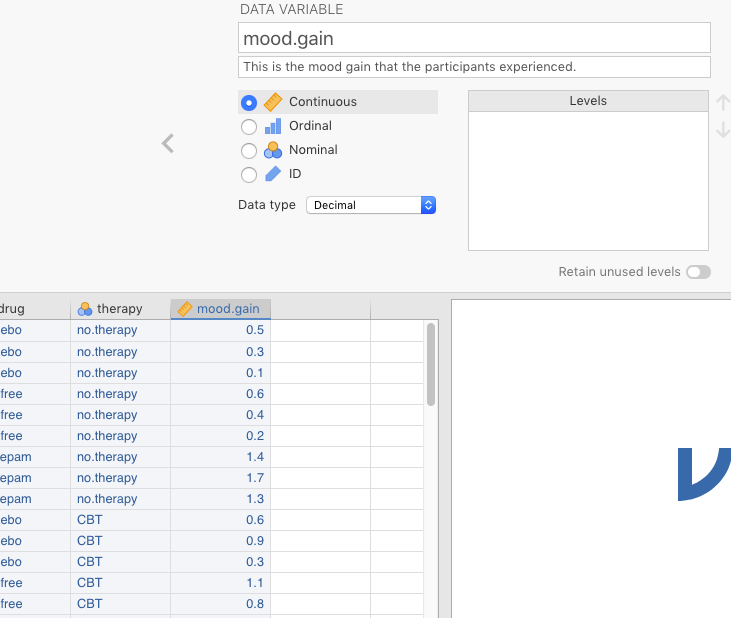
```

<br/>

**You're done!! with Practice Exercise \@ref(#PracManualing)**

<br/>

Next you will work on importing and exporting data, but in reverse order. That is, we are first going to export data from a spreadsheet, which corresponds above to section \@ref(Exporting) Then we will work on importing the data we just exported, which is covered above in Section \@ref(Importing).

<br/>

### Practice exporting {#PracticeExporting}

Here is some practice on Exporting, *Practice Exercise* \@ref(BasicDataOperations)B, starting with entering data into a spreadsheet.

<br/>

#### Spreadsheet data {#PracEnterGoogleSheetData}

A great many researchers end up with their data stored somehow in a spreadsheet. This is not ideal, but it is very common. However, spreadsheets are not very powerful at statistics. For this reason, it's usually best to export whatever data is in the spreadsheet into a text-delimited file for subsequent import into statistics software like jamovi.^[jamovi itself will also export data into different formats (as long as it has some data). To do this go to $(\equiv)$ > *Export*. There are both proprietary (e.g., SPSS' .sav format) and text-delimited formats (e.g., .csv). We won't be doing this in this class, but it may be useful when sharing your data with others who don't use jamovi.]

So to mimic this all-too-common experience, you need to open up a spreadsheet in [Google Sheets](https://www.google.com/docs/about/). The link takes you to **Google Docs** which includes **Google Sheets**. Note, you will need to create a Google account if you do not have one already. If you are a student at Texas A&M, you already have this, and we require you to use your university Google account. You can find it [here](https://google.tamu.edu/), where you log in to **Google Drive**.

```{block2, type="rmdwarning", echo=T}
**WARNING**: When you log in to your university Google account, it is wise to log ***OUT*** of any other non-university Google accounts you may have. You will lose functionality if you are connected to a private Google account simultaneously. This apparently has something to do with the fact that **Google Apps for Texas A&M** is compliant with the [Family Educational Rights and Privacy Act](https://studentprivacy.ed.gov/audience/parents-and-students) (FERPA), whereas the private Google accounts are not.
```

<br/>

Under **Drive** in the upper left, click the **+ New** icon to create a new document in your drive, and select **Google Sheets**. You should see a new Google Sheet open up.^[It is essentially the same as *Microsoft Excel* (commercial) or *Libre Office Calc* (free), among others.] You can change the name in the upper left from *Untitled spreadsheet* to something like *PracticeExportingDelimitedFiles* (or something like that). Just click where it says *Untitled Spreadsheet* and type over it with the new name (e.g., *Practice_Exercise_@\ref(PracticeExporting)*. It's automatically saved in your Google Drive.

In cell A1 (the upper-right-most cell in the grid), type **ID**. Move over one cell to the right (B1). Type in the name of some two-level nominal variable, like **Sex** (we'll get to entering values below). Finally, in the third cell over (C1), type in the name of a continuous variable, like **Aggression**.

Let's make 6 rows of data. For **ID**, type in 1-6 in cells A2 to A7, respectively. Under **Sex** type in a "1" in cells B2 to B4, and a "2" in cells B5 to B7. Under **Aggression** type in some random values on a scale from 1 to 7. See Figure \@ref(fig:GoogleSheetManualData) below for an example of how we did this.^[To do this in a non-thinking way, a function in Google Sheets called [RANDBETWEEN](https://cloud.google.com/dataprep/docs/html/RANDBETWEEN-Function_118228858) was used. You can see this in the formula bar just above the column references. The exact function is =RANDBETWEEN(1,7), which means: "Produce a random number (integer) between the values of 1 and 7." It was then copy-and-pasted from C2 to C3 through C7.]

<br/>

```{r GoogleSheetManualData, fig.cap="Entering data manually into Google Sheets.", echo=F, out.width="600px"}
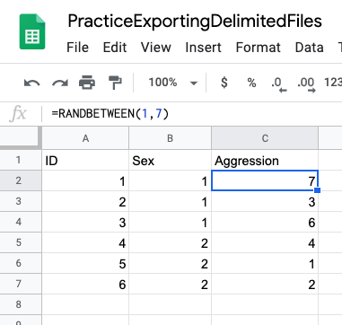
``` 

<br/>

#### Exporting to a delimited file {#PracExportGoogleSheetData}

The next step is to export the data from the Google Sheet. This is extremely easy. Simply click **File** > **Download as** > **Comma-separated values (.csv, current sheet)**. You can see an illustration of this below in Figure \@ref(fig:GoogleSheetExportData)

<br/>

```{r GoogleSheetExportData, fig.cap="Exporting data into .csv format from Google Sheets.", echo=F, out.width="600px"}
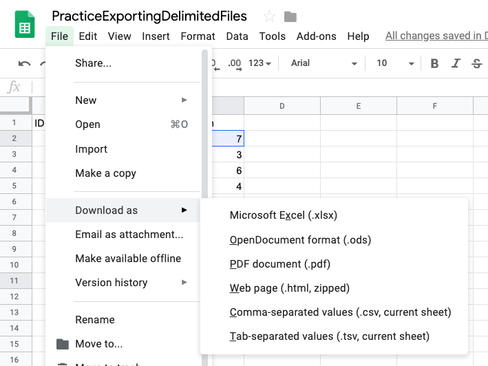
```

<br/>

Do this, and, when prompted, save it to somewhere on the same computer where jamovi is located. ***And remember where you saved it!***

<br/>

You could also bypass all this exporting from a spreadsheet program by just entering the data manually into a plain text file, and appending the appropriate file extension. No one does this, but it is useful for illustration. In fact, you can try this yourself by copying and pasting the text below into a program like TextEdit (on a Mac) or Notepad (on a PC), and saving it as a plain-text file with the appropriate file extension. Here is how you would do that (using TextEdit's menu as the example [Notepad should be similar]):

<br/>

1. Select the four lines of text below, and then copy it to the clipboard:  

"ID","Age","MaritalStatus"
"Bilbo",24,2
"Gandalf",32,1
"Boromir",44,1  

<br/>

2. Open up TextEdit (or any other word processor)  
3. Paste the clipboard material in (you could also try typing it in directly)  
4. Go to *File* > *Save*, give the file a name, and a .csv extension, and then click *Save*.
5. Open up jamovi
6. Go to $(\equiv)$ > *Import* and find the file you just created.

<br/>

This should work as well, though you can see why you'd have to be crazy to do it for large data sets.

<br/>

### Practice importing {#PracticeImporting}

Here is some practice on Importing, Exercise \@ref(BasicDataOperations)C: importing.

Open jamovi. Go to $(\equiv)$ > **Import**. Once there, optionally select **CSV** at the bottom where it gives you a drop-down menu called **Data files** (this will narrow the file search). Click the **Browse** button at the upper right, and then search for your .csv file. You should see something like what's in Figure \@ref(fig:JamoviImportStart).

<br/>

```{r JamoviImportStart, fig.cap="Starting to import a delimited file in jamovi.", echo=F, out.width="600px"}
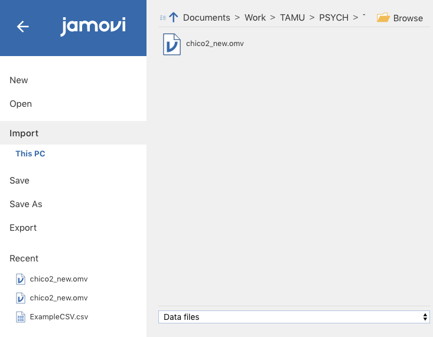
```

<br/>

Double-click it when you see it. You should see something like you see in Figure \@ref(fig:JamoviImportEnd) below.

<br/>

```{r JamoviImportEnd, fig.cap="jamovi spreadsheet after importing delimited file.", echo=F, out.width="600px"}
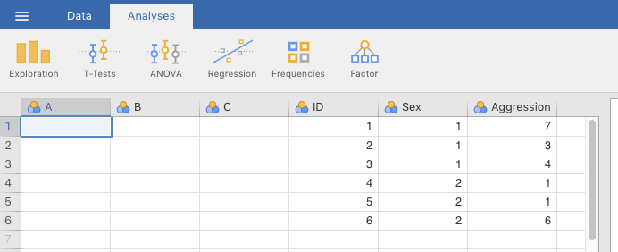
```

<br/>

Notice that jamovi just added the variables to the right of its default variables. Just delete the default variables by going to the **Data** tab at the top, selecting the column or any cell for variable **A**, and clicking the **Delete** icon in the menu at the top (the one with the vertical red stripe). Repeat this for variables **B** and **C**. Alternatively, you could select variable **A**, then hold down the SHIFT key, and select variable **C**. Then delete them all at once. This latter method was used in the screenshot depicted in Figure \@ref(fig:JamoviImportDeleteVars) below.^[You can also do all this *before* importing the new data.]

<br/>

```{r JamoviImportDeleteVars, fig.cap="Deleting variables in jamovi.", echo=F, out.width="600px"}
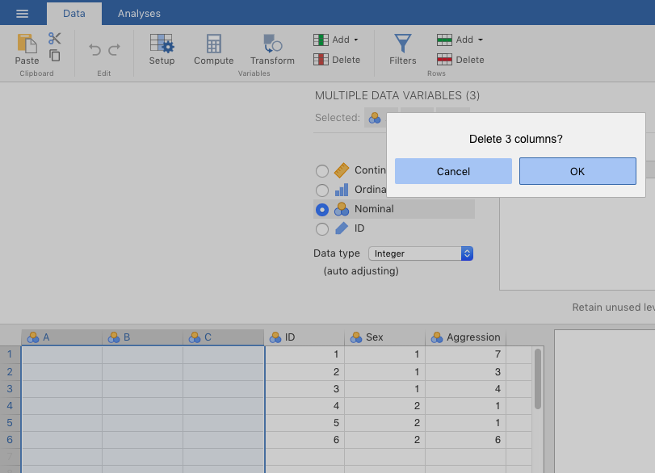
```

<br/>

In addition to adding unnecessary, default variables, jamovi also doesn't recognize certain things that are critical to your analysis. It actually has no way of knowing the following, so it's understandable:

- **ID** should be an ID variable, where the numbers should not be math-ed upon (it is **NOT** the end of the world if this doesn't get changed, as long as you know to ignore any statistics that get calculated from it);
- the numbers (1 and 2) for for **Sex** should represent levels of a nominal variable (it couldn't have since the levels were never assigned); and
- **Aggression** should be continuous.

<br/>

You just change these manually. Double-click **ID** and then click the **ID** option. Use the same procedure for **Sex** as you did in Sections \@ref(PracticeManuallingDrug) and \@ref(PracticeManuallingTherapy), but assign, say "1" to **Female** and "2" to **Male** (or vice-versa; your choice). For **Aggression** use the same procedure you used in Section \@ref(PracticeManuallingMoodGain). That is, just change the variable type to **Continuous**. Keep the **Data type** as **Integer** (or make it so).

Make sure to save your results.

**Congratulations! You're done**

<br/>

<!-- ### Practice wrangling data {#PracticeWranglingData} -->

<!-- **FOR LATER** -->