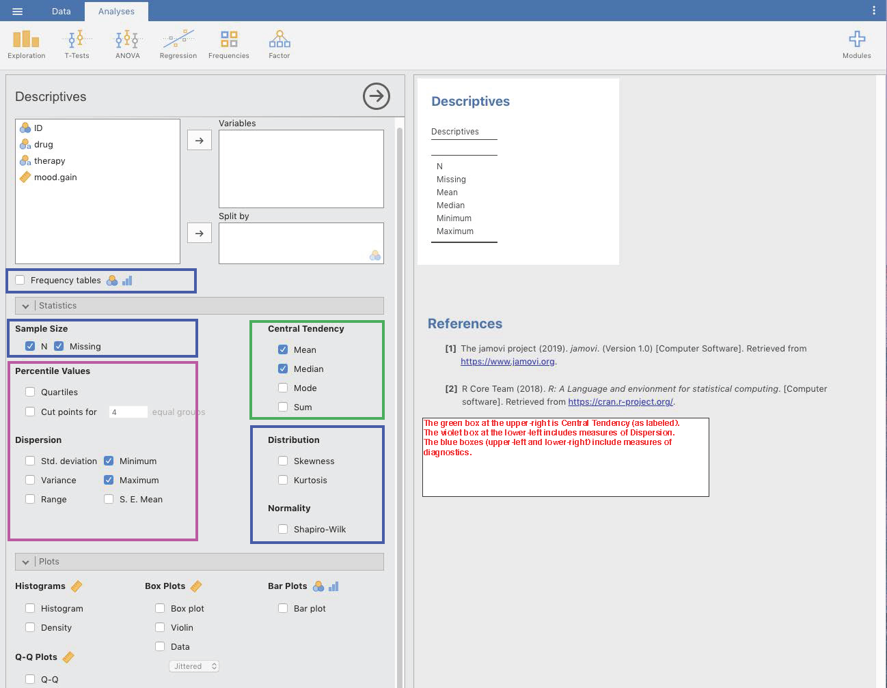
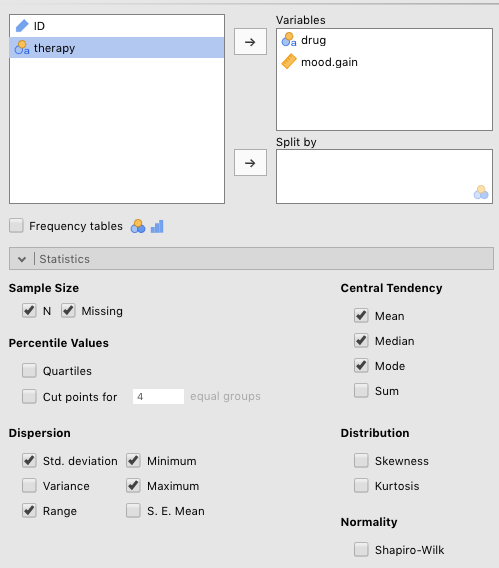
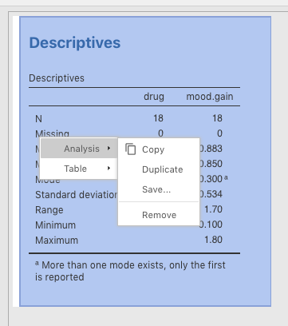
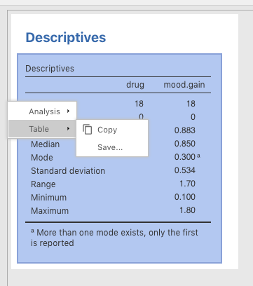
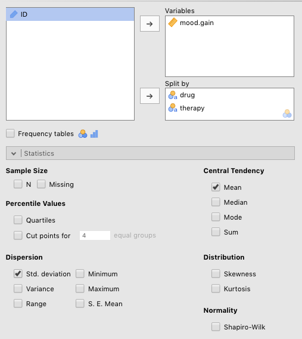
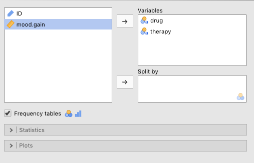
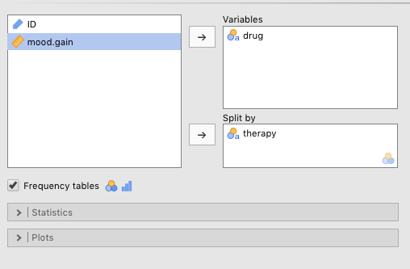
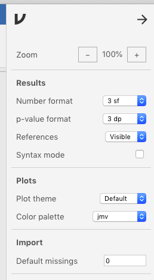
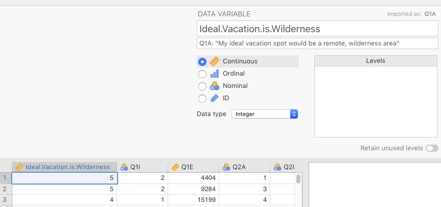
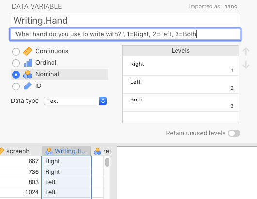

# Descriptive statistics {#DescriptiveStats}

## Overview {#OverviewOfDescriptiveStats}


As in the last chapter, the best way to learn in this chapter is to follow along in each section using *jamovi* on your own computer. There are also some extra practice exercises at the end of the chapter (section \@ref(PracticeSummarizingAndReporting)).

Following that is a quick glossary of important terms in this chapter.

<br/>

There are really three types of descriptive statistics, which are covered more in depth in @lsj, Chapters 4 and 5. These three types are **central tendency**, **dispersion** (or **variability**), and **diagnostics**. 

- **Central tendency** tells us what the best prediction would be for a person (or a rat, or a plant) on any given measure, assuming you had no other information available.  
- **Dispersion** gives us convenient numbers that indicate how accurate (non-noisy) our measure of central tendency is.  
- **Diagnostics** tell us various things, but most importantly in this class, whether we can be confident that the dispersion (see above) has a normal distribution. It would also be a good idea to include sample size and missing values here, along with frequency-of-category data, since **diagnostics** the closest statistical description.  

There is one more category here, but it covers all three types of descriptive statistics. This is **data visualization**. That is, all descriptive statistics can be represented as numbers, or depicted visually. We will cover data visualization in Chapter \@ref(DataVisualization). But for now, you can also consult the main textbook [@lsj], Chapter 5 (**Drawing graphs**), which is all about how to do data visualization in *jamovi*.

<br/>

## Descriptives in *jamovi* {#DescriptivesInJamovi}

To briefly illustrate descriptive statistics in *jamovi* in this lab manual, we will use main textbook's [@lsj] data set `Clinical Trial` again (we used this data set previously in sections \@ref(Importing) and \@ref(PracManualing)). You can get to this data by clicking $(\equiv)$ > `Open` (`Data Library`) > `learning statistics with jamovi` > `Clinical Trial`.

Once open, if you click the `Analyses` tab on top, then click `Exploration` on the left, a drop-down menu will appear where you select `Descriptives`. You'll see a window with the variables from the data set on the right in a box. If you want to analyze them, you need to select them and click the arrow to get them into the right box (either `Variables` or `Split by`).  You can see how this all begins in Figure \@ref(fig:DescriptivesStart) below.

<br/>

```{r DescriptivesStart, fig.cap="The opening *Descriptives* window in jamovi [with the data set 'Clinical Trial' from @lsj]. The green box (not seen in jamovi) encloses measures of central tendency. The violet/purple box at the lower left encloses measures of dispersion/error. The blue boxes enclose either simple measures or measures that can be used as diagnostics.", echo=F, out.width="750px"}

```

<br/>

The data are summarized in some, but not all ways. We chose descriptives that are either most often reported, or most often covered in introductory courses. These are as follows:

- Central Tendency  
  - Mean  
  - Median  
  - Mode  
- Dispersion  
  - Standard deviation (`Std. deviation`)  
  - Range  
  - Minimum  
  - Maximum  
- Diagnostics  
  - Frequencies (of nominal variables by level)  
  - Number of observations (`N`)  
  - Missing values (`Missing`)  

<br/>

### Summarizing continuous variables {#SummarizingContinuousVariables}

For reasons of simplicity, we also chose only two variables to analyze: `drug`, which is one of the predictors, and `mood.gain`, the outcome variable for this data set. These choices can be seen below in Figure \@ref(fig:DescriptivesParametersClinicalData). The results are below that.

<br/>

```{r DescriptivesParametersClinicalData, fig.cap="Parameters for certain descriptive statistics in jamovi [with the data set 'Clinical Trial' from @lsj].", echo=F, out.width="600px"}

```

<br/>

```{r, include=FALSE}
ClinicalTrial <- readRDS("datasets/DescStats_ClinicalTrial.rds")
```

```{r, echo=FALSE}
jmv::descriptives(
    data = ClinicalTrial,
    vars = vars(drug, mood.gain),
    mode = TRUE,
    sd = TRUE,
    range = TRUE)
```

<br/>

The first thing you might notice is that the variable `drug` only shows the results for `N` and `Missing`. This is because it is a nominal variable, and you can't do very much with nominal data except describe frequencies, detect missing values, and split data up into subgroups (the function of the `Split by` box below the `Variables` box).

Under the `mood.gain` variable is where you see most of the work done. In addition to `N` and `Missing`, you see all the other descriptive statistics listed above that can be carried out on continuous data (interval or ratio).

<br/>

```{block2, type="rmdtip", echo=T}
**TIP**: One useful function to highlight at this point is how to remove analyses (or visualizations) that you no longer wish to include. Just CTRL-click (or right-click) anywhere on the output, then select `Analysis` > `Remove.` It will disappear. You will inevitably need to do this a lot to keep your *jamovi* (`.omv`) file from being cluttered. See the figure below.
```

<br/>

```{r DescriptivesClinicalDataRemove, fig.cap="Removing output from jamovi.", echo=F, out.width="300px"}

```

<br/>

```{block2, type="rmdtip", echo=T}
**TIP**: Another useful function, using that same `CTRL-click` (or `right-click`) function, is that you can also save or copy a table or image for use in another document. So if you wanted to take the table output, save it as a `.pdf`, then insert it into this document, you would `CTRL-click` the table, go to `Table` > `Save` and save it as a `.pdf` file. This image could then be displayed in many different types of presentations. See Figure \@ref(fig:DescriptivesClinicalTableSave) below. *datalab.cc* also has a [video tutorial on this](https://datalab.cc/tools/jamovi), which is labeled *Exporting tables & plots*. It is roughly in the middle of the list of videos.
```

<br/>

```{r DescriptivesClinicalTableSave, fig.cap="How to save a table in jamovi as a .pdf file for further use.", echo=F, out.width="300px"}

```

<br/>

### Grouped summaries {#GroupedSummaries}

Now we will cover how to view descriptive statistics by group in *jamovi*. Recall that we can't get very many descriptive statistics from nominal variables. However, where they are very useful is in splitting up your outcome variable into various groups.

Using the same data, `Clinical Trial`, we will split `mood.gain` into six groups, namely, those patients who got the following:

- `anxifree` while getting `CBT` therapy  
- `anxifree` while getting `no therapy`  

- `joyzepam` while getting `CBT` therapy  
- `joyzepam` while getting `no therapy`  

- a `placebo` while getting `CBT` therapy  
- a `placebo` while getting `no therapy`

<br/>

To split up your descriptive statistics along these groupings, you drag `mood.gain` into the `Variables` box, like before. But instead of also dragging the nominal variables `drug` and `therapy` into the `Variables` box, you instead drag them into the `Split by` box. The parameter choices are depicted in Figure \@ref(fig:DescriptivesOnClinicalDataSplit) below.

<br/>

```{r DescriptivesOnClinicalDataSplit, fig.cap="Setting parameters for descriptives statistics split by nominal variables in jamovi [with the data set 'Clinical Trial' from @lsj].", echo=F, out.width="600px"}

```

<br/>

This results in a display of the descriptive statistics for each of the 6 groups (though only the mean and standard deviation were included in order to simplify the output). You can see the results below.

<br/>

```{r, echo=FALSE}
jmv::descriptives(
    formula = mood.gain ~ drug:therapy,
    data = ClinicalTrial,
    n = FALSE,
    missing = FALSE,
    median = FALSE,
    sd = TRUE,
    min = FALSE,
    max = FALSE)
```

<br/>

### Frequencies {#Frequencies}

Lastly, when describing our data (say, in a *Methods* section in a manuscript), we usually need to provide an indication of the relative numbers of responses in each category. For instance, the reader/listener will usually want to know how many responses there were in our data set across the levels of the *drug* condition as well as across the levels of the *therapy* condition..

To do this, you need to slide the two nominal variables, `drug` and `therapy` into the `Variables` box. Then simply check the `Frequency tables` check box just above the `Statistics` sub-menu label. Figure \@ref(fig:DescriptivesFrequenciesParameters) shows you how to do this.

<br/>

```{r DescriptivesFrequenciesParameters, fig.cap="Setting the parameters for the frequencies of different nominal variables independently.", echo=F, out.width="600px"}

```

<br/>

The results of this analysis are below. As you can see, this creates two new tables that give us the counts and proportions of responses in each level of each variable in the `Variables` box. Here, the data are symmetric and balanced across conditions. But this is not always the case. These descriptive statistics need to be provided to the reader/listener as well.

<br/>

```{r, echo=FALSE}
jmv::descriptives(
    data = ClinicalTrial,
    vars = vars(drug, therapy),
    freq = TRUE,
    n = FALSE,
    missing = FALSE,
    mean = FALSE,
    median = FALSE,
    min = FALSE,
    max = FALSE)
```

<br/>

There is another way to do this, where you split one nominal variable by another. This will put the two variables into the same table. To do this, just slide one of the nominal variables into the `Variables` box, and the other into the `Split by` box. This was done for these data, as can be seen in Figure \@ref(fig:DescriptivesFrequenciesSplitParameters) below.

<br/>

```{r DescriptivesFrequenciesSplitParameters, fig.cap="Setting the parameters to examin the frequencies of different nominal variables jointly", echo=F, out.width="600px"}

```

<br/>

```{r, echo=FALSE}
jmv::descriptives(
    formula = drug ~ therapy,
    data = ClinicalTrial,
    freq = TRUE,
    n = FALSE,
    missing = FALSE,
    mean = FALSE,
    median = FALSE,
    min = FALSE,
    max = FALSE)
```

<br/>

Here there is one table, with the `Variables` variable (`drug`) represented vertically on the left, and the `Split by` variable (`therapy`) represented horizontally across the top. Note that there are a total of 18 observations, where 3 belong to each combination of levels across the two variables. This is a more succinct summary than the one in the first table produced above.

<br/>

### Reporting data summaries

A great deal of this lab is devoted to writing. The first step will be writing quick summaries of descriptive statistics, something that usually takes place near the beginning of the *Results* section of a scientific research paper. However, some of these statistics will be reported in the *Method* section.

<br/>

```{block2, type="rmdcaution", echo=T}
**CAUTION**: You might be tempted to put all possible descriptive statistics in the *Results* section of the paper (the one that comes after *Method*), but this is not true of all variables. The *Results* section is about reporting on inferential statistics, or your main analysis (whatever that may be). The descriptive statistics you provide there are the ones relevant to your inferential statistics (i.e., the means and standard deviations that correspond to the levels relevant to your intereential statistics). Some of your descriptive statistics (e.g., the total number of participants [N], the number of men vs. women, the average age, etc.) often go in the *Methods* section, especially if they are not critical to your main analyses.

```

<br/>

So below we have inserted, in table format, the results of a simple *Descriptives* procedure on the *Clinical Data* provided by @lsj.

<br/>

```{r, echo=F}
jmv::descriptives(
    data = ClinicalTrial,
    vars = mood.gain,
    missing = FALSE,
    sd = TRUE,
    range = TRUE)
```

<br/>

Here is how it could be summarized at the beginning of the *Results* section:

> *Method*
>
>... There were three participants in each combination of *drug* (*joyzepam*, *anxifree*, and *placebo*) and *therapy* (*therapy* vs. *no therapy*), for a total of 18 participants. 
>
> *Results*
>
> ...There was an increase on average for all 18 participants on *mood gain* (*M*=0.883), but there was also a significant amount of variability (*SD*=0.534), with the mood gain ranging from 0.1 to 1.8 across participants.

<br/>

```{block2, type="rmdnote", echo=T}
**NOTE**: Keep in mind that the summary above for the *Method* section is extremely minimal. For instance, frequencies of *Gender* and average *Age* are also usually reported, among any other variables that the researcher deems relevant.

```

<br/>

Eventually, you will see that whatever was reported in the *Method* section is material that would **not** be reported in the *Results* section, at least not directly. That said, `Sex`/`Gender` and `Age` are almost always reported in the *Methods* section, irrespective of their use in the main analysis.

More information on how to report on different elements of the study in the *Method* section will be provided later in Chapter \@ref(WritingMethodSections). 

```{r, include = FALSE}
rm(ClinicalTrial)
```

<br/>

## Outside help on descriptives {#OutsideHelpOnDescriptives}

To reinforce your learning here, you can go to [datalab.cc](https://datalab.cc/tools/jamovi) [@datalab.cc], which provides a short video on why we summarize data in the first place, along with the options available in *jamovi* (generally). It is labeled *Exploration: chapter overview*.

The video after that in [datalab.cc](https://datalab.cc/tools/jamovi), labeled *Descriptive statistics* provides a more detailed tutorial on how to get descriptive statistics in *jamovi*.  

The [jamovi quickstart guide](https://www.jamoviguide.com/) by @Rafi2019 (Chapter 3) also covers **Descriptives**, but only very briefly.

Finally, the online textbook [Statistics for Psychologists](https://cwendorf.github.io/Sourcebook/) by @Wendorf2019 covers descriptive statistics in *jamovi* in two ways. First, it shows you how to do it. Just click `jamovi`. Then scroll down and click `Descriptives (Frequencies and Descriptives)`. Critically, he also provides a guide on how to interpret the output. In this case, scroll down further to `Annotated Output`, and find the entry with the identical label, `Descriptives (Frequencies and Descriptives)`. Here you can see extensive annotations for each kind of output.

<br/>

## Practice summarizing and reporting {#PracticeSummarizingAndReporting}

Practice \@ref(DescriptiveStats)A. 

And now for some practice. To do this, we will access a data set that has been made available online. The [*Open-Source Psychometrics Project*](https://openpsychometrics.org/) has made many data sets about personality available, along with references to the publications that used them. This particular data set comes from a survey called the *Nature Relatedness Scale* (or *NR-6*), which attempts to measure how connected people are to nature. The researchers [@NisbetZelenski2013] were trying to shorten an earlier survey of 21 questions down to 6 in order to make it easier to administer (people find long surveys annoying). The data set consists of those six key questions about attitudes towards nature, along with more than 30 other variables. 

The data set is available online as a .zip file [here](https://openpsychometrics.org/_rawdata/NR6-data-14Nov2018.zip). (You might need a utility like [7-zip](https://www.7-zip.org/) to open .zip files if you are not using a Mac or Linux). 

However, it is also stored in the primary author's GitHub site for this lab manual. It is located in [this directory](https://github.com/patrickabolger/ElemStatsLabManual/tree/master/datasets). Just scroll down to `DescStats_NR6.csv` and double-click it. Then search for the button labeled `raw` and click it. Finally, go to `File` > `Save page as` (or the equivalent) in your browser and save it to your computer.

```{block2, type="rmdnote", echo=T}
This file extension might be a little confusing. The file ends with a *.csv* extension. This would normally lead you to believe that it is a comma-delimited file. But if you look closely, you will that that it is not, in fact, in comma-delimited format, but rather in tab-delimited format. This is because (as noted before) there are some commas in the responses (see the very last variable). But nicely, *jamovi* does not care, and finds the right delimiter for you automatically. See Sections \@ref(Importing) and \@ref(PracticeImporting)) to refresh your memory on how to import such a file. Any spreadsheet software, like *MS Excel* will also display it correctly if you specify `tab` as the delimiter in an import procedure.

```

<br/>

```{block2, type="rmdcaution", echo=T}
**CAUTION**: Do not import the data yet. Make sure you read the ***next two paragraphs*** below before importing the data.
```

<br/>

Something that is ***very, very, very*** useful when you are importing a data set is a **codebook**, if one exists. A codebook is either a separate file or an additional sheet in a spreadsheet program. The codebook tells you what the (often-opaque) variable names really stand for (e.g., `Q3A` is *My connection to nature and the environment is a part of my spirituality*), and what the numbers under the nominal variables represent. On this note, recall from Sections \@ref(Manualling) and \@ref(PracManualing) that responses like `male` vs. `female` (as levels for `Sex`) are often initially recorded as numbers. It is then your job to translate them back into categories. This data set comes with a codebook called `codebook.txt` in the original zip folder, but in the *GitHub* `datasets` folder for this textbook, it is called `DescStats_NR6_codebook.txt`.

One thing that is really important that we can infer^[The researchers did not directly write this in the codebook, but they did indicate the possible responses, which never included `0`. Thus, we can infer that the 0 represents a non-response, a *missing value*.] from this particular codebook is that the number `0` is used to indicate ***missing values*** on nominal variables.^[Blanks are used under free responses, like the last variable in the data set: *major*, but "messy" free-response data is a topic for another course] Sometimes when we collect data, especially on surveys, people (either deliberately or by mistake) don't respond to certain questions.^[You can force them to respond to certain questions in online surveys like *Google Forms*, but respondents often find this annoyingly coercive, especially if you do this for lots of questions.] The code for such a non-response in this data set is `0`. So before you import this data set in *jamovi*, you should change the `Default missings` option to `0`. To do this, go to $(\vdots)$ > `Import` > `Default missings` and replace *NA* with `0`. See the very bottom of Figure \@ref(fig:PracticeNR6DefaultMissings) below.

<br/>

```{r PracticeNR6DefaultMissings, fig.cap="Setting the *(Import) Default missings* from 'NA' to '0' under *Preferences*.", echo=F, out.width="300px"}

```

<br/>

So now you are ready to import the data as you did in Sections \@ref(Importing) and \@ref(PracticeImporting)). But we have done one of descriptive analyses for you, just for good measure. In Figure \@ref(fig:PracticeNR6ChangeQ1A) we changed `Q1A` to to `Ideal.Vacation.is.Wilderness`, and we inserted the name in the codebook, *My ideal vacation spot would be a remote, wilderness area*, into the `Description` box below the variable name. We also changed the variable type to `Continuous`.

<br/>

```{r PracticeNR6ChangeQ1A, fig.cap="Changing *Q1A* to name in codebook, along with changing variable type to *Continuous*.", echo=F, out.width="600px"}

```

<br/>

We also chose a variable that is bound to have no real effect: `Writing.Hand`. We changed the imported variable name, `hand`, to `Writing.Hand`, and then took the description from the codebook, *What hand do you use to write with? 1= Right; 2 = Left; 3=Both*, and put this in the `Description` box below the variable name. As for the levels of the variable, they are as follows: `0=NA`,^[`NA` (no quotes) is the native missing-value used in *jamovi* and *R*. When we imported `0` as *missing*, *jamovi* turned all the `0`s into `NA`s under the hood.] `1=Right`, `2=Left`, and `3=Both`. 

You already know how to associate levels with labels because you did this in Sections \@ref(Manualling) and \@ref(PracManualing). See Figure \@ref(fig:PracticeNR6ChangeHand) below for a screenshot of this change in *jamovi*. 

<br/>

```{block2, type="rmdcaution", echo=T}
**CAUTION**: Make sure the *Data type* for `Writing.Hand` is `Text`. Otherwise, *jamovi* will give you meaningless statistics about means, medians, etc. 
```

<br/>

```{r PracticeNR6ChangeHand, fig.cap="Changing *hand* to name in codebook, along with indicating what each level means.", echo=F, out.width="600px"}

```

<br/>

Now all we need to do is generate some descriptive statistics and write about them. See the two tables below, which are identical to the output that *jamovi* would render.

<br/>

```{r, echo=F, message = FALSE}
NR6data <- readr::read_delim("datasets/DescStats_NR6.csv", delim="\t", col_names=T, na='0', col_types=readr::cols_only(Q1A=readr::col_integer(), hand=readr::col_factor()))
NR6data$Ideal.Vacation.Is.Wildnerness <- NR6data$Q1A
NR6data <- NR6data %>% 
  dplyr::mutate(Writing.Hand=dplyr::recode(hand, '1'="Right", '2'="Left", '3'="Both"))
NR6data$hand <- NULL
NR6data$Q1A <- NULL
```

```{r, echo=F}
jmv::descriptives(
    data = NR6data,
    vars = vars(Ideal.Vacation.Is.Wildnerness, Writing.Hand),
    sd = TRUE,
    range = TRUE,
    median=FALSE)
```

<br/>

```{r, echo=F}
jmv::descriptives(
    formula = Ideal.Vacation.Is.Wildnerness ~ Writing.Hand,
    data = NR6data,
    missing = FALSE,
    median = FALSE,
    sd = TRUE,
    min = FALSE,
    max = FALSE)
```

<br/>

Here is an example of how one might summarize this data:

> *Methods*
>
> ...There were a total of 1,522 participants who responded to this study... The range of responses (4) covered the entire spectrum of possible answers, from 1 ("disagree") to 5 ("agree").
>
> *Results*
>
>Overall, participants responded positively to the notion their ideal vacation would be in the remote wilderness (*M*=3.91) with a bit of variability (*SD*=1.27). With respect to their dominant writing hand, there were slightly fewer responses (1,506), as 16 participants failed to indicate their handedness for whatever reason. Among those who did respond however, 1,302 reported being right-handed, 155 left-handed, and 49 ambidextrous. Respectively, each group responded roughly in the same way to the question (see above) about their ideal vacation (right-handers: *M*=3.90, *SD*=1.26; left-handers: *M*=3.94, *SD*=1.31; and ambidextrous: *M*=4.06, *SD*=1.30).

<br/>

Now it is your job to do the same for another pair of variables. Choose one of the variables between `Q2A` and `Q5A` (i.e., excluding `Q1A`), as well as one of the following nominal variables: `education`, `urban`, `gender`, `engnat`, `orientation`, `voted`, and `married`. Then, carry out exactly the same statistics in *jamovi* as are reported above, and provide a short, written summary of those descriptive statistics.

<br/>

## Glossary of descriptives {#GlossaryOfDescriptives}

### Central tendency {#CentralTendency}

There are three basic measures of central tendency: the **mean**, the **median**, and the **mode** (sections 4.1.1, 4.1.3, and 4.1.6, respectively, in @lsj). *jamovi* includes another, `Sum`, but this is rarely reported, though it can be useful in certain circumstances (as you will see in Chapter \@ref(CategoricalDataAnalysis) (section \@ref(ChiSquareGoodnessOfFitAdvancedUCBAdmit)). 

<br/>

#### The mean {#Mean}

To review, the **mean** is the balanced "fulcrum" of the data (with data points further away from the center being given progressively more weight in the calculation). The formula is simply: 

<br/>

$$\frac{\sum X_{i}}{N}$$

<br/>

#### The median {#Median}

The **median** is the value located where "half"^[or the average of the middle two values if there are an even number of observations] the ordered values are to the left and "half" to the right (without any regard to the magnitude of the values). 

<br/>

#### The mode {#Mode}

Finally, the **mode** is any subgroup of values in a data set that are both highly similar to each other in value, and relatively high in number (a peak in a histogram) compared to other clustered values.^[This is a somewhat alternative definition from most that you will encounter (e.g., "the most common value in a data set"), but one that accounts for the fact that a data set can have more than one mode.]

<br/>

### Dispersion {#Dispersion}

There are a seven measures of dispersion available in *jamovi*, though one of them is reported under an alternative heading. These are as follows: `Quartiles` (under the heading `Percentile values`), `Std. deviation` (standard deviation), `Variance`, `Range`, `Minimum`, `Maximum`, and `S. E. Mean` (standard error of the mean).

<br/>

#### The range, minimum, and maximum {#RangeMinimumMaximum}

The **range** is the simply the value you get when you subtract the **maximum** data value collected from the **minimum** data value collected (Importantly, these **maximum** and **minimum** values may (and probably will) be different from the lowest *possible* score and the highest *possible* score on whatever variable you are collecting data on). These values are usually reported, but they are not ultimately that useful.

<br/>

#### The standard deviation {#StandardDeviation}

The **standard deviation** is the typical distance from the mean. One way to imagine this is to imagine doing the following:

1. Draw a histogram of the data you have up on a whiteboard about the size of, say, someone's head  
2. Carefully mark where the mean is and draw a long, vertical line at that location  
3. Plot each individual data point on the histogram  
4. Get a bag of dried spaghetti  
5. For any one data point, measure the horizontal distance from that data point to the mean  
6. Break a "stick" (or whatever it's called) of spaghetti to the exact length between that data point and the mean (discard the unused portion of that spaghetti stick)  
7. Do this for all the data points  
8. Gather up all the spaghetti sticks and measure each one of them  
9. Calculate the average length of the spaghetti sticks  
10. That's the standard deviation!  

<br/>

Obviously, the formula for the standard deviation (below) is more complicated than this. So the thought experiment above isn't quite right. But it is very close.

<br/>

$$SD=\sqrt{\frac{1}{N-1}{\sum_{i=1}^{n} (x_{i}-\bar{x})^2}}$$

<br/>

#### Mean absolute deviation {#MeanAbsoluteDeviation}

Now, if you wanted a statistic that directly reflected this thought experiment, then you'd probably use the **mean absolute deviation**, which is rarely used. @lsj covers this topic in section 4.2.3 of Chapter 4.

<br/>

$$MAD=\frac{1}{N}{\sum_{i=1}^{n} |x_{i}-\bar{x}|}$$
<br/>

The **standard deviation** and the **mean absolute deviation** are close in value, but statisticians prefer **standard deviation** for reasons beyond the scope of this manual.

<br/>

#### The variance {#variance}

The variance, as you probably know from @lsj, is simply the **standard deviation** squared. So you just remove the *radical* symbol, $\sqrt{}$, from the formula for the standard deviation. Thus:

<br/>

$$Variance=\frac{1}{N-1}{\sum_{i=1}^{n} (x_{i}-\bar{x})^2}$$

<br/>

The **variance** is extremely important in inferential statistics, but it is rarely reported as a summary statistic since it's not on a scale that makes sense to anyone. It becomes especially important in the **Analysis of Variance** (ANOVA), which comes up later.

<br/>

#### Quartiles, quantiles, and percentiles {#QuartilesQuantilesPercentiles}

When you ask for **Quartiles**, you're asking *jamovi* to find data values that cut the range of the data into fourths, where each fourth contains 25% of the data. The second quartile is always the median. First quartile is the data value indicating the point in the data where half of the values below the median are below it, and half are above it. The same is true for the third quartile, but above the mean instead of below it. The span between the first and third quartiles contain 50% of the data, and has a special name: the **Interquartile range** or **IQR**. Although quartiles are arguably the most common way to bin data, you can set other cut points for **quintiles** (5 equal bins), **sextiles** (6 bins), and so on If you ask for 100 of them, you will get **percentiles**. If you recall from your ACT/SAT scores, if you scored in, say, the 86th percentile, that means that 86% of the other people your age who took that test scored below you. This is exactly the same concept.

<br/>

#### Standard error of the mean {#StandardError}

All of these are covered in your main textbook [@lsj], in Chapter 4. But one deserves special mention here: `S. E. Mean` (among *jamovi*'s `Descriptives` options), also known as the **standard error of the mean**, or more generally, the **standard error**. This isn't mentioned until Chapter 8 of your main textbook [@lsj] (specifically, Chapter 8, section 8.3.3). This is essentially another version of standard deviation, but it is the standard deviation, not of the raw data, but rather of something known as the **sampling distribution**. To understand this concept, you need to use your imagination a little.

Imagine that instead of collecting the data from the 18 patients on `mood.gain` only one time, you collected the data 100 separate times, using 100 independent samples from the same population. And instead of inputting the raw data (which would amount to $18 \times 100$, or $1,800$ data points), you instead just calculated the mean for each of the 100 samples, and inputted those into your data frame instead. This would give you 100 means (and 100 rows of data in your data frame). Notice now that it would be trivial calculate the mean and standard deviation of these 100 means. If you did, the mean of those means would be the same as the the mean of the 1,800 observations you could have (but didn't) analyze. However, the standard deviation of these 100 means (the *standard error*) would be much smaller. This is because, critically, those 100 means would be much closer, on average, to the overall mean than the 1,800 raw data values.

Strangely, for such an ostensibly unusual concept, the formula is quite simple:

<br/>

$$SE_{mean}=\frac{SD_{mean}} {\sqrt{n}}$$

<br/>

The standard error (and its other form, the variance) is a ***very*** important concept in statistics, but we'll have to leave how it's used for later, or Chapter 8 in your main textbook.

What's also important from this little discussion is that we just led you through a mental exercise in what it feels like to be a **frequentist**. All the statistics we do in this introductory course fall under the umbrella of **frequentism** (the main other school of thought is **Bayesian**, which we don't do). Our thought experiment is an example of how frequentists conceptualize inferential statistics. That is, each time they run a statistic, they are (at least supposed to be) thinking the following to themselves:

>Now, what if I ran this study 100 or 1,000 times? What would the distribution of those 100 (or 1,000) means look like? Come to think of it, what would the distribution of means look like if I did this an infinite number of times?    


Believe it or not, these two questions form the heart and soul of the frequentist statistics you are learning about in this class. This will become clearer in Section IV (**Statistical theory**) of your main textbook by @lsj.

<br/>

### Diagnostics {#diagnostics}

There are lots of diagnostic statistics out there that help us determine whether we are using the right statistics or not, given the nature of our data. And almost all of them related to the dispersion of the data (not the central tendency). However, only a few, key ones are offered among *jamovi*'s `Descriptives` options: namely, `Skewness`, `Kurtosis`, and the `Shapiro-Wilk` test of normality. 

But we won't cover these options here. The reason is that very few practitioners use actual numbers to evaluate these particular diagnostics. It turns out that it is instead generally more useful simply to visualize the data in order to identify such issues with data.