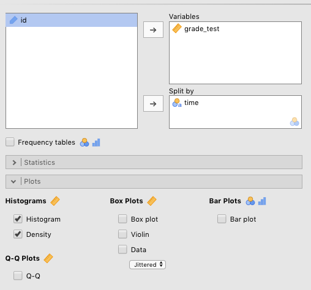
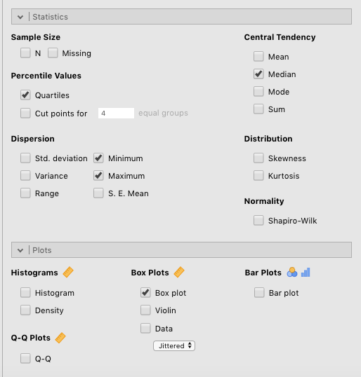
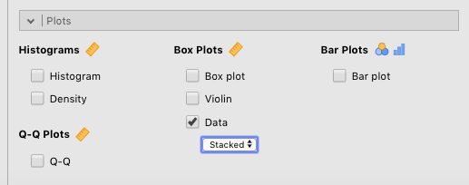
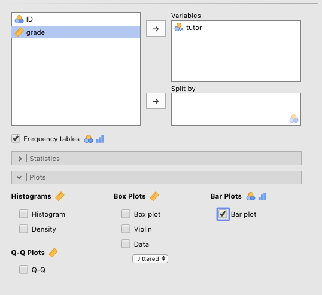
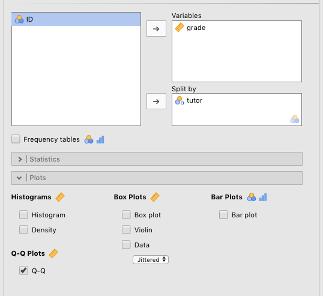

# Data visualizations {#DataVisualization}

There are a few visualizations possible from among the *jamovi* `Descriptives` options. Again, your main textbook by @lsj dedicates a chapter to data visualization in *jamovi*. This is Chapter 5 (**Drawing graphs**). And also again, the best way to get through this chapter is to open up *jamovi* and follow along at each step. There are no practice exercises for this chapter.

<br/>

```{block2, type="rmdnote", echo=T}
**NOTE**: There is one important thing you should understand, however, about the visualizations in this chapter (e.g., histograms, boxplots, Q-Q plots). Namely, these visualizations of descriptive statistics are used mostly by researchers to help them make decisions about subsequent analyses. These are ***NOT*** typically visualizations that are reported in the *Results* sections of journal articles. In *jamovi*, the plots that **are** used in *Results* sections are included within the menu for the statistical analysis itself. For example, there is a box called `Descriptives plots` that you can check under the `T-Tests` tab. This will give you a dot plot with confidence intervals [to be explained later in @lsj]. The exception below is the bar plot for frequency data (section \@ref(Barplots)). Such plots are, in fact, often used in *Results* sections of papers.
```

<br/>

To illustrate these various visualizations, we will use the `Chico2.omv` sample data set from @lsj. To get to this, just go to $(\equiv)$ > `Open` > `Data Library` > `Chico 2`. The data consist of grades on some test (`grade_test`), which is a continuous variable, along with a time-of-test variable, `time`, which is a 2-level factor, where `1` represents `at time 1` and `2` represents `at time 2`.

<br/>

```{block2, type="rmdnote", echo=T}
**NOTE**: It is important to note at this point that none of the `Plots` from the the `Descriptives` menu will work if the variable you are trying to visualize is not `Continuous`. Go back to the `Data` tab to check this if you are having trouble getting *jamovi* to depict your data visually.
```

<br/>

## Histograms {#Histograms}

The first visualization is the well-known histogram, where the frequency of particular responses are either "binned" if they are non-discrete (e.g., values with decimals), or possibly "stacked" if they are discrete integers (though such a variable may be binned as well).

What does this mean? For certain variables, like reaction times, values almost never repeat. It would be very strange for any one or two people to get the same exact reaction time of 632.44 milliseconds (ms). Therefore, you can't really "stack" these observations in a histogram. What you can do, however, is bin them. You can create various bins of, say, 50 milliseconds, and place relevant values in there. For instance, there could be a bin for reaction timess between 350-400 ms, another one adjacent, to the right of that one for reaction times between 400-450 ms, then for 450-500 ms, and so on. You can change the width of the bin.

For other variables, it's entirely possible to stack them, sometimes. For instance, if age (in years) is recorded as a simple integer (e.g., 18, 19, 20), it would be very easy to stack the 18s, the 19s, the 20s, the 21s, and so on, as long as your age range is relatively limited (e.g., typical college students). Note that if you had a really wide range of ages, you might bin them (1-5, 6-10, 11-15, 16-20,... 61-65... etc.).

Often paired with the histogram is the **density plot**, which uses math to estimate what a population distribution with many, many observations would look like based on the sample data you have. 

Go get these for the `Chico2.omv` data, we moved `grade_test` over to the `Variables` box, and `time` over to the `Split by` box. Then we checked `Histogram` and `Density` under `Histograms`. You can see the parameters that need to be set in Figure \@ref(fig:VisualizationsHistAndDensity) below.

<br/>

```{r VisualizationsHistAndDensity, fig.cap="Parameters for histograms and density plots for **test grade** split by **time of test** [with the data set 'Chico 2' from @lsj].", echo=F, out.width="600px"}

```

<br/>

The results of this are below.

<br/>

```{r, include=FALSE}
Chico2 <- readRDS("datasets/DataVis_Chico2.rds")
```

```{r, echo=F}
jmv::descriptives(
    formula = grade_test ~ time,
    data = Chico2,
    hist = TRUE,
    dens = TRUE,
    n = TRUE,
    missing = FALSE,
    mean = TRUE,
    median = FALSE,
    sd = TRUE,
    min = FALSE,
    max = FALSE)
```

```{r, include = FALSE}
rm(Chico2)
```

<br/>

## Boxplots {#Boxplots}

One of the drawbacks of histograms and density plots is that, although they are handy with respect to depicting the informal shape of a distribution, they are not so good at showing particular statistics about any given variable. This is where the boxplot comes in. Together with violin plots and dotplots (which can all be superimposed), you can offer your reader/listener a great deal of information about your variables.

We will use the `Harpo` data set provided by @lsj (we see this data again in Chapter 11 of @lsj). This data has to do with the grades of 33 fictional students in "Dr. Harpo's" statistics class. Dr. Harpo also has two tutors: Anastasia and Bernadette. Go to $(\equiv)$ > `Open` > `Data Library` > `Harpo`.

<br/>

```{block2, type="rmdnote", echo=T}
**NOTE**: When you open the `Harpo` data set, you will need to change the `grade` variable to continuous, which you learned how to do in Section \@ref(Manualling). You can leave the `tutor` variable alone.
```

<br/>

```{block2, type="rmdtip", echo=T}
**TIP**: Save this file as a `.omv` file. Not only are there a lot of analyses here that you will be carrying out, but we also re-visit this data in Chapter \@ref(ComparingTwoMeans), when we work on *t*-tests.
```

<br/>

Once you have addressed the note above, go to `Exploration` > `Descriptives` and simply slide the `grade` variable into the `Variables` box, and then (since you already know how to do this) slide the `tutor` variable into the `Split by` box. Finally, click the `Box plot` box under the `Box Plots` heading. Also check the following boxes, which will help you understand the boxplot: `Quartiles`, `Median`, `Minimum`, and `Maximum`. You can see these settings in Figure \@ref(fig:VisualizationsBoxplotParameters) below.

<br/>

```{r VisualizationsBoxplotParameters, fig.cap="Parameter settings for boxplots along with related descriptive statistics.", echo=F, out.width="600px"}

```

<br/>

```{block2, type="rmdnote", echo=T}
**NOTE**: If we had chosen two separate variables to slide into the `Variables` box, and then clicked `Box plot`, you would have seen two separate plots, each with one boxplot. That is, to get the side-by-side plots, you need to have a `Split by` variable, which in turn must be nominal (e.g., `time`, `Sex`, `tutor`), not continuous.

```

<br/>

Along with the statistics, Two side-by-side plots should appear in the output window. You can see all this below. But because of the length of the explanation (spanning several paragraphs), we are going to start explaining the boxplot above the descriptives and figure below, so that it is easier for you to scroll back and forth.

```{block2, type="rmdnote", echo=T}
**NOTE**: The canonical orientation of boxplots is vertical, with the outcome variable along the *y*-axis. It is also possible to present boxplots as horizontal, with the outcome variable on the *x*-axis. However, the explanations below assume the canonical, vertical orientation.

```

Looking at the boxplots below, you are probably asking yourself: "What do the different elements of the box mean?" You have probably also noticed that there isn't just a box in the plot. Rather, the box is divided into two by a horizontal line, and the box has vertical lines extending from the top and the bottom. Finally, there's a strange dot at the bottom of the boxplot for the tutor named "Bernadette."

First: the box itself. The box itself encloses the data from the 1st to the 3rd ***quartiles***. As explained in glossary below (Section \@ref(QuartilesQuantilesPercentiles)), the **first quartile** is the same as **the 25th percentile**, or the single score that lies just above the bottom 25% of the scores (ordered from lowest to highest). The first quartile is the bottom horizontal line of the box. The **3rd quartile** is equivalent to the **75th percentile**, or the score that lies just above the bottom 75% of scores This is the top of the box. So if your grade was at the third quartile, then 75% of the class would have scores below yours. To verify this, you can compare the boxplot to the descriptives above them. The 25th percentile for Anastasia is 69. This corresponds to the bottom of "her" box. Likewise, the 75th percentile for her data is 79. This is the top of her box. You can verify this for Bernadette's box as well, on your own.

All this also suggests that half of all the scores lie between the 1st and 3rd quartiles. So, in effect, the box shows you where the middle half of your data is. This also entails that half of the data is outside the confines of the box). The upper- and lower confines of the box comprise what is also known as the ***Interquartile Range*** or ***IQR*** (see @lsj, Section 4.2.2, for more information).

So now, what does the horizontal line in the middle of the boxes mean? That line represents the ***median*** (also explained below in the glossary below, Section \@ref(Median))). Working from the discussion directly above, the median is simply the **2nd quartile**, or the **50th percentile**. This can be verified by looking at the values for the median and the 50th percentile; they are identical values (for Anastasia and Bernadette, respectively).

<br/>

```{r, echo=F}
Harpo <- readRDS("datasets/DataVis_Harpo.rds")
```

```{r, echo=F, message=F, warning=F}
jmv::descriptives(
    formula = grade ~ tutor,
    data = Harpo,
    box = TRUE,
    n = FALSE,
    missing = FALSE,
    mean = FALSE,
    quart = TRUE)
```

<br/>

In other words, the median is the middle value of your data, if you ordered your data from smallest to largest. That is, half of the data points should lie below the median, and half above (and if there is an even number of data points, the median is the average of the middle two values).

The next feature is the pair of vertical lines extending from the top and bottom of the box, respectively. These are often called ***whiskers***.^[Moreover, a more descriptive name for the boxplot is the *box-and-whiskers plot*. *Boxplot* is really just a shortened version of that.] Traditionally, these lines extend out to 1.5 times the interquartile range (the value at the 3rd quartile minus the value at the 1st quartile), a calculation we can attribute to @Tukey1977. The idea here is to capture all the data that is not considered potentially extreme within the ends of the whiskers. 

Anything outside the whiskers, then, is considered possibly extreme, and could have an unexpectedly high influence on the calculation of the mean. This brings us to the final element of the boxplot: the dots (sometimes small circles). These appear beyond the whiskers and represent individual observations whose values are probably a bit extreme, given what we'd expect from a normal distribution. 

Another name for such observations is **outliers**, or ***potential*** *outliers*, to be precise. Determining what *is* vs. *isn't* an outlier is a little bit involved and goes well beyond boxplots. Your main textbook [@lsj] covers this issue with respect to boxplots in Section 5.2.3., though the general concept is introduced in Section 4.2.1.

Note that in the boxplot figure there is one dot on the plot, which is located at the bottom of Bernadette's group of students. This is a potential outlier. If you see any dots at all, then the top-most and/or bottom-most of these will be the **maximum** and/or **minimum** values in your data. For the person with the low grade who has Bernadette as a tutor, you can see that the minimum in her group is 56, which is exactly where the dot is at the bottom of Bernadette's box. Boxplots provide no representations of data beyond these dots.

Overall, the boxplot is a quick way of visually determining critical characteristics of your data. Here are some guidelines:

- The bigger the box and the longer the whiskers, the more spread out your data is (and vice-versa)  
- The closer the median is to the center of the box, the more symmetrical (non-skewed) your data is (and vice-versa)  
- A higher number of dots in your boxplot indicate a higher number of extreme values in the tails of your distribution. **However**:  
  - This matters much more if there are considerably more dots above the top whisker than below the bottom whisker (or vice-versa)  
  - That is, the larger the data set, the more dots in the extremes you can expect (what matters is their relative distribution above or below the whiskers), so dots appearing in the boxplot is much more of a concern for smaller data sets. A median that is relatively centered in the box is a good clue that the date is symmetrical.  
  
<br/>

## Violin plots {#ViolinPlots}

Violin plots are really an extension of the boxplot. You can think of it this way: A violin plot is to a boxplot what a density plot is to a histogram (see Section \@ref(Histograms)). In fact, you could just call the violin plot a *sideways, self-reflected density plot* (with the ends cut off), because that's all it is, really. There are really only two main differences between a density plot and a violin plot:

- A violin plot is canonically vertical, whereas a density plot is canonically horizontal  
- A violin plot is usually reflected against itself,^[Sometimes, the reflecting is dispensed with since it is, actually, redundant. In fact, you can combine "half" violin plots with "half" boxplots, etc. The [gghalves](https://erocoar.github.io/gghalves/) package for *R* exploits this side-by-side visualization possibility] whereas a density plot is not.^[The reflecting is what ultimately gives the violin plot its shape, and hence, its name.]  

<br/>

To get a violin plot, simply click of the `Violin` check box under `Box plots`. Also click `Box plot`, as that will give you an idea of how the violin plot circumscribes the boxplot, which you already understand. Finally, also check `Density` under `Histograms`. We have seen these before, but it is a good idea to do so now to see how the density plots and violin plots relate.

<br/>

```{r, echo=FALSE}
jmv::descriptives(
    formula = grade ~ tutor,
    data = Harpo,
    dens = TRUE,
    box = TRUE,
    violin = TRUE,
    n = FALSE,
    missing = FALSE,
    mean = FALSE,
    median = FALSE,
    min = FALSE,
    max = FALSE)
```

<br/>

Nicely, the boxplots get embedded within the violin plots when you click both in *jamovi*. This is another reason why these kinds of plots can stuff a lot of information into a small space.

Anyway, the first thing to notice (if you hadn't already with the boxplots before), the axes are switched between histograms/density plots, on the one hand, and boxplots/violin plots, on the other. In fact, it's the histograms and density plots that are somewhat unusual in the world of statistical visualization. In almost all other cases, the outcome variable is plotted on the *y*-axis (as you see with the boxplots and violin plots), not the *x*-axis (as you see with the histograms and density plots). We encourage you to always think of your outcome variable as being plotted on the *y*-axis; this "mind trick" actually helps you understand other statistics better, especially linear regression (coming up in Chapter \@ref(CorrAndLinearReg)).

Note the "violin-like" quality of the plots.^[This is sort of a lie. Honestly, normally distributed data look more like deep-sea skates or rays, but the labels *stingray plot* or *skate plot* are not going to take off any time soon, and the "violin" misnomer has stuck. Nonetheless, when the data is really bimodal, you do get a violin-like quality to the plots.] Again, this comes from turning a density plot on its side and reflecting it against itself. Obviously, the density plot by itself is more detailed, whereas the violin plot is a more restricted visualization.

<br/>

## Dot plots {#DotPlots}

One final way of illustrating the nature of your data is to use a dot plot. This simply plots out each observation along the *y*-axis of the graph. There are two options here: You can *stack* the dots, or *jitter* them. Stacking works better for small data sets (like the `Harpo` data set), whereas jittering works better for large data sets where you are likely to have many dots with close or identical values. Generating this graph is just as easy as the others. Just check the `Data` box (under `Box plots`), and choose `Stacked` or `Jittered` from the drop-down menu below it. An example of this is shown in Figure \@ref(fig:VisualizationsDotPlainParameters) below.

<br/>

```{r VisualizationsDotPlainParameters, fig.cap="Parameters for generating a stacked dot plot.", echo=F, out.width="600px"}

```

<br/>

The results of the stacked dot plot can be seen below. We also checked *Violin* in order to illustrate the relationship between the two. Side-by-side dots represent identical values (i.e., students who got the same grade).

<br/>

```{r, echo=FALSE}
jmv::descriptives(
    formula = grade ~ tutor,
    data = Harpo,
    violin = TRUE,
    dot = TRUE,
    dotType = "stack",
    n = FALSE,
    missing = FALSE,
    mean = FALSE,
    median = FALSE,
    min = FALSE,
    max = FALSE)
```

<br/>

Note that these all fall under *Box plots* for a reason. Namely, you can combine these plots in any way you see fit. We have combined all three into one plot below. Note that the dots are **jittered** this time, strictly for illustration purposes (i.e., it was not helpful in any way for visualization since the number of observations is low).

<br/>

```{r, echo=FALSE}
jmv::descriptives(
    formula = grade ~ tutor,
    data = Harpo,
    box = TRUE,
    violin = TRUE,
    dot = TRUE,
    n = FALSE,
    missing = FALSE,
    mean = FALSE,
    median = FALSE,
    min = FALSE,
    max = FALSE)
```

<br/>

## Bar plots {#Barplots}

The next visualization covered here is a **bar plot**. 

<br/>

```{block2, type="rmdnote", echo=T}
**NOTE**: This is not the clumsy bar ***graph*** that has been used so often throughout history. A bar graph (for lack of a better term that distinguishes it from bar **plot**) represents continuous data (e.g., reaction times) with a bar (or bars). This type of chart is often discouraged by many in favor of line charts and dot charts with error bars. Indeed, bars are used in *jamovi* only to count up frequencies. *jamovi* replaces bar graphs representing continuous data with dot or line plots These are available under the appropriate inferential tests.

```

<br/>

The bar plot is a good way of visualizing frequency data.^[Traditionally, pie charts have been used to do this, but pie charts can be problematic for several reasons. [Here](https://www.businessinsider.com/pie-charts-are-the-worst-2013-6) is a link that explains pretty clearly why.] This type of visualization is not usually necessary for any kind of visual summary of any data you collect in this course. However, it can be very useful, ultimately, for chi-square analyses and the display of individual Likert items. A discussion of chi-square analyses comes up later in this lab manual (Chapter \@ref(CategoricalDataAnalysis)), and in your main textbook [@lsj; Chapter 10]. The display of Likert items does not really come up in this class.

Despite the fact that you will probably not need this kind of plot for this class, you can still practice. We will use the `Harpo` data again. We will compare the number of students in Anastasia's vs. Bernadette's tutoring groups. First, you need to drag the `tutor` variable over to the `Variables` box. Then check the `Frequency tables` check box located under the left-most (but label-less) white box. Finally, check the `Bar plot` box under `Bar plots` to get the frequency plot. You can see the parameter settings for this in Figure \@ref(fig:VisualizationsFrequenciesParameters)

<br/>

```{r VisualizationsFrequenciesParameters, fig.cap="Parameters for generating a bar plot.", echo=F, out.width="600px"}

```

<br/>

The result is a simple bar plot of the number of students in each tutoring group, along with relevant descriptive statistics above the plot. See below.

<br/>

```{r, echo=FALSE}
jmv::descriptives(
    data = Harpo,
    vars = tutor,
    freq = TRUE,
    bar = TRUE,
    n = FALSE,
    missing = FALSE,
    mean = FALSE,
    median = FALSE,
    min = FALSE,
    max = FALSE)
```

<br/>

The meaning of the bar plot is almost self-explanatory in this case.

<br/>

## Q-Q plots {#QQPlots}

Finally, we get to the last type of visualization available under `Descriptives`: `Q-Q plot` (which is short for *quantile-quantile plot*).

This plot is strictly diagnostic. It's a quick way to detect whether your data is normally distributed or not. In general, it plots the quantiles of two distributions against each other. To assess normality (the default option in *jamovi*), it plots the quantiles of a theoretically normal distribution on the *x*-axis against the data that you have on the *y*-axis in the form of standardized residuals (another term for individual deviations from central tendency; *z*-scores, essentially).

That may have made little sense to you at this point, and that's okay. What's important about this plot is that the dots should line up near the line without any systematic or extreme deviations.^[A really nice feature of the Q-Q plot is that it isn't restricted to comparing your data to normal distributions (though that's all we do in this class). Rather, you can use it to determine whether your data conform to some other well-known distribution, which might lead to another family of statistics (this is way beyond the scope of this class, but you should know about it).]

We've provided the Q-Q plot for the `Harpo` data, with `grade` divided into the two `tutor` groups: `Anastasia` and `Bernadette`. The parameters you need to set to generate this is in Figure \@ref(fig:VisualizationsQQPlotParameters) below.

<br/>

```{r VisualizationsQQPlotParameters, fig.cap="Parameters for generating Q-Q plots.", echo=F, out.width="600px"}

```

<br/>

```{r, echo=FALSE}
jmv::descriptives(
    formula = grade ~ tutor,
    data = Harpo,
    qq = TRUE,
    n = FALSE,
    missing = FALSE,
    mean = FALSE,
    median = FALSE,
    min = FALSE,
    max = FALSE)
```

<br/>

As you can see, the dots line up quite closely to the line, suggesting that the data is normally distributed.

To show what a positively skewed data set looks like in a Q-Q plot, we have opened the `AFL Margins` data set from @lsj, a data set that has something to do with Australian Rules Football. You can see the results of this below.

```{r, include = FALSE}
rm(Harpo)
```

<br/>

```{r, include=FALSE}
AflMargins <- readRDS("datasets/DataVis_AflMargins.rds")
```

```{r, echo=FALSE}
jmv::descriptives(
    data = AflMargins,
    vars = afl.margins,
    hist = TRUE,
    qq = TRUE,
    n = FALSE,
    missing = FALSE,
    mean = FALSE,
    median = FALSE,
    min = FALSE,
    max = FALSE)
```

<br/>

This time we included the histogram to show you the positive skew. In the Q-Q plot, look at the *y*-axis, and how the scale only goes down to about -1.5 standardized residuals (*z*-scores), whereas the *x*-axis goes down to -3. The dots splay out to the left away from the line, suggesting that they're clumping up at the bottom end and **not** producing a nice, leftward, asymptotic (small) tail. At the upper end, you can see that several dots have higher values than the line would "suggest." This means that the *z*-scores are too high for the distribution for it to be considered a normal. In other words, there is positive skew.

If you didn't understand very much of that, that's okay. The beauty of the Q-Q plot is that dots-**on-or-near**-the-line means that your data fit that particular theoretical distribution well (in this case, the default: a normally distribution). Dots-**not-on-or-near**-the-line means that you might need to do something to your data (a transformation) in order to do statistics, or choose a different kind of analysis altogether.

```{r, include = FALSE}
rm(AflMargins)
```

<br/>

## Outside help on visualization

### Histograms {#OutsideHelpOnHistograms}

*datalab.cc* also has a [tutorial on histograms and density plots](https://datalab.cc/tools/jamovi). The videos are labeled *Histograms* and *Density plots*. Your textbook [@lsj] also covers histograms in the first section (5.1) of Chapter 5. 

<br/>

### Boxplots {#OutsideHelpOnBoxPlots}

For some outside help on boxplots, you can go to the video labaled *Box plots* at [datalab.cc](https://datalab.cc/tools/jamovi).

<br/>

### Violin plots {#OutsideHelpOnViolinPlots}

For more on violin plots, you can go [datalab.cc's tutorial](https://datalab.cc/tools/jamovi) on them, which is the video labeled *Violin plots*.

Your main textbook also covers violin plots in Section 5.2.1.

<br/>

### Dot plots {#OutsideHelpOnDotPlots}

For outside help on dot plots, you can go to [datalab.cc's tutorial on dot plots](https://datalab.cc/tools/jamovi), where you can find the video labeled "Dot plots."

<br/>

### Bar plots (#OutsideHelpOnBarPlots)

For outside help on bar plots in jamovi, you can go to [datalab.cc's tutorial on bar charts](https://datalab.cc/tools/jamovi), which is the video labeled *Bar plots*.
