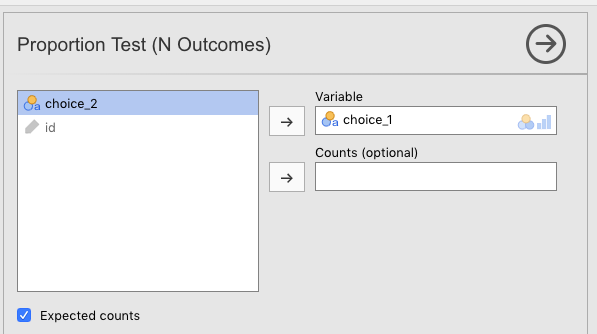

# (PART) Inferential statistics {-}

# Categorical data analysis {#CategoricalDataAnalysis}

Up to this point, we have been following, roughly, the order of information set out in your main textbook by @lsj. We depart a little at this point as we are not going to cover the material in Chapter 6 of that book. We will cover that material in Appendix A. Nor will we cover chapter 7-9 at all. Instead, this lab manual resumes below as parallel to Chapter 10 of @lsj.

From the current chapter (Chapters \@ref(CategoricalDataAnalysis)) to Chapter \@ref(FactorialAnova), you'll see that the point of inferential statistics is to calculate specific signal-to-noise ratios in order to see if the signal that emerges from our data is so strong over the noise (that emerges from our data) that we can confidently claim that we indeed have a signal, and not just a bunch of noise.

We will start with the first of these tests: the *chi-square test*. Thus, this chapter shows you how to use jamovi to conduct analyses when your outcome variable consists of counts of nominal (categorical) data (e.g., the number of men vs. women who voted in a particular district, where the proportions are known to be about 50/50). The topic is covered in much more detail in your main textbook @lsj [Chapter 10].

There are several versions of the chi-square test, but we will only cover two here: the $\chi^2$ *goodness-of-fit test*, and the $\chi^2$ *test of association*. The former is used is when you want to compare your sample data to known population proportions (like the voting example above), and the latter is when you want to compare the counts of two groups against one another. For example, perhaps you wanted to know whether the morning-beverage preferences (coffee, tea, or juice) were the same across men and women. A $\chi^2$ test of association could answer this (assuming you collected the data, of course).

The first we will cover here is the goodness-of-fit test.

<br/>

## Chi-square goodness-of-fit test {#ChiSquareGoodnessOfFit}

In each chapter in this manual, there will be one basic analysis, and often, one, more advanced analysis. The basic analysis will always be a quick way to do the analysis presented in the relevant chapter in @lsj. The more advanced analysis will be the UC Berkeley graduate-admissions data from 1973 (a famous data-analysis case).

<br/>

### Basic: The Cards data {#ChiSquareGoodnessOfFitBasicCards}

This is from Section 10.1.1 of @lsj, and the data set is labeled *Randomness.csv*. Thus: $(\equiv)$ > *Open* > *Data Library* > *learning statistics with jamovi* > *randomness.csv*.

In this imaginary experiment (with imaginary data), participants were asked to mentally choose a single card from an imagined deck of cards, and then a second card. The idea was to figure out if people really could do things at random, or if they had preferences for different suits (*clubs*, *diamonds*, *hearts*, or *spades*).

<br/>

#### Inspecting {#ChiSquareGoodnessOfFitBasicCardsInspecting}

To start, you just want to get a bird's-eye view of the relative proportions across the two choices. So you to go *Exploration* > *Descriptives*, drag the first choice over to the *Variables* box and check *Frequency tables*. We also unchecked all the other options for descriptive statistics. You should see what is below in Figure (\@ref(fig:ChisquareGoodFitTestChoice1FrequencyTable)). 

<br/>

```{r ChisquareGoodFitTestChoice1FrequencyTable, fig.cap="Setting the parameters in jamovi for getting the counts on the first choice of the *cards* data from @lsj.", echo=F, out.width="600px"}

```

<br/>

Your output should look like the following:

<br/>

```{r, echo=F}
Randomness <- readRDS("datasets/CategoricalData_Randomness.rds")
```

```{r, echo=F}
jmv::descriptives(
    data = Randomness,
    vars = choice_1,
    freq = TRUE,
    n = FALSE,
    missing = FALSE,
    mean = FALSE,
    median = FALSE,
    min = FALSE,
    max = FALSE)
```

<br/>

It looks like people have a preference for *hearts* over *clubs*, but this could be due to chance. We need to test this. 

<br/>

#### Hypothesizing {#ChiSquareGoodnessOfFitBasicCardsHypothesizing}

So referring to Chapter 9 in @lsj, first we need to create null and research hypotheses. Stated in English, it would be as follows:

>$H_0:$ There is no suit preference among participants

<br/>

Mathematically, it would come out as below, where we state each outcome as a probability, *P*:

>$H_0:P_{clubs}=P_{diamonds}=P_{hearts}=P_{spades}$

<br/>

Or even better for this particular inferential test:

>$H_0:P=(.25, .25, .25, .25)$

<br/>

This last one means that you are predicting that the probability for each suit is equal.

<br/>

```{block2, type="rmdimportant", echo=T}
***IMPORTANT***: In this chi-square goodness-of-fit test, all the probabilities were presumably equal at 25% each. But this isn't always the case. For instance, if we had asked participants to imagine any card ignoring the suit (*clubs*, *diamonds*, *hearts*, and *spades*) but including jokers, then the probabilities under the null hypothesis would be 4/54 (or 7.41%) for each of the values 2-10, *Jack*, *Queen*, *King*, and *Ace*, but only 2/54 (or 3.7%) for a *Joker*. The chi-square goodness-of-fit test can account for these differences. You will see this in the advanced analysis in section \@ref(ChiSquareGoodnessOfFitAdvancedUCBAdmit), if you choose to do so. This is also covered in @lsj in section 10.1.8.
```

<br/>

Conversely, the research hypothesis would be as follows:

>$H_1$: Participants have a preference for one or more of the suits over one or more of the others

>$H_1:P \neq (.25, .25, .25, .25)$

<br/>

```{block2, type="rmdimportant", echo=T}
***IMPORTANT***: The research hypothesis above is not very specific. It can also be stated in English as *any outcome that is not the null-hypothesis outcome*. This formulation is appropriate when there more than two things to compare. This is because it could be true that $P_{clubs} \neq P_{spades}$, or $P_{clubs} \neq (P_{diamonds}=P_{hearts}=P_{spades})$, or even $(P_{clubs} =P_{diamonds}) \neq (P_{hearts}=P_{spades})$. Clearly, there are several possible outcomes for the research hypothesis. You simply need to infer these underlying possibilities when reading the research hypothesis since it would be onerous to write all of them out. That said, there are cases where you do write them out (in which case they then become specific predictions). This issue will come up again and again, especially when we get to ANOVAs.
```

<br/>

#### Testing {#ChiSquareGoodnessOfFitBasicCardsTesting}

Carrying out the chi-square goodness-of-fit test is ultimately quite easy in jamovi. But we will spend a little extra time explaining the results since this is the first inferential test in the lab manual.

To carry out the test, Go to the *Analyses* tab across the top, click *Frequencies*, and then choose *N Outcomes* $\chi^2$ *Goodness of fit*. This is shown in the screenshot below, Figure \@ref(fig:ChisquareGoodFitChooseFromPullDown).

```{r ChisquareGoodFitChooseFromPullDown, fig.cap="Choosing the chi-square goodness-of-fit test from the *Frequencies* menu in jamovi.", echo=F, out.width="600px"}
knitr::include_graphics("images/CategoricalData/ChisquareGoodFitChooseFromPullDown.png")
```

<br/>

Then slide the variable *choice_1* over to the *Variable* box. Also click the *Expected counts* box. The parameters should be as you see below in Figure \@ref(fig:ChisquareGoodFitTestChoice1Parameters).

<br/>

```{r ChisquareGoodFitTestChoice1Parameters, fig.cap="Setting the parameters in jamovi for doing the chi-square goodness-of-fit test on first choice of the *cards* data from @lsj.", echo=F, out.width="600px"}

```

<br/>

The output should look like the following:

<br/>

```{r, echo=FALSE}
jmv::propTestN(
    formula = ~ choice_1,
    data = Randomness,
    expected = TRUE,
    ratio = c(1, 1, 1, 1))
```

<br/>

You might also want to plot this in jamovi. The way to do this is by checking the *Barplot* box in *Descriptives*. See Figure \@ref(fig:ChisquareGoodFitTestChoice1BarplotParameters) below for the right parameter settings.

<br/>

```{r ChisquareGoodFitTestChoice1BarplotParameters, fig.cap="Setting the parameters in jamovi for creating a barplot for the first choice of the *cards* data from @lsj.", echo=F, out.width="600px"}
knitr::include_graphics("images/CategoricalData/ChisquareGoodFitTestChoice1BarplotParameters.png")
```

<br/>

The results will look like the following:

<br/>

```{r, echo=FALSE}
jmv::descriptives(
    data = Randomness,
    vars = choice_1,
    bar = TRUE,
    n = FALSE,
    missing = FALSE,
    mean = FALSE,
    median = FALSE,
    min = FALSE,
    max = FALSE)
rm(Randomness)
```

<br/>

#### Interpreting {#ChiSquareGoodnessOfFitBasicCardsInterpretingOutput}

First, note that since we asked for *Expected counts*, jamovi told use the exact numbers that would have been expected under the null hypothesis. This was 50 for each group since there were a total of 200 participants, and we assumed that there was an equal chance of any card suit being preferred (25% for each suit).

The observed values are the counts that we actually got from the participants.

This is all easy enough to read from the first table. The second table gives us the results of the inferential test.

The degrees of freedom is for the chi-square goodness-of-fit test is the total number of categories minus 1. There were 4 card suits, minus 1, therefore, df = 3. The test statistic gave us an obtained value of 8.44. The test statistic is the following formula:

<br/>

$$\chi^2=\sum_{i=1}^{k}\frac{(O_{i}-E_{i})^2}{E_i}$$

<br/>

The obtained value is 8.44, which is what you get after you refer to the table above, and substitute the *O*s and the *E*s with the *Observed* and *Expected* values (respectively) for each card suit (*i*) found in the table above, .

What is important about the degrees of freedom (3 in this case) is that this figure sets up the particular chi-squared **distribution** that the test statistics of 8.44 will be evaluated against. This distribution is the solid line in Figure 10.1 in @lsj [section 10.1.5, p. 217]. But we reproduce it below.

<br/>

```{r, echo=FALSE, warning=FALSE, message=FALSE}
ChiPlotDf3 <- ggplot2::ggplot(data.frame(x = c(0, 10)), ggplot2::aes(x = x)) +
        ggplot2::stat_function(fun = dchisq, args = list(df=3))
ChiPlotDf3 +
  ggplot2::ggtitle("Chi-squared distribution for 3 degrees of freedom") +
  ggplot2::scale_x_continuous(name = "Obtained values") +
  ggplot2::scale_y_continuous(name = "Probability")
rm(ChiPlotDf3)
```

<br/>

What does this distribution represent? Think of it this way: If you carried out an infinite number of these experiments with the cards and the four suits, this $\chi_2$ distribution (with degrees of freedom equal to 3) represents the relative probabilities (areas under the curve) of getting different ranges of observed values (mapped across the x-axis) under the assumption that the null hypothesis is underlyingly true.

It turns out that for this inferential test ($\chi^2$ goodness of fit) with three degrees of freedom, obtained values of 7.815 or greater would be less than 5% likely to occur if the null hypothesis were true. The value 7.815 is the critical value, where that 5% area extending out to the right starts. Our obtained value of 8.44 is greater than that (7.815) of course. In fact, if we were to calculate the area under the curve to the right of 8.44, we would get 3.8%, which is our *p*-value up above (an *exact* *p*-value).

Our *p*-value is less than our pre-set $\alpha$ (alpha) level of .05, so we are given the "green light" to reject the null hypothesis. What does that actually mean?

Normally, one doesn't talk about rejecting the null hypothesis, per se. Rather, the expression ***was statistically significant*** suffices because it is shorthand for a more complex process that all researchers are assumed to understand. What is this process. By way of illustration, here is an overwrought, but accurate way of rejecting the null hypothesis:

>The obtained value for our chi-square goodness-of-fit test was 8.44. If we replicated this exact experiment an infinite number of times with new samples (thereby giving us 3 degrees of freedom each time) ***and*** the null hypothesis were underlyingly true, then obtained values of 8.44 or greater would occur only about 3.8% of the time. Since it is the industry standard in Psychology not to accept a risk of being wrong greater than 5%, we are comfortable accepting the 3.8% risk here, thus concluding (at least provisionally) that it's not our data that are strange, but rather that the null hypothesis itself. That is, it seems to be an inappropriate assumption in this case, so we provisionally reject it. Something ***other*** than the null hypothesis is more likely to be true, namely (assuming we have designed things appropriately), the research hypothesis. Since there are more than 2 categories (df>1), the exact form of the research hypothesis still needs to be determined. This may be determined either through post-hoc or planned comparisons.

<br/>

```{block2, type="rmdwarning", echo=T}
***WARNING***: We noted above that this passsage is overwrought. Do not ever write such a thing (though we think maybe researchers should practice it to remind themselves what they are doing). It is also pedantic and condescending since any researcher reading such a passage should already understand that this is the actual meaning that undergirds *statistical significance*.
```

<br/>

#### Reporting {#ChiSquareGoodnessOfFitBasicCardsReporting}

Actually writing out results takes a far different form.

Here, we will briefly discuss how to write out the results of statistics in APA format since this is the first time we cover it in the lab manual. But a more detailed account is provided in section \@ref(ReportingInferentialStatistics).
 
Test statistics in APA format always follow the pattern below.

1. a letter (in italics) representing the test statistic used
2. parentheses that enclose the degrees of freedom
3. an equals sign
4. the obtained value of the test statistic
5. a comma
6. the letter *p* in italics
7. one of three symbols: =, <, or >
8. a *p*-value

<br/>

Thus, the results of our chi-square analysis would be reported as $\chi^2 (3)=8.44,p=.038$.

<br/>

But we cannot stop there. A proper report in a results section only includes the test results as parentheticals to more everyday prose. 

>Our results were statistically significant, $\chi^2 (3)=8.44,p=.038$. It appears that when people imagine a card picked randomly from a deck of cards, they have preferences for certain suits over others. For whatever reason, the most likely candidate disproportionality in our case is that they have a strong inclination to imagine a card from *hearts* (32%) and a strong disinclination to imagine a card with *clubs* (17.5%). The other two suits had observed frequencies that matched their expected frequencies. A post-hoc analysis would be required to determine the exact relationships with more certainty.

<br/>

```{block2, type="rmdnote", echo=T}
**NOTE**: This first sentence in the passage above is actually a condensed version of almost the entire "overwrought" passage above that (i.e., the one above the WARNING message).
```

<br/>

### Advanced: Student admissions at UC Berkeley {#ChiSquareGoodnessOfFitAdvancedUCBAdmit}

For the more advanced analysis, we will work with a well-known data set from @BickelHammelOconnell1975 that analyzed the 1973 graduate-school admissions data to the University of California - Berkeley. The data set contains data on how many men vs. women were given or denied admission across the six largest graduate schools at *Cal* (*Cal* is the nickname for the university).

At first blush, it looks like men are being favored over women in graduate admissions. But we want to find out whether this is really true.

<br/>

#### Opening data {#UCBAdmissionsOpeningData}

This data set is available as one of the data sets that comes with base-R. Since jamovi is built on top of R, it has no problem opening R data sets. In fact, the module called **R data sets** includes this data set. Install this module if you haven't already (see the end of Section \@ref(NavigatingJamovi) for how to do this).

Once you have done this, all you have to do is click $(\equiv)$ > *Open* > *Data library* > *R data sets* > *UCBAdmissions* (the file is near the bottom of the list). Your data should look like what is below.

<br/>

```{r, echo=F}
UCBAdmissions <- readRDS("datasets/CategoricalData_UCBAdmissions.rds")
```

```{r, echo=F, warning=F, message=F}
knitr::kable(UCBAdmissions, caption="Graduate-school admissions figures by gender and department from the University of California Berkeley in 1973 (available as the 'UCBAdmissions' sample data set in base-R).", digits = c(0,0,0,3)) %>%
  kableExtra::kable_styling(bootstrap_options = "striped")
```

<br/>

The data give us the numbers of men versus women who were admitted and rejected by academic department (the six largest departments only). We have what we need to start an analysis of whether men are being favored over women in admissions.

<br/>

#### Preparing {#UCBAdmissionsPreparing}

There are two things that you are going to need to do in order to prepare this data for a full analysis:

1. Calculate relative proportions of men versus women who ***applied*** to graduate school at Cal; and
2. Filter the data in order to count admissions only, as well as filter by department in six of the cases (Departments A-F).

<br/>

##### Calculating relative proportions {#UCBAdmissionsCalculateRelativeProportions}

The default null hypothesis for a chi-square goodness-of-fit test is that all outcomes are equally likely.^[This isn't even likely for any data you ever collect, unless you are analyzing coin flips, or dice throws (which you are unlikely to be doing).] So in the admissions data we have, it would assume that men and women are equally likely to be admitted (50/50); the analysis would expect equal numbers of men and women admitted under the null hypothesis. 

There is a big problem with the admissions data at Cal, however. Namely, not only did the numbers of men vs. women who applied to graduate school at the university differ overall (2,691 vs. 1,835), but the numbers also differed by department. So if more men apply than women, you'd expect more men to be accepted than women, even if the university (or department) is admitting men and women without bias towards one or the other. In fact, if equal numbers of men and women were accepted, you'd likely have to conclude that the university was favoring women in admissions.

As noted in @lsj [section 10.1.8], this test offers a way to correct for this. We will need to do so here. To start, we will need to carry out some *Descriptives* on the data. First, we go to the *Analysis* tab, and click *Descriptives.* We move the variable *Freq* over to the *Variables* box, and the variable *Gender* over to the *Split by* box. Then we make sure that the only box that is checked is *Sum* under *Central Tendency*. This will add up the numbers for Admitted and Rejected applicants across all departments, but divided by *Gender*. See Figure \@ref(fig:ChisquareGoodFitSumMenWomenAcrossUniversity) below.

<br/>

```{r ChisquareGoodFitSumMenWomenAcrossUniversity, fig.cap="Setting the jamovi parameters for summing overall numbers of men versus women (admitted plus rejected) across the university for the Cal Berkeley admissions sample data set from @R-base.", echo=F, out.width="600px"}
knitr::include_graphics("images/CategoricalData/ChisquareGoodFitSumMenWomenAcrossUniversity.png")
```

<br/>

You should see the following results when you do this. Note that these are the numbers that we provided above for men and women across the six largest graduate-school programs at the university.

<br/>

```{r, echo=FALSE}
jmv::descriptives(
    formula = Freq ~ Gender,
    data = UCBAdmissions,
    n = FALSE,
    missing = FALSE,
    mean = FALSE,
    median = FALSE,
    sum = TRUE,
    min = FALSE,
    max = FALSE)
```

<br/>

With these numbers, you will need to write down the relative percentages of men vs. women in the data set. Thus, percentage of men applicants overall (across departments) is as follows:

<br/>

$$\%\;males_{overall}=\frac{2691}{2691+1835} = \frac{2691}{4526}=.5945=59.45\%$$

<br/>

And therefore, for women, it's as follows: 

<br/>

$$\%\;females_{overall}=1-.5945=.4055=40.55\%$$

<br/>

You will need these numbers soon enough.

<br/>

Now we need to get these figures by academic department (*A* through *F*). To do this, we just do the same as in Figure \@ref(fig:ChisquareGoodFitSumMenWomenAcrossUniversity) above, but we also slide *Dept* into the *Split by* box. See Figure \@ref(fig:ChisquareGoodFitSumMenWomenByDepartment) below. In fact, you'll probably want to get the variables in the *Split by* box in the order shown in the figure, so you may need to slide *Gender* out, then slide *Dept* and then *Gender* back in a again.

<br/>

```{r ChisquareGoodFitSumMenWomenByDepartment, fig.cap="Setting the jamovi parameters for summing the numbers of men versus women (admitted plus rejected) by academic department at the university for the Cal Berkeley admissions sample data set (UCBAdmissions) from @R-base.", echo=F, out.width="600px"}

```

<br/>

You should see the numbers below.

<br/>

```{r, echo=FALSE, warning=FALSE}
jmv::descriptives(
    formula = Freq ~ Dept:Gender,
    data = UCBAdmissions,
    n = FALSE,
    missing = FALSE,
    mean = FALSE,
    median = FALSE,
    sum = TRUE,
    min = FALSE,
    max = FALSE)
```

<br/>

So now we need to calculate the relative percentages of males versus females applying to each department. 

- Applicants to Department A
  - $\%_{males}=\frac{825}{825+108}=\frac{825}{933}=.8842=88.42\%$; and therefore,
  - $\%_{females}=1-.8842=.1158=11.58\%$
- Applicants to Department B
  - $\%_{males}=\frac{560}{560+25}=\frac{560}{585}=.9573=95.73\%$; and therefore,
  - $\%_{females}=1-.9573=.0427=4.27\%$
- Applicants to Department C
  - $\%_{males}=\frac{325}{325+593}=\frac{325}{918}=.3540=35.4\%$; and therefore,
  - $\%_{females}=1-.3540=.6460=64.6\%$
- Applicants to Department D
  - $\%_{males}=\frac{417}{417+375}=\frac{417}{792}=.5265=52.65\%$; and therefore,
  - $\%_{females}=1-.5265=.4735=47.35\%$
- Applicants to Department E
  - $\%_{males}=\frac{191}{191+393}=\frac{191}{584}=.3271=32.71\%$; and therefore,
  - $\%_{females}=1-.3271=.6729=67.29\%$
- Applicants to Department F:
  - $\%_{males}=\frac{373}{373+341}=\frac{373}{724}=.5152=51.52\%$; and therefore,
  - $\%_{females}=1-.5152=.4848=48.48\%$
  
<br/>

We are done with calculating relative proportions of applicants by gender. Now we need to create some filters.

<br/>

##### Filtering {#UCBAdmissionsFiltering}

Due to a quirk in jamovi, in the sole case of chi-square goodness-of-fit tests, it was most convenient to save 7 different jamovi (.omv) files. We did this after we created each filter (See section \@ref(FilteringData) for how to filter data).

In the first filter, we wanted to filter **in** all the rows that say *Admitted* under *Admit*, and filter **out** all the rows that have *Rejected* under *Admit*. We left the variable *Dept* alone for the first filter. This filter gave us the counts for men and women who were *admitted* to the six largest graduate schools at Cal.

This was easy to do. We just typed the following into the filter function:

>=Admit=='Admitted'

<br/>

(you saw this kind of formula before in Section \@ref(FilteringData)).

Your result should look something like Figure \@ref(fig:ChisquareGoodFitFilterForAdmittedAcrossUniversity) below.

<br/>

```{r ChisquareGoodFitFilterForAdmittedAcrossUniversity, fig.cap="Creating a filter for the UCBAdmissions data set [@R-base] that restricts the rows to the counts that refer to admissions only (no rejections).", echo=F, out.width="600px"}

```

<br/>

As noted above, there is a strange quirk having to do with the interaction between filters and chi-square goodness-of-fit tests, so we had to save this file as *CategoricalData_UCBAdmissions_AllDepartments.omv*.

But we needed six more filters, each of which would restrict the analysis to one department (i.e., one of *A* through *F*).

To create the first for *Department A*, we took the *CategoricalData_UCBAdmissions_AllDepartments.omv* file and saved it as *CategoricalData_UCBAdmissions_DepartmentA.omv* [$(\equiv)$ > *Save As*].

After doing this, we could modify *Filter 1* by adding to its conditions. So we re-opened *Filter 1*, and clicked the $+$ sign on the far, right-hand sign of the line with $f_{x}$. This creates a second line $f_{x}$ line in addition to the one above it. It is pre-pended by the word **and**. The expression *AND* is called a *conjunction* in Boolean logic, and it means "this also must be true." Ultimately, this means that jamovi will return only the rows where condition 1 (only *Admitted"*) **AND** condition 2 (only department *A*) are **both** true. You can see the results of this in Figure \@ref(fig:ChisquareGoodFitFilterForAdmittedInDepartmentA) below.

<br/>

```{r ChisquareGoodFitFilterForAdmittedInDepartmentA, fig.cap="Creating a filter for the UCBAdmissions data set [@R-base] that restricts the rows to the counts that refer to admissions only (no rejections) AND Department A only (filtering out Departments B-F).", echo=F, out.width="600px"}

```

<br/>

Note that there are two new columns now: *Filter 1* and *F1 (2)*. jamovi does this automatically. *F1 (2)* means that it's the second part of *Filter 1*. Also note that all rows are filtered out except for admissions in Department A.

Now we could save this file as another, named *CategoricalData_UCBAdmissions_Department.omv* (for Department B, obviously). Then, we just changed the second condition to the following:

>and Dept=='B'

<br/>

We needed to repeat this so that we ended up with seven .omv files, each with its own unique filter. Thus:

-CategoricalData_UCBAdmissions_**AllDepartments**.omv  
-CategoricalData_UCBAdmissions_Department**A**.omv  
-CategoricalData_UCBAdmissions_Department**B**.omv  
-CategoricalData_UCBAdmissions_Department**C**.omv  
-CategoricalData_UCBAdmissions_Department**D**.omv  
-CategoricalData_UCBAdmissions_Department**E**.omv  
-CategoricalData_UCBAdmissions_Department**F**.omv  

<br/>

#### Testing {#UCBAdmissionsTesting}

Now that we had the relative proportions and the necessary filters, we could proceed to the chi-square goodness-of-fit test to determine whether there was actually gender discrimination in graduate admissions at Cal Berkeley in 1973.

First, we wanted to look at the graduate admissions by gender across the university. So we opened the jamovi file CategoricalData_UCBAdmissions_**AllDepartments**.omv. First, to reduce clutter, we clicked the "eye" icon in the filter menu to remove from view all the rows that were filtered out. All that remained visible were admissions. Then we went to the *Analyses* tab, and selected *Frequencies* > *One Sample Proportion Tests: N Outcomes - $\chi^2$ Goodness of fit*. When we opened this, we click-and-dragged to the right the left-hand side of the window headed with *Proportion Test (N Outcomes)*. This made the data appear on the left (as in Figure \@ref(fig:ChisquareGoodFitTestParametersForAllUniversity) below). 

We then dragged the *Gender* variable to the *Variable* box, and the *Freq* variable over to the *Counts (optional)* box.^[The reason that *Counts* is optional is that it is summarized data. Thus, it is not "tidy," *per se*. One could also do this chi-square if each row corresponded to one person, without the *Count* variable. This would have been a data set with 4,526 rows. In fact, this is normally the way data is collected. In this case, jamovi would have just counted the relevant numbers of rows instead of having them provided in an extra variable.]

Next, we needed to add in the expected proportions manually. Recall, this is what we did in Section \@ref(UCBAdmissionsCalculateRelativeProportions). The expected proportions will be the same proportions of males versus females in the total applicant pool. The observed values will be the proportions of men versus women that were actually admitted. To the extend that these proportions differ is the extent to which you have evidence of gender discrimination... possibly.

The proportion of male applicants was 59.45%, which we can type in (59.45) to the *Expected Proportions* box under *Male*. The complementary proportion for females was 40.55%, so we type in 40.55 under *Female*. For good measure, we also checked the *Expected Counts* box.

<br/>

```{block2, type="rmdnote", echo=T}
This is actually the reason that you have to create separate files for each goodness-of-fit analysis. The filter applies to **all** analyses. However, each of our analyses requires different values in the *Expected Proportions* box. Thus, we need to separate the analyses into different files. This is a jamovi quirk that seems only to apply to one-sample tests in jamovi, like the chi-square goodness-of-fit test.
```

<br/>

See Figure \@ref(fig:ChisquareGoodFitTestParametersForAllUniversity) below to get an idea of what our settings were.

<br/>

```{r ChisquareGoodFitTestParametersForAllUniversity, fig.cap="jamovi paramaters for a Chi-square goodness-of-fit test on admitted male versus female graduate applicants at UC Berkeley in 1973.", echo=F, out.width="750px"}
knitr::include_graphics("images/CategoricalData/ChisquareGoodFitTestParametersForAllUniversity.png")
```

<br/>

The results of the chi-square are significant, which you can see below. From this analysis, it looks like males are being preferred in admissions over females. This is because although 712 females were expected to be admitted (under the null hypothesis that there was no discrimination), only 557 were. In contrast, although only 1,043 males were expected to be admitted (if there had been no discrimination), 1,198 were admitted (higher than the expected number). This discrepancy was statistically significant: $\chi^2 (1)=56.5,\;p<.001$.

<br/>

```{r, echo=FALSE, warning=FALSE, message=FALSE, echo=FALSE}
UCBAdmissionsOverall <- UCBAdmissions %>% dplyr::filter(Admit=="Admitted")
jmv::propTestN(
    formula = Freq ~ Gender,
    data = UCBAdmissionsOverall,
    expected = TRUE,
    ratio = c(40.55, 59.45))
rm(UCBAdmissionsOverall)
```

<br/>

But we had more detailed information than just overall admissions by gender. We had information by department. This required six different analyses, where we will use the six remaining files that we created since the *Expected Proportions* values differed for each department (the ones we calculated in section \@ref(UCBAdmissionsCalculateRelativeProportions)).

We will not display how to set the parameters in jamovi here. We will simply display the results.

<br/>

##### Department A {#GoodnessOfFitForDepartmentA}

This file is *CategoricalData_UCBAdmissions_DepartmentA.omv*. Recall from section \@ref(UCBAdmissionsCalculateRelativeProportions) above that the proportion of women applying was 11.58%, whereas the proportion of men applying was 88.42%. The results of the chi-square goodness-of-fit test for Department A are below.

<br/>

```{r, eval=TRUE, message=FALSE, warning=FALSE, echo=FALSE}
UCBAdmissionsDepartmentA <- UCBAdmissions %>% dplyr::filter(Admit=="Admitted", Dept=="A")
jmv::propTestN(
    formula = Freq ~ Gender,
    data = UCBAdmissionsDepartmentA,
    expected = TRUE,
    ratio = c(11.58, 88.42))
rm(UCBAdmissionsDepartmentA)
```

<br/>

The chi-square goodness-of-fit test for department A was significant: $\chi^2 (1)=6.12,\;p=.013$. But if you look at observed versus expected values, you'll see that more females (89) were admitted than expected (70), and fewer males (512) were admitted than expected (531).

<br/>

##### Department B {#GoodnessOfFitForDepartmentB}

This file is *CategoricalData_UCBAdmissions_DepartmentB.omv*. The proportion of women applying was 4.27%, whereas the proportion of men applying was 95.73%. The results of the chi-square goodness-of-fit test for Department B are below.

<br/>

```{r, eval=TRUE, message=FALSE, warning=FALSE, echo=FALSE}
UCBAdmissionsDepartmentB <- UCBAdmissions %>% dplyr::filter(Admit=="Admitted", Dept=="B")
jmv::propTestN(
    formula = Freq ~ Gender,
    data = UCBAdmissionsDepartmentB,
    expected = TRUE,
    ratio = c(4.27, 95.73))
rm(UCBAdmissionsDepartmentB)
```

<br/>

The results of the analysis for Department B were not significant: $\chi^2 (1)=0.0954,\;p=.76$. Department B seems to have been favoring neither men nor women in their admissions. One more female was admitted (17) than expected (16), and one less male was admitted (353) than expected (354).

<br/>

##### Department C {#GoodnessOfFitForDepartmentC}

This file is *CategoricalData_UCBAdmissions_DepartmentC.omv*. The proportion of women applying was higher this time, at 64.6%. In contrast, the proportion of men applying was down to 35.4%. The results of the chi-square goodness-of-fit test for Department C are below.

<br/>

```{r, eval=TRUE, message=FALSE, warning=FALSE, echo=FALSE}
UCBAdmissionsDepartmentC <- UCBAdmissions %>% dplyr::filter(Admit=="Admitted", Dept=="C")
jmv::propTestN(
    formula = Freq ~ Gender,
    data = UCBAdmissionsDepartmentC,
    expected = TRUE,
    ratio = c(64.6, 35.4))
rm(UCBAdmissionsDepartmentC)
```

<br/>

Department C had a similar outcome to Department B. There seems to have been no gender discrimination in their admissions decisions: $\chi^2 (1)=0.491,\;p=.48$. Six fewer women were accepted (202) than expected (208), and six more men were accepted (120) than expected (114). Not much of a difference.

<br/>

##### Department D {#GoodnessOfFitForDepartmentD}

This file is *CategoricalData_UCBAdmissions_DepartmentD.omv*. The proportion of women applying was roughly even with the men this time, at 47.35%. The proportion of men applying was 52.65%. The results of the chi-square goodness-of-fit test for Department D are below.

<br/>

```{r, eval=TRUE, message=FALSE, warning=FALSE, echo=FALSE}
UCBAdmissionsDepartmentD <- UCBAdmissions %>% dplyr::filter(Admit=="Admitted", Dept=="D")
jmv::propTestN(
    formula = Freq ~ Gender,
    data = UCBAdmissionsDepartmentD,
    expected = TRUE,
    ratio = c(47.35, 52.65))
rm(UCBAdmissionsDepartmentD)
```

<br/>

Department D also seems not to have been engaging in any kind of gender discrimination: $\chi^2 (1)=0.196,\;p=.66$. Four more women were admitted (131) than expected (127), and four fewer men were accepted (138) than expected (142). Again, not much of a difference.

<br/>

##### Department E {#GoodnessOfFitForDepartmentE}

This file is *CategoricalData_UCBAdmissions_DepartmentE.omv*. The proportion of women applying was higher again, at 67.29% of applicants. The proportion of men applying was down to 32.71% for this department. The results of the chi-square goodness-of-fit test for Department E are below.

<br/>

```{r, eval=TRUE, message=FALSE, warning=FALSE, echo=FALSE}
UCBAdmissionsDepartmentE <- UCBAdmissions %>% dplyr::filter(Admit=="Admitted", Dept=="E")
jmv::propTestN(
    formula = Freq ~ Gender,
    data = UCBAdmissionsDepartmentE,
    expected = TRUE,
    ratio = c(67.29, 32.71))
rm(UCBAdmissionsDepartmentE)
```

<br/>

Department E as well, seems not to have engaged in gender discrimination: $\chi^2 (1)=0.747,\;p=.39$. Five more men were accepted (53) than expected (48), and five fewer women were accepted (94) than expected (99).

<br/>

##### Department F {#GoodnessOfFitForDepartmentF}

This file is *CategoricalData_UCBAdmissions_DepartmentF.omv*. The proportion of women applying to this department was about even with the men again, at 48.48%. The proportion of men applying was about equal at 51.52%. The results of the chi-square goodness-of-fit test for Department F are below.

<br/>

```{r, eval=TRUE, message=FALSE, warning=FALSE, echo=FALSE}
UCBAdmissionsDepartmentF <- UCBAdmissions %>% dplyr::filter(Admit=="Admitted", Dept=="F")
jmv::propTestN(
    formula = Freq ~ Gender,
    data = UCBAdmissionsDepartmentF,
    expected = TRUE,
    ratio = c(48.48, 51.52))
rm(UCBAdmissionsDepartmentF)
```

<br/>

And finally, the same is true of Department F: no apparent gender discrimination with $\chi^2 (1)=0.251,\;p=.62$. Two more females were accepted (24) than expected (22), in contrast with the males, where two fewer were accepted (22) than expected (24).

```{r, echo=FALSE, warning=FALSE, message=FALSE}
rm(UCBAdmissions)
```

<br/>

#### Reporting {#GoodnessOfFitReporting}

See *Appendix A* for a review of how to report statistics in APA format.

One could report the null findings from the first pair of randomly generated variables in the following way:

>At first blush, it looked as if there had been gender discrimination in the the graduate-admissions process at the University of California - Berkeley in 1973. Indeed, when we applied a chi-square goodness-of-fit test to the counts of male vs. female admissions across the six largest departments (against the respective numbers that applied), we obtained significance, $\chi^2 (1)=56.5,\;p<.001$. Men were being admitted at a rate about 10% higher than expected, whereas women were being admitted at a rate about 10% lower than expected. However, when we analyzed the admissions rate by department (the six largest departments only), we found that only one of these departments showed a significant discrepancy between the expected and actual admission rates between the sexes. This was department A, $\chi^2 (1)=6.12,\;p=.013$; all other *p*s > .38. Surprisingly however, it was also clear that females were being favored over males in department A.

<br/>

#### Conclusion {#GoodnessOfFitConclusion}

In addition to providing some insight in how to do a chi-square goodness-of-fit test, it is actually also a famous case of *Simpson's Paradox* (in fact, it is listed in the [Wikipedia entry](https://en.wikipedia.org/wiki/Simpson%27s_paradox) for the term). This is a phenomenon where an apparent pattern at one level gets cancelled out or even reverses itself at another level. In the 1973 graduate-school admissions data at UC Berkeley, they found evidence for preference for men if they looked at all graduate schools together, but found a small bias for women when they analyzed the data by department. 

Apparently, large numbers of men had been applying to schools with high admission rates (low competition), as long as they met minimal requirements, whereas women had been applying in larger numbers to departments that had lower admission rates, even among qualified candidates (high competition). This resulted in what looked to be, on aggregate, a bias for men being accepted to graduate school compared to women, but was really only the result of lots of men getting into less competitive programs.

These data were originally reported by @BickelHammelOconnell1975. A link to this reference (only) can be found at the *Science* website [here](https://science.sciencemag.org/content/187/4175/398). But if you are a student at Texas A&M, you can obtain the article [here](https://www-jstor-org.srv-proxy1.library.tamu.edu/stable/1739581).

<br/>

## Chi-square test of independence {#ChiSquareTestOfIndependence}

This test looks at whether the counts across two variables are random or whether the variables are *contingent*. For instance, are coffee drinkers just as likely to be larks ("morning people") as non-coffee drinkers? Are left-handers just as likely to be diagnosed with dyslexia as right-handers?

The key difference between this test and the goodness-of-fit test, is that this one looks for balance across two variables (as established by overall group size), whereas the goodness-of-fit test involved only one variable tested against known proportions.

<br/>

### Basic: The *Chapek 9* data {#ChiSquareTestOfIndependenceChapek9}

The *Chapek 9* data from @lsj [section 10.2] is from the imagination of the primary author of that book. But it is a good one for illustration. You can obtain the data set from jamovi by clicking $(\equiv)$ > *Open* > *Data library* > *learning statistics with jamovi* > *Chapek 9*.

The story goes that the residents of Chapek 9 (a city) are all robots, and to gain access, you must be a robot. So the robots design a test to determine if someone is a robot or a human.^[This is clearly a spin on Alan Turing's [-@Turing1950] [Turing Test](https://en.wikipedia.org/wiki/Turing_test)] The test that the robots devised asked w(whether a candidate to enter the city preferred puppies, flowers, or large, properly formatted data files. But the validity of the test needed to be checked against data that were collected (in someone's imagination).

<br/>

#### Inspecting {#ChiSquareTestOfAssociationBasicChapek9Inspecting}

The first thing to do is create a cross-tabulation of the data. Go to the Analyses tab and click *Frequencies* > *Contingency Tables* > *Independent Samples $\chi^2$ test of association*. *species* should go in the *Columns* box, and *choice* should go in the *Rows* box.^[You could do this the other way around; it's the same. But this is the way it was done in @lsj. We do the same here so as to reduce confusion.] The parameters you need to choose to follow @lsj are as depicted in Figure \@ref(fig:ChisquareTestOfIndependenceChapek9Parameters) below.

<br/>

```{r ChisquareTestOfIndependenceChapek9Parameters, fig.cap="Parameter settings in jamovi for a chi-square test of independenc on the Chapek 9 data in @lsj.", echo=F, out.width="600px"}

```

<br/>

The result should look like the following:

<br/>

```{r, echo=F}
Chapek9 <- readRDS("datasets/CategoricalData_Chapek9.rds")
```

```{r, echo=FALSE}
jmv::contTables(
    formula = ~ choice:species,
    data = Chapek9,
    chiSqCorr = TRUE,
    phiCra = TRUE,
    exp = TRUE)
```

<br/>

For good measure, we also included a barplot with *species* as a *Split by* variable in the *Descriptives* menu (see section \@ref(ChiSquareGoodnessOfFitBasicCardsInspecting) above for the right parameter settings). You just additionally slide *species* into the *Split by* column.

<br/>

```{r, echo=FALSE}
jmv::descriptives(
    formula = choice ~ species,
    data = Chapek9,
    bar = TRUE,
    n = FALSE,
    missing = FALSE,
    mean = FALSE,
    median = FALSE,
    min = FALSE,
    max = FALSE)
```

<br/>

In the data set you can see that there were 180 participants, 87 who turned out to be robots (in reality), and 93 who turned out to be human. The main question is whether the responses to *flower*, *puppy*, and *large, properly formatted data file* were equally proportioned across both humans and robots. If so, the test is no good at distinguishing them. But if not, then it might have some value as a shibboleth.

The expected values are calculated by dividing the total number of participants (human and robot) who chose, say, *puppy*, and dividing by the total (180, then applying that ratio to the population of each group. There were 28 participants who chose *puppy*, which comprises $\frac {28}{180}=15.55\%$ So the expected value for humans was $Expected_{human}=93 \times.1555=14.5$. For robots, this was $Expected_{robot}=87 \times.1555=13.5$. The same is done for the other two categories (*flowers* and *data files*). These are then compared to the observed values for each group through the formula for the chi-square test for independence, which we will get to shortly.

<br/>

#### Hypothesizing {#ChiSquareTestOfAssociationBasicChapek9Hypothesizing}

The null hypothesis in this case is that the proportion of preferences for each object across species is the same. Or $H_0$:

$P_{human_{puppy}}=P_{robot_{puppy}}$  
$P_{human_{flower}}=P_{robot_{flower}}$  
$P_{human_{ProperlyFormattedDataFile}}=P_{robot_{ProperlyFormattedDataFile}}$  

<br/>

The research hypothesis would be that any one or more of those equivalencies is false.

<br/>

#### Testing {#ChiSquareTestOfAssociationBasicChapek9Testing}

The formula for this test is in @lsj [section 10.2.1, p. 227], and is as follows:

 $$\chi^2=\sum_{i=1}^{r} \sum_{j=1}^{c} \frac{(O_{ij}-E_{ij})^2}{E_{ij}}$$
 
<br/>
 
```{block2, type="rmdnote", echo=T}
**NOTE**: The double sigmas $\sum_{i=1}^{r} \sum_{j=1}^{c}$ are not as scary as they look. Just replace *r* with *rows* (object preferences) and  and *c* with columns (species) and you will see that these are just the combinations of object preferences by species. That is, *i* takes the values *puppy*, *flower*, and *large, properly formatted data file*, whereas *j* takes on the values *human* and *robot*.

Walking through this might help. You start with $i=robot$ on the left-hand sigma, then choose $j=puppy$ in the right-hand sigma. With those two values for *i* and *j* (i.e., *robots who chose puppies*), you can calculate the formula on the right. After you do that, you keep the sigma on the left constant (i.e., $i=robot$) and change the sigma on the right by one to *flower* (i.e., *robots who chose flowers*, or $j=flower$). Then you plug the appropriate numbers into the formula again to get another number. That gets added to the last one you calculater. Then you do *large, properly formated data files*. When you have exhasted all the values of *j* for *robots*, you then change the sigma on the left to refer to *humans* (i.e., $i=human$). Then you start all over again for the different values of *j*. When you have exhausted all the values for *j* on every vaue of *i*, you are done.
```

<br/>

Plugging in the *Expected* and *Observed* values into the formula renders the *obtained value*. The degrees of freedom are determined by the total number of data points minus the number of constraints. In this case, it's $(r-1)(c-1)=(3-1)(2-1)=(2)(1)=2$. See @lsj [section 10.2.1, pp. 227-228] for more detail.

The degrees of freedom define the particular chi-square distribution that the obtained value gets evaluated against. 

<br/>

```{r, echo=FALSE, warning=FALSE}
ChiPlotDf2 <- ggplot2::ggplot(data.frame(x = c(0, 13)), ggplot2::aes(x = x)) +
        ggplot2::stat_function(fun = dchisq, args = list(df=2))
ChiPlotDf2 +
  ggplot2::ggtitle("Chi-squared distribution for 2 degrees of freedom") +
  ggplot2::scale_x_continuous(name = "Obtained values") +
  ggplot2::scale_y_continuous(name = "Probability")
rm(ChiPlotDf2)
```

<br/>

Obviously, this chi-square distribution looks very different from the one above with 3 degrees of freedom (with the cards data). The chi-square distribution in general has the unique feature of changing its shape dramatically depending on the degrees of freedom, something that doesn't change very much with *t*-distributions (next chapter).

But nothing changes with respect to its function. It defines the probabilities of an infinite set of test outcomes (from an infinite set of study replications) with 2 degrees of freedom, all under the assumption that the null hypothesis is true. With 2 degrees of freedom, you can see that the most common obtained value under the null hypothesis would be 0, with progressively diminishing probabilities for more extreme obtained values. Moreover, the critical value on this distribution (for $\alpha=.05$) is 5.991. This means that obtained values of 5.991 or greater are less than 5% likely to occur if the null hypothesis is true.

The chi-square test statistic came out as follows: $\chi^2 (2)=10.7,p=.005$. Thus, our obtained value was quite improbably if the null hypothesis were true. As a result, we have enough confidence to reject the null hypothesis and resort to the research hypothesis.

Without going in to too much detail, it is pretty clear from the test results, the table, and the figure that the robots were over-choosing *flower* and the humans were over-choosing *large, properly formatted data files*. 

This effect was not that strong as Cramér's *V* was only .244. According to @Cohen1988, who was the great grandfather of effect sizes, this would be a small-ish effect size.

<br/>

#### Reporting {#ChiSquareTestOfAssociationBasicChapek9Reporting}

Borrowing from Danielle Navarro's imagination here a little bit, this is how we could write this up:

>We carried out a chi-square test of independence on the *Chapek 9* data set. The results were significant, $\chi^2 (2)=10.7,p=.005$. There were roughly as many robots (87) as humans (93) who responded. Responses to *puppy* looked to be about equally likely across the two groups. However, humans responded with a disproportionate number of preferences for *large, properly formatted data files* compared to robots, whereas the robots seemed to respond with a disproportionate number of preferences for *flower*. It turns out that the robots had a policy to murder humans who answered honestly and identified themselves as human with a *puppy* or *flower* response. Many of the humans had caught on to this policy, and therefore chose *file* out of concern for their safety. The unusual number of robot preferences for *flower* is harder to explain, but is partly due to the fact that humans were avoiding that choice out of fear for their lives.

<br/>

### Advanced: The Narcissistic Personality Inventory {#NarcissisticPersonalityInventory}

We will use the for-fun, online version of the Narcissistic Personality Inventory (NPI) to illustrate how to perform more realistic version of this test in jamovi. This data is part of the *Dark Triad*. You can take the dark-triad survey yourself for fun [here](https://openpsychometrics.org/tests/SD3/).

<br/>

```{block2, type="rmdnote", echo=T}
**NOTE**: The data in the survey we linked you to, as well as the data we analyze below, are being collected "for fun." You should not take any results be obtained very seriously. A more serious analysis of the NPI portion was reported by @RaskinTerry1988, located online [here](http://proxy.library.tamu.edu.srv-proxy1.library.tamu.edu/login?url=http://search.ebscohost.com/login.aspx?direct=true&db=pdh&AN=1988-25254-001&site=ehost-live) for Texas A&M students.
```

<br/>

#### Obtaining the data {#NarcissisticPersonalityInventoryObtainingData}

The data and the codebook are available both available online [here](http://openpsychometrics.org/_rawdata/). You need to scroll down to the row with *Narcissistic Personality Inventory* and click the link on the far right-hand side labeled *NPI*. This will download a .zip file with the files you need. Students in PSYC 301 at Texas A&M can access these files in eCampus under *Lab: Lab manual data sets* > *CategoricalData_NPI*.

<br/>

```{block2, type="rmdnote", echo=T}
**NOTE**: This data set is fairly large currently, with over 11,000 observations. Therefore, we will not display the table in this lab manual
```

<br/>

#### Preparing {#NarcissisticPersonalityInventoryPreparing}

One could analyze a combination of almost any of two of the variables *Q1* through *Q40*. The variables don't have names other than *Q##*. Respondents simply choose one of two answers that appear on the screen. We arbitrarily chose the following questions to analyze in chi-square test of independence: *Q16* and *Q24*. These two questions carried the following two response possibilities according to the codebook (i.e., *codebook.txt*):

- Q16
  - 1 = I can read people like a book
  - 2 = People are sometimes hard to understand
- Q24
  - 1 = I expect a great deal from other people
  - 2 = I like to do things for other people
  
<br/>

Thus, presumably, such an analysis would look at whether one's self-assessed ability to understand others' behavior (theory of mind) predicts how self-centered one is. Because... why not?

The first step was to re-code *Q16* according to the codebook (as above). We clicked the *Data* tab and double-clicked variable *Q16*. We typed "Theory of Mind" into the *Description* box, and then typed over "1" with *I can read people like a book* and "2" with *People are sometimes hard to understand*. Then we decided, in order to reduce the width of the contingency table, to replace these rather long labels with the shorter versions: *Good Theory of Mind* and *Poor Theory of Mind*, respectively. Finally, we made sure that the *Data type* drop-down menu was set to *text*. These settings are illustrated below in Figure \@ref(fig:ChisquareTestOfIndependenceQ16Settings).

<br/>

```{r ChisquareTestOfIndependenceQ16Settings, fig.cap="Settings in jamovi for the variable Q16 from the online version of the Narcisisstic Personality Inventory from @RaskinTerry1988.", echo=F, out.width="600px"}
knitr::include_graphics("images/CategoricalData/ChisquareTestOfIndependenceQ16Settings.png")
```

<br/>

Figure \@ref(fig:ChisquareTestOfIndependenceQ24Settings) below shows how to do the same thing for *Q24* (replacing *I expect a great deal from other people* with *Self-centered*, and *I like to do things for other people* with *Selfless*.

<br/>

```{r ChisquareTestOfIndependenceQ24Settings, fig.cap="Settings in jamovi for the variable Q24 from the online version of the NPI from @RaskinTerry1988.", echo=F, out.width="600px"}
knitr::include_graphics("images/CategoricalData/ChisquareTestOfIndependenceQ24Settings.png")
```

<br/>

#### Hypothesizing {#NarcissisticPersonalityInventoryHypothesizing}

The null hypothesis in this case is that the proportion of those with a self-assessed good theory of mind are distributed equally across those who are relatively self-centered vs. those who are not. Or $H_0$:  

 $P_{good.theory.of.mind_{self-centered}}=P_{bad.theory.of.mind_{self-centered}}$  
 $P_{good.theory.of.mind_{selfless}}=P_{bad.theory.of.mind_{selfless}}$  
 
 <br/>
 
... or alternatively:

 $P_{self-centered_{good.theory.of.mind}}=P_{selfless_{good.theory.of.mind}}$  
 $P_{self-centered_{bad.theory.of.mind}}=P_{selfless_{bad.theory.of.mind}}$  

<br/>

The research hypothesis would be that any one or more of those equivalencies is false.

This is all we needed for an analysis.

<br/>

#### Testing {#NarcissisticPersonalityInventoryTesting}

First, we reported some descriptive statistics for the survey. We wanted the counts for *Q24* ("Selflessness") split by the levels of *Q16* ("Theory of Mind"). This would give us a birds-eye view of the responses out of 11,186 (as of the writing of this lab manual). See section \@ref(Frequencies) for instructions on how to do this yourself.

<br/>

```{r, echo=F, message=FALSE, warning=FALSE}
NPI.raw <- readRDS("datasets/CategoricalData_NPI.rds")
NPI <- NPI.raw %>% dplyr::select(Q16, Q24)
rm(NPI.raw)
```

```{r, echo=F, message=FALSE, warning=FALSE}
jmv::descriptives(
    formula = Q24 ~ Q16,
    data = NPI,
    bar = TRUE,
    mean = FALSE,
    median = FALSE,
    min = FALSE,
    max = FALSE)
```

<br/>

Thus, of the 11,186 responses, about 55% reported having a relatively poor theory of mind (6,174), and about 45% (5,012) reported having a relative good theory of mind. Less than half of one percent failed to provide any response, equally distributed across both levels of Theory of Mind. A cursory glance at the bar plot suggests that those reporting a relatively poor theory of mind are more likely to self-report selflessness than those reporting a relatively good theory of mind. But plots can deceive. We needed to carry out an inferential test to see if this might be a real difference or not.

Carrying this procedure out was much more straightforward than the chi-square goodness-of-fit test in the last section. We started by clicking the *Analyses* tab, and then *Frequencies*. Drag *Q16* to the *Rows* box and *Q24* to the *Columns* box (or vice-versa; it doesn't matter).

Also click the following options. 

- Statistics: 
  - Tests
    -$\chi^2$
  - Nominal
    - Phi and Cramér's V
- Cells:
  - Counts
    - Observed counts
    - Expected counts
  - Percentages
    - Row
    - Column

<br/>

See Figure \@ref(fig:ChisquareTestOfIndependenceParameters) for a visual illustration of this.

<br/>

```{r ChisquareTestOfIndependenceParameters, fig.cap="Parameter settings in jamovi for a chi-square test of independence on the online NPI data, originally from @RaskinTerry1988.", echo=F, out.width="600px"}
knitr::include_graphics("images/CategoricalData/ChisquareTestOfIndependenceParameters.png")
```

<br/>

Choosing these options gave us the following output:

<br/>

```{r, echo=FALSE, warning=FALSE, message=FALSE}
jmv::contTables(
    formula = ~ Q16:Q24,
    data = NPI,
    phiCra = TRUE,
    ci = FALSE,
    exp = TRUE,
    pcRow = TRUE,
    pcCol = TRUE)
```

```{r, echo=FALSE, warning=FALSE, message=FALSE}
rm(NPI)
```

<br/>

#### Interpreting {#NarcissisticPersonalityInventoryInterpreting}

The results were "highly" significant, with $\chi^2 (1)=99.8,p<.001$. We could tentatively conclude that having a good or poor theory of mind does affect your selflessness. Those with poor theories of mind showed higher counts of selflessness (4,521) than expected (4,279), whereas those with good theories of mind showed unexpectedly lower counts of selflessness (3,231) than expected (3,473). The converse was true of the counts of *Self-centered*. However, the significance may have been primarily an artifact of having such a large sample size (11,186). The effect-size measures (the $\phi$ coefficient and *Cramér's V*) were both quite small at .095.

<br/>

#### Reporting {#NarcissisticPersonalityInventoryReporting}

This is how it might have been written up:

>We took variables *Q16* ("Theory of Mind": *Good* vs. *Poor*) and *Q24* ("Selflessness": *Selfless* vs. *Self-centered*) and subjected the relative counts of these levels to a $\chi^2$ test of independence. All else being equal, the null hypothesis would predict that 69.3% of the respondents for both good and poor theories of mind would have reported that they were selfless, and 30.7% would have reported that they were self-centered. The results were significant [$\chi^2 (1)=99.8,p<.001$] with those who self-reported a poor theory of mind also reporting unexpectedly higher counts of selflessness (4,521, or 73.2%) than 69.3% would predict (4,279), and those who self-reported a good theory of mind also reporting unexpectedly lower counts of selflessness (3,231, or 64.5%) than 69.3% would predict (3,473). The effect size was negligible, however, with $\phi=.095$. Thus, the statistical significance could be an artifact of the large sample (N= 11,186).

<br/>

Incidentally, this is a good example of how a bar plot (see above) can deceive the statistically naïve. The difference in the heights of the bars was probably due mostly to the fact that there were more people overall who self-reported as having a relatively poor theory of mind (6,174 versus 5,012).

It's also an example of how a large sample size can exaggerate the inferential statistics by inflating obtained values (and thereby deflating *p*-values). Results should only be interpreted in conjunction with an effect size (since effect sizes are designed to temper the interpretation of test statistics by being immune to sample sizes).

<br/>

## Outside help on chi-square {#OutsideHelpOnChisquare}

For whatever reason, there is less overall outside help on analyzing frequency data in jamovi.

Still, to reinforce your learning here, you can go to [datalab.cc](https://datalab.cc/tools/jamovi) [@datalab.cc]. The first video to watch is #45, which discusses analyzing count data in general. We only covered how to do two analyses here, though five are possible under *Frequencies* in jamovi. Texas A&M students can find these datalab.cc tutorials in the *LinkedIn Learning* series, available through the *Howdy!* portal.

Your textbook [@lsj] obviously has a chapter on chi-square. But it also has a short tutorial on how to create contingency tables in Section 6.1.^[The data for this little tutorial in @lsj are from *In the Night Garden*, a television show for really young children that isn't shown in the US, but the main author (Bolger) got to see extensively while living in Canada when his son was very young. It has achieved some sort of cult status even among adults, who often find it so remarkably bizarre as to be entertaining even for them (at least for short stretches). The website for it is [here](https://www.inthenightgarden.co.uk/) in case you are interested in a truly strange children's show.]

<br/>

### Goodness-of-fit test {#OutsideHelpOnGoodnessOfFit}

datalab.cc also provides a review of how to do chi-square goodness-of-fit tests. You can find it as video #47.

This is also in your main textbook [@lsj, section 10.1].

<br/>

### Chi-square test of independence {#OutsideHelpOnChisquareTestOfIndependence}

The datalab.cc video for the chi-square test of independence ("Association") is video #48.

This is also in your main textbook [@lsj, section 10.2].