# Comparing two means {#ComparingTwoMeans}

This chapter is about inferential tests that compare two means, each with a normal distribution of errors. It follows the main textbook [@lsj, Chapter 11]. Think of it this way: If you have a single outcome variable, but both men and women contributed to the responses on that outcome variable, then you can split that outcome variable into two means: one for the women, and one for the men. Now you can compare these two means (with an independent samples *t*-test).

In fact, there are four different situations when you might compare two means:

- When you have collected only one sample (you can't split your outcome into two), but you have information about a population that you'd like to compare that sample to.  
  - In the case where you have access to both a known population mean and standard deviation (known population SAT scores from the [College Board](https://www.collegeboard.org/)), you can use a **one-sample** ___z___-**test**  
  - In the he case where you have access to the population mean, but **not** the population standard deviation (just like above, but more much more likely to be your case), you use what's called a **one-sample** ___t___-**test**
- When you **do** have two samples that you can split your outcome variable by.
  - In the case where the two samples do not consist of the same people (e.g., men vs. women), you can use an **independent-samples** ___t___-**test**  
  - In the case where you have the same group of people sampled twice (e.g., time 1 vs. time 2), you can use a **dependent-samples** ___t___-**test**, also known as a **paired** ___t___-**test**.^[In some cases, you can use a paired-samples *t*-test for different groups of people, but they must be highly *matched* (e.g., identical twins, kids from the same home).]  
  
<br/><br/>

We will skip the one-sample *z*-test since it is unrealistic to begin with [See @lsj Section 11.1]. In fact, we will also skip one-sample *t*-test for the sake of brevity. The independent samples, and paired-samples *t*-tests are much more common in practice anyway.

<br/><br/>

## The independent-samples *t*-test {#DoingIndSamplesTTest}

Carrying out independent-samples *t*-tests is covered in your main textbook [@lsj, Section 11.3].

In this test, we are interested in whether two groups comprising independent observations differ with each on a single, continuous outcome variable. The standard equation for this is called *Student's _t_*.^[*Student's _t_* **would** have been called *Gossett's _t_*, had it not been for the strange policies of Gossett's employer, Guinness Brewing in Ireland. For more on this, see @lsj, Section 11.2.1., or [here](https://en.wikipedia.org/wiki/William_Sealy_Gosset)]

Of course, you do not need to calculate *Student's _t_*, or any other statistical equation in jamovi; the software does it for you... which is the *sine qua non* of statistical software in general. So let's get to that.

<br/><br/>

### Basic: Dr. Harpo's statistics class {#IndSamplesDrHarpo}

For a basic introduction to how to do a *t*-test in jamovi, we replicated the the example from the textbook in Section 11.3. It's the *Harpo* data again, which you already worked on in this lab manual in Section \@ref(Boxplots) under visualizing data with boxplots. 

<br/><br/>

#### Obtaining the data {#IndSamplesDrHarpoObtaining}

To follow along yourself, you can open that file (if you saved it), or the one in the module from @lsj: $(\equiv)$ > *File* > *Data Library* > *learning statistics with jamovi* > *Harpo.omv*. Make sure to modify *grade* to be continuous (if necessary) and *tutor* to have two levels: *Anastasia* and *Bernadette* (if necessary).

<br/><br/>

#### Implementing the procedure {#IndSamplesDrHarpoImplementing}

We clicked the *Analyses* tab and selected *T-Tests*. We slid *grade* into the *Dependent Variables* box, and *tutor* into the *Grouping Variable* box. Under *Tests* we checked *Student's* (for the traditional *t*-test), as well as the "alternative" test, *Welch's*, which actually turns out to be better in most cases (and less confusing!). The research hypothesis [see Chapter 9 of @lsj] is non-directional, so we left *Group 1 $\ne$ Group 2* (the default) checked under *Hypothesis*. As for *Additional Statistics*, we checked *Effect size*, *Descriptives*, and *Descriptives plots*. 

The top two options under *Assumption Checks*, can really be addressed before you get to the inferential-test stage, so we chose not to do them here. However, the *Equality of variances* is an interesting case in jamovi. jamovi is "smart",^[Actually, its programmers are smart.] so ***IF*** you check *Student's* without checking *Welch's*, then jamovi will add a footnote about the test for equality of variances (*Levene's test*). This is because using the *Student's t-test* is only appropriate if you have equality of variances across the two conditions. To pass Levene's test, your *p*-value must be ***greater*** than .05 (not less, like in the regular inferential tests). This is because the null hypothesis for equality of variances is that the variances are equal. So you **want** to *fail to reject* that particular null hypothesis. This is counter-intuitive once you have a handle on null-hypothesis significance testing, but you'll get used to it. Many assumption checks work the opposite way from the inferential tests.

But you might also notice (if you play around a bit) that if you **also** check *Welch's*, then Levene's test disappears from the footnote in the output. You have to ask for it specifically (at the lower right). This is because the (smart) programmers at jamovi knew that if you also selected *Welch's* that you really didn't need the test for equality of variances in the first place since the test is irrelevant for *Welch's _t_-test* (which internally corrects for inequality of variances). But you can still ask for it by checking the box for it at the lower right. We did that here. We went one step further and un-checked *Student's* just to simplify the output.

Thus, the options shown below in Figure \@ref(fig:TTestHarpoParameters) should be more than enough to make educated decisions about the *t*-test.

<br/><br/>

```{r TTestHarpoParameters, fig.cap="Parameter settings for the independent samples *t*-test using the *Harpo* data from @lsj.", echo=F, out.width="600px"}
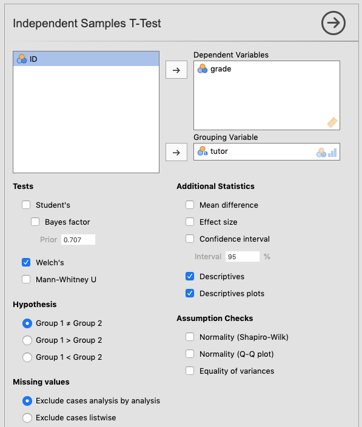
```

<br/><br/>

If you're following along, you should see something like the following as output:

<br/><br/>

<!-- The code below brings in data for display of certain things -->
```{r, echo=F, message=F, warning=FALSE}
HarpoData <-readr::read_csv("datasets/DataVis_Harpo.csv", col_names=T)
HarpoData$ID <- as.character(HarpoData$ID)
HarpoData$tutor <- as.factor(HarpoData$tutor)
```

```{r, echo=F, message=FALSE, warning=FALSE}
jmv::ttestIS(
    formula = grade ~ tutor,
    data = HarpoData,
    vars = grade,
    students = FALSE,
    welchs = TRUE,
    desc = TRUE,
    plots = TRUE)
```

<br/><br/>

#### Interpreting the output {#IndSamplesDrHarpoInterpreting}

Here you can see that the difference in grades between Anastasia's and Bernadette's tutoring groups are *marginally significant*^[The use of the term *marginally significant* is a bit controversial. It means that the *p*-value was close to going below .05, but didn't quite get there.] using Welch's *t*-test, which is the appropriate choice here.

<br/><br/>

#### Reporting the output {#IndSamplesDrHarpoReporting}

As far as a write-up is concerned, this is how it might come out:

>The students in the group that Anastasia tutored scored a little bit higher (*M* = 74.5, *SD* = 9, *n* = 15) than those of Bernadette (*M* = 69.1, *SD* = 5.77, *n* = 18). This difference in means was marginally significant,  Welch's *t*(23) = 2.03, *p* = 054, with a medium-strong effect size (*d* = .74).

<br/><br/>

(For a guide on how to report *t*-tests, see section \@ref(ReportingInferentialStatistics))

```{r, echo=FALSE, warning=FALSE, message=FALSE}
rm(HarpoData)
```

<br/><br/>

### Advanced 1: The conspiracy data {#IndSamplesConspiracyData}

We're going to use another online *open data* set. This one is more involved, but fun. It is called the **Generic Conspiracist Beliefs Scale** [@BrothertonFrenchPickering2013]. If you like, you can take the survey yourself [here](https://openpsychometrics.org/tests/GCBS/). The online version is strictly for fun.

<br/><br/>

#### Obtaining the data {#IndSamplesConspiracyObtainingData}

This is an online survey designed to tap into the belief in generic conspiracy theories (there are 15 generic conspiracies covered, which were distilled down, mathematically,^[using something called *factor analysis*, which is covered in @lsj Chapter 15, but which we don't cover in this class] from 75). You can see these questions [here](https://www.frontiersin.org/files/Articles/46573/fpsyg-04-00279-HTML/image_m/fpsyg-04-00279-at001.jpg), or in the Appendix of @BrothertonFrenchPickering2013. Responses to these question were on a Likert Scale, ranging from 1 (*Definitely not true*) to 5 (*Definitely true*).

<br/><br/>

```{block, type="rmdnote"}
**NOTE**: The data that was collected online is not the data that was reported in @BrothertonFrenchPickering2013, which was a more serious effort. Rather, the data you have access to was collected for fun. Or as the authors put it in the codebook: "Visitors [to the online survey] completed the test primarily for personal amusement." A major consequence of this is that you should not take any results you find here very seriously. If you want to find serious answers, read the published article.
```

<br/><br/>

The data (*data.csv*) and codebook (*codebook.txt*) can be found online [here](http://openpsychometrics.org/_rawdata/GCBS.zip) as a .zip file, or, for Texas A&M students in PSYC 301, on eCampus under *Lab: Lab manual data sets* > *TwoMeans_GCBS* (a folder containing the two files). Feel free to follow along with how we analyzed this data. 

In this case, as we saw before, the researchers indicated non-responses with a 0. Zero, then, is the number that represents missing values. So before we imported the data, we put 0 (i.e., zero, with no quotes) into the *Default missings* box under preferences $(\vdots)$.

<br/><br/>

#### Adjusting the data {#IndSamplesConspiracyAdjustinggData}

Once the data was imported (as we did back in Sections \@ref(Importing) and \@ref(PracticeImporting)), we changed some variable names with some help from the codebook. We also adjusted the variable types. We chose variable ***Q3*** (*Secret organizations communicate with extraterrestrials, but keep this fact from the public*) as our outcome variable (We called it *Comm.Wth.Exts* just to save space in the jamovi output). The changes are depicted below in \@ref(fig:TTestConspiracyImportExtraters).  

<br/><br/>

```{r TTestConspiracyImportExtraters, fig.cap="Changes made in jamovi to the variable *Q3* from @BrothertonFrenchPickering2013.", echo=F, out.width="600px"}
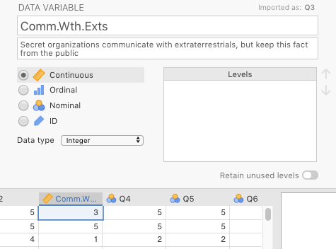
```

<br/><br/>

We chose ***voted*** (*Have you voted in a national election in the past year?*) as our two-level predictor variable. We changed the name to *Voted.In.Past.Year*. The change we made to it is shown in Figure \@ref(fig:TTestConspiracyImportVoting) below.

<br/><br/>

```{r TTestConspiracyImportVoting, fig.cap="Changes made in jamovi to the variable *voted* from @BrothertonFrenchPickering2013.", echo=F, out.width="600px"}
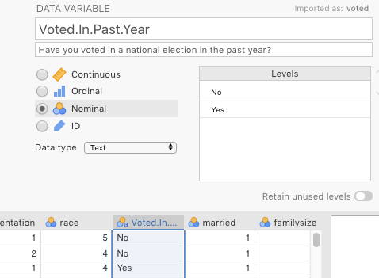
```

<br/><br/>

If we wanted to analyze any other variables, we would need to adjust those too. But there is no reason to do so in this manual, though you are welcome to play with the data yourself.

<br/><br/>

#### Implementing the procedure {#IndSamplesConspiracyImplementing}

We used the same settings as above in Figure \@ref(fig:TTestHarpoParameters), except that we kept the *Student's* option checked, and we also checked *Equality of variances* under the heading *Assumption Checks*.

<br/><br/>

```{r TTestConspiracySetParameters, fig.cap="Setting the parameters for a *t*-test on variables from @BrothertonFrenchPickering2013.", echo=F, out.width="600px"}
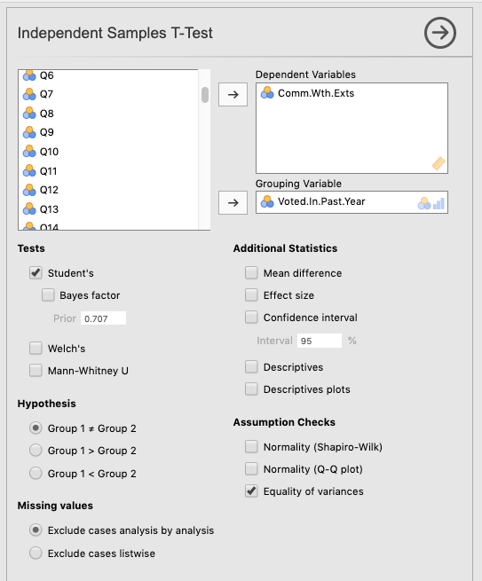
```

<br/><br/>

#### Interpreting the output {#IndSamplesConspiracyInterpreting}

<!-- The code below brings in data for display of certain things -->
```{r, echo=F, message=F}
GCBSdata.raw <- readRDS("datasets/TwoMeans_GCBS.rds")
```

```{r, echo=F, message=F}
GCBSdata <- GCBSdata.raw %>% 
  dplyr::select(Comm.Wth.Exts, Count.Comm.Wth.Exts, Voted.In.Past.Year)
rm(GCBSdata.raw)
```

The output below is what you should see in jamovi if you had only checked *Student's _t_-test*. Notice the footnote telling you that you can't really use Student's *t*-test. We also explicitly included the more detailed output for Levene's test below the *t*-test output. There you can see that the failure of this test is a pretty spectacular failure with an *F* value of 35.9 (trust us, this is a large *F* value). We'll get to what this all means when we analyze the final output.

<br/><br/>

```{r, echo=F, size="tiny", message=FALSE}
jmv::ttestIS(
    formula = Comm.Wth.Exts ~ Voted.In.Past.Year,
    data = GCBSdata,
    vars = Comm.Wth.Exts,
    eqv = TRUE)
```

<br/><br/>

In contrast, if you had only checked *Welch's*^[a better choice in our opinion as well as that of @lsj; see Sections 11.3.7 and 11.4; also see @DelacreLakensLeys2017, linked [here](http://doi.org/10.5334/irsp.82)], then the output is much simpler, and safer to go with. You can see it in the output below, where we have also included descriptive statistics and plots.

<br/><br/>

```{r, echo=F, message=FALSE}
jmv::ttestIS(
    formula = Comm.Wth.Exts ~ Voted.In.Past.Year,
    data = GCBSdata,
    vars = Comm.Wth.Exts,
    students = FALSE,
    welchs = TRUE,
    effectSize = TRUE,
    ci = FALSE,
    desc = TRUE,
    plots = TRUE)
```

<br/><br/>

Clearly, the effect is significant. But how do we interpret that? Well it turns out that with *t*-tests it's very simple in the case of a significant effect: The mean that is greater is significantly greater than the other, and vice-versa.

But there's a bigger problem. This is something that would have been caught beforehand if looking specifically at *Descriptives* (as we did in Chapter \@ref(DescriptiveStats)). But you can see it in two places here: 1) in the table of *Descriptives* that we asked for; and especially in 2) in the *Descriptives plots.*

Do you see it? 

Look at the means vs. the medians. The numbers are give explicitly in the table, but the dot plot really shows you what's happening. The means are plotted as circles flanked by confidence intervals.^[the lines above and below the circle; see @lsj Chapter 8 (specifically Section 8.5) for a discussion of confidence intervals] They look quite normal. However, the medians (represented as squares) are both at the bottom. This suggests, as you might expect, that the vast majority of respondents do not believe this kind of conspiracy theory. The distribution must be massively skewed to the right.

The best way to see this is with a violin plot with the *Data: Jittered* option checked (see Section \@ref(ViolinPlots)).

<br/><br/>

```{r, echo=F, size = "tiny"}
jmv::descriptives(
    formula = Comm.Wth.Exts ~ Voted.In.Past.Year,
    data = GCBSdata,
    violin = TRUE,
    dot = TRUE,
    missing = FALSE,
    mean = FALSE,
    median = FALSE,
    min = FALSE,
    max = FALSE)
```

<br/><br/>

Clearly, the distributions are very similar to each other, but they are **heavily** skewed positively (Remember, violin plots are like histograms [density plots, really] tilted 90 degrees counterclockwise, and then mirrored). The "violins" should be fat in the middle and narrow at the extremes. Instead, both violin plots look like narrow vases with wide bases, where the vast majority of the responses are 1, at the lower end of the scale (which is on the y-axis now, not on the left-hand side of the x-axis, as is true for histograms).

The *t*-test gave us a significant result, but it is not an appropriate test at all.

<br/><br/>

You might be asking yourself why we chose such an inappropriate data set while introducing you to the  *t*-test. Consider this an extreme example of why it is important to check statistical assumptions. Notice that if you just look at the results of the *t*-test without looking at the distribution of the variables or other diagnostics, you could easily come to the conclusion that the *t*-test showed us significant differences. This is where the following quotation is appropriate:

>"There are three kinds of lies: lies, damned lies, and statistics"
>
> --- Mark Twain purportedly quoting Benjamin Disraeli (but see [here](https://en.wikipedia.org/wiki/Lies,_damned_lies,_and_statistics))

<br/><br/>

Of course, the quote is both true and false. It is false because statistics cannot in and of themselves lie. After all, they're not human, and they tell you exactly what you ask them to tell you (perfect truth-tellers in fact). But humans can lie (or more commonly, tell half-truths) with statistics. That's how the quote is true in this case.

<br/><br/>

#### Reporting the output {#IndSamplesConspiracyReporting}

Just as you saw with the chi-square analyses in Chapter \@ref(CategoricalDataAnalysis), the APA reporting guidelines follow an almost universal pattern for statistical tests, with the following eight elements appearing left-to-right in order:

1. a letter (in italics) representing the test statistic used
2. parentheses that enclose the degrees of freedom
3. an equals sign
4. the obtained value of the test statistic
5. a comma
6. the letter *p* in italics
7. one of three symbols: =, <, or >
8. a *p*-value

<br/><br/>

```{block, type="rmdwarning"}
***WARNING***: This report is not justified because the analysis was inappropriate, but it is how it would look if the analysis had been appropriate:
```

<br/><br/>

> "An independent-samples *t*-test was carried out between people who *had* voted in the previous year and those who *had not* on degree of agreement with a conspiracy theory in which secret organizations are concealing from the public their contact with aliens. Those who *had* voted showed significantly less agreement with the conspiracy statement (*M* = 1.85, *SD* = 1.26, *n* = 792) than those who *had not* voted (*M* = 2.15, *SD* = 1.43, *n* = 1,672) according to Welch's *t*(1742) = 5.27, *p* < .001. The effect size was somewhat small (*d* = 0.21)."

<br/><br/>

For a guide on how to report *t*-tests specifically, as above, see Section \@ref(ReportingInferentialStatistics).

<br/><br/>

#### Alternative analysis of conspiracy data {#AlternativeConspiracyData}

Briefly, to deal with this particular problem, one could carry out chi-square analysis. It's a bit cruder, since you lose a good deal of information, but it will do the trick. First, we would need to compute a new variable in order to do a chi-square analysis as in the last chapter in this manual, which is also in Chapter 10 of @lsj.

##### Recoding the Likert item {#AlternativeConspiracyRecoding}

<!-- The code below is to add the new variable for the chi-square analysis -->
```{r, echo=F}
GCBSdata$Count.Comm.Wth.Exts <- as.factor(ifelse(GCBSdata$Comm.Wth.Exts==1,"Totally Disagree","Do NOT Totally Disagree"))
```

We created a new two-level factor from the original Likert item. This was done in jamovi through the *Data* tab. We just clicked *Compute* from there. This automatically inserted a new column, but without any values. We gave the variable a new name (*Count.Comm.Wth.Exts*), and inserted the following IF-THEN-ELSE statement into the function box:

> "IF(Comm.Wth.Exts==1,"Totally Disagree","Do NOT Totally Disagree")"

<br/><br/>

See Figure \@ref(fig:TTestConspiracyComputeNewCount) below.

<br/><br/>

```{r TTestConspiracyComputeNewCount, fig.cap="Computing a new, 2-level nominal variable based on an old continuous variable using an IF-THEN-ELSE function in jamovi.", echo=F, out.width="600px"}
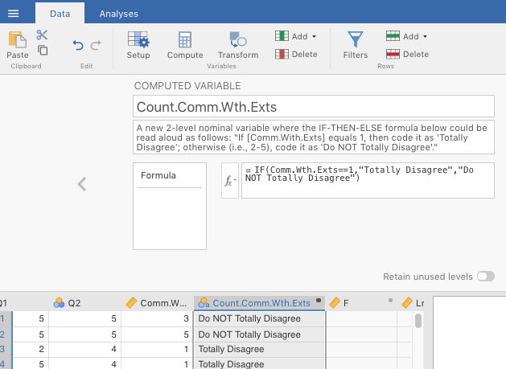
```

<br/><br/>

The end result was a new categorical variable with two levels.^[We could have split up counts of the new variable in a different way e.g., 1-2 in one group and 3-5 in another, but this is definitely the most efficient since the vast majority of respondents answered 1 (*Totally disagree*)]

<br/><br/>

##### Doing a chi-square analysis {#AlternativeConspiracyImplementing}

Next we did an *independent samples chi-square test of association* (see last chapter). The results are displayed in the table below.

<br/><br/>

```{r, echo=F}
jmv::contTables(
    formula = ~ Count.Comm.Wth.Exts:Voted.In.Past.Year,
    data = GCBSdata,
    chiSq = FALSE,
    chiSqCorr = TRUE,
    phiCra = TRUE,
    exp = TRUE,
    pcCol = TRUE)
```

<br/><br/>

The chi-square test was significant. Looking at the contingency table, one can see the following. Among those who **did not** vote, the expected number of people who totally disagreed with the conspiracy theory was lower (867) than expected (920), whereas among those who **did** vote, the number of people who totally disagreed was higher (489) than expected (436). Also, among those who did not vote, there was about a 50/50 split between absolutely disagreeing and not-totally disagreeing with the conspiracy theory. In contrast, among those who did vote, those who disagreed outnumbered those who didn't totally disagree by about 5-to-3.

This test is not as potentially informative as having the convenience of 1-5 Likert scale. However, it is more appropriate in this case. You can trust these results more.^[Note that if were were serious researchers trying to get this published in a peer-reviewed journal, we would probably get some resistance from a reviewer since our transformation was so extreme. They might ask us to re-collect our data using yes/no scale directly, instead of relying on a transformation. This is not unreasonable. After all, what we did was we made several assumptions about how participants **would** have responded if the scale had been pitched differently. But we don't **know** that they would have responded that way; we can only assume so, which may not be enough for science.]

<br/><br/>

##### Reporting the alternative output {#AlternativeConspiracyReporting}

(See section \@ref(ReportingInferentialStatistics) for a guide on how to report chi-square analyses in APA format)

What follows is  more legitimate report, namely, that of the chi-square analysis:

>"An independent-samples Chi-square test of association was calculating comparing the relative frequencies of voters vs. non-voters in their propensity to agree with a conspiracy-theory statement concerning secret societies concealing their contact with aliens. There was a significant interaction, *$\chi$*^2^(1, *N* = 2464) = 20.8, *p* < .001. The effect size was quite small (*$\phi$* = .09). There were slightly fewer-than-expected voters who agreed with the statement, whereas there were slightly more-than-expected non-voters who agreed with the statement."

<br/><br/>

```{r, echo=FALSE, message=FALSE, warning=FALSE}
rm(GCBSdata)
```

<br/><br/>

### Advanced 2: Spoken vs. written pitches {#IndSamplesSpokeWrit}
<!-- DO NOT UNCOMMENT:  -->
<!-- This is from the [Open Stats Lab](https://sites.trinity.edu/osl/data-sets-and-activities/t-test-activities). It is the article by @SchroederEpley2015. -->
<!-- END DO NOT UNCOMMENT -->

You will be working on a real data set. The description of the study is below, followed by the relevant tasks you need to carry out, as well as some useful information to get you started.

#### Study description {#IndSamplesSpokeWritDescription} 

The following activity is a partially altered version of one developed by @OslHandouts.

Imagine you were a job candidate trying to pitch your skills to a potential employer. Would you be more likely to get the job after giving a short speech describing your skills, or after writing a short speech and having a potential employer read those words? That was the question raised by a couple of researchers at the University of Chicago. The authors predicted that a person’s speech (i.e., vocal tone, cadence, and pitch) communicates information about their intellect better than their written words (even if they are the same words as in the speech).

To examine this possibility, the authors randomly assigned 39 professional recruiters for Fortune 500 companies to one of two conditions. In the audio condition, participants listened to audio recordings of a job candidate’s spoken job pitch. In the transcript condition, participants read a transcription of the job candidate’s pitch. After hearing or reading the pitch, the participants rated the job candidates on three dimensions: intelligence, competence, and thoughtfulness. These ratings were then averaged to create a single measure of the job candidate’s intellect, with higher scores indicating the recruiters rated the candidates as higher in intellect. The participants also rated their overall impression of the job candidate (a composite of two items measuring positive and negative impressions). Finally, the participants indicated how likely they would be to recommend hiring the job candidate (0 - not at all likely, 10 - extremely likely).

#### Your tasks {#IndSamplesSpokeWritTask}

1. Start jamovi.
2. Import the data file in eCampus called *TwoMeans_SpokeWrit.csv*. 

<br/><br/>

```{block2, type="rmcaution"}
**CAUTION**: When you import this .csv file, you will notice that there is no codebook for this data set. However, it is pretty clear that the missing values are blanks. Therefore, in jamovi under $(\vdots)$ > *Import: Default missings* you should type in "", as displayed below in Figure \@ref(fig:PracticeInfantMusicDefaultMissings).
```

<br/><br/>

```{r PracticeInfantMusicDefaultMissings, fig.cap='Setting *Default missings* to blanks ("") in jamovi.', echo=F, out.width="300px"}
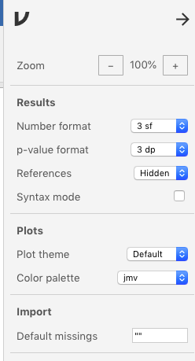
```

<br/><br/>

3. Explore the data file. Note, you will not analyze all of these variables. Try to find the variables that are relevant to the study description above. Modify them if necessary.  
4. Save it as .omv file with the following name: "SpokeWritExercise_YOURLASTNAME_YOUR FIRSTNAME.omv" (where the elements in uppercase are replaced with your last and first name, respectively).  
5. You first want compare participants in the audio condition to participants in the ***transcript*** condition on the ***Intellect_Rating*** variable. Which type of analysis is appropriate, given the design described above?  
6. Next compare participants in the ***audio*** condition to participants in the ***transcript*** condition on the ***Impression_Rating*** variable.  
7. Finally, compare participants in the ***audio*** condition to participants in the ***transcript*** condition on the ***Hire_Rating*** variable.  
8. Prepare an APA-style results paragraph describing the results of the analyses performed above.  

<br/><br/>

## The paired-samples *t*-test {#DoingPairedSamplesTTest}

Paired samples *t*-tests are used when you have a single outcome variable, but the two groups that you are splitting the outcome variable by consist of the same people (or sometimes, *different* people who are highly matched on key variables). The key here is that the *concept* that splits the two means must result in correlated values, meaning that the value for one of the "levels" gives you a good idea of what the value for the other "level" is.

You might be asking yourself why we used the term *concept* instead of *variable* (after all, you split your outcome variable by another two-level predictor in the case of the independent samples *t*-test; don't you do the same thing here?). You need not worry very much; we're actually just highlighting something about the data set that is typically used for this kind of analysis. In a traditional paired samples *t*-test, the two levels of the predictor variable are represented as two separate columns.^[This is also true of the big sister to the paired samples *t*-test: the repeated measures ANOVA, which we won't get in to here, but can be found in the main textbook [@lsj], section 13.8] So there technically is no variable in the data set, per se, that splits the variable into its two levels. You have to understand that your data set has that structure. When you run the analysis in jamovi, you will need to select two different columns corresponding to those two levels.^[The more modern way to do this kind of analysis works more like the independent samples *t*-test with a *Split by* variable, but this approach, called *multilevel modeling* or *mixed-effects modeling* is well beyond the scope of this class. However, for what it's worth, it is mentioned in your main textbook [@lsj], in section 17.1.2, under the bullet point labeled *Mixed Models* (apologies or the multiple names for identical concepts; it's one of the curses of statistics).] You will see this shortly.

<br/><br/>

### Basic: The *Chico* data {#PairedSamplesChicoBasicData}

For the basic paired-samples *t*-test we are going to analyze the sample data provided by @lsj in the data set *Chico.omv*. To find this data set, simply go to $(\equiv)$ > *File* > *Open* > *Data Library* > *Chico*. The data should look like the table below.

<br/><br/>

```{r, echo=FALSE, warning=FALSE, message=FALSE}
Chico <- readRDS("datasets/TwoMeans_Chico.rds")
```

```{r, echo=F, warning=F, message=F}
knitr::kable(Chico, caption="The 'Chico' data set from Navarro and Foxcroft (2019).", digits = c(0,2,2) ) %>%
  kableExtra::kable_styling(bootstrap_options = "striped")
```

<br/><br/>

Descriptives of the data should come out as follows:

<br/><br/>

```{r, echo=F}
jmv::descriptives(
    data = Chico,
    vars = vars(grade_test1, grade_test2),
    missing = FALSE,
    median = FALSE,
    sd = TRUE,
    min = FALSE,
    max = FALSE)
```

<br/><br/>

#### Implementing the procedure {#PairedSamplesChicoBasicImplmenting}

To get a paired-samples *t*-test, Go to *Analyses* > *T-Tests* tabs. Then slide *grade_test2* over to the *Paired Variables* box. It should end up on the left-hand column of that box. Then slide *grade_test1* over. This variable should end up in the right-hand column.^[You could do this in either order, but we are following @lsj [section 11.5.3]. Presumably, they did this in order to get a positive value for Cohen's *d*, in order to reduce confusion for the reader.] Additionally, make sure that *Student's* is checked, along with *Effect size* and *Descriptive plots*. Figure \@ref(fig:PairedTTestBasicParameters) below shows what you should see after doing all this.

<br/><br/>

```{r PairedTTestBasicParameters, fig.cap="Setting the parameters for a paired-samples *t*-test on a simulation of the *Chico* data from @lsj.", echo=F, out.width="600px"}
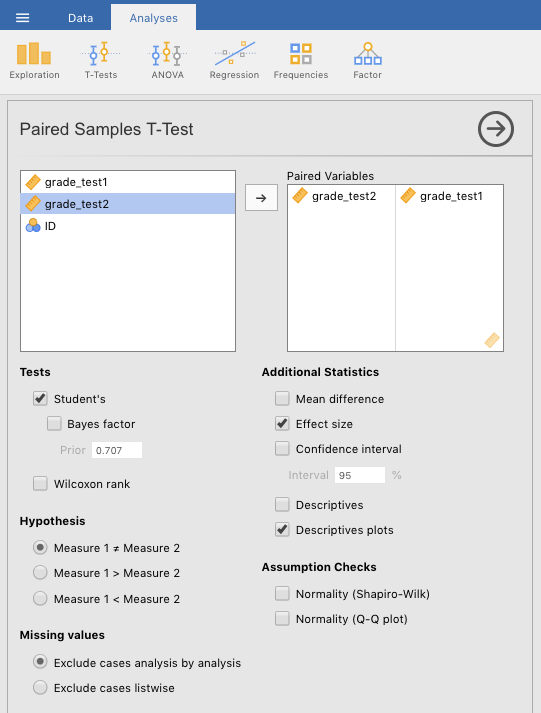
```

<br/><br/>

The output from this procedure can be seen below.

<br/><br/>

```{r, echo=FALSE, message=FALSE, warning=FALSE}
jmv::ttestPS(
    data = Chico,
    pairs = list(
        list(
            i1="grade_test2",
            i2="grade_test1")),
    effectSize = TRUE,
    plots = TRUE)
```

<br/><br/>

#### Interpreting

The test was clearly statistically significant with *p* less than .001, with Student's *t* at 6.48 (19 degrees of freedom). From the graph, it looks like grades at time of test 2 were significantly greater than at time of test 1. 

But there is one issue here that might get overlooked in the graph. Normally, one can use confidence intervals to judge significance. Specifically, when confidence intervals do not overlap, or overlap only a little, one can hazard a guess that the difference is significant. This was evident in our basic analysis of the independent-samples *t*-test above (Section \@ref(IndSamplesDrHarpo)), the Dr. Harpo data. Note that the confidence intervals cross just a little, and the *p*-value is borderline significant.

**However**, this trick that compares confidence intervals only works with independent-samples (or between-subjects tests). When the comparisons are paired (or repeated measures), confidence intervals do not work so well because they **over**-estimate the error. That is, they are too wide. Notice here that the confidence intervals cross each other a lot, yet the effect is significant. This is common in paired-samples (or repeated-measures) data.

<br/><br/>

#### Reporting

What follows is how one might report this analysis:

>"The 20 students in Dr. Chico's class scored a little bit higher on the second exam (*M* = 58.4, *SD* = 6.41) than they did on the first exam (*M* = 57.0, *SD* = 6.62). This difference in means was highly significant according to a paired *t*-test, *t*(19) = 6.48, *p* < .001, with a strong effect size (*d* = 1.45)."

<br/><br/>

### Advanced 1: Randomly generated *Chico* data {#PairedSamplesChicoAdvancedData}

For the first advanced, paired *t*-test we are just going to add a small twist. We are going to modify the data so that you create the data yourself, as you may have tried in Section \@ref(Randoming).

<br/><br/>

#### "Replicating" the data {#PairedSamplesChicoAdvancedReplicating}

To start, for the purpose of illustration,^[This is actually a very useful procedure in the world of data analysis, but it only serves as an illustration here.] we will replicate the original means and standard deviations of the *Chico.omv* data set with a different set of data points. Begin by opening a new file in jamovi by clicking $(\equiv)$ > *New*. 

Select the default variables (*A* through *C*) and delete them using *Delete* under the *Data* tab.

Double-click a blank variable (at the header, or top row) and choose *NEW DATA VARIABLE*. Give it the name *ID*, and make it an *ID* variable type. See Figure \@ref(fig:TTestRandomlyChicoStartIDVar) 

<br/><br/>

```{r TTestRandomlyChicoStartIDVar, fig.cap="Creating a new ID variable.", echo=F, out.width="600px"}
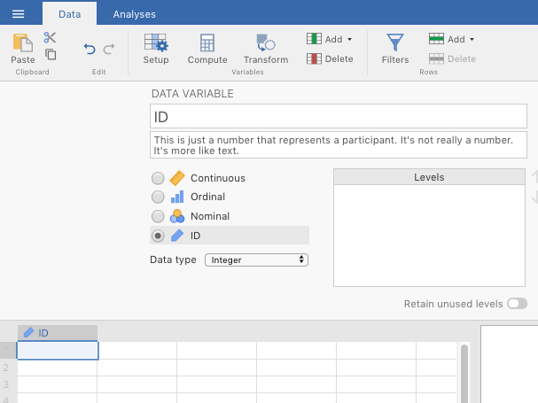
```

<br/><br/>

Then, double-click another blank column header, but this time choose *NEW COMPUTED VARIABLE*. Name it *grade_test1*. In the original, sample data set, the mean of this variable is 57.0, with a standard deviation of 6.62. So in the formula box ($f_{x}$), type in the following formula: =NORM(57,6.62), then press <enter>. See Figure \@ref(fig:TTestRandomlyChicoStartGradeVar) below. Do the same for another variable, but name it *grade_test2*, and type in the formula, =NORM(58.4,6.41).

<br/><br/>

```{r TTestRandomlyChicoStartGradeVar, fig.cap="Step one of creading a new computed variable, consisting of observations drawn randomly from an infinite number of observations comprising a normal distribution with a mean of 57 and a standard deviation of 6.62.", echo=F, out.width="600px"}
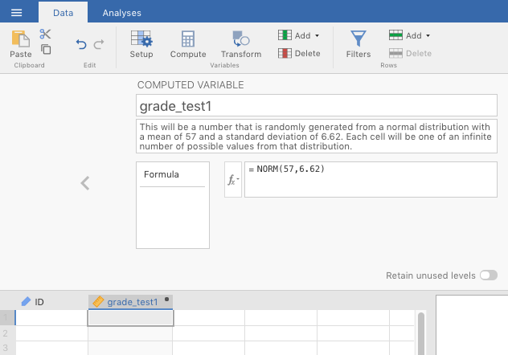
```

<br/><br/>

Now, go back to the spreadsheet and start entering values into the *ID* cells. Start with the top left, and enter "1" (without quotation marks). You'll see the two computed variables automatically fill up with "random" numbers. Do this for 20 rows, with a different number for each row of *ID* (the easiest is to use the numbers 1-20, of course, and jamovi will not think that they're numbers since you set it as an ID variable type). In Figure \@ref(fig:TTestRandomlyChicoFill) below, you can see that it's possible to skip rows on the *ID* variable. The ID variable is not that important for our purposes anyway.

<br/><br/>

```{r TTestRandomlyChicoFill, fig.cap="Filling in rows in the new, computed variable. Note the ability to skip rows on the ID variable.", echo=F, out.width="600px"}
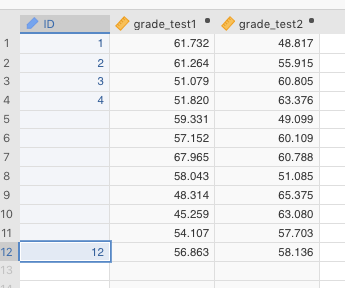
```

<br/><br/>

See the table below for **OUR** data (the odds are astronomically low that you would have the same values since they were generated randomly).

<br/><br/>

```{r, echo=F}
RandomlyChico <- readRDS("datasets/TwoMeans_ChicoRandomly.rds")
```

```{r, echo=F, warning=F, message=F}
knitr::kable(RandomlyChico, caption="The authors' randomly generated data set based off of the 'Chico' data set from Navarro and Foxcroft (2019).", digits = c(0,2,2) ) %>%
  kableExtra::kable_styling(bootstrap_options = "striped")
```

<br/><br/>

Now you should do descriptives on your data as you did in Sections \@ref(SummarizingContinuousVariables) and \@ref(PracticeSummarizingAndReporting). Be sure to click standard deviation. The table below shows the relevant descriptives for our data (again, yours will be different).

<br/><br/>

```{r, echo=F}
jmv::descriptives(
    data = RandomlyChico,
    vars = vars(grade_test1, grade_test2),
    missing = FALSE,
    median = FALSE,
    sd = TRUE,
    min = FALSE,
    max = FALSE)
```

<br/><br/>

You might be shocked to notice that the means and standard deviations are not exactly the same as they are in the original *Chico.omv* file. This is because the ***=NORM()*** function does not replicate the data set *per se*. Rather, it draws values at random from a theoretical, normal distribution defined by your parameters (e.g., a mean of 57 and a standard deviation of 6.62), and those theoretical distributions consist of an infinite number of observations to draw from. It also follows that the more observations you add here, the closer you will get to the means and standard deviations of the original settings.

We are now ready to analyze the data using a paired-samples *t*-test. We will show you the results of with our randomly generated data, but yours will necessarily be different.

<br/><br/>

#### Implementing the procedure {#PairedSamplesChicoAdvancedImplementing}

You can now run the same test as above in section \@ref(PairedSamplesChicoBasicData) and Figure \@ref(fig:PairedTTestBasicParameters). The output from this procedure can be seen below.

<br/><br/>

```{r, echo=FALSE, message=FALSE, warning=FALSE}
jmv::ttestPS(
    data = RandomlyChico,
    pairs = list(
        list(
            i1="grade_test2",
            i2="grade_test1")),
    effectSize = TRUE,
    plots = TRUE)
```

<br/><br/>

#### Interpreting the output {#PairedSamplesChicoAdvancedInterpreting}

Our data is not even close to significant, with a *p*-value approaching 0.5 (recall, our alpha level is .05, not .5). This contrasts a great deal with the original *Chico* data from @lsj. Their data was presumably not randomly generated, but rather artificially constructed to show a particular pattern, namely, scores at *time 2* always being higher than scores at *time 1* (this was the research hypothesis, in fact).

You might expect this, as the two grades from each student are **supposed** to be correlated with each other. *Correlated* in this case means that, given one value for a student, you can make a pretty good prediction about their other value. Or specifically, given their score on *test 1*, you can make a reasonable guess that their score on *test 2* will be higher. This is why we do paired-samples *t*-tests in fact. 

To determine if this was, in fact, the case, we subtracted the scores for *time 1* from the scores for *time 2*, and called the new variable *DIFF*. We did this for both data sets. If students are generally doing better the 2nd time, then you should see mostly positive difference scores. This is exactly what we see for the original data set below.

<br/><br/>

```{r, include=FALSE}
OriginalChicoWithDiff <- readRDS("datasets/TwoMeans_ChicoOriginalWithDiff.rds")
```

```{r, echo=F, warning=F, message=F}
knitr::kable(OriginalChicoWithDiff[,1:4], caption="The original Chico.omv data set from Navarro & Foxcroft (2019), with 'DIFF' being 'time 1' subtracted from 'time 2'.", digits = c(0,2,2,2)) %>%
  kableExtra::kable_styling(bootstrap_options = "striped")
```

<br/><br/>

We can do the same with our randomly generated data.

<br/><br/>

```{r, include=FALSE}
RandomlyChico$DIFF <- RandomlyChico$grade_test2-RandomlyChico$grade_test1
```

```{r, echo=F, warning=F, message=F}
knitr::kable(RandomlyChico, caption="The randomly generated Chico.omv data set from Navarro & Foxcroft (2019), with 'DIFF' being 'time 1' subtracted from 'time 2'.", digits = c(0,2,2,2)) %>%
  kableExtra::kable_styling(bootstrap_options = "striped")
```

<br/><br/>

It is clear from this second table that these scores are **uncorrelated** with each other. Some values are higher during the 2nd test, whereas others a lower. The underlying pattern is random, except that the values for *time 2* are slightly higher, **on average** than the values for *time 1*. That makes sense because jamovi calculated random values for each variable, without any kind of underlying correlation between any two values for one student (i.e., some did better on the 2nd test; some did worse, in about equal). Apologies for leading you up the garden path. But we needed to illustrate that two randomly generated variables are not necessarily correlated (and probably won't be).

It turns out that there was a way to get *time 2* correlated with *time 1*, with the former being slightly greater than the latter. See below.

In the *NEW VARIABLE* formula for *time 2*, we should **not** have entered "*=NORM(58.4,6.41)*" for *grade_test2* (see Figure \@ref(fig:TTestRandomlyChicoStartGradeVar)) but rather "*=grade_test1 + NORM(1.4, 0.97)*" (which correspond the actual mean and standard deviation of the difference scores in the original data set). This new formula can be read as follows:

>"take *grade_test1* and ***add*** to it a value randomly drawn from a distribution (of infinite values) with a mean of 1.4, and a standard deviation of 0.97."

<br/><br/>

This will generate correlated values within observations. You can see this in the table below if you look at the *DIFF* scores.

<br/><br/>

```{r, echo=FALSE, message=FALSE, warning=FALSE}
set.seed(119873)
RandomlyChico2 <- RandomlyChico %>% 
  dplyr::mutate(NewRand = rnorm(20, 1.4,0.97)) %>% 
  dplyr::mutate(grade_test2 = grade_test1 + NewRand) %>%
  dplyr::select(-NewRand) %>%
  dplyr::mutate(DIFF = grade_test2 - grade_test1)
```

```{r, echo=F, warning=F, message=F}
knitr::kable(RandomlyChico2, caption="The randomly generated Chico.omv data set (corrected to have correlated levels) from Navarro & Foxcroft (2019), with 'DIFF' being 'time 1' subtracted from 'time 2'.", digits = c(0,2,2,2)) %>%
  kableExtra::kable_styling(bootstrap_options = "striped")
```

<br/><br/>

And if we run a paired samples *t*-test, we get the following results. This result is very close to the original data in @lsj [section 11.5, figure 11.16].

<br/><br/>

```{r, echo=FALSE, message=FALSE, warning=FALSE}
jmv::ttestPS(
    data = RandomlyChico2,
    pairs = list(
        list(
            i1="grade_test2",
            i2="grade_test1")),
    effectSize = TRUE,
    desc = TRUE)
```

<br/><br/>

#### Reporting the output {#PairedSamplesChicoAdvancedReporting}

See section \@ref(ReportingInferentialStatistics) for a review of how to report the specific *t*-test statistics in APA format.

One could report the null findings from the first pair of randomly generated variables in the following way:

>Students scored higher on average during the second exam (*M* = 57.1, *SD* = 5.19, *N* = 20) than during the first exam (*M* = 55.8, *SD* = 6.64, *N* = 20). However, the difference in means was quite small, and there was no statistically significant effect of time of test, *t*(19) = 0.664, *p* = 0.514. The effect size was also quite small, *d* = 0.149. Students are doing no better or worse on average during the second exam, compared to the first.

<br/><br/>

But the second randomly generated (but correlated) data set would be significant, and reported as follows:

>"Students scored higher on average during the second exam (*M* = 57.6, *SD* = 6.74, *N* = 20) than during the first exam (*M* = 55.8, *SD* = 6.64, *N* = 20). Although the difference in means was quite small,  there was a statistically significant effect of time of test, *t*(19) = 8.19, *p* < 001. The effect size was also quite large, *d* = 1.83. Students are doing better on average during the second exam, compared to the first."

```{r, echo=FALSE, warning=FALSE, message=FALSE}
rm(RandomlyChico)
rm(RandomlyChico2)
```

<br/><br/>

### Advanced 2: Singing parents {#PairedSamplesSingingParents}
<!-- DO NOT UNCOMMENT:  -->
<!-- This is from the [Open Stats Lab](https://sites.trinity.edu/osl/data-sets-and-activities/t-test-activities). It is the article by @MehrSongSpelke2016. -->
<!-- END DO NOT UNCOMMENT -->

This is another real data set from a real study. The description of the study is below, followed by the relevant tasks you need to carry out, as well as some useful information to get you started.

#### Study description {#ExtraPracticingPairedSamplesStudyDescription}

The following activity is another partially altered version of one developed by @OslHandouts.

Parents often sing to their children and, even as infants, children listen to and look at their parents while they are singing. The research here by a couple of Harvard researchers sought to explore the psychological function that music has for parents and infants, by examining the hypothesis that particular melodies convey important social information to infants. Specifically, melodies convey information about social affiliation.

The authors argue that melodies are shared within social groups. Whereas children growing up in one culture may be exposed to certain songs as infants (e.g., “Rock-a-bye Baby”), children growing up in other cultures (or even other groups within a culture) may be exposed to different songs. Thus, when a novel person (someone who the infant has never seen before) sings a familiar song, it may signal to the infant that this new person is a member of their social group.

To test this hypothesis, the researchers recruited 32 infants and their parents to complete an experiment. During their first visit to the lab, the parents were taught a new lullaby (one that neither they nor their infants had heard before). The experimenters asked the parents to sing the new lullaby to their child every day for the next 1-2 weeks.

Following this 1-2 week exposure period, the parents and their infant returned to the lab to complete the experimental portion of the study. Infants were first shown a screen with side-by-side videos of two unfamiliar people, each of whom were silently smiling and looking at the infant. The researchers recorded the looking behavior (or gaze) of the infants during this ‘baseline’ phase. Next, one by one, the two unfamiliar people on the screen sang either the lullaby that the parents learned or a different lullaby (that had the same lyrics and rhythm, but a different melody). Finally, the infants saw the same silent video used at baseline, and the researchers again recorded the looking behavior of the infants during this ‘test’ phase. For more details on the experiment’s methods, please refer to Mehr et al. (2016) Experiment 1.

<br/><br/>

#### Getting the data {#PairedSamplesSingingParentsImportingGetting}

This *open data* set is located on eCampus at *Lab: Lab manual data sets* > *TwoMeans_InfantMusic.csv* (or as an .omv file). Again, the missing value for this .csv file is a blank. So set the *Default missings* to two side-by-side quotation marks: ""

<br/><br/>

#### Adjusting the data {#PairedSamplesSingingParentsAdjusting}

The first thing you will need to do is filter the experiments down to only those for Experiment 1.

The data are deliberately set up such that you can use a *filter* to restrict the data. There are three variables in the data set named, respectively, *exp1*, *exp2*, and *exp3*. You only need the first for this. It is coded "1" if that observation (row) corresponds to Experiment 1, and "0" if it corresponds to Experiments 2 or 3.

You do this by going to the *Data* tab in jamovi, and finding the *Filters* icon. Click it and a window will pop up. The filter will be named *Filter 1*, and a new column will appear on the left of the spreadsheet. The filter formula goes into the box to the left of the formula symbol $(f_{x})$. In this box, you should type in the following: ***exp1==1***.

The results of this process should look similar to Figure \@ref(fig:PracticeInfantMusicFilter1) below.

<br/><br/>

```{r PracticeInfantMusicFilter1, fig.cap='Creating a filter in jamovi.', echo=F, out.width="600px"}
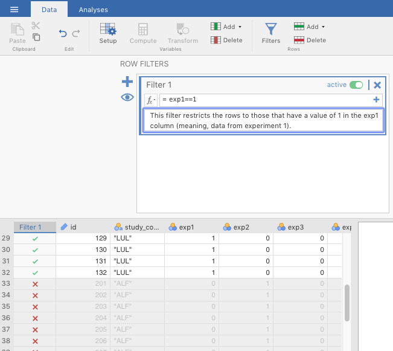
```

<br/><br/>

### Your tasks {#PairedSamplesSingingParentsStudentTask}

1. Explore the data file. Note, you will not analyze all of these variables. Try to find the variables that are relevant to the study description above (Section \@ref(ExtraPracticingPairedSamplesStudyDescription).  
2. Next, you want to demonstrate that infants attended equally to the two singers during the familiarization trials. Run a paired samples *t*-test comparing the ***Gaze to Familiar Song*** vs. the ***Gaze to Unfamiliar Song***.  
3. Finally, compare looking behavior at baseline to looking behavior at test, using a paired-samples *t*-test.  
4. Prepare an APA-style results section to describe each of the analyses conducted above.

<br/><br/>

## Outside help on *t*-tests {#OutsideHelpOnComparingTwoMeans}

[datalab.cc](https://datalab.cc/tools/jamovi) has a nice introduction to the purpose of these tests (minus the one-sample *z*-test). Choose video #26 (*_t_-tests: chapter overview*). You can also find this at Texas A&M via the *Howdy!* portal as tutorials in *LinkedIn Learning*.

<br/><br/>

### Independent samples *t*-test {#OutsideHelpOnIndependentSamplesT}

For a just-the-basics online tutorial on the independent samples *t*-test, go to the [jamovi quickstart guide](https://www.jamoviguide.com/t-test.html#independent).

[datalab.cc's tutorial](https://datalab.cc/tools/jamovi) has a more extensive video tutorial. Choose videos #27. 

You will also find online tutorials at [Statistics for Psychologists](https://www4.uwsp.edu/psych/cw/statistics/textbook.htm) [@Wendorf2019]. Choose *JAMOVI* > *JAMOVI: Using the Software*. Scroll to the table of contents, and click *INDEPENDENT SAMPLES T TEST*. On the same website, you can find a tutorial for interpreting the output. Just go to *JAMOVI* > *JAMOVI: Annotated Output*. Then scroll down to the table of contents and choose *T-TEST (INDEPENDENT SAMPLES)*. The annotations are based on a slightly older version of jamovi, but they will suffice.

Your main textbook [@lsj] covers this in Sections 11.3 and 11.4.

<br/><br/>

### Paired samples *t*-test {#OutsideHelpOnPairedSamplesT}

For a quick online tutorial on the paired samples *t*-test, go to the [jamovi quickstart guide](https://www.jamoviguide.com/t-test.html#paired).

[datalab.cc](https://datalab.cc/tools/jamovi) covers paired-samples *t*-tests in video #28.

You will also find online tutorials at [Statistics for Psychologists](https://www4.uwsp.edu/psych/cw/statistics/textbook.htm) [@Wendorf2019]. Choose *JAMOVI* > *JAMOVI: Using the Software*. Scroll to the table of contents, and click *PAIRED SAMPLES T TEST*.You can also find there a tutorial for interpreting the output. Just go to *JAMOVI* > *JAMOVI: Annotated Output*. Then scroll down to the table of contents and choose *T-TEST (PAIRED SAMPLES)*.

Your main textbook [@lsj] covers this in Section 11.5.