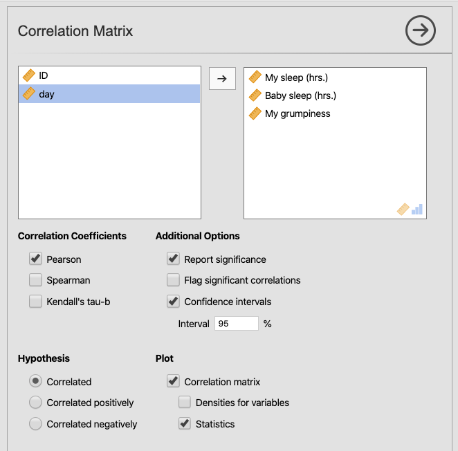
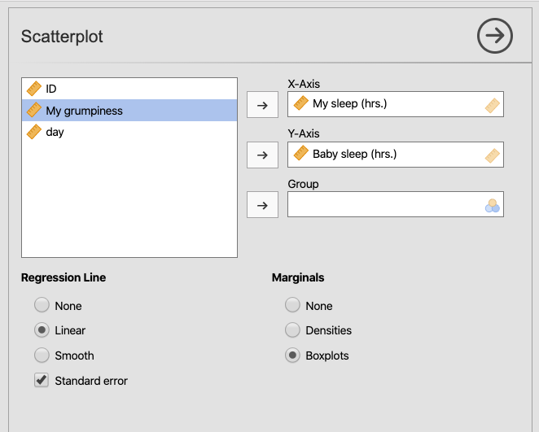
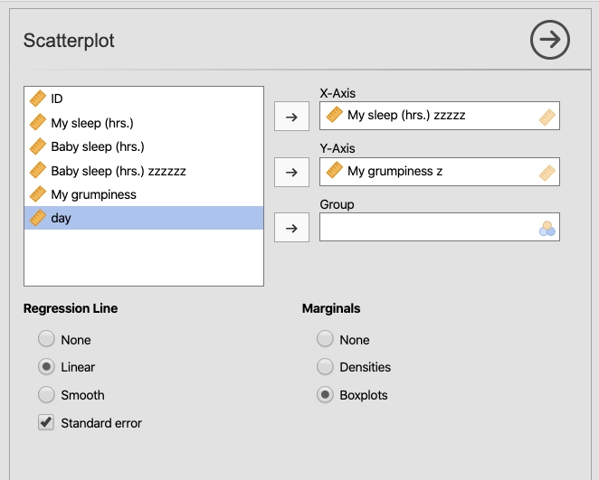
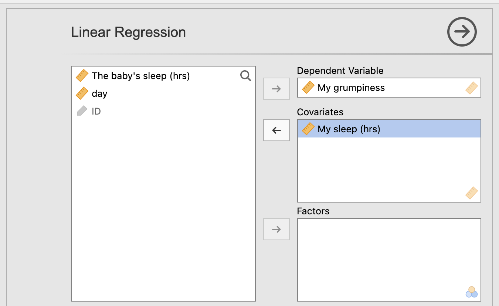
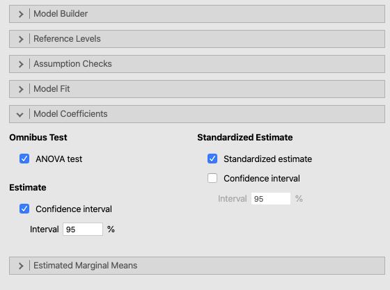
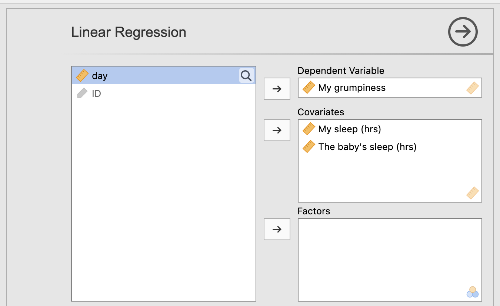

# Correlation and linear regression {#CorrAndLinearReg}

So far, we have only addressed cases where the predictor variable is categorical in nature (e.g., `Sex`: `male`/`female`; `Handedness`: `left`/`right`/`ambidextrous`). 

But this chapter is all about how to analyze data when both the outcome variable and the predictor variable are continuous in nature. For example, you might be interested in the proclivity of university students to attend sporting events (measured on a scale from 1-7, 1 being `not at all`, and 7 being `every event I can possibly attend`) as predicted by how much they crave social interaction (same scale, 1 being `not at all` and 7 being `all the time`). You might expect that students who provide higher values on the first question would also tend to provide higher values on the second, and vice-versa. This sort of analysis cannot be carried out with a chi-square, or *t*-test, or ANOVA. It can be analyzed, however, as a correlation or a simple regression.^[Note that there is a considerable amount of controversy here. Many would argue that Likert scales are either not truly interval scales, or (when used as predictor variables) not measured without error, or both. These are assumptions of the basic, introductory kind of regression we are doing this is class (ordinary least squares), though there are more advanced solutions to these problems (e.g., ordinal logistic regression and errors-in-variables modeling, respectively). At the same time, such questions are beyond the scope of this class. They are worth noting, however, to return to later when your statistical knowledge is sufficiently advanced.]

<br/>

## Correlations {#Correlations}

The first analysis in this chapter is correlation. The second is a simple regression. Both involved only two variables: a single, continuous outcome variable, and a single, continuous predictor variable. 

Underneath however, these two particular analyses turn out to the same thing. The correlation between two continuous variables (which is the kind of regression we deal with in this section) is essentially a special case of a simple regression between two variables. Specifically, correlation is a simple regression where both the outcome variable and the predictor variable are both standardized (i.e., into *z*-scores).^[Note that in the case of multiple regression, when there is more than one predictor variable, you cannot derive the correlation (Pearson's *r*) from any of your continuous predictor variables since the math is different.]

Restricting ourselves to correlation, the obtained value for a correlation between two continuous variables is known as Pearson's *r*, after Karl Pearson.^[Karl Pearson should not be confused with his son, Egon Pearson, who also became an historically important statistician. Most notably, we can partly credit the son with the decision-making component (the "Neyman-Pearson approach") of null-hypothesis significance testing that the frequentist statistics you are learning in this class revolves around.] The obtained value of Pearson's *r* ranges from -1 to 1, with the extremes (-1 and 1) indicating opposite, but equally strong, directions of correlation, and the middle value, 0, indicating no relationship at all. The closer one is to the extremes (-1 or 1), the *stronger* the correlation is. The closer one is to the middle (0), the *weaker* the correlation is.

The direction of the correlation (i.e., whether it's positive or negative) simply indicates the how the variables are related. Specifically, if the values of *X* tend to increase alongside increases in *Y*, then the correlation is positive (e.g., height and weight are always positively correlated, though the correlation is not perfect).

In contrast, if as the values of *X* go up, the values of *Y* tend to go **down**, then the correlation is negative. This is what you would find if you compared the amount of rainfall to the number of university students who walk or ride their bikes to school (note, that the number of students who *drive* to school would be positively correlated in this case -- thus, the direction of a correlation [positive or negative] has nothing to do with whether the relationship is "good" or "bad").

In the textbook [@lsj] in section 12.1.3, the authors simplify the formula for Pearson's *r* to the following:

$$r_{XY}=\frac{COV(X,Y)}{\hat{\sigma}_X,\hat{\sigma}_Y}$$

But for whatever reason, they don't simplify it further. This can be done. The easiest formula for Pearson's *r* (at least from the perspective of the author of this lab manual) is the following:

$$r_{XY}=\frac{\sum{Z_XZ_Y}}{n-1}$$
<br/>

Or more specifically:

$$r_{XY}=\frac{1}{n-1} \sum_{i=1}^n Z_{X_i}Z_{Y_i}$$

where `i` is an individual observation (e.g., multiply Jerry's *z*-score on *X* by his *z*-score on *Y*, then add that product to Jennifer's *z*-score on *X* multiplied by her *z*-score on *Y*... etc.)

<br/>

That is, for every observation in your data set, take the *z*-score for *X* and multiply it by the *z*-score for *Y*; add all those product up; and then divide by the number of observations minus 1 (*n-1*).

There is also a significance test associated with correlation. You can perform this inferential test on its own,^[with its own lookup table, if you happen to be in Papua New Guinea with a dead laptop battery, but a functioning hardcopy of a statistics book] or as a *t*-test of a coefficient in a simple regression (more on this later in section \@ref(LinearRegression) below).

<br/>

### Basic: Parenthood data {#BasicCorrelationParenthood}

This part of the lab manual simply presents the material in Navarro and Foxcroft [-@lsj], Chapter 12.1 to 12.2, but in a more lab-oriented manner.

<br/>

#### Importing the data {#BasicCorrelationParenthoodGettingTheData}

The data used to illustrate correlation in this chapter is called `Parenthood.csv` and it is available from the *jamovi* module associated with this textbook. Just go to ($\equiv$) > `Open` > `Data Library` > `Parentood.csv`.

The data is fictional, but real in the sense that the first author has a son, who was naturally an infant at one point. It is a fictitious data set where the author recorded three things:

1. their own sleep patterns (in total hours per night)  
2. their grumpiness over the course of 100 days (0 meaning `not at all grumpy`, and 100 meaning `extremely grumpy`)  
3. their son's sleeping patterns (in total hours per night)  

This data set is actually a comma-delimited text file (hence, the title of this subsection: *Importing*). So although *jamovi* is good at guessing, sometimes it makes mistakes. You want to make sure that all the variables, except perhaps `ID`, are continuous. So change any mis-specified variables first.

You can also re-name the variables, if you wish, into human-readable names, as Navarro and Foxcroft suggest [-@lsj, p. 282]. Do this in the top row of each variable when you double click the name. You should also probably save it as a .omv (*jamovi*) file. For the purposes of display, I chose `My sleep (hrs.)`, `Baby sleep (hrs.)`, and `My grumpiness`.

<br/>

#### Familiarization {#BasicCorrelationParenthoodFamiliarization}

Notice that there are three correlations that we can run here. Namely, correlations between the following variables:

1. their own sleep and the baby's sleep  
2. their own sleep and their own grumpiness  
3. the baby's sleep and their own grumpiness  

The first two seem like direct relationships. the last seems like an indirect relationship. This is extremely important since there's a well-known dictum in statistics:

>Correlation does not imply causation

<br/>

Or more precisely:

>Correlation does not *necessarily* imply causation, although all effects will be statistically correlated somehow with their causes as long as there are no significant moderating variables (variables that affect the relationship between the cause and the effect). That said, *causation* is mostly a research-design issue, not so much a statistical one.

<br/>

Importantly, you can probably guess that there will probably be a statistical correlation between the baby's sleep and the author's grumpiness. However, such a clearly indirect relationship would be conceptually *mediated*^[When the causal relationships among variables is unclear, one can employ *mediation analysis*, a set of statistical procedures designed to pull apart how inter-correlated variables are directly vs. indirectly related to each other. But this also is beyond the scope of this course.] by the author's own sleep.

<br/>

#### Analysis {#BasicCorrelationParenthoodAnalysis}

In this case, there are multiple possible correlations, not all of them useful (see section \@ref(BasicCorrelationParenthoodGettingTheData) above). Nonetheless, it is possible to analyze multiple correlations at the same time in *jamovi*.

Go to the `Analyses` tab, and click `Regression` and choose `Correlation Matrix` from the pull-down menu.

In the textbook, Navarro and Foxcroft [-@lsj] have you put all four variables into the analysis, but we will have you only choose the variables related to grumpiness and sleep (leave `day` alone). 

Make sure to check the boxes `Pearson` under the heading `Correlation Coefficients`, the boxes `Report significance` and `Confidence intervals` (with the interval set to 95%) under the heading `Additional Options`, and the boxes `Correlation matrix` and `Statistics` under the heading `Plot`.

These selections should look like figure \@ref(fig:SetParametersForCorrMatrix) below.

```{r SetParametersForCorrMatrix, fig.cap="Setting the parameters for a correlation matrix across sleep hours (for infant and parent separately) and grumpiness (of parent), from the `parenthood.csv` dataset in Navarro and Foxcroft [-@lsj].", echo=F, out.width="600px"}

```

<br/>

The results of this analysis should appear as below.

```{r, echo=F, message=F, warning=F}
ParenthoodData <- readRDS("datasets/CorrAndLinReg_Parenthood.rds")
```

```{r, echo=F, message=F, warning=F}
jmv::corrMatrix(
    data = ParenthoodData,
    vars = vars("My sleep (hrs.)", "Baby sleep (hrs.)", "My grumpiness"),
    ci = TRUE,
    plots = TRUE,
    plotStats = TRUE)
```

<br/>

Both results are correlation matrices: one in the form of a table (the top one); the other in the form of a figure (the bottom one). Both of them have the same pattern:

- Variables are listed across the top from left-to-right  
- The same variables are listed in the same order from top to bottom  
- The intersection (the diagonal) is a variable's correlation with itself, which will always be 1, so there is no reason putting anything there  
- off-diagonals are correlations between different variables (what we're interested in)  
- the lower-left triangle duplicates the upper-right triangle, so only one usually contains information (in the table, it's the upper-right; in the figure it's the lower-left, though the figure also provides information in the upper-right because we asked for statistics in the plot)  

As noted earlier, correlations near zero indicate no relationship at all between variables, whereas correlations approaching -1 or 1 indicate strong linear relationships. So here, the confidence intervals are quite informative. Essentially, if the interval does not contain zero, you have a significant effect. This is more informative than *p*-values (which are also provided) because in addition to statistical significance, the confidence intervals contain a range of possible population correlation coefficients. 

<br/>

```{block2, type="rmdtip", echo=T}
***TIP***: An easy way to look at confidence intervals here is to see if both values (for one correlation) are either both negative or both positive. If they are, then the correlation is significant since the range cannot contain 0. If on the other hand, the lower bound is negative and the upper bound is positive, then the range *does* contain zero, and you do not have significance. Thus, to test for significance, you do not need to actually look at the values in the confidence intervals, just the signs (`+` or `-`).
```

<br/>

In the analysis here you can see that all the variables are correlated with each other. The strongest correlation is between the author's sleep and their grumpiness, $r(98)=-0.903, p<.001$. This is indeed the logical connection to grumpiness. But we can also see that there is a statistically significant correlation between the author's grumpiness and their baby's sleep, $r(98)=-0.566, p<.001$ (surely an indirect relationship, mediated by the author's sleep), and finally between the author's sleep and their baby's sleep, $r(98)=0.628, p<.001$, a positive correlation (the more the baby sleeps, the more the author sleeps). The degrees of freedom for Pearson's *r*, by the way, is $N-2$. The author's fake data has 100 recordings of these three variables. Thus, the degrees of freedom are $100-2=98$.

<br/>

There is a useful page online that annotates the output of correlations in *jamovi*. It is page four of the *JAMOVI: Annotated Output* document from Wendorf [-@Wendorf2019]. You can find it [here](https://www4.uwsp.edu/psych/cw/statistics/textbook.htm), though you need to choose *JAMOVI* in the menu across the top, then *JAMOVI: Annotated Output*.

<br/>

#### Visualization using scatr {#BasicCorrelationParenthoodVisualizationWithScatr}

The visualization provided by *jamovi* in the `Regression` analysis tab is somewhat limited. One of the software developers at *jamovi*, Ravi Selker, built an add-on module for *jamovi* named `scatr`, which does a better job of creating scatterplots.

Under the `Analyses` tab, click `Exploration`. Choose `scatterplot` under the `scatr` sub-menu (from the pull-down menu).

At this point, put one of the variables you want to analyze as part of the correlation into the box labeled `X-axis`, and the other variable you want to analyze into the `Y-axis` box. Under the sub-menu called `Regression Line`, choose `Linear` and (when it subsequently appears) `Standard error`. Under `Marginals`, choose either `Densities` or `Boxplots`. We chose `Boxplots` for illustration purposes here (and because they are more informative than density plots). These options are shown below in Figure \@ref(fig:SetParametersForScatrOnGrumpinessAndMySleep) for the variables `My Sleep (hrs.)` and `My grumpiness`.


```{r SetParametersForScatrOnGrumpinessAndMySleep, fig.cap="Setting the parameters for a scatterplot between `My grumpiness` and `My Sleep (hrs.)`, from the `parenthood.csv` dataset in Navarro and Foxcroft [-@lsj].", echo=F, out.width="600px"}

```

<br/>

The output of this procedure should look something like what is below.

```{r, echo=F, warning=F, message=F}
scatr::scat(
    data = ParenthoodData,
    x = "My sleep (hrs.)",
    y = "My grumpiness",
    marg = "box",
    line = "linear",
    se = TRUE)
```

<br/>

As before, you can see that there is a negative correlation between `My grumpiness` and `My sleep (hrs.)`. As the parent sleeps less, their grumpiness goes up, and as they sleep more, their grumpiness goes down.

Now technically speaking (and this really is getting nit-picky), this is the wrong graph for the Pearson's *r*. So was the one above generated through the *Regression* analysis. This is because, as noted in section \@ref(Correlations) above, Pearson's *r* actually uses standardized versions of each variable, and what you see here are the variables in their raw values (just read the axes; a standardized scale would have 0 in the middle).

So what's going on? Are we trying to confuse you?

No. As we *also* mentioned above, the statistical test will come out the same whether you standardize or not. If you do standardize, you will get Pearson's *r*; if you don't, you will get something called the *regression coefficient*, which works off of the raw values. But the results of the inferential test will be exactly the same.

But let's say that you wanted to get a scatterplot of Pearson's *r*, and not the scatterplot for the regression. All you have to do is standardize the variables, as was demonstrated in sections \@ref(ZScores) and \@ref(PreparingDataCalculatingZScores).

Once you have the *z*-scores for each variable, simply run the same analysis using `scatr`. We have done this in Figure \@ref(fig:SetParametersForScatrStandardizedVersion) below.

```{r SetParametersForScatrStandardizedVersion, fig.cap="Setting the parameters for a scatterplot between `My grumpiness` and `My Sleep (hrs)`, both standardized for a closer relation to Pearson's *r*, from the `parenthood.csv` dataset in Navarro and Foxcroft [-@lsj].", echo=F, out.width="600px"}

```


<br/>

And the results should appear as below.


```{r, echo=F, message=F, warning=F}
scatr::scat(
    data = ParenthoodData,
    x = "My sleep (hrs.) zzzzz",
    y = "My grumpiness z",
    marg = "box",
    line = "linear",
    se = TRUE)
```

<br/>

The outputs are nearly identical, visually, in this case. And again, underneath, they really are the same thing. Sometimes you will see correlations depicted without an *X* or *Y* axis, and the reason for that is straightforward: The origin (where both *X* and *Y* equal 0) now bisects the data right in the middle of the plot. So visualizing the axes in this case would be both intrusive and redundant.

One thing that has changed, however, is that the slope of the line in the second scatterplot (directly above) for the standardized variables (recall that the slope of the line is defined as the change in the value on *Y* for a one-unit change in *X*) is now tightly related to Pearson's *r*. In fact, the slope in the figure above is now Pearson's *r* correlation coefficient, ***exactly***. If you wanted to state it in words, you'd say, "For every standard-deviation increase of one in `My sleep (hrs.)`, there is a corresponding decrease of .903 standard-deviation units in `My grumpiness`." Or, "As I sleep more, I get less grumpy."

<br/>

#### Reporting the output {#BasicCorrelationParenthoodReporting}

As already shown in the case of chi-square, and both the *z*- and *t*-tests, APA requires a consistent pattern for reporting statistical output:

1. a letter (in italics) representing the test statistic used  
2. parentheses that enclose the degrees of freedom  
3. an equals sign  
4. the obtained value of the test statistic  
5. a comma  
6. the letter *p* in italics  
7. one of three symbols: =, <, or >  
8. a *p*-value  
9. confidence intervals between square brackets, with the lower bound reported first followed by the upper bound (separated by a comma), along with the interval identified (usually 95%)  

<br/>

The test letter is now *r* (not *t*, *z*, or $\chi^2$). The degrees of freedom is calculated as $N-2$.  

To report Pearson's *r* in APA format, you can get most of the information you need from the correlation matrix that we requested in section \@ref(BasicCorrelationParenthoodAnalysis) above. The test statistic is *r*. There were 100 days that the author (fakely) recorded these data. Thus, the degrees of freedom is $100-2$ or $98$. Next, we need the three obtained values for Pearson's *r* itself (for the correlation between each pair of the three variables). These are also in that same table, namely:

- `My sleep (hrs.)` with `My grumpiness`: $-0.903$  
- `Baby sleep (hrs.)` with `My grumpiness`: $-0.5666$  
- `My sleep (hrs.)` with `Baby sleep (hrs.)`: $0.628$  

Next, we need the *p*-values, which are also located in the correlation matrix (since we requested them). The exact values are not given in this case, but rather just the value $<.001$. The reason for this is that correlation matrices can get quite crowded with many variables, so this keeps the display clean-looking. It is enough for our purposes, since the APA discourages reporting exact values below $.001$ anyway.

Finally, we should report the confidence intervals, which we asked for in *jamovi*. These were

- $[-0.934, -0.859]$  
- $[-0.686, -0.416]$  
- $[0.492, 0.734]$  

<br/>

```{block2, type="rmdnote", echo=T}
**NOTE**: The effect size for Pearson's *r* is Pearson's *r* itself. There is no need, therefore, to report a separate effect size. 
```

<br/>

These inferential statistics were all reported above at the end of section \@ref(BasicCorrelationParenthoodAnalysis). But we will re-produce them below:

- `My sleep (hrs.)` with `My grumpiness`: *r*(98) = -0.903, *p* < .001, 95% CI [-0.934, -0.859]  
- `Baby sleep (hrs.)` with `My grumpiness`: *r*(98) = -0.566, *p* < .001, 95% CI [-0.686, -0.416]   
- `My sleep (hrs.)` with `Baby sleep (hrs.)`: *r*(98) = 0.628, *p* < .001, 95% CI [0.492, 0.734]  

<br/>

We can now put together a partial *Results* section for this one analysis:

>An analysis of this dataset suggests that the less the parent slept [*My Sleep (hrs.)*], the worse mood they were in (*My grumpiness*), $r(98)=-0.903, p<.001$, 95% CI [-0.934, -0.859]. Likewise, the less the baby slept [*Baby sleep (hrs.)*], the worse mood the parent was in, $r(98)=-0.566, p<.001$, 95% CI [-0.686, -0.416]. This correlation was almost certainly an indirect relationship, mediated by the amount that the parent slept. Finally, the more the baby slept, the more the parent slept, $r(98)=0.628, p<.001$, 95% CI [0.492, 0.734]. This last correlation would be unsurprising to any parent, as would probably any of these correlations.

<br/>

### Advanced {#AdvancedCorrelationSPRING2020}

***SLATED FOR SPRING 2021***

<br/>

## Linear regression {#LinearRegression}

Chapter 12 of Navarro and Foxcroft [-@lsj] begins the discussion of linear regression with a simple linear regression (sections 12.3-12.4). They also note that the **simple** linear regression is essentially the same as Pearson's *r*, but without the standardized variables. That is, the simple linear regression uses the raw values of the variables. We also noted this above in section \@ref(BasicCorrelationParenthoodVisualizationWithScatr).

This changes two things. First, the intercept gets a value other than zero. 

Recall that since Pearson's *r* is calculated from standardized variables, the intercept of the line of best fit (i.e., where it crosses the y-axis) is known beforehand. It is located at $Y=0$. In fact, the line must cross at the origin (0,0), since by definition, $X=0$ as well at the intercept. So the axes are rarely represented when Pearson's *r* is graphed. It would just add visual clutter in the form of a cross drawn through the middle of all the data.

But since the linear regression uses the raw values, there must be a calculated value at the intercept. The reason here is that all lines must have an intercept before we can map them on to a Cartesian coordinate system (an $X$ and a $Y$ axis). It's just that in the case of linear regression, this intercept must now be calculated. In Pearson's *r*, it was known beforehand.

Second, the slope of the line changes. Recall that the slope of a line is the change in $Y$ associated with a one-unit increase in $X$. In the case of Pearson's *r*, the units were standard deviations since the the variables had been standardized. Thus, the slope can be interpreted as the change in standard deviation on $Y$ due to an increase of one standard deviation on $X$. This is great if you don't need to make any real-world predictions on values on $Y$.

But if you are interested in communicating what actual values on $Y$ are predicted from values on $X$ (e.g., predicted college GPA based on high-school GPA), then you need a linear regression where the slope of the line will represent the change on the real-world value of $Y$ given a one-unit increase in the real-world value of $X$ (e.g., the change in college GPA due to a one-unit [single-grade] increase on high-school GPA).

Recall from high-school algebra (or earlier) that the formula for a straight line is as follows:

$$Y=mX+b$$
, where $Y$ is some value you're trying to calculate based on some $X$ value, combined with an intercept, $b$, and a slope, $m$.

Navarro and Foxcroft [-@lsj] use the formula $Y=bX+a$, where, as you might imagine, the slope is $b$ and $a$ is the intercept. 

This is just the way they do it in Australia, where Navarro is from.

It's a more convenient formula, however, since it corresponds with the way linear regression is often expressed in textbooks.

Not always however.

Here is a formula that you will find in more advanced textbooks on linear regression:

$$Y=\beta_0+\beta_1X$$

Here, $\beta_0$ is the intercept and $\beta_1$ is the slope. The advantage to this formulation is that anything represented as greek $\beta$ (greek lowercase "beta") must be calculated, and anything represented as $X$ is given to you (from the data set). This formulation becomes more handy when you study multiple linear regression.

<br/>

### Basic: Parenthood data (again) {#BasicRegressionParenthood}

Navarro and Foxcroft [-@lsj] use the same data set to illustrate simple linear regression as they did correlation. This makes sense since it is informative to see the similarity across the two analysis options.

<br/>

#### Import and familiarize {#BasicRegressionParenthoodGettingTheData}

As you did above (and you don't currently have it open), just go to ($\equiv$) > `Open` > `Data Library` > `Parentood.csv`.

You will probably need to make some adjustments as we did for the correlation analysis. Refer to the instructions above in section \@ref(BasicCorrelationParenthoodGettingTheData).

Also familiarize yourself with the data as illustrated in section \@ref(BasicCorrelationParenthoodFamiliarization) above.

<br/>

#### Analysis {#BasicRegressionParenthoodAnalysis}

Following the textbook [@lsj, section 12.4.1], go to the `Analyses` tab and choose `Regression` > `Linear Regression`.

Slide `My grumpiness` into the `Dependent Variable` box and `My Sleep (hrs)` into the `Covariates` box. See Figure \@ref(fig:SetParametersForLinReg) below.

<br/>

```{r SetParametersForLinReg, fig.cap="Setting the parameters for a linear regression of `My grumpiness` on `My Sleep (hrs)`, from the `parenthood.csv` dataset in Navarro and Foxcroft [-@lsj].", echo=F, out.width="600px"}

```

<br/>

You should also choose a couple of options under the `Model Coefficients` box, which lies below the main window (see Figure \@ref(fig:SetParametersForLinRegExtra) below). These options are the `ANOVA test`, the `Confidence interval` (set at 95%), and the `Standardized estimate`.

<br/>

```{r SetParametersForLinRegExtra, fig.cap="Adding some parameters for the linear regression of `My grumpiness` on `My Sleep (hrs)`, from the `parenthood.csv` dataset in Navarro and Foxcroft [-@lsj].", echo=F, out.width="600px"}

```

<br/>

The results should look something like the following:^[Recall that the output below (and further down) was generated from the *jmv* package in *R*, and will therefore be rounded to more decimal places than the native output in *jamovi*.]

```{r, echo=F, warning=F, message=F}
jmv::linReg(
    data = ParenthoodData,
    dep = "My grumpiness",
    covs = "My sleep (hrs.)",
    blocks = list(
        list(
            "My sleep (hrs.)")),
    refLevels = list(),
    anova = TRUE,
    ci = TRUE,
    stdEst = TRUE,
    emMeans = ~ "My sleep (hrs.)")
```
<br/>

This output can be interpreted as follows:

<br/>

>If the author gets zero sleep, they will indeed be very grumpy at 125.96 (but could as low as 119 or as high as 132). But for every hour of sleep beyond zero, their grumpiness goes down by 8.94 units (an estimate that could be extreme as -9.79 or as mild as -8.09).

<br/>

Recall that this was also interpretable as Pearson's *r*, but only in standard-deviation units. Thus, using Pearson's *r* from section \@ref(BasicCorrelationParenthoodAnalysis) above, or just the far right-hand side of the output above (the result of checking the `Standardized estimate` box in our regression analysis):

<br/>

>If the author gets their average amount of sleep, then they will be at average grumpiness. And for every standard deviation increase in sleep, their grumpiness goes down by .903 standard-deviation units.

<br/>

Not very concrete, to say the least. For this reason, the regression coefficients are usually more interesting to talk about.

<br/>

#### Visualization using scatr {#BasicRegressionParenthoodVisualizationWithScatr}

We actually did this already in section \@ref(BasicCorrelationParenthoodVisualizationWithScatr) above. However, we will do it again below, but this time with density plots selected in `scatr` instead of boxplots:

```{r, echo=F, warning=F, message=F}
scatr::scat(
    data = ParenthoodData,
    x = "My sleep (hrs.)",
    y = "My grumpiness",
    marg = "dens",
    line = "linear",
    se = TRUE)
```

<br/>

This visualization adds something that was a little bit more difficult to see with the boxplots for each variable in section \@ref(BasicCorrelationParenthoodVisualizationWithScatr). Namely, the shape of the distribution (as density plots) for each variable is skewed negatively. Using our powers of visual inference, it looks like, at least most of the time, the author is getting just over 7 hours/night of sleep, and has a typical grumpiness level of about 60 or so. Nonetheless, there are some bad nights with little sleep (though not less than 4.5 hours of sleep) and subsequent higher levels of grumpiness (though not higher than about 91).

You might also notice the blue-ish shaded area around the linear regression line. This represents the 95% confidence interval for the slope of the line. From the output of the regression, we can see that the standard error for this slope is 0.429. Using our pretty-good-guess formula for the 95% confidence interval, we get the following:

$$CI_{95\%}=-8.94 \pm 1.96(0.429) = -8.94 \pm 0.841 = [-9.78,-8.1]$$
<br/>

This was actually nearly identical to the confidence interval provided in *jamovi* in the output above: [-9.79, -8.09], which *jamovi* calculated using a value from the *t*-distribution at 95% instead of the value we used from the *z*-distribution (1.96).

Of course, this confidence interval suggests that if we ran this experiment 100 times, and calculated this confidence interval each time, 95 of those confidence intervals would contain the population mean. Assuming this is one of those 95 times, the true grumpiness-to-sleep relation is between -9.79 and -8.09 (using the output from *jamovi*), with the best estimate at -8.94.

You might also have noticed that the confidence interval (the shaded area) near the ends of the line is further away from the line than it is near the middle of the line. This turns out to have a straightforward explanation: The confidence interval refers to a slope, not a fixed point, like a mean. As such, both a shallower and a steeper slope will diverge from the line more towards the ends than towards the middle. To visualize what's going on here mentally, think of the line as lying on a fulcrum towards the middle of the line, and rotating over that fulcrum like a see-saw through the confidence interval.

<br/>

#### Reporting the output {#BasicRegressionParenthoodReporting}

A *Results* section reporting this information might appear as follows:

<br/>

>The amount that this parent sleeps in hours significantly predicts how grumpy they are on this grumpiness scale ($b=-8.94, t(98)=-20.9, p<.001$). As the parent gets more sleep, their grumpiness declines, and vice-versa.

<br/>

Note that the intercept was not mentioned since it is meaningless in this data. The author may indeed experience nights without sleep, but not in this data set. The regression line really only relates to the range of values it is based on. Here, the author never seems to have slept less than 5 hours or so.

<br/>

### Advanced: {#AdvancedRegressionSPRING2020}

**UNDER CONSTRUCTION**

<!-- <br/> -->

<!-- ## Multiple linear regression {#MultipleLinearRegression} -->

<!-- Arguably, the most productive procedure in all of statistical procedures is multiple linear regression. It turns out to be a minor generalization of simple linear regression, but a minor generalization that has massive implications. Specifically, whereas simple linear regression has only one predictor, multiple linear regression incorporates more than one predictor. -->

<!-- Here was the formula from above for a simple linear regression: -->

<!-- $$Y=\beta_0+\beta_1X$$ -->
<!-- <br/> -->

<!-- Multiple linear regression just adds a subscript to the $X$ since there can be more than one $X$ variable now. The fact that that there is technically no limit to the number of predictors you can include is represented by the subscript *n*. That is, you can include up to *n* predictors. -->

<!-- $$Y=\beta_0+\beta_1X_1+\beta_2X_2...\beta_nX_n$$ -->
<!-- <br/> -->

<!-- Let's face it: This is a more realistic data-analysis scenario. It is rare that we can isolate a single predictor variable and view its effects on an outcome variable. We can certainly attempt this in a lab environment with experimental controls (and this is often done successfully). However, the more one wants to connect one's research to real-world contexts (*ecological validity*), the more one will have to face including multiple predictors in one's statistics. -->

<!-- And by far the most common tool to carry this out is multiple linear regression.  -->

<!-- ```{block2, type="rmdnote", echo=T} -->

<!-- In fact, we have been doing it all along. Regression is typically introduced as a continuous predictor acting on a continuous outcome, but this is purely for  (arguably outdated) pedagogical reasons. It is trivial to include nominal predictors in a simple or multiple regression. And it turns out that a *t*-test is a simple regression with one nominal predictor with two levels. The output will look different from a traditional *t*-test (because it will have an intercept and a slope, unlike the *t*-test we carried out in Chapter \@ref(ComparingTwoMeans)), but the underlying statistical output will be identical. And not just close, but rather ***identical***. -->

<!-- By extension, a Oneway ANOVA is a simple linear regression where a single, nominal predictor with three or more levels acts on a single continuous outcome variable. A factorial ANOVA is a *multiple* linear regression where two or more nominal predictors (and possibly their interaction) act on a single continuous outcome variable. -->

<!-- You can also "mix and match" predictors. That is, you can include both nominal and continous predictors in the same model, as well as their interactions. -->

<!-- More advanced version of regression include nominal outcome variables (*logistic regression*), outcome variables that are rates (*poisson regression*), multiple continuous outcome variables (*multivariate regression*), and other more advanced forms of regression (e.g., *multilevel modeling*, aka *mixed-effects modeling*). -->

<!-- So this rather extended note is an indirect way of informing you that understanding regression is really the gateway to learning more advanced statistics.  -->

<!-- Thus, Chapter 12 in @lsj is arguably the most important chapter in the book. -->

<!-- ``` -->

<!-- <br/> -->

<!-- The incorporation of multiple predictors (as opposed to one in simple regression) introduces several new concepts and complications. Among these are the following issues that relate to how multiple predictors behave: -->

<!-- - ***mediation***   -->
<!--   - This happens when one predictor predicts another predictor, which in turn predicts the outcome   -->
<!--   - This is beyond the scope of this manual, and isn't even covered in the main textbook   -->
<!--   - It is common in personality and industrial/organizational psychology, however   -->
<!-- - ***moderation***   -->
<!--   - This is when one predictor strengthens or weakens the effect of another predictor on the outcome   -->
<!--   - We have actuallly already covered this   -->
<!--     - It was the *interaction* from Chapter \@ref(FactorialAnova))   -->
<!--     - One difference with factorial ANOVAs, however, is that moderation in multiple regression is not restricted to nominal predictors; you can also include continuous variables in interactions   -->
<!--     - But this is an complicated topic and not covered here; and it is only mentioned in the main textbook as a topic that they would like to have covered, but didn't (mentioned in Chapter 17.1.1) -->
<!-- - ***multicollinearity*** (aka *collinearity*)   -->
<!--   - This is what occurs when one or more predictors can predict one or more of the other predictors with *substantial* accuracy (though *minor* correlations across predictors are not considered a problem)   -->
<!--   - It is a sign of *confounding*   -->
<!--   - In other words, predictors should correlate with the outcome variable, but not with each other   -->
<!--   - As noted above, multicollinearity is a sign of confounded variables  -->
<!-- - ***suppression***^[Sometimes, a predictor that does this is called a *suppressor*. This is because it artificially suppresses the error term. But some call such a variable an *enhancer*. This is because it artificially enhances the effect of one or more of the other predictors in the model. It is the same phenomenon, however.]   -->
<!--   - This is when a predictor doesn't so much contribute to the predictive power of the model so much as it merely reduces the error term   -->
<!--   - This often throws regression coefficients off their true values, and leads to something called *overfitting* (a model that does well with your current data set, but doesn't do well on future datasets)     -->
<!--   - This is beyond the scope of this lab manual and isn't even discussed in the main textbook     -->

<!-- There are also some other important issues that come up that don't have to do with the fact that you have multiple predictors, per se, but rather have to do with the fact that you will now be dealing with multiple statistical models. They are as follows:  -->

<!-- - ***assessing model fit***   -->
<!--   - Basically, this involves evaluating whether the predictor that you choose do a good job of predicting the outcome variable   -->
<!-- - ***model specification*** -->
<!--   - This involves *how* you include your predictors   -->
<!--   - You can include them as predictors by themselves, you can include them as interactions with other predictors, and you can even specify them as polynomials, though polynomials are beyond the scope of both the textbook and this lab manual   -->
<!-- - ***model comparison and selection***   -->
<!--   - This is the process of deciding *which* predictors to exclude and *which* to include   -->
<!--   - Ultimately, researchers try to settle on the most parsimonious model (i.e., the model in which the fewest predictors possible account for the most variance in the outcome variable)   -->

<!-- There are also several assumptions that come with multiple regression. However, they are pretty much the same assumptions that we have seen for all the parametric statistics we have studied so far. These are listed in @lsj, Chapter 12, sections 12.9 to 12.10. -->

<!-- However, one assumption this isn't quite clear in the textbook is *linearity* (Section 12.9, p. 309). After noticing that it possible to specify a linear regression model with interactions and even polynomials (e.g., a predictor multiplied by itself; see above), a careful learner might wonder how such a model could be "linear." The answer is that linearity refers to the coefficients, not to the predictors themselves or any combination thereof (e.g., interactions, polynomials, etc.). That is, the coefficients (the $\beta$s) that are calculated from the data must be single, real numbers (and not anything more complex than that), whereas the predictors that are provided with the data set can be specified as non-linear. In other words, the *linearity* assumption does not refer to how you specify the model, but rather to the resulting coefficients that are calcuated from that specification. -->

<!-- <br/> -->

<!-- ### Basic: Parenthood data (third time) {#BasicMultRegressionParenthood} -->

<!-- Navarro and Foxcroft [-@lsj] use the same data set to illustrate multiple linear regression as they did simple linear regression. This allows the reader to build upon earlier knowledge. We repeat this here. -->

<!-- <br/> -->

<!-- #### Import and familiarize {#BasicMultRegressionParenthoodGettingTheData} -->

<!-- As you did twice above (and if you don't already have it open), just go to ($\equiv$) > `Open` > `Data Library` > `Parentood.csv`. -->

<!-- You will probably need to make some adjustments as we did for the correlation analysis. Refer to the instructions above in section \@ref(BasicCorrelationParenthoodGettingTheData). -->

<!-- Also familiarize yourself with the data as illustrated in section \@ref(BasicCorrelationParenthoodFamiliarization) above. -->

<!-- <br/> -->

<!-- #### Analysis {#BasicMultRegressionParenthoodAnalysis} -->

<!-- Following the textbook [@lsj, section 12.5.1], go to the `Analyses` tab and choose `Regression` > `Linear Regression`.  -->

<!-- Instead of just sliding `My grumpiness` into the `Dependent Variable` box and `My Sleep (hrs)` into the `Covariates` box, you should ***also*** slide `The baby's sleep (hrs)` into the `Covariates` box. -->

<!-- See Figure \@ref(fig:SetParametersForMultLinReg) below. -->

<!-- <br/> -->

<!-- ```{r SetParametersForMultLinReg, fig.cap="Setting the parameters for a multiple linear regression of `My grumpiness` on both `My Sleep (hrs)` and `Baby sleep (hrs)`, from the `parenthood.csv` dataset in Navarro and Foxcroft [-@lsj].", echo=F, out.width="600px"} -->
<!--  -->
<!-- ``` -->

<!-- <br/> -->

<!-- As above, you should also choose a couple of options under the `Model Coefficients` box, which lies below the main window (see Figure \@ref(fig:SetParametersForMultLinRegExtra) below). These options are the `ANOVA test`, the `Confidence interval` (set at 95%), and the `Standardized estimate`. -->

<!-- ```{r SetParametersForMultLinRegExtra, fig.cap="Adding some parameters for the multiple linear regression of `My grumpiness` on both `My Sleep (hrs)` and `The baby's sleep (hrs)`, from the `parenthood.csv` dataset in Navarro and Foxcroft [-@lsj].", echo=F, out.width="600px"} -->
<!-- knitr::include_graphics("images/CorrAndLinReg/SetParametersForMultLinRegExtra.png") -->
<!-- ``` -->

<!-- ## Outside help on correlation {#OutsideHelpOnCorrelation} -->

<!-- For outside help on understanding the output from `Regression` > `Correlation matrix` in *jamovi*, go to the [online textbook](https://www4.uwsp.edu/psych/cw/statistics/textbook.htm) by Wendorf [-@Wendorf2019]. From the pull-down menus, choose `JAMOVI` > `Annotated Output`, and scroll down to page 4. -->

<!-- <br/> -->

<!-- ## Outside help on linear regression {#OutsideHelpOnLinearRegression} -->


<!-- ## Outside help {#OutsideHelpOnCorrAndReg} -->
<!-- ### Outside help on correlations {#OutsideHelpOnCorrelations} -->
<!-- ### Outside help on linear regression {#OutsideHelpOnLinearRegression} -->
<!-- ### NAME OF REG DATA {#NameOfLinearRegressionData} -->
<!-- ## Conclusion {#ConclusionOfCorrAndLinearReg} -->
<!-- ## Practice Exercises {#PracticingCorrAndLinearReg} -->
<!-- ### Practicing correlations {#PracticingCorrelations} -->
<!-- ### Practicing linear regression {#PracticingLinearRegression} -->
