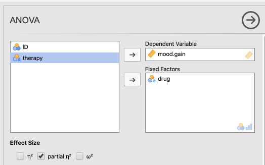
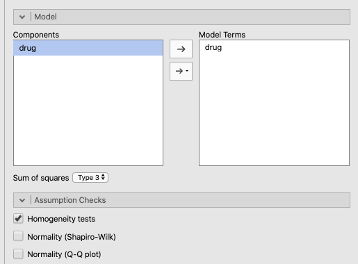
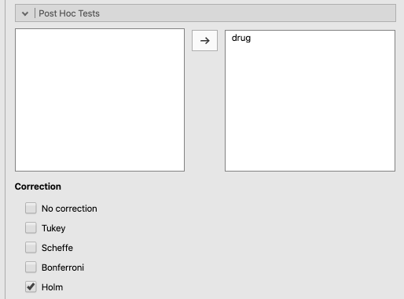
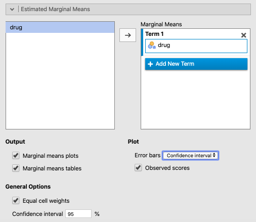

# Comparing several means {#ComparingSeveralMeans}

This chapter explains how to use jamovi to analyze a continuous outcome variable when it is split into three or more levels of a categorical predictor variable. It follows the main textbook [@lsj, Chapter 13]

For example, you might analyze something like attitude towards increasing taxes to fund public education. And your participants might have been, say, Democrats, Republicans, and "Others." In this case, you could look at their mean responses by group, and figure out if any of these means were significantly different from any of the others.

<br/>

## The One-Way ANOVA {#OnewayAnova}

Carrying out One-Way ANOVA is covered in your main textbook [@lsj, Sections 13.1 to 13.7].

In this test, we are interested in whether three or more groups comprising independent observations differ with each on a single, continuous outcome variable.^[Technically, you can also do this kind of test on a categorical variable with only two levels, something you would normally think to do an independent-samples *t*-test on. However, the results will be the same in this case, except that the ultimate obtained value for *F* (the ANOVA test) will be the equivalent of the obtained value for *t*, but squared. [@lsj] talk about this briefly in section 13.10.]

The *F*-test is the calculation of a particular kind of ratio, the *F*-ratio (unsurprisingly!). It is the ratio of between-subjects variance (*Mean Squares Between*) divided by the within-subjects variance (*Mean Squares Within*). Each of these, respectively, is the ratio of the *Sum of Squares* (between or within) divided by the *degrees of freedom* (between or within). Thus:

$$F= \frac{MeanSquares_{between}}{MeanSquares_{within}} = \frac{\frac{SumOfSquares_{betweeen}}{DegreesOfFreedom_{between}}}{\frac{SumOfSquares_{within}}{DegreesOfFreedom_{within}}}$$
<br/>

And this is a pretty complex formula if spelled out all the way. You can refer to Table 13.1 in [@lsj, p. 334] if you want to see how this works. In fact, Table 13.1 is in a standard ANOVA-table format, though we won't go into that in this manual.

Naturally, you do not need to calculate the *F*-ratio by hand. jamovi will do it for you.

<br/>

### Basic: Clinical Trial data {#OnewayAnovaClinicalTrialData}

The data set that Navarro and Foxcroft [-@lsj] use to illustrate the One-Way ANOVA is fictional. It is a hypothetical clinical trial in which which 18 patients with moderate to severe depression are recruited to participate in a trial in which half receive Cognitive Behavioral Therapy in contrast to half who do not. Each half then receives one of three drugs: *joyzepam*, *Anxifree* (a real antidepressant), and a placebo. Three participants are in each group, across both levels of therapy type. Their mood is measured at the beginning and then 3 months later on a 10-point scale from -5 to 5.

This lab manual simply presents the dataset and analysis in a more lab-like way.

<br/>

#### Obtaining the data {#OnewayAnovaClinicalTrialDataObtainingTheData}

To follow along yourself, you can open the in the module from @lsj: $(\equiv)$ > *File* > *Data Library* > *learning statistics with jamovi* > *Clinical Trial.omv*. We are only going to look at the effect of *drug* on *mood.gain* (the outcome variable).

<br/>

#### Implementing the procedure {#OnewayAnovaClinicalTrialDataImplementing}

Simply click the *Analyses* tab and select *ANOVA*. Choose the *ANOVA* option there too (skipping over the *One Way* option as that is more limited). 

When the options window opens, slide *mood.gain* into the *Dependent Variables* box, and *drug* into the *Fixed  Factors* box. 

Under *Effect Size*, click either $\eta^2$ or *partial* $\eta^2$ (which are identical in a One-Way ANOVA). 

See Figure \@ref(fig:OneWayClinicalParametersMain) directly below for a depiction of these options.

```{r OneWayClinicalParametersMain, fig.cap="Main parameter settings for the ANOVA procedure using the *Clinical Trial* data from @lsj.", echo=F, out.width="600px"}

```

<br/>

Next, click the arrow pointing to *Model* and make sure that *drug* is placed under *Model Terms* (and leave *Sum of squares* as *Type 3*. There is no built-in correction for heterogeneous variances in this procedure, but you can test the assumption using *Levene's Test for Homogeneity of Variance*. This avails itself if you check the box *Homogeneity tests* under *Assumption Checks*. See Figure \@ref(fig:ANOVAClinicalParamatersModelAndLevene) below for a depiction of these options.

```{r ANOVAClinicalParamatersModelAndLevene, fig.cap="Model settings and assumption checks for the ANOVA procedure using the *Clinical Trial* data from @lsj.", echo=F, out.width="600px"}

```

<br/>

Under *Post-Hoc Tests*, make sure that *drug* is in the box on the right, and that the *Correction* is set to *Holm*. This is a more powerful way to conduct multiple post-hoc analyses than Bonferroni adjustments (see Navarro and Foxcroft [-@lsj, section 13.5.4, pp. 343-344] for a more thorough explanation). Scheffé and Tukey are also reasonable options. Ultimately however, all choices end up leading to the same conclusion in this case, which is often the case. See Figure \@ref(fig:OneWayClinicalParametersPostHoc) below for how to select these options.

```{r OneWayClinicalParametersPostHoc, fig.cap="Multiple-comparison, post-hoc settings for the ANOVA procedure using the *Clinical Trial* data from @lsj.", echo=F, out.width="600px"}

```

<br/>

Finally, under *Estimated Marginal Means*, make sure that the following are true:

- *drug* makes it over to the box on the right under *Term 1*  
- both boxes are checked under *Output* (*Marginal means plots* and *Marginal means tables*)  
- *Equal cell weights* is checked (the default)  
- *Error bars* (under *Plot*) is set to *Confidence interval*  
- and for fun, check the box *Observed scores*.^[22 Oct 2019: Note however that you may get a strange message in German here: *unerwartetes Symbol 1:...*, which means "Unexpected symbol 1:...." This seems to be a bug in jamovi. If you get it, just uncheck the box; the error message goes away.] 

These options are shown in Figure \@ref(fig:ANOVAClinicalParamatersEMM) below.

```{r ANOVAClinicalParamatersEMM, fig.cap="Graphic settings for the ANOVA procedure using the *Clinical Trial* data from @lsj.", echo=F, out.width="600px"}

```

<br/>

The results should appear as follows:

```{r, echo=F, message=F, warning=F}
ClinicalData <- readRDS("datasets/SeveralMeans_ClinicalTrial.rds")
```

```{r, echo=F, message=F, warning=F}
jmv::ANOVA(
    formula = mood.gain ~ drug,
    data = ClinicalData,
    effectSize = "partEta",
    homo = TRUE,
    postHoc = ~ drug,
    postHocCorr = "holm",
    emMeans = ~ drug,
    emmPlotData = TRUE,
    emmTables = TRUE)
```

<br/>

#### Interpreting the output {#OnewayAnovaClinicalTrialDataInterpreting}

The first thing to notice is actually the second table down. For Levene's test of Homogeneity of Variance, the null hypothesis is that the distributions of the variables is equal across groups (the assumption itself). Therefore, you want to fail to reject the null hypothesis, which is what happened here as *p* = .266. This also means that there is no problem interpreting the table above it, which is covered next.

The second thing to notice is the table at the top. This is known as an ANOVA table. It has a very specific structure. The key value is the *p*-value in the second-to-last column. It is below .05, so you can reject the null hypothesis that the three drugs have an equal effect on patients. How to report the *F*-test in APA format is covered below in section \@ref(OnewayAnovaClinicalTrialDataReporting). 

However, another key value is in the last column. This is the effect size, $\eta_p^2$. This statistic is also a bit redundant in the table since it is actually derived from column two. Well, when there is one predictor variable, it is equivalent to $\eta^2$ (*eta squared*), which is available from the table as the sum of squares between divided by the total sum of squares. The effect size here of .713 is quite large.

$$\eta^2 = \frac{SumOfSquares_{between}}{SumOfSquares_{total}}= \frac{SumOfSquares_{between}}{SumOfSquares_{between}+SumOfSquares_{within}}=$$
$$\frac{3.45}{3.45+1.39} = \frac{3.45}{4.84} = 0.713$$

<br/>

Naturally, that *F*-test is an omnibus test, and only tells us that there are some significant differences among the three means, but it doesn't tell us which. Therefore, there are also some post-hoc tests that we called for, which are located in third table down. It appears that there is a significant difference between joyzepam and each of the other two drugs, but not between the other two drugs themselves. This is clear in the figure, where you can see that the confidence interval for joyzepam does not overlap with either of the other two drugs, but the confidence intervals of the other two drugs overlap with each other quite a bit.^[Note that this is an approximate rule. Sometimes confidence intervals do overlap a little between variables that turn out to be significantly different.]

Also note that the *Estimated Marginal Means* may be slightly different than the means that you obtain from running *Exploration* > *Descriptives* in jamovi. This topic is beyond the scope of this class as it has to do with how means are calculated multiple regression. Although these are legitimate estimates, you should report the means and standard deviations from the *Descriptives* procedure instead of the *Estimated Marginal Means* from the ANOVA output.

<br/>

#### Reporting the output {#OnewayAnovaClinicalTrialDataReporting}

As already shown in the case of chi-square, the *z*- and *t*-tests, and the correlation/regression chapter, APA requires a consistent pattern for reporting statistical output:

1. a letter (in italics) representing the test statistic used
2. parentheses that enclose the degrees of freedom
3. an equals sign
4. the obtained value of the test statistic
5. a comma
6. the letter *p* in italics
7. one of three symbols: =, <, or >
8. a *p*-value

<br/>

There will be only two differences this time:

- The test letter is now *F* (not *t* or $\chi^2$)  
- There are two degrees of freedom instead of one  

To report the *F*-test in APA format, you can get all the information you need from the second table in the output above (the ANOVA table). The test statistic is *F*. There are two degrees of freedom: one for the sum of squares between, and one for the sum of squares within. These are located in the third column under *df*. They are 2 an 15, respectively, in that order [i.e., ($df_{between}$,$df_{within}$)]. Next, we need the *F*-ratio itself, which is located in the fifth column under *F*. As noted above, the *p*-value is in the second-to-last column. We also report the effect size, which is in the last column. All together, the full report of the test statistic, in the order presented directly above, is as follows:

$F(2,15)=18.6,p<.001, \eta_p^2=0.713$

<br/>

We can now put together a partial *Results* section for this one analysis:

>The mood improvement over the course of three months differed significantly across the three groups of patients taking either *joyzepam*, *anxifree*, or a placebo, $F(2,15)=18.6,p<.001, \eta_p^2=0.713$. Post-hoc comparisons with Holm corrections revealed that there was a significant difference between *joyzepam* and both *anxifree* [$t(15)=-4.36,p<.001$] and the placebo [$t(15)=5.88,p<.001$]. However, there was no significant difference between *anxifree* and the placebo [$t(15)=1.52,p=.15$]. These differences are also clear in Figure 1, where it is clear that the 95% confidence interval for *joyzepam* does not overlap with those of either of the other two conditions, whereas the confidence intervals for the latter two conditions overlap substantially. *joyzepam* is clearly resulting in a significantly greater mood gain than the other two conditions. Additionally, the effect size ($\eta^2=0.713$) is quite large, suggesting that this difference between *joyzepam* and the other two conditions is quite substantial in magnitude.

<br/>

### Advanced

**UNDER CONSTRUCTION**

<!-- Maybe this study: @article{vonKosstorkildsenHitchinsMyhrumWie2019, -->
<!-- but not both here and in chapter 15 -->

<br/>

## Repeated-measures One-Way ANOVA

<br/>

## Outside help on One-Way ANOVA

<br/>

<!-- ## Conclusion {#ConclusionOfOnewayAnova} -->

<!-- <br/> -->

## Extra practice One-Way ANOVA {#PracticingOnewayAnova}