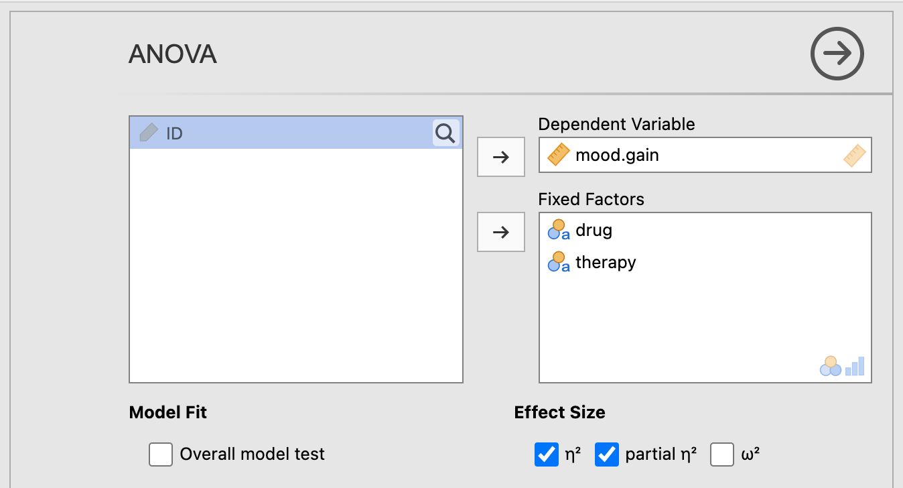
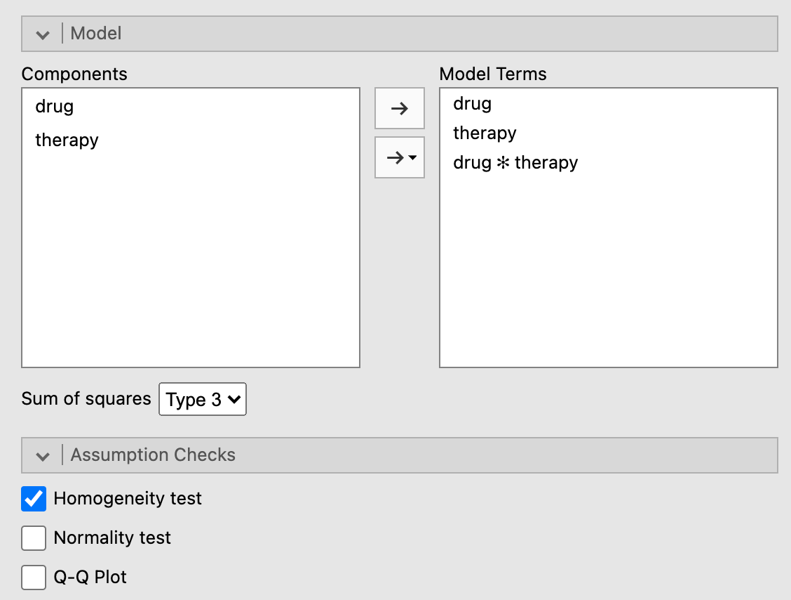
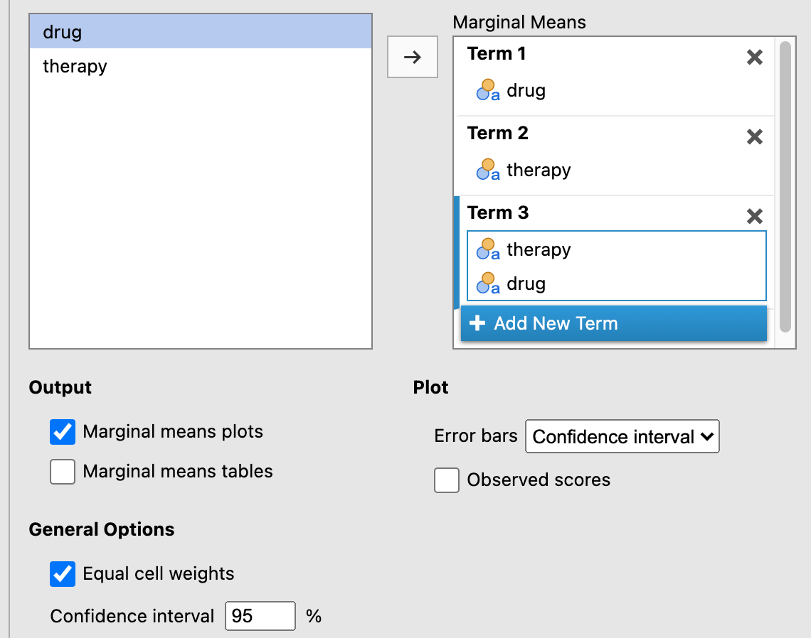

# Factorial ANOVA {#FactorialAnova}

Sometimes you have more than one predictor variable. This chapter covers the case when you have two or more nominal predictor variables that might operate independently or together to account for variance in the outcome variable. This is called a *Factorial ANOVA*.

There are a few new concepts that come into play when discussing factorial ANOVAs. One is in the name itself. That is, the notion of a *factor* (from *factorial*) is quite important. It turns out that the experimental traditional of statistical analysis that developed alongside the correlational approach in the early 20th century adopted the label *factor* to describe nominal predictors.

So it's really that simple, a *factor* is simply a new name for a nominal predictor. Researchers from the correlational approach to statistics don't use this term, but those from the experimental approach do. So the bad news is that there is a new redundant term you need to learn; the good news is that the concept is not new.

The second concept that is new is actually a new concept altogether: the *interaction*. Up to this point, we have only discussed one predictor at a time. It may have been a nominal predictor with only four levels (e.g., the factor `Class Level`, with `Freshman`, `Sophomore`, `Junior`, and `Senior` as levels of that factor).

However, when you have more than one predictor, they can interact with each other.^[Interactions are not restricted to factorial ANOVAS; they can also feature in multiple regression, where not only can nominal predictors ("factors") interact with each other, but also continuous predictors can interact both with each other and with other nominal predictors. Interaction is called *moderation* in this tradition. Regardless, this chapter restricts itself to interactions among categorical predictors.]. This means that if you have two factors, like `Gender` and `Class Level`, you can analyze three types of effects on the outcome variable:  

1. The main effect of `Gender`  
2. The main effect of `Class Level`  
3. The interaction between `Gender` and `Class Level`  

A *main effect* can be interpreted in the same way that a single predictor was interpreted in a oneway ANOVA. That's all the label refers to: the effect of one particular predictor, by itself, on the outcome variable in your analysis. So using our `Gender` $\times$ `Class Level` example from directly above, a main effect for `Gender` would imply a significant difference across the various levels of `Gender` (e.g., `male`, `female`, `not listed`).

An interaction, however, is a new concept. It is the effect one predictor on the outcome, but moderated by another predictor. If you are using only factors, as we are in this chapter, then this amounts to the following: A significant interaction is when the effect of one factor depends on the levels of another factor. For example, it might be the case that genders do indeed differ on their `Overall Student Satisfaction`, but only for upperclassmen (`juniors` and `seniors`); but for underclassmen, there are no differences across genders for `Overall Student Satisfaction`.

If you have two factors, then the possible number of significant results is 3. But it is also possible to include three factors (e.g., `Gender` $\times$ `Class Level` $\times$ `College`). In this case, there are three possible main effects (1-3 below), and ***four*** possible interactions (4-7 below):

1. main effect for `Gender`  
2. main effect for `Class Level`  
3. main effect for `College`  
4. two-way interaction between `Gender` and `Class Level`  
5. two-way interaction between `Gender` and `College`  
6. two-way interaction between `Class Level` and `College`  
7. ***three***-way interaction among `Gender`, `Class Level`, and `College`  

And if you have four factors, the number of possible interactions increases to ***ten***!!

So you can see how things can get complicated very quickly. For this reason, most researchers try to keep their analyses as simple as possible for interpretation purposes. This is especially true since a four-way interaction (i.e., `A` $\times$ `B` $\times$ `C` $\times$ `D`, possible only with a factorial ANOVA with four factors) is very difficult to visualize, and virtually impossible for humans to conceptualize. Interestingly, there is nothing stopping the software from calculating. You can obtain a four-way interaction and even higher order interactions, but you will have great difficulty interpreting them. To the extent that this is true, such statistical models risk losing their scientific utility since they do not contribute to human understanding.^[They may not lose their ***practical*** utility, however, if the sole purpose of such models is merely to make accurate predictions, as in the business world. That is, science implies human understanding of models, whereas the business world (among others) does not, necessarily.]

Carrying out a factorial ANOVA is covered in your main textbook [@lsj, Chapter 14]. We will not cover the mathematics of this in the lab manual however. Although the calculation for each main effect and interaction is ultimately converted into the same *F*-ratio found in \@ref(ComparingSeveralMeans), the partitioning out of main effects and interactions can get complicated. How to do this is covered in the main textbook [@lsj, Sections 14.1.3 to 14.1.4].

So at this point, it is useful to demonstrate how to carry out a factorial ANOVA in *jamovi*, along with how to interpret the output.

## Basic: joyzepam data {#BasicFactorialAnovaJoyzepam}

This is the same artificial data set from used above in section \@ref(OnewayAnovaClinicalTrialData). Again, the hypothetical scenario is researchers looking at overall mood gain among three groups of participants (*N*=18) battling depression under different drug regimens: `joyzepam`, `anxifree`, and a placebo. There are six patients in each group. Furthermore, the six participants under each of these regimens is either undergoing *Cognitive Behavioral Therapy* (`CBT`) or no therapy at all (`no.therapy`), ultimately rendering three participants in each `drug` $\times$ `therapy` group (a balanced data set). In contrast to the previous chapter in this lab manual (Chapter \@ref(ComparingSeveralMeans)), we ***will*** be analyzing `therapy` in addition to `drug` to create a (two-factor) factorial ANOVA instead of a (single-factor) Oneway ANOVA.

### Obtaining the data {#BasicFactorialAnovaJoyzepamObtainingTheData}

To repeat from section \@ref(OnewayAnovaClinicalTrialDataObtainingTheData), this data set can be found in *jamovi* (if you have added the *lsj-datasets* module) by clicking ($\equiv$) > `File` > `Data Library` > `learning statistics with jamovi` > `Clinical Trial.omv`.

<br/>

### Implementing the procedure {#BasicFactorialAnovaJoyzepamImplementing}

As described in section \@ref(OnewayAnovaClinicalTrialDataImplementing), click `Analyses` tab and select `ANOVA` > `ANOVA`.

Slide `mood.gain` into the `Dependent Variables` box, and ***both*** `drug` and `therapy` into the `Fixed  Factors` box. 

Under `Effect Size`, click both $\eta^2$ and *partial* $\eta^2$.

See Figure \@ref(fig:FactorialClinicalParametersMain) directly below for a depiction of these options.

```{r FactorialClinicalParametersMain, fig.cap="Main parameter settings for performing a factorial ANOVA using the ANOVA procedure using the *Clinical Trial* data from @lsj.", echo=F, out.width="600px"}

```

<br/>

Next, click the arrow pointing to `Model` and make sure that both `drug`, `therapy`, and `drug*therapy` is placed under `Model Terms` (and as in the Oneway ANOVA, leave `Sum of squares` as `Type 3`. 

You can test the assumption of homogeneity of variance using *Levene's Test for Homogeneity of Variance*. Jcheck the box `Homogeneity tests` under `Assumption Checks`. See Figure \@ref(fig:FactorialClinicalParamatersModelAndLevene) below for a depiction of these options.

```{r FactorialClinicalParamatersModelAndLevene, fig.cap="Model settings and assumption checks for a factorial ANOVA under the ANOVA procedure using the *Clinical Trial* data from @lsj.", echo=F, out.width="600px"}

```

<br/>

In a factorial ANOVA, a researcher should not really set up any post-hoc tests until they know which main effects and/or interactions are significant. The problem is that each of the main effects and interactions are separate tests, and one should only perform posthoc tests at the particular level (e.g., a particular main effect or interaction) where an *F*-test was significant. One cannot know this before running the omnibus test. Hence, the *post-* ("after") in the term *post-hoc*.

In fact, this is a broader principle: Researchers should not set up post-hoc tests at all before an omnibus test. We did this for the sake of convenience in Section \@ref(OnewayAnovaClinicalTrialDataImplementing) above. However, you should avoid this in real situations.

That said, you *can* set up *a priori* tests (aka *planned comparisons*) at the same time as an omnibus test. This changes a few things, most notably the familywise error rate. But in order to "get away with" planned comparisons, a researcher must have compelling reasons that would satisfy a reviewer from whatever journal they a submitting the paper to.

For now, we will leave both types of comparisons aside.

<br/>

Finally, under `Estimated Marginal Means`, click `+ Add New Term` three times, and make sure that the following are true:

- `drug` makes it over to the box on the right under `Term 1`  
- `therapy` makes it over to the box on the right under `Term 2` 
- `therapy` and `drug` makes it over to the box on the right under `Term 3`   (drag `therapy` over before `drug`; it just looks better if `therapy` is on the *x*-axis)  

- The `Marginal means plots` box is checked under `Output` (leave the `Marginal means tables` box unchecked to simplify the output)  
- `Equal cell weights` is checked (the default)  
- `Error bars` (under `Plot`) is set to `Confidence interval`  

These options are shown in Figure \@ref(fig:FactorialClinicalParamatersEMM) below.

```{r FactorialClinicalParamatersEMM, fig.cap="Graphic settings for a factorial ANOVA under the ANOVA procedure using the `Clinical Trial` data from @lsj.", echo=F, out.width="600px"}

```

<br/>

```{block2, type="rmdnote", echo=T}

**NOTE**: You might be wondering whether the same logic that prevents you from planning post-hoc comparisons also applies to graphics. You would be partly correct. That is, you shouldn not try to convince your reader of main effects and/or interactions visually, when you did not establish them statistically. However, visualizations make it easier for readers to conceptualize the data summary. So as long as the author is honest about the statistical findings, visualizations that display non-significant effects can be legitimate and can actually aid the reader in understanding why such effects were ***not*** found.

```

<br/>

The results should appear as follows (the reader may need to scroll to the right to see the full output due to the output being rounded to more decimal places):^[Recall that the output below (and further down) was generated from the *jmv* package in *R*, and will therefore be rounded to more decimal places than the native output in *jamovi*.]

<!-- REVISE: SEE IF THERE'S A WAY TO REDUCE THE NUMBER OF DECIMAL PLACES -->

```{r ReadClinData2, echo=F, message=F, warning=F}
ClinicalData2 <- readRDS("datasets/SeveralMeans_ClinicalTrial.rds")
```

```{r AnalyzeClinData2, echo=F, message=F, warning=F}

jmv::ANOVA(
    formula = mood.gain ~ drug*therapy,
    data = ClinicalData2,
    effectSize = c("eta", "partEta"),
    homo = TRUE,
    emMeans = ~ drug + therapy + therapy:drug)

```

### Interpreting the output {#BasicFactorialAnovaJoyzepamInterpreting}

As we saw for the results with the same data in Section \@ref(OnewayAnovaClinicalTrialDataInterpreting), there was a main effect for `drug`. We did not call it a *main effect* in that case because there were no other predictors in the model. But now that we have added `therapy` as another predictor, as well as included a possible interaction between `drug` and `therapy`, we should discuss the effect of `drug` as a *main effect*. The main effect for `drug` should be interpreted as the independent effect of `drug` when `therapy` and the interaction between `drug` and `therapy` are also included in the model, but "left aside" or "neutralized."


<!-- REVISIT: ^^ ADD AN EXPLANATION FOR THIS, INCLUDING REFERENCE BACK TO THE PARTIAL REGRESSION COEFFICIENT IN CHAPTER 7, WHEN IT'S COMPLETE -->

The other main effect for `therapy` was also significant [*F*(1,12) = 8.58, *p* = .013, $\eta^2$ = .713]. It should be interpreted in the same way: specifically, the effect of `therapy` when both `drug` and the interaction between `therapy` and `drug` are both in the model, but "neutralized."

Finally, the interaction^[You might notice a minor notational difference here. *jamovi* uses an asterisk (\*) to represent the interaction, whereas the output directly above uses a colon (:). The asterisk is more common in publication. There is no difference. The colon is an artifact of us using the *jmv* package from within *R*, and *R* sometimes uses colons to represent specific interactions.] between `therapy` and `drug` was not significant [*F*(2,12) = 2.49, *p* = .125].

At this point, we ***could*** run post-hoc tests to see where the significant differences are. However, post-hoc tests turn out to be unnecessary in this case. First, we already ran a Oneway ANOVA on `drug` in Section \@ref(OnewayAnovaClinicalTrialDataImplementing). From that analysis, we already know how to interpret the main effect for `drug` (see section \@ref(OnewayAnovaClinicalTrialDataInterpreting) for that interpretation).

There was another significant main effect in this case: `therapy`. But this predictor only has two levels: `CBT` and `no.therapy`. And if you only have two levels for a significant predictor in an ANOVA, there is no need to conduct a post-hoc test for that predictor. It's equivalent to a *t*-test. Specifically, the level associated with the larger mean is the level that is significantly greater than the other level, whereas the other level is significantly less. In our case, it is clear that `CBT` is having a significantly greater effect on `mood.gain` than `no.therapy`. No other interpretation is possible.

Finally, there is the interaction. But the interaction as not significant. This suggests that both `drug` and `therapy` are having independent effects on `mood.gain`. That is, both contribute to changes in mood gain, but they don't have anything to do with one another.

The two main effects (for `drug` and `therapy` are easy enough to see in the first two erro-bar charts above. The third chart is for the non-significant interaction. As noted above, it's okay to present a non-significant interaction in a figure as long as the researcher is honest and explains how the chart demonstrates the non-significance, rather than potential significance (or something misleading like that). 

In this case, although the lines for the different drugs across treatment levels are non-parallel, the sample size (*N* = 18 overall, but only *n* = 3 in each group) was probably too small to reach significance. If so, this is an issue of *power*, which is the probability of rejecting the null hypothesis when it is underlyingly false; or a *true positive*. 

So there might very well be a interaction here, where `joyzepam` and the placebo work equally well or poorly, respectively, regardless of the type of therapy, but `anxifree` works better with `CBT` than with no therapy at all. But this can only be speculative because of the lack of power.

This highlights the importance of properly powering your statistical analyses. That is, this hypothetical data set illustrates how there are insufficient data points (i.e., participant responses) for the complexity of the model (two predictors and the interaction between them).

<br/>

### Reporting the output {#BasicFactorialAnovaJoyzepamReporting}

Again, APA format requires a particular pattern for statistical output:

1. a letter (in italics) representing the test statistic used
2. parentheses that enclose the degrees of freedom
3. an equals sign
4. the obtained value of the test statistic
5. a comma
6. the letter *p* in italics
7. one of three symbols: =, <, or >
8. a *p*-value

This time, however, there are three such tests to report: the two main effects and the interaction. To get the *degrees of freedom - between* (the first number in parentheses), look under the column `df` for the effect in question. To get the *degrees of freedom - within* (the second number in the parentheses), go to the bottom row, `Residuals`,^[Again, the term *residuals* is synonymous with *error*, *deviations*, *deviance*, etc., and even "noise." It refers to the variation in the data that the model could not account for (or "leftover" variation).] under `df` (it's the same for all the main effects and interactions). Thus, combining this new knowledge with what you learned in section \@ref(OnewayAnovaClinicalTrialDataReporting), the statistical reports come out as follows:

1. Main effect for `drug`: $F(2,12)=31.71,p<.001,\eta_p^2=.841$  
2. Main effect for `therapy`: $F(1,12)=8.58,p=.013,\eta_p^2=.417$  
3. Interaction between `drug` and `therapy`: $F(2,12)=2.49,p=0.12\eta_p^2=.293$  

<br/>

Now we can write a partial *Results* section for this analysis. It builds upon the one written in Section \@ref(OnewayAnovaClinicalTrialDataReporting).

>The analysis revealed a significant main effect for *drug*. The mood improvement over the course of three months differed significantly across the three groups of patients taking either *joyzepam*, *anxifree*, or a placebo, $F(2,12)=31.71,p<.001,\eta_p^2=0.841$. There was also a significant main effect for *therapy*, $F(1,12)=8.582,p=.013,\eta_p^2=0.417$. However, there was no interaction between the two, $F(2,12)=2.49,p=0.12\eta_p^2=.293$.

>Post-hoc comparisons for the main effect of *drug* with Holm corrections revealed that there was a significant difference between *joyzepam* (*M* = 1.48, *SD* = 0.214) and both *anxifree* (*M* = 0.717, *SD* = 0.392),^[Note that the mean and standard deviation were obtained through *jamovi*'s *Descriptives* procedure] $t(15)=-4.36,p<.001$, and the placebo (*M* = 0.45, *SD* = 0.281), $t(15)=5.88,p<.001$. However, there was no significant difference between *anxifree* and the placebo, $t(15)=1.52,p=.15$. These differences are also clear in Figure 1, where it is clear that the 95% confidence interval for *joyzepam* does not overlap with those of either of the other two conditions, whereas the confidence intervals for the latter two conditions overlap substantially. *joyzepam* is clearly resulting in a significantly greater mood gain than the other two conditions. Additionally, the effect size ($\eta_p^2=0.841$) is quite large, suggesting that this difference between *joyzepam* and the other two conditions is quite substantial in magnitude.

>For the main effect of *therapy*, it is clear that cognitive behavioral therapy has a larger mean (*M* = 1.04, *SD* = 0.45) resulted in greater mood gain than no therapy at all (*M* = 0.72, *SD* = 0.59).$^\*$ Finally, there was no significant interaction between *drug* and *therapy*, $F(2,12)=2.49,p=0.125,\eta_p^2=0.293$. In other words, both *drug* and *therapy* exerted an influence on *mood gain*, but they did not depend on each other, though the study may have been underpowered (*n* = 3 in each condition) as there seemed to be a trend for *anxifree* to work better with cognitive behavioral therapy then without any therapy at all. Future studies may reveal more about any such potential interaction.

<br/>

## Advanced: advanced data NAME {#AdvancedFactorialAnova_NAME}

<br/>

### Obtaining the data {#AdvancedFactorialAnova_NAMEObtainingTheData}

<br/>

### Implementing the procedure {#AdvancedFactorialAnova_NAMEImplementing}

<br/>

### Interpreting the output {#AdvancedFactorialAnova_NAMEInterpreting}

<br/>

### Reporting the output {#AdvancedFactorialAnova_NAMEReporting}

<br/>

## Conclusion {#ConclusionOfFactorialAnova}

<br/>

## Outside help on factorial ANOVA {#OutsideHelpOnFactorialAnova}

<br/>

## Extra practice on factorial ANOVA {#PracticingFactorialAnova}
