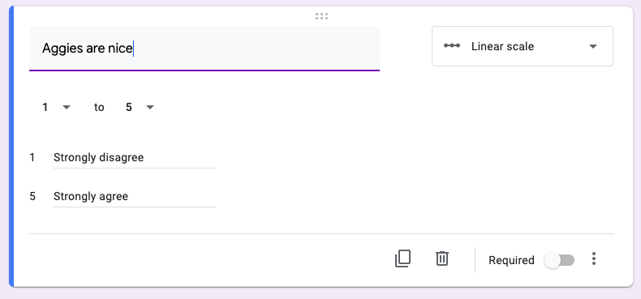
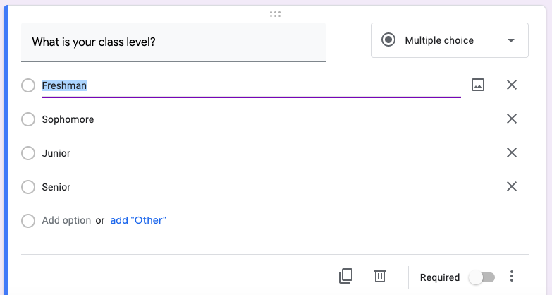
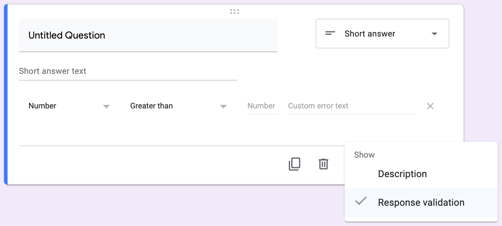
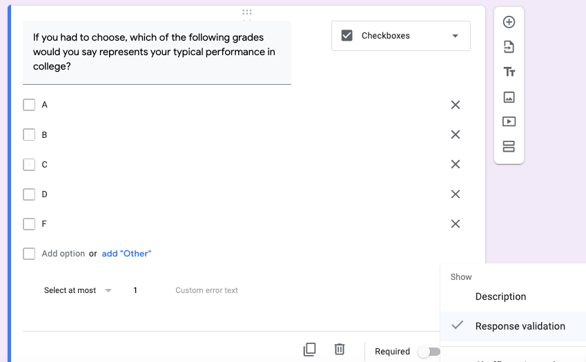
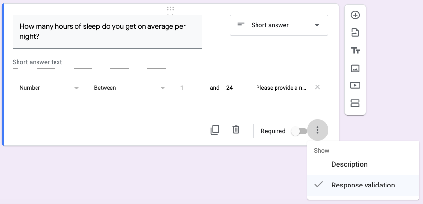

# (PART) Research projects {-}

# Survey Design and Data Collection {#SurveyDesignAndDataCollection}

<br/>

## Unit Overview {#ResearchProjectsOverview}

This chapter and the one that follows detail the tasks necessary to carry out your lab-based research projects in *PSYC 301* at Texas A&M University. This particular chapter outlines the tasks involved in designing your research study and collecting data. The next chapter (Chapter \@ref(DataPreparationAndAnalyses)) shows you what you need to do to generate the data set and the specific statistical analyses necessary to write your papers (and then how to your papers are covered in Chapters \@ref(ReportingResearch) to \@ref(WritingGeneralDiscussionSections), along with the Appendixes).

<br/>

## Chapter Overview {#SurveyDesignAndDataCollectionChapterOverview}

The steps described in this section, after they are implemented, will provide you with the raw data necessary to complete the writing assignments in the lab. It is also very desirable, though not absolutely necessary, that you have a good study design. Otherwise, it doesn't matter how much data you collect; it will be flawed.

With that in mind, this chapter covers what you need to do, step-by-step, in order to maximize the potential of obtaining results that are easy to write about (i.e., interesting results). There are two parts: (1) *Designing the Survey* (section \@ref(DesigningTheSurvey)); and (2) *Collecting the Data* (section \@ref(CollectingTheData)). The first of these is occupies much more space in this chapter than the second.

The reasons for the more extensive coverage of study design are twofold. First, we have very specific requirements here. Whatever topic you choose, the variables in the survey need to conform to the statistical procedures that are taught in the main class. If you do not follow the guidelines here, you may not be able to complete the writing assignments. Thus, understanding and implementing the advice below is critical for you in order to pass this course.

Second, research design may be the most important part of any scientific study. In order to produce meaningful results, you must collect sound data, and in order to collect sound data, you must have a sound design. Even if you don't know how to analyze your data, you can find someone else who can (e.g., the [Statistical Collaboration Center](https://www.stat.tamu.edu/consulting-collaboration-center/) at Texas A&M, which provides consulting services to faculty all across Texas A&M). **However**, if a poor research design has resulted in the collection of poor data, there is not much even the most sophisticated statistical consultant can do. You may have wasted your time (or worse, someone else's money [e.g., a grant]) collecting bad data. This basic requirement of any study design is captured in the phrase *garbage in, garbage out*. That is, if you collect bad data, you will end up with bad analyses. Thus, following the advice below is critical for you to become a good scientific researcher beyond this class.

<br/>

## What is *Science*? {#WhatIsScience}

The scientific process could be conceptualized as follows:^[There are other definitions, naturally.]

>*science*: the collective art of answering empirical questions that is both demonstrable and replicable

<br/>

An *empirical question* is one that can be answered by means that can be experienced in the same way by other humans. This entails that the phenomena under consideration must be *natural*; you can ask questions about supernatural phenomena, but they cannot be answered via the scientific method.

This is because the methods that you use must be both *demonstrable* and *replicable*. That is, you not only have to be able to show your results to others, but you must also be able to show them how to do it themselves in order to (potentially) derive the same results. And replicability necessarily entails objective *measurement*. Broadly speaking, if it can't be measured, it can't be part of science. Below, we expand upon the notion of measurement, which is really your focus in this chapter. 

But we included another term: *collective*. The reason for that there are collectively agreed-upon guidelines to this process that have been established over many years by practitioners of many different fields, including scientists themselves, engineers, mathematicians, statisticians, and philosophers. It is a collective enterprise. 

Furthermore, science relies on *consensus*, where, although the science is technically *never* settled in an absolute sense (as a *proof* would be in mathematics), truth is established only when particular theories reach a point where researchers no long bother to challenge them as such challenges seem almost certainly bound to fail empirically. In other words, scientific truths are theories that scientists no longer challenge. In that sense, consensus is less a component of the scientific process itself, and more like an outcome (albeit an outcome that serves as the foundation for more science and, often [hopefully], decision-making in the public sphere).

<br/>

### What is *measurement*? {#WhatIsMeasurement}

In order for science to function, therefore, the phenomena that are to be analyzed must be measured. *Measurement* is one component of the scientific process that even the most un-scientific among us can understand. Broadly speaking, in the scientific context, measurement is the process of assigning a reliable number or category to instances of phenomena (concrete or abstract), using some common, standard unit, in order to differentiate that instance from other instances of the same type. Importantly, the unit used must be one that anyone else in one's community can also reliably obtain and use in their own measurement This unit can be quantitative (a number) or qualitative (a category).

#### Numerical measures {#NumericalMeasures}

For some phenomena, numbers can be used for measurement. And for some measures, the numbering can be quite precise, where a physical benchmark is used. The kilogram had such a benchmark until May of 2019. It was a cylinder of platinum iridium (the [International Prototype of the Kilogram](https://www.bipm.org/en/bipm/mass/ipk/) until May 2019. Since then, it has been based on physical constants, a more stable, but more abstract reference.

For measures of more abstract things (e.g., *aggression*) scientists may need to establish weaker, but (hopefully) reliable measurement standards. One that is quite common in psychology (and elsewhere) is the *Likert Scale*.^[This is named after Rensis Likert (1903-1981), an American social psychologist at the University of Michigan. Perhaps the strangest thing about the history of the Likert scale is its [pronunciation](https://en.wikipedia.org/wiki/Likert_scale#Pronunciation). Likert himself pronounced his name as rhyming with *wicker* or *sicker* (but with a <t> at the end, naturally. However, due to the spelling of the name, most people pronounce it as rhyming with *hiker* or *striker*.] The Likert Scale is covered in more detail in section \@ref(TheThreeOutcomeVariables).

There are other types of numerical scales that one might use to measure psychological phenomena. For instance, one might ask someone to rate the morality of a behavior they have been exposed to (e.g., on video) on a scale from 1-10 with 1 being not ethical at all, and 10 being very ethical. This is not a Likert scale since it does not necessarily have a middle, neutral value.

<br/>

So far we have presented three cases of numerical measurement in this section. But measurement also includes assigning categories to phenomena. Most people do not usually think of applying categories to objects as a form of measurement; it is though. Still, as easy as it sounds, it is fairly common among novice researchers to create nominal variables that are flawed in terms of analysis potential. This is discussed more thoroughly in section \@ref(TwoMoreNominalVariables) below.

<br/>

### What are *constructs*? {#WhatAreConstructs}

A *construct* is a scientific term that refers to the mental process of constructing a label that encapsulates common features of and/or causes for a natural phenomenon. Scientists do this constantly when describing natural phenomena and trying to come up with explanations for them. 

In fact, humans outside the scientific domain do this all the time as well, just not with all the formalities, constraints, and tools that scientists use. For example, new, everyday words are entering the language all the time that describe phenomena (usually human behaviors). You could just do an internet search for the word *neologism* (a new word in the language).^[Many of these are actually *portmanteaus* (combinations of words that are already used, like *smog* (*smoke* + *fog*) or *brunch* (*breakfast* + *lunch*). Humans like playing with their language in this way, for whatever reason.] On one European [website](https://www.gpb.eu/2019/12/neologisms-new-words.html) that lists English neologisms, the first two that could conceivably be turned into new areas of psychological research seemed to be *anticipointment*, from 2016:

>*anticipointment*: Anticipated disappointment, often after launch of a heavily hyped product or service

<br/>

Another was *broflake* (shortlisted for 2017 *Word of the Year* by the Oxford English Dictionary):

>*broflake*: A derogatory term for someone, usually a white male, easily offended by views which conflict with their own world view 

<br/>

The first neologism listed that *was* actually a new scientific construct was *anti-nutrients* (from 2017):

>*anti-nutrients*: Natural or synthetic compounds found in a variety of foods that interfere with the absorption of vitamins, minerals and other nutrients, e.g. in the human body

<br/>

Most of these new layperson's constructs will not end up being objects of scientific interest, for example:

>*Al Desko*: eating at your desk 

<br/>

But what is important here is that the notion of a scientific construct is really just an everyday human process, but contextualized scientifically.

On that note, to make a construct scientific, it must be operationalized, which is next.

<br/>

### What is *operationalization*? {#WhatIsOperationalization}

*Operationalization* is simply the process of assigning a measure to a construct. Typically, an operationalization is flagged by the phrase *as measured by*.  A non-controversial example would be as follows:

>*height* as measured in centimeters

<br/>

In psychology, we do not always have constructs that are so easily measured For example, we cannot measure *conscientiousness* with any physical measure, unless someday we find a way to get at its implementation in the brain (decades away, presumably). But we can get at it for now with a Likert item, or two, or three.^[Again, Likert items are understood by most everyone, but they are explained more formally in section \@ref(TheThreeOutcomeVariables)] For example:

>On a scale of 1 to 5, with 1 being *strongly disagree* and 5 being *strongly agree*, rate the following statement in terms of how it applies to you: *Disorganized settings make me feel uneasy*.

<br/>

Thus, we have operationalized *conscientiousness* (a small feature of it to be precise) using a Likert scale:

>*Conscientiousness* **as measured by** a Likert scale of 1 to 5, with 1 representing... and 5 representing...

<br/>

And once you have operationalized a construct, you can begin collecting data
if you implement a way to do it. Once you have done so, you will have a *variable*, which is explained next.

<br/>

### What are *variables*? {#WhatAreVariables}

A variable is a quantity or quality that can adopt any value from a given range of values. For example, `Height` (in centimeters) is a variable that can take on any value from zero onward. A human might be 155 or 170 cm tall.

With our example from *conscientiousness* above, we operationalized it on a Likert scale. As a result, `Conscientiousness` is a variable that can take on any value between 1 and 5 (but not 6 or 7, since we did not operationalize it that way).

Tautology aside, even qualitative variables are variables. So biological `Sex` can take on two values: *female* and *male*.^[We recognize that there are grey areas here, biologically] And `Class Level` (assuming you are an undergraduate at a US university) can be any of the following: *freshman*, *sophomore*, *junior*, or *senior*.^[Incidentally, this class-level system is very US-centric. For instance, Canadians call these simply *first-years*, *second-years*, *third-years*, and *fourth-years*, respectively.]

Since this is a statistics course, we will also conceptualize our variables along another dimension: their role in statistical analyses. For now, we will restrict this to *outcome* and *predictor* variables.

<br/>

#### What are *outcome* variables? {#WhatAreOutcomeVariables}

In the correlational tradition (as opposed to the *experimental* tradition), an *outcome* variable is a measure of some construct that is fundamental to your study. It is usually the centerpiece of your research question. And it is also usually the variable over which the researcher has the least control in terms of the values that it takes; rather, the researcher gives the participant the most freedom in providing the values themselves.

Ultimately (when we study linear regression), you will see that outcome variables are equivalent to the *Y* in the following linear equation, which should be familiar to you:

$$Y = mX +b$$

<br/>

#### What are *predictor* variables? {#WhatArePredictorVariables}

In the same correlational tradition, a predictor variable is any variable that you use to tease apart your outcome variable in some scientifically interesting way. You use them to look at aspects of the outcome variable. For instance, if your outcome variable is `reaction time`, you might look at how men vs. women respond, that is, reaction time in men vs. women. If you do this, your predictor variable is `Sex`. You could also have a continuous predictor variable like `Age` (e.g., reaction time as predicted by `Age`).

The predictor variables are often (but not always) under the control of the researcher, not the participant.

Finally, predictor variables are equivalent (in linear regression) to any *X* in the equation above (yes, there could, and usually are, several *X*s).

<br/>

#### Notes on the terminology {#NotesOnHowWeClassifyVariables}

You can probably think of (and you will inevitably run in to) examples where the outcome variable is not really under the "control" of the participants, or is not really "provided" by them. This is entirely understandable because there is, in fact, **no statistical distinction** between outcome and predictor variables (see below). These labels come from *research design*, not statistics *per se*. In fact, statistics are somewhat blind to the distinction. Rather, the researcher needs to determine whether a variable is an outcome or a predictor. There is no statistical procedure to figure this out.

Also note that the experimental tradition (as opposed to the correlational tradition that we are using) uses the term *dependent* variable for *outcome*, as well as *independent variable* for *predictor*. The relatively opaque terms from the experimental traditional are ultimately somewhat more confusing terms to use. Navarro and Foxcroft [@lsj] use *outcome* and *predictor* rather than *dependent* and *independent*. Since this lab manual is based on @lsj, we will follow their preference for the terms *outcome* and *predictor*. But (ironically) you will notice that *jamovi* uses the terms *dependent* and *independent* variable. In the end, it is a simple substitution: *outcome* for *dependent* and *predictor* for *independent*.

<br/>

## Designing the survey {#DesigningTheSurvey}

This section is less about the theory underlying measurement, constructs, operationalizations, and variables, and more about how to carry this out in this course (in groups of 3-4 people).

In the most general sense, you will be doing the following in this course:

1. Designing a survey  
2. Collecting data  
3. Analyzing the data  
4. Writing an IMRaD-style research paper (IMRaD: *Introduction*, *Method*, *Results*, and *Discussion*; see Chapter \@ref(ReportingResearch))  

Broken down more into parts, in order:

a. Via an online survey, providing your interests in psychology to your TA (allowing them to try to put you in like-minded research groups)  
b. Completing a *Topic Brainstorm* (another online survey) that will give you a small amount of practice in designing your own study  
c. Getting into your groups and deciding on a topic for your study  
d. Designing a research project around that topic, using a survey using Google Forms to collect the data  
e. Writing a rough and final draft of the *Introduction* to the IMRaD paper (Writing Assignment #1)  
f. Collecting the data  
g. Downloading the data into *jamovi*  
h. Preparing the data for analysis, and carrying out descriptive statistics    
i. Writing a rough and final draft of the *Method* section of the IMRaD paper  
j. Completing a *t*-test and an ANOVA from the data you have collected  
k. Writing a rough and final draft of *Study 1*, which will include a *Results* and *Discussion* section encompassing both the *t*-test and the ANOVA  
l. Completing a correlation and simple linear regression from the data you have collected  
m. Writing a rough and final draft of *Study 2* (the *Results* and *Discussion* concerning your correlation and simple regression) and a *General Discussion* (the final summary of your IMRaD paper)  

To get you prepared for all of this, we discuss below the variable types that **must** be included in your study.

<br/>

### Variables in your study {#VariablesInYourStudy}

There will be a total of **nine** variables in your study: **three** outcome variables and **six** predictor variables.

These are described in more detail below.

<br/>

#### The three outcome variables {#TheThreeOutcomeVariables}

There will be **three** *continuous* outcome variables that, together, will eventually form one *composite* variable. The italicized terms may be unfamiliar to you. We will explain them below, and then come back to this particular requirement of your study.

A *continuous* variable is one whose numerical increments (e.g., whole numbers) at the very least represent equal intervals along some continuum of of measurement. For example, `Age` in years (or months, or days, or milliseconds) is a continuous variable. This is because the distance between 3-4 years is the same distance between 80-81 years (leaving some uncertainty within the year aside).

Another example is `Reaction Time` in milliseconds (or seconds). The difference between 900ms and 800ms is the same as the difference between 550ms and 450ms.

The continuous variables that you will be **required** to use in this class will be some form of Likert items, which are popular on survey questions. We explain the nature of the Likert scale below.

<br/>

##### The Likert scale {#LikertScale}

The Likert scale consists of a statement that the participant reads, along with some response options. Respondents typically indicate their agreement with the statement on a scale, originally numbered 1 to 5 by Likert himself. However, the scale's range can be from 1 to any other positive odd number. The vast majority are 1-5, 1-7, or 1-9. Anything less or more presents significant problems.

| Response 	| 1 	| 2 	| 3 	| 4 	| 5 	|
|:--------:	|:-----------------:	|:--------:	|:--------------------------:	|:-----:	|:--------------:	|
| Meaning 	| Strongly Disagree 	| Disagree 	| Neither Agree nor Disagree 	| Agree 	| Strongly Agree 	|

<br/>

One end of the scale typically represents *strongly agree* and the other: *strongly disagree*.^[*Agreement* is the most common scale, but others are possible like *Support* (*Do not support at all* ... *Support very much*), or *Attraction* (*Very attracted to*... *Not attracted to at all*), etc.] Whether *strongly agree* (for example) is represented by the lowest or the highest integer is arbitrary, but it should be consistent. Above, the scale has disagreement on the left. Below, it is on the right:

| Response 	| 1 	| 2 	| 3 	| 4 	| 5 	|
|:--------:	|:-----------------:	|:--------:	|:--------------------------:	|:-----:	|:--------------:	|
| Meaning 	| Strongly Agree 	| Agree 	| Neither Agree nor Disagree 	| Disagree 	| Strongly Disagree 	|

<br/>

The wording of the statement, however, may reverse the expected response from 1 to 5 or 2 to 4, or vice-versa, on any given scale. For example, a shy person might respond 5 to the first statement below (using the scale directly above), but 1 to the second:

>I generally *enjoy* passing time with strangers  
>
>I generally *dislike* passing time with strangers 

<br/>

The Likert scale must be both *symmetric* and *balanced*. By *symmetric*, we mean that the scale must have an equal number of response possibilities on either side of the middle, neutral value. Likewise, it must be *balanced*, which is another way of saying that the intervals between each response must appear equal in magnitude to the respondent. This allows researchers (albeit somewhat controversially) to treat the responses to Likert items as if they were interval data, and not just ordinal.

You will find reasonable disagreement among researchers as to whether the numbers 1-5 on this scale truly form a continuous scale, or merely an ordinal scale (where, although there is order to the numbers, they are not necessarily equally spaced). But for the purposes of this class, they are continuous. This is not an unreasonable assumption. After all, Likert items are deliberately designed (i.e., worded) to appear as equal intervals to the participants. But note if you choose to remove the middle value (the neutral option), which you should **never** do in this class,^[It is possible to analyze such data (ordinal data), but we do not cover these methods in this class] the scale is probably tipped towards ordinal rather than interval in nature.

In Google Forms, the Likert scale is implemented through the *Linear scale* option, one of the question-type options available on the right-hand side of any question-development box. See Figure \@ref(fig:LikertScaleIsCalledLinearScaleInGoogleForms) below. The question measures agreement with the statement *Aggies are nice*.

```{r LikertScaleIsCalledLinearScaleInGoogleForms, fig.cap='The Likert scale is implemented through the *Linear scale* option in Google Forms', echo=F, out.width="750px"}

```

<br/>

The Google-Form template (named *GoogleFormTemplate*) that you have ready in your group's Google folder (when it is assigned to you) for the course already contains three outcome variables scaled from 1-7. You can alter them to the specifics of your own survey.

Note that if you change a scale to an even range (e.g., 1 to 4), you will not have a Likert scale. It will be an interval scale, but not a Likert scale. So please do not do this.

Also note that using **any other** question type (e.g., *Multiple choice*, *Checkboxes*) to implement a Likert scale will result in a considerable amount of extra work for you, as you will then have to convert text to numbers in *jamovi* (an unnecessary task if you use the *Linear scale* option). Don't make this mistake.

<br/>

##### Other continuous scales {#OtherContinuousScales}

You are free to use other continuous scales that are not Likert scales in your survey, but only as predictor variables. We will cover this below under section \@ref(TwoMoreContinuousVariables). 

<br/>

##### Final note on the outcome variables {#FinalNoteOnTheOutcomeVariables}

Do not mix scale ranges, where one question, say, would be on a Likert scale from 1 to ***5***, and another question wold be a scale from 1 to ***7***. This introduces unnecessary difficulties into your analyses. Specifically, you would be forced into transforming all your scores into *z*-scores before averaging or summing them, which is the topic of the next section.

<br/>

##### The composite variable {#TheCompositeVariable}

Before we move on to the six predictor variables, there is one more concept you need to know. Ultimately, each research group will average their three outcome variables into a single *composite variable*. A composite variable is a variable composed of other variables. The construct underlying the composite is typically a real-world phenomenon that, by itself is nearly impossible to measure reasonably with a single question. For example:

>How happy are you? 

<br/>

Instead, you measure it with multiple questions that address different aspects of the complex construct. 

At this point however, your three outcome variables (those three questions) kind of lose their "status" as outcome variables, *per se*, and become *indicator* variables. This is because they're no longer being analyzed as outcome variables. Instead, the new composite variable is being analyzed as the outcome variable.

Let's create a more reasonable example from the *happiness* discussion: *student satisfaction*. You could ask the following:

>How satisfied are you as a student? 

<br/>

However, it'd be a pretty good guess that students would ask you in return:

>What exactly do you mean by that? 

<br/>

To measure it more precisely, you might ask three more specific questions like the following:

>1. How satisfied are you with your *social* life at the university?  
>2. How satisfied are you with your life *volunteering* at the university?  
>3. How satisfied are you with *academic* life at the university?  

<br/>

It is easy to see that the results of the three responses can be averaged or added together to obtain a more holistic, abstract measure of student satisfaction. And students would be much less likely to be puzzled by the questions.

<br/>

##### Additional requirement: reverse-scoring {#AdditionalRequirementReverseScoring}

We have one additional requirement for these three outcome variables. Specifically, one of the questions must be reverse-scored. We discussed this above in section \@ref(LikertScale). Basically, for any particular participant, one of the questions, relative to the other questions, must elicit an expected response that lies on the other end of the numerical scale.

Using the examples from above, we will re-phrase them as Likert items, and then reverse-score the third:

>1. I am satisfied with *social* life at the university  
2. I am satisfied with my life *volunteering* at the university  
3. I am dissatisfied with my *academic* life at the university    

<br/>

Note that if they use the scale directly below, then someone who is generally *very* satisfied in all aspect of their student life would respond with 5s on the first two question, but with a 1 on the last.

| Response 	| 1 	| 2 	| 3 	| 4 	| 5 	|
|:--------:	|:-----------------:	|:--------:	|:--------------------------:	|:-----:	|:--------------:	|
| Meaning 	| Strongly Disagree 	| Disagree 	| Neither Agree nor Disagree 	| Agree 	| Strongly Agree 	|

<br/>

Subsequently, before averaging these items, you will then need to reverse-score this item to make it conform to the others.

This may seem like busywork, but the purpose of it is twofold:

1. It keeps the participants from getting bored with the same types of questions over and over again. This is more important on longer surveys, but we practice it here.  
2. It captures respondents who may be responding "robotically" (e.g., just indicating the same number over and over again to get through the survey, without actually reading the questions). In many cases, researchers can use such inconsistent responses to filter out disingenuous observations. Again, this is more important for longer surveys, but we practice it here.  

<br/>

But we now need to turn to the six predictor variables.

<br/>

#### The six **predictor** variables {#TheSixPredictorVariables}

Overall, of the remaining six variables, three are continuous, and three are nominal (the categories *continuous* and *nominal* are explained below).

More specifically, of the six remaining, the predictor variables carry the following characteristics:

- two will be given to you (each project must include these two specific variables)
- two will be nominal
- two will be continuous

<br/>

##### Required predictor variables: `Sex` and `Age` {#SexAndAge}

Two of your nine variables are already chosen for you: `Sex` and `Age`. These two variables are almost always collected in psychology, if nothing else only to describe general characteristics of the sample of participants. `Sex` will have two levels: *male* and *female*; and `Age` will be a natural number (a positive number with no decimals).^[Unless you are working with small children, it is usually a bad idea to record ages more exact than a natural number with no decimals. The reason has to do with collecting information that could identify participants. The more precise the age (e.g., years & months, or exact birth dates), the less anonymous the data. Combined with other data you collect from the participant, you could end up uniquely identifying them. Data collection that leans in this direction is very highly discouraged because of privacy concerns. Good researchers try to anonymize their data to the maximum extent possible, given the nature of the research.]

That leaves four other predictor variables.

<br/>

##### Two more nominal predictors {#TwoMoreNominalVariables}

For the research project in this class you will need two more nominal variables. The first will be a two-level nominal predictor so that you can perform an independent-samples *t*-test (section \@ref(DoingIndSamplesTTest)). The other will also be a nominal predictor, but with 3-5 levels. This latter variable will allow you to perform a oneway ANOVA (section \@ref(OnewayAnova)). Both of these analyses will be necessary in order for you to write the Results section (explained Chapter \@ref(WritingResultsSections)) for Assignment #3.

<br/>

###### A two-level nominal predictor {#ATwoLevelNominalPredictor}

As just mentioned, one of your nominal predictors (the one you need for an independent-samples *t*-test) will have two levels (e.g., `Class Status` [*Upperclassman* vs. *Lowerclassman*]^[Substituting *man* with *person* in this case makes it sound like socioeconomic status (i.e., *Upper-class person*), so we will stick with the more sexist terms, until we can think of better ones.]) Other examples are `Residence` (*on-campus* vs. *off-campus*) and perhaps `Extroversion` (*extrovert* vs. *introvert*), though perhaps a Likert scale would be better here, under the continuous predictors covered below.

An important issue to consider is your chance of getting sufficient respondents to respond with each level. That is, ideally, you want to end up with the same number of people indicating each level. Exact equality across levels is unlikely, and it is certainly not the end of the world statistically (it happens much more often than not in surveys). However, the more you can collect equal numbers across both groups, the better off you are.

With a poorly thought-out variable design, you may get very few or, worst-case-scenario, no people at all to respond to one of your levels. Using a bit of an extreme example, this might happen with a falsely dichotomous variable like `Love of Country` (*Supporter of US* vs. *Supporter of evil foreign country*). Your first category would fill up, and you would end up with probably no one responding with the second level. You are going to need this level to perform a *t*-test, and if you have zero observations associated with one level of a two-level predictor, we would all need to figure something out, because you would not be able to perform that *t*-test. With few observations (a severely *unbalanced* design), it might be problematic, at least insofar as obtaining significance is concerned.

<br/>

Another mistake that is easy to accidentally incorporate into your survey is a question that offers incomplete levels as responses, thereby making it difficult for some of your respondents to finish the survey. This might, in turn, lead to some respondents to fail to finish the survey (bad), or provide a false response (worse). Consider the following question:

>Are you left- or right-handed?

<br/>

Most people are indeed either right or left-handed, but some are not clearly dominant on either side, and still others are ambidextrous. If you pitch a question this way with only left- or right-handedness as the options, you may miss some participants who are ambidextrous, or who can only respond if `handedness` were put on a Likert scale, or something. They may choose not to respond, in which case you have systematic non-response, which is bad (you do not know who is not responding, but their failure to respond is not random). 

Worse, they may even arbitrarily choose right- or left-handedness when they are neither. This is worse since your data now contain dishonest, and therefore, inaccurate, misleading responses.

In fact, both may occur since not responding and responding with false information would vary from person to person. You would probably have both problems on your hands.

The above example is that of a question with low validity. It is not really addressing handedness like it should. It is excluding information that it should include. This is known as *measure deficiency*.^[The opposite (i.e., including information that should not be included) is known as *measure contamination*.]

<br/>

###### A 3-5-level nominal predictor {#AThreeToFiveLevelNominalPredictor}

As noted above, this variable will allow you to perform a oneway ANOVA (section \@ref(OnewayAnova)).

This variable is no different than the two-level predictor, except that there must be 3-5 levels. Typical examples here include `Class Level` (*freshman*, *sophomore*, *junior*, *senior*) or `University Status` (*faculty*, *staff*, *student*).

We limit the number of levels to five since, although it is possible to execute oneway ANOVAs with more levels than five, it becomes increasingly unlikely that you will gather enough participants per level, the more levels you have. In other words, you seriously risk having an unbalanced design, the more levels you have.

This problem is common since some nominal variables naturally have many levels and/or levels, but the proportional representation of each level in the population is very uneven. An example here is [`Race`](https://www.census.gov/topics/population/race/about.html), as it is used by the US Census Bureau. The minimum levels of `race` that the Census Bureau must use are as follows:

- White  
- Black or African American  
- American Indian or Alaska Native  
- Asian  
- Native Hawaiian or Other Pacific Islander

<br/>

But if you were to choose `Race` as one of your variables here at Texas A&M in College Station, TX, it is likely that you would only end up with responses for three of the 5 levels. This is because there are relatively few self-identified Native Americans or Pacific Islanders at Texas A&M. There are some, to be sure, but you are only collecting between 30-100 observations. You'd be rather lucky to get either of those categories in sufficient numbers.

For the purposes of this course, losing two of your five levels is not catastrophic. We will be requiring you to do a oneway ANOVA, which will require that you have at least three levels.

However, if you start off with a nominal variable that has only three levels (or worse, two levels), and one of them occurs relatively rarely in the population, then you could have a problem. For instance, if you ask respondents what `political party` they affiliate with (do not do this), and your options are *Republican*, *Democrat*, and *Other*, you may find that either no one chooses the last category, or very few do. The first problem would be worse since you would not normally carry out an ANOVA with only two levels.^[Actually, you can, but for the purposes of this class, this would be problematic since we will also want you to carry out post-hoc analyses if your omnibus results are significant.]. You would be left unable to carry out that part of the requirement of the class. In the latter case (few respondents) your statistical tests lose power. 

In sum, you should design the variable so that you think there's a good chance that participants will respond in roughly equal numbers to each of the 3-5 levels. *Exactly equal* numbers is too high a bar (unless you are doing laboratory experiments), but *roughly equal* is a good target for surveys.

<br/>

There are several ways to implement a nominal variable in Google Forms. The most straightforward way to do this is with the *Multiple choice* option. An example is provided below in Figure \@ref(fig:ImplementingANominalVariableInGoogleForms)

```{r ImplementingANominalVariableInGoogleForms, fig.cap='How to implement a nominal variable in Google Forms with the *Multiple choice* option.', echo=F, out.width="750px"}

```

<br/>

##### Two more continuous variables {#TwoMoreContinuousVariables}

The last two variables that you will need are two more continuous variables. You will need these to carry out an analysis using Pearson's *r* correlation coefficient (section \@ref(Correlations)) and a simple linear regression (section \@ref(LinearRegression)). Both of these analyses will be necessary in order for you to write the Results section (explained Chapter \@ref(WritingResultsSections)) for Assignment #4.

Unlike the outcome variables (which must be Likert items), these two  variables can be of any variety, as long as they qualify as continuous. That is, they can very well be Likert items (and many of you will do exactly this). However, they could also be items with response scales that are different from Likert scales.

You could just have participants input a number like they do for `Age` (see section \@ref(SexAndAge) below). This would be carried out through the *Short answer* question-type option in Google Forms, where you also included response validation by clicking the $\vdots$ symbol at the lower-right and checking *Response validation*. From there, you can choose from several parameters to "force" your participant to type in the type of number you need (e.g., decimal, integer, etc.). See Figure \@ref(fig:UsingOtherContinuousVariablesResponseValidation) below:

```{r UsingOtherContinuousVariablesResponseValidation, fig.cap='To have the respondent provide a number, choose *Short answer* along with *Response validation* and the appropriate parameters.', echo=F, out.width="750px"}

```

You could also use the *Linear scale* question-type option to create a different kind of scale than that of a Likert scale. For instance, you could ask a question like the following:

>If you had to choose, which of the following grades would you say represents your typical performance in college?
>
>A
>B
>C
>D
>F

<br/>

One oddity about this scale, even though it is an interval scale for the most part, is that it skips a letter (*E*). This means that the *Linear scale* option in Google Forms becomes problematic. You could ask participants to type in a number, and try to figure out how to restrict their choices through Google Form's response-validation option. But it might be just as easy to use checkboxes, where you restrict the participant to choosing one response. You can convert the letter grades (*A*-*D*, and *F*) into a continuous 1-5 (or 5-1) scale later on, after data collection has ended. Figure \@ref(fig:UsingCheckboxesToIndicateANumericalVariable) below is an example of how to do this in Google Forms.

```{r UsingCheckboxesToIndicateANumericalVariable, fig.cap='To ask for anything about letter grades, you can use the *Checkboxes* option in Google Forms, and restrict participants to checking one and only one box (*Select at most 1*) through *Response validation*.', echo=F, out.width="750px"}

```

<br/>

More straightforwardly, you could ask respondents about the amount of sleep they get per night on average, or the amount that they think they need on average. For this type of question, you would use the same *Short answer* type shown above in Figure \@ref(fig:UsingOtherContinuousVariablesResponseValidation), but perhaps with some restrictions that would prevent outrageous responses, like restricting the hours per night to somewhere between 1 and 24. This is shown below in Figure \@ref(fig:ShortAnswerNumberWithResponseValidationBetween). You can also provide a message that the respondent will see if they type in a response that doesn't conform to the parameters you specified (e.g., "Please provide a number in digits (e.g., 8.5) between 1 and 24.").

```{r ShortAnswerNumberWithResponseValidationBetween, fig.cap='How to ask for a number between 1-24 using *Response validation* under the *Short answer* question type. Note: The message at the lower right of the image gets cut off, but it says, *Please provide a number in digits (e.g., 8.5) between 1 and 24*, which is the message that the respondents will see if they type in a number outside that range, or a number as text (e.g., *eight*).', echo=F, out.width="750px"}

```

<br/>

### More information on survey questions {#MoreInformationOnSurveyQuestions}

There are several suggestions and warnings we have for you on formulating your survey questions. We will begin with the suggestions, and follow with warnings.

<br/>

#### Suggestions for survey questions {#SuggestionsForSurveyQuestions}

##### Settings {#SuggestionsForSurveyQuestionsSettings}

There are some options in Google Forms that you should include under *Settings*. To get there, click on the gear icon to the left of the *Send* box (and make sure you are under the *General* tab). The required settings are as follows:

- *Restrict to Texas A&M users*  
- *Limit to 1 response*  
  - This prevents people from responding twice  
- *Edit after submit*  
  - This allows respondents to change their answers after the fact if they feel they aren't comfortable with the answers they gave. This is just a courtesy. 
    - They can only do this up until the moment you click the box labeled *Accepting responses* under the *Responses* tab (which only appears after you've collected data). This will change the screen text to say, *Not accepting responses*. This action will lock all the responses for the indefinite future, and prevent any further responses. So do not do it until you are certain you are finished collecting your data.  

Do not check any other boxes under *Settings*.

<br/>

##### Opt-out question {#SuggestionsForSurveyQuestionsOptOut}

You should have a question in your survey at the very beginning that allows the respondent to opt out of the survey. This comes *after* they have had a chance to read what the survey is about. This is common courtesy, and conforms to the general principle in research ethics that research participation is voluntary, and participants always have the right to stop participating at any time.

This question is already in the Google Form template provided to your research group in your group's Google Folder. We suggest not changing this question at all since it branches. That is, it exits the survey if they indicate they do **not** want to continue, but proceeds to the first question if they indicate that they **do** want to continue.

The next suggestion is also related to the same research-ethics principle noted above.

<br/>

##### Do-not-analyze-my-data question {#SuggestionsForSurveyQuestionsDoNotAnalyze}

You should have a question at the end of the survey that allows the respondent to indicate whether they want their data analyzed. It is too difficult to remove data via an email request once it is there (imagine if you had 10,000 anonymized participants), but it is superficially easy to tag certain observations as not to be analyzed. This is what the final question of the survey should be. This way, before you analyze your data, you can filter out any responses with this *do not analyze* tag.

There is already such a question on the Google Form template provided to you in your group's folder. You do not need to change anything here.

<br/>

#### Warnings about survey questions {#WarningsAboutSurveyQuestions}

There are several things you should **not** do when designing survey questions. We cover a few of them here.

<br/>

##### Avoiding the unnecessary-dichotomy temptation {#AvoidingTheUnnecesssaryDichotomyTemptation}

If you look at any of your nominal variables, and you notice that the levels are actually ranges of numbers, then switch it back to numbers. Do not unnecessarily dichtomize continuous variables. You lose information this way.

For instance, with `Age`, many novice researchers make the mistake of setting up their variable in a way similar to the following:

>Please indicate your age.
>
>a. 18-25 years old
>b. 26-35 years old
>c. 36-45 years old
>d. 46 or older

<br/>

The problem is that the researcher could just as easily have asked the following question instead:

>Please indicate your age by typing it in to the box below. Please use a whole number (e.g., 24) without decimal points.

<br/>

Part of the confusion here probably stems from the fact that data that is collected in its continuous form (i.e., a number, not a category) often gets reported (e.g., on the nightly news) as categories (e.g., *18-25 year-olds*). This is the result of a data summary, however, not data collection. That is, you can summarize data almost any way you want if you have collected it as continuous data. The the reverse is not true: You cannot convert data that is collected as categories into continuous data. It does not work in reverse; it's a one-way street.

All that said, one should also be careful not to get too precise with personally identifying data like `Age`. For instance, one could collect birth *dates* instead of ages (as whole numbers). But this would be overkill for adults since no psychological phenomenon could ever be expected to vary between, say, two adults who differ in age by three weeks.^[Newborns, infants, and toddlers, however, are a different matter.] 

Much worse, birth dates, combined with some other personally identifying information, such as `Sex` and, say, `Academic Major`, might just be enough to narrow the information sufficiently to identify the exact individual who provided the data in the first place. This is a big **NO-NO** in academic research. It is actually a violation of [FERPA](https://www2.ed.gov/policy/gen/guid/fpco/ferpa/index.html) (a federal law designed to protect student anonymity) unless steps are taken **before any data collection** to justify the need for such data.

<br/>

##### Do not turn a Likert item into a multiple-choice item {#DoNotTurnALikertItemIntoAMultipleChoiceItem}

This was already noted above at the end of section \@ref(LikertScale). But it bears repeating here.

In Google Forms, it is easy to change the question type from *Linear scale* to *Multiple choice* or *Checkboxes*. But do not do this as it will just give you an extra headache. Instead of getting numbers back (as with the *Linear scale*), you will get text back, and you would need to convert all that text into numbers for analysis.

It can be done, but it is not fun.

<br/>

##### Do not create questions that are difficult to respond to {#DoNotCreateQuestionsThatAreDifficultToResondTo}

An example of this problem was given at the end of section \@ref(ATwoLevelNominalPredictor) (the *handedness* issue).

Survey design requires extensive forethought. One of the reasons is that it is not always apparent to the researcher how respondents that have a different perspective from the researcher might perceive the question. Another is that a simple question that you might ask in conversation may not work well at all on a survey that is collecting quantitative data. 

Let's take an example that you might ask in person: 

>*How satisfied are you at this university*? 

This question is fine face-to-face because your interlocutor can break down the question into parts for you:

>Well, I'm happy with my classes, but some of the teachers are... And I've had some problems with...

<br/>

The problem is that you cannot analyze such responses with the statistics we are learning in this class.^[There are some methods to analyze such data, such as [sentiment analysis](https://en.wikipedia.org/wiki/Sentiment_analysis), but this is well beyond the learning confines of this course.] 

For this kind of question, you would need to break this complex construct of *student satisfaction* into various parts that are answerable on their own. We covered this in section \@ref(TheCompositeVariable) above, but it bears repeating here:

>1. How satisfied are you with your *social* life at the university?  
>2. How satisfied are you with your life *volunteering* at the university?  
>3. How satisfied are you with *academic* life at the university?  

<br/>

Another example of a difficult-to-answer question would be one that is uncomfortable for some people. Here is an example of one:

>What is your sexual orientation?

<br/>

Naturally, some people might be hesitant to provide you with this information since their could be social repercussions if the information were mis-handled.

That was an extreme example, one that you should not even consider at all.

But here is one that is more seemingly innocuous:

>What is your US residence status?
>
>A. US Citizen  
>B. US Permanent Resident  
>C. Visa (student, visitor, etc.)  
>D. Other

<br/>

Clearly, *Other* in this case is very suggestive of undocumented status. Some of your respondents might be hesitant to reply. Others might see this, and then protest such a question by refusing to continue with the survey.

Admittedly, not even that one was very innocuous. But here is one:

>Have you ever been in a car accident?  
>
>A. Yes  
>B. No  

<br/>

It could be that the answer is *Yes*, but that your respondent was responsible for the accident and had to serve time, pay a large settlement, etc. They may not want to revisit this. Alternatively, they may have lost a loved one in the accident.

This last question probably really is okay, but we used it to illustrate the range of possibilities that you need to think about when it comes to formulating questions.

In short, you do not want to ask questions that might elicit emotional triggers for some. In addition to being somewhat insensitive, such questions can distort your data through systematic non-responses. 

<br/>

##### Do not allow for free responses {#DoNotAllowForFreeResponses}

You just cannot do this in this class. Such data cannot be analyzed without sophisticated linguistic tools like [sentiment analysis](https://en.wikipedia.org/wiki/Sentiment_analysis). 

The way you make this mistake is by choosing the *Short answer* (or even worse, *Paragraph*) option for your question type, and then failing to constrain the response types with *Response validation* ($\vdots$ > *Response Validation*). Such questions might be okay occasionally for regular surveys, but they are utterly useless in this course. They'd be a waste of both your time **and** (more importantly) your respondent's time.

Don't do this, please.

<br/>

##### Don not make the respondent work too hard {#DoNotMakeTheRespondentWorkTooHard}

This mistake is easy to make. It is best illustrated by example:

>How many hours do you study per week?

<br/>

For this question, the respondent needs to calculate across seven days. This might not be so bad if the person does the same thing every day. But some people work, some do athletics, etc. Their schedule may be uneven.

The solution here is to simplify down to the day. Most people can come up with an average per day, even those with uneven schedules.

<br/>

##### Do not ask overlapping questions {#DoNotAskOverlappingQuestions}

To maximize the amount of information that you gather, you should try as hard as possible to make sure that your questions do not ask for redundant information. In fact, redundant information, if contradictory, can put you in a data-analysis quandary.

Let's say that you have the following questions:

>I am satisfied with my college GPA  
>I am dissatisfied with my social life in college  
>I am satisfied with my current health  
>I am satisfied overall with my college experience  

<br/>

The problem is that the last of these encompasses aspects of the previous three questions. Therefore, it seems to be a waste of a question.

Furthermore, doing this opens your data up to contradictions. For instance, what if the respondent had indicated on the first three variables that they were relatively dissatisfied, but indicated more satisfaction on the last question? This could be construed as a contradiction. Here, you need to make a decision: 

1. Keep the first three questions, and drop the last?  
2. Keep the last question, but drop the first three?  
3. Delete the observation?  

None of these is desirable for various reasons.

In short, try to keep all of your questions discrete from each other.

<br/>

### Summary of *Survey Design* assignment {#SummaryOfSurveyDesignAssignment}

You must create a survey using Google Forms with nine variables in it. There will be more questions than that, but nine of the questions will be variables with very specific requirements. They are as follows:

- Three outcome variables  
  - These must be Likert items on a scale of 1-5 or 1-7  
  - They must be three components of a single construct  
  - You must ultimately average (or sum) them into a single, composite variable  
  - One of them must be reverse-scored  
  - You could add a fourth outcome variable, if you so chose, but you cannot have fewer than three  
- Six predictor variables  
  - Two required predictors  
    - (biological) `Sex` (*Female* vs. *Male*)  
    - `Age` (in whole-number years)    
  - Two nominal (categorical) predictors  
    - A predictor with exactly two levels  
    - A predictor with 3-5 levels  
  - Two continuous predictors  
    - These can be any type of continuous predictor (e.g., Likert, count, decimal, integer)  
    - But they may not be on an ordinal scale  

<br/>

### Outside help on surveys {#OutsideHelpOnSurveys}

Here are a couple of links that might be useful in formulating questions. They go into more detail than we do above.

[How to conduct surveys](https://owl.purdue.edu/owl/research_and_citation/conducting_research/conducting_primary_research/surveying.html)

[Designing surveys](https://owl.purdue.edu/owl/research_and_citation/conducting_research/conducting_primary_research/interview_and_survey_questions.html)

<br/>

## Collecting the Data {#CollectingTheData}

After you have designed your survey, and critically, **your TA has approved it**, you can send it out.

There are several ways to do this, and they all start with the *Send* button at the upper right in Google Forms.

There are several options for sending out your survey. You can see these as tabs running across the top of the *Send form* pop-up screen. The one on the left is by email (an envelope icon); the one in the middle is by hyperlink (a sideways paper clip icon); and the on on the right is embedded html (double angled brackets).

The most useful of these is the hyperlink, the one in the middle. Copy that link and send it out to whatever contacts at Texas A&M conform to the population that you are interested in. In any communication that you send out to elicit responses, you should indicate that this is strictly for a class project, and the data will not be used for any publication.

It is usually a good practice to check the *Shorten URL* box to get a smaller URL. Long links look intimidating and *old school*.

<br/>

Once your survey is out, you can just wait. The responses should come in. Ideally, you are hoping for at least 30 responses, but do not exceed 100. If you are near 100, then do what is explained in the next paragraph, but sooner than the due date for the data.

When the data is due, you will want to go back to the survey and look across the top for the tab labeled *Responses*. Click it and then look for the button that says *Accepting responses* (it is located right under the green flag icon). Once you click it, all responses are frozen. No more can come in, and respondents can no longer edit their old responses.

<br/>

The next step is *Data Preparation and analyses*, which is covered in the next chapter, Chapter \@ref(DataPreparationAndAnalyses).