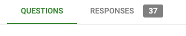
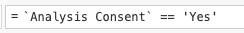
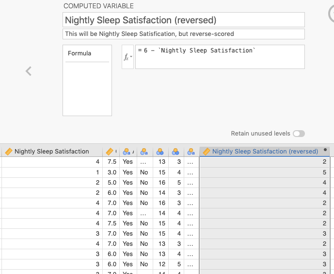
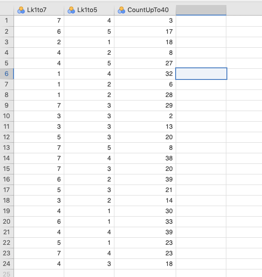
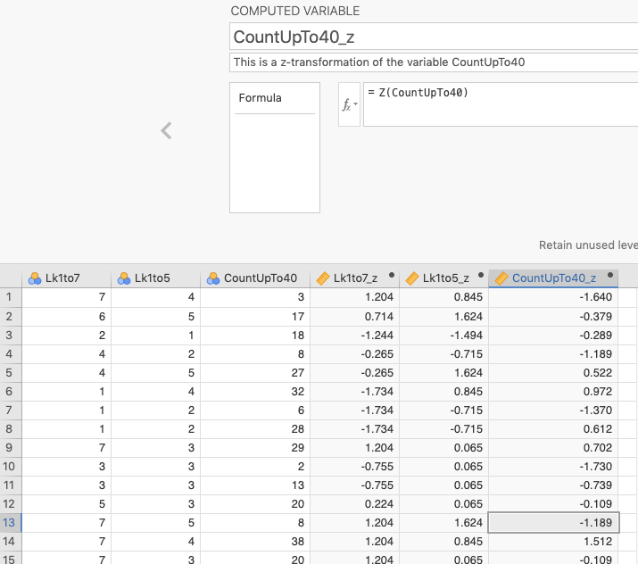
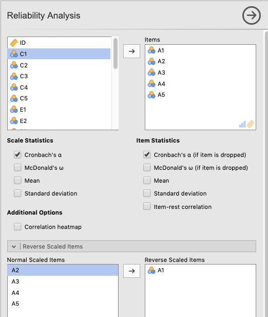
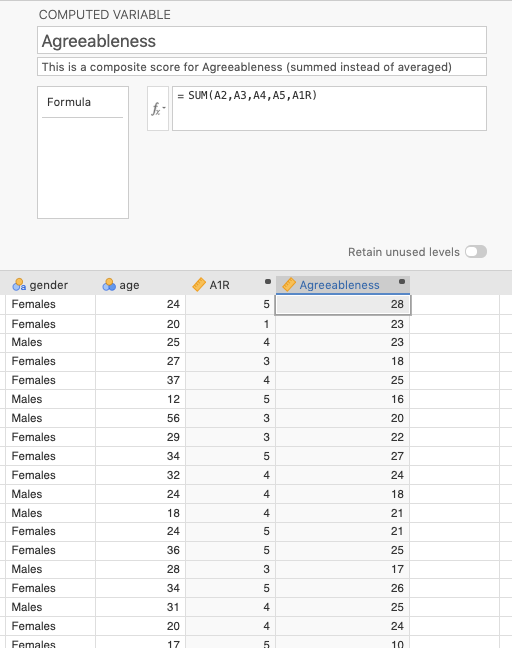

# Data Preparation and Analyses {#DataPreparationAndAnalyses}

## Chapter overview {#DataPreparationAndAnalysesChapterOverview}

This section is dedicated to showing you how to get your data that you have collected from Google into *jamovi*, and then prepared in such a way that you can begin Writing Assignment #2 (in section \@ref(WritingAssignment2)). 

This section will proceed as follows:

1. Exporting your data from Google Forms  
2. Importing your data into *jamovi*  
3. Cleaning up the data in *jamovi* so that only your pertinent variables remain  
4. Filtering out observations that should not be analyzed  
5. Reverse-scoring data any variables that need this transformation  
6. Calculating *z*-scores (if necessary)  
7. Calculating Cronbach's Alpha and analyzing your outcome variables  
8. Creating a composite variable from your outcome variables  

## Exporting data from Google Forms {#PreparingDataExportingDataFromGoogleForms}

This step is extremely easy. And it is really just a particular version of what we already covered in sections \@ref(Importing) and \@ref(PracticeImporting) earlier in the manual.

<br/>

When you are finished with data collection and you open your Google Form, you will see two tabs at the top: *Questions* and *Responses* (with a number next to it). Select *Responses*. See Figure \@ref(fig:GoogleFormsStartTabs) below.

```{r GoogleFormsStartTabs, fig.cap="Example of tabs available upon opening your Google Form (assuming it has data; the number will vary depending on how much data you have collected).", echo=F, out.width="300px"}

```
<br/>

You will then see an option that says *Accepting responses*. click the button next to that. This will prevent further participants from adding data to your survey.^[This step isn't actually required, but it can reduce confusion down the line, as one of your group-mates may decide to download more current data without you knowing, thereby giving you two or more datasets.] 

```{r GoogleFormsAcceptingNotResponses, fig.show="hold", out.width="25%", fig.align="left", fig.cap="How to halt all future responses in Google Forms", echo=F}
knitr::include_graphics(c("images/PrepForWA2/GoogleFormsAcceptingResponses.png", "images/PrepForWA2/GoogleFormsNotAcceptingResponses.png"))
```

<br/>

From here, there is an option to download the data as a .csv file directly by clicking the three vertical dots. So click ($\vdots$) > *Download responses (.csv)*. This will place a compressed .zip folder on your computer. 

You will then need to unzip it. On a Mac, simply double-click it and it will unzip it in the same location. On Windows 10, right-click it and choose *Extract All* and choose an appropriate destination and click *Extract* at the bottom. Note down where the extracted directory is.

That's it.

<br/>

## Importing the data into *jamovi* {#PreparingDataImportingTheData}

Start *jamovi* and click ($\equiv$) > *Import*. Navigate to the directory with the .csv file and double click the file.

<br/>

```{block2, type="rmdnote", echo=T}
***NOTE***: *jamovi* seems to have no problem recognizing commas inside of comma delimiters in .csv files exported by Google, so you should not have the following problem. However, if there were problems importing the .csv file due to the commas being delimiters, go back to Google Forms and click the square green icon with the white cross inside it. This will create a Google Sheet. From there, you can click *File* > *Download* > *Tab-separated values (.tsv, current sheet)*. This will create a tab-delimited file that *jamovi* should definitely not have a problem with.
```

<br/>

Save your imported data as a *jamovi* file with the following name: *MainData_[YOUR.GROUP.ID].jmv* (e.g., *MainData_905C.jmv*). This is the file that you will ultimately upload (as a group) to the Google Folder assigned to you, and refer to when you notify your instructor that you have done so (in *Canvas*, under *Lab: BDDO* > *Data*). Only one person from the group needs to upload this.

But first, there are some changes you need to make.

<br/>

## Cleaning up the data {#PreparingDataCleaningUpTheData}

### Renaming variables {#PreparingDataRenamingVariables}

First, Google Forms just exported the questions as your variable names. This is not convenient since they are very long, and will clutter up any statistical output, figure, or table you subsequently produce. 

```{block2, type="rmnote", echo=T}
**NOTE**: You do not need to do this for variables with short names, like `Age` or `Gender`.
```

<br/>

Double-click the header at the top of the relevant column in *jamovi*. This will open up the *DATA VARIABLE* window, where you can manipulate things like the levels of the variable, the name, the descriptions, etc. In this case, you are going to manipulate the variable name and description.

First read the variable name at the top and think of a reasonable name for it. Don't type over the variable name yet. Just think of a reasonable, shorter replacement and write it down. A reasonable, shorter replacement name is one that is transparent enough for figures and tables, but not so long that it creates space problems for the same elements (i.e., figures and tables). For instance, a variable with the original name of *How satisfied are you with the amount of sleep you get each night* could be changed to *Nightly Sleep Satisfaction*.

Next, select the entire variable name. Then either click CTRL-X or go to *Edit* > *Cut*. The long name should disappear from the top box. Now read the caution below:

```{block2, type="rmcaution", echo=T}
**CAUTION**: For the moment, leave that long label in your clipboard (memory). You will come back to it shortly. And do not use the copy function again until you are finished with the process below. The reason for this is that *jamovi* will not allow you to leave that top box blank, even just to paste what you just copied into the *Description* box (see below). You must provide a variable name right now or nothing else will work. How to do this is explained below.
```

<br/>

So the very next thing you must do is re-name the variable in the top box. Use the variable name you wrote down (see above).

Now, place the mouse in the *Description* box (make sure the cursor is blinking inside there) and click CTRL-V, or *Edit* > *Paste*. Now the long name of the variable is in the *Description*. The description in *jamovi* is mostly for researcher reference. It doesn't appear anywhere in any analyses, tables, or figures.

<br/>

### Removing variables {#PreparingDataRemovingVariables}

Next, remove the *A*, *B*, and *C* columns as demonstrated earlier in the manual in section \@ref(PracticeImporting) and Figure \@ref(fig:JamoviImportDeleteVars).

<br/>

In the same way, you will also want to delete the *Timestamp* variable that Google Forms creates that you do not need.

<br/>

Assuming you used the Google Form template, there was a question at the beginning asking participants whether they wanted to continue. If they chose *yes*, then their data were recorded. If they chose *no*, they were bumped out of the survey and thanked, but their data was not recorded.

What this means is that for all or most of you, the next variable is useless [i.e., *I would like to continue with this survey (by clicking "No", you will exit the survey)*]. If the survey worked right, the column should have only *yes* responses, and no *no* responses since only people who responded *yes* even have data there. So you can delete this variable too.

However, this agreement to participate should not be confused with the variable near the end of the survey (to the far right in the spreadsheet), where participants indicated whether they wanted their data analyzed (i.e., *Do you give permission for the data you just provided to be used and analyzed for research purposes?*). This is different. This variable was collected **after** the data had undergone recording. It is an indication whether or not the participant is comfortable with you analyzing the data. If the response was *no*, then you need to filter out that response.

This is the topic of section \@ref(PreparingDataFilteringData) below. But first, you may need to adjust some variables.

<br/>

### Adjusting variables {#PreparingDataAdjustingVariables}

When *jamovi* imports data from a delimited text file, sometimes it gets the variable type wrong.

For instance, when we imported some data from a past project in this class, *jamovi* imported *Age* as a nominal variable. If this happened to you, just double-click on *Age* and click the *Continuous* box. That will take care of it.

*jamovi* may have done this with your Likert data as well, as it did in our case. That data should be *Continuous* (Data type: *Integer*). Do that for all variables that were imported as nominal, but should be continuous.

<br/>

## Final steps before analysis {#PreparingDataFinalStepsBeforeAnalysis}

### Filtering data {#PreparingDataFilteringData}

Sometimes you need to filter data out for whatever reason. It could be that some of your observations have been identified as outliers. or it could be that the data was somehow corrupted, or you identified the responses as being somehow illegitimate. Presumably, none of those reasons will come up in your study. 

However, if the participant indicated that they did not want their data analyzed, then you very much **need** to filter that data out. This is an issue of [informed consent](https://en.wikipedia.org/wiki/Informed_consent).

We covered how to do this earlier in section \@ref(FilteringData). You can refer back to that section, and filter out any such variables.

But in short this is easy to do. The filter function is located under the *Data* tab. Once there, we just clicked the icon labeled *Filters* (at the upper-right). The icon looks like a funnel, half full of liquid. There's a box there labeled *ROW FILTERS*. 

Assuming you changed the variable name from *Do you give permission for the data you just provided to be used and analyzed for research purposes?* to something like *Consent*, you can type in the following in the box under *Filter 1*, labeled $f_{x}$:

>Consent == 'Yes'

The double equals sign is the way that the underlying programming language, R, wants you to ask yes/no questions. Basically, *Consent == 'Yes'* translates to "Is the value in this row under the column 'Consent' the same as 'Yes'?"

Also note that if you have a space between a two-word variable name (e.g., *Informed Consent*), you will need to surround the whole variable name with single back-ticks. This is how R can deal with spaces within variables. You can see this below in Figure \@ref(fig:BackticksInJamoviFilter). On your keyboard, the backtick is located just below the tilde (~), which is in turn is located just below the Escape key in the upper-left corner.

```{r BackticksInJamoviFilter, fig.cap="Surround any variable with spaces in it with backticks.", echo=F, out.width="300px"}

```

<br/>

### Reverse-scoring {#PreparingDataReverseScoring}

For your particular assignments, we have required that you collect three, related outcome variables that, together, form a single construct in the form of a composite variable. Thus, you will be adding or averaging these variables together.

But you will need to take care of a few things before doing so. Some may not apply to you, but others will.

Many or most of you have a reverse-scored item. That means that the response scale is reversed compared to the other items. For example, the responses to the statement "I am disappointed with my cumulative grade-point average" (1 - Strongly disagree <---> 5 - Strongly agree) would be reverse-scored relative to the responses to the statement "I am generally happy with my GPA this semester" (1 - Strongly disagree <---> 5 - Strongly agree). Someone who was happy with both would respond low to the first statement and high to the second statement. 

There is a simple formula for reverse scoring. If your variable is *x*, then the formula is $max(x)+1-x$. That is, take the maximum possible value of *x*, add one to it, and subtract the value of *x* for that cell in the spreadsheet.

In *jamovi*, you click the *Data* tab, and find a blank column on the right-hand side of the spreadsheet, and double-click the header. You will see several options, but you should click NEW COMPUTED VARIABLE.

You should come up with a new name for the variable that relates to the original. Thus, if the original had been *Aggression1*, the new one could be *Aggression1R* (with an *R* to indicate *reversed*). We have done one in plain English here with spaces (thereby requiring backticks). Here we are reverse-scoring *Nightly Sleep Satisfaction* into *Nightly Sleep Satisfaction (reversed)*.

The scale was a 1-5 Likert scale, so we added 1 to 5, giving us 6. We then subtracted *Nightly Sleep Satisfaction* from 6. See Figure \@ref(fig:ReverseScoringInJamoviScreen) below.

```{r ReverseScoringInJamoviScreen, fig.cap="Reverse scoring by subtracting a variable from its maximum value plus one (Note the use of backticks around the original variable, which had spaces in the name).", echo=F, out.width="600px"}

```

In the figure, you can also compare the scores on the *Nightly Sleep Satisfaction* variable (at the lower left) with the new values for *Nightly Sleep Satisfaction (reversed)* variable (at the lower right). The pattern is as follows: 

 $5\to1$  
 $4\to2$  
 $3\to3$  
 $2\to4$  
 $1\to5$  

<br/>

[Here](https://psychology.hanover.edu/classes/ResearchMethods/jamovi/reliability/reverseScoring.html) is a more detailed link that describes reverse-scoring and how to carry it out in *jamovi*.

<br/>

### Calculating *z*-scores {#PreparingDataCalculatingZScores}

Some of you may have these variables on different scales. Perhaps one of your questions is on a 1-to-5 Likert scale, but another is a count. If this is the case, then you will need to convert all the variables into *z*-scores before analyzing them. This was covered in a previous chapter in section \@ref(ZScores), but in a very different context. We will provide a simple example here.

We artificially created three variables for a data set of 23 observations. The first variable, *Lk1to7* is contains random values between 1 and 7. The second variable *Lk1to5* is the same, but only varies between 1 and 5. The third, *CountUpTo40* varies between 1 and 40. Let's say that it's a count variable. These are shown in \@ref(fig:ArtificialVariablesForZScoreConversion) below.

```{r ArtificialVariablesForZScoreConversion, fig.cap="An artificial data set with a variable that ranges between 1 and 7 (Lk1to7), one that varies between 1 and 5 (Lk1to5), and one that varies between 1 and 40 (CountUpTo40).", echo=F, out.width="600px"}

```

<br/>

To put these on the same scale, you need to create a new variable for each of the old ones, and apply a *z*-transformation, converting them into *z*-scores (standard-deviation units) around a new mean of zero.

As you did for the reverse-scored items (section \@ref(PreparingDataReverseScoring)), double-click a blank header above any of the blank columns, and choose *NEW COMPUTED VARIABLE*. Type in a new variable name that represents the particular *z*-score, like *Lk1to7_z*.

Click the little down arrow just to the right of the $f_x$ symbol, and scroll down until you find *Z* and double click it. You'll now see $=Z()$ in the box to the right of $f_x$. Inside those parentheses, type the name of the old variable, *Lk1to7*.

Press <enter> and Voila! You have your new *z*-transformed variable. And again, for this set of scores, the mean is zero, and the scores represent standard-deviation units.

We completed this for the other two variables as well. You can see the results below in Figure \@ref(fig:ResultsOfTransforming3RandomVariablesToZScores).

```{r ResultsOfTransforming3RandomVariablesToZScores, fig.cap="The results of transforming those variables into z-scores (identified by having a _z extension).", echo=F, out.width="600px"}

```

<br/>

Though it is not as ideal as having all variables on the same scale, you can indeed average or sum these values together.

It is also important to keep in mind that the scale has changed irredeemably. Your mean value will now be zero. You will need to be able to interpret things this way in the *Results* and subsequent *Discussion* sections.

<br/>

<!-- STUDENTS FOUND THE SECTION BELOW A LITTLE CONFUSING 
SOMETHING TO DO WITH NOT UNDERSTANDING THEY NEEDED TO APPLY 
IT TO THEIR OUTCOME VARIABLES. CHECK FOR OTHER THINGS TOO-->

### Calculating Cronbach's alpha {#PreparingDataCalculatingCronbachsAlpha}

Assuming you have taken care of any conversion of your scores to *z*-scores (if necessary), you will then need to carry out an analysis of how well your individual questions are working together. This is done through an analysis of Cronbach's Alpha. If your analysis shows that you can use all three variables, then you use all three. Don't be surprised, however, if one of your variables does not act like the others. In this case, you may want to consider analyzing that variable separately.

To illustrate this, we will simply use a dataset called *Personality Questionnaire: Ch15 - Personality data sample 3* (*bfi_sample3*) [located at the very bottom] from the datasets associated with @lsj. In fact, this is the dataset they use to illustrate the same (pp. 461-463).

Simply go to ($\equiv$) > *Open* > *lsj-data* > *Personality Questionnaire: Ch15 - Personality data sample 3*. This dataset is a sample of people who took a Big-5 Personality test. The variables `A1`-`A5` represent *Agreeableness*, but `A1` is reverse-scored.

Luckily, we do not need to reverse-score this ourselves. *jamovi*'s procedure for calculating *Cronbach's Alpha* contains a mechanism within it to deal with reverse-scored items.

One thing you ***may*** have to do, however, is convert the `A1` through `A5` variables from nominal variables to continuous variables. For whatever reason, *jamovi* is reading these variables as nominal variables when they are, in fact, continuous.

Under the *Data* tab, just double-click the variable and change the *Measure type* from *Nominal* to *Continuous*. Do this for variables `A1` to `A5` (don't bother with the other variables since we are not working with them at this time).

When you have the data, click the *Analyses* tab, and choose *Factor*.^[*Cronbach's Alpha* is often carried out in conjunction with something called *Factor Analysis*, which you are free to read about in Chapter 15 of @lsj] From here select *Reliability Analysis*.

Move variables `A1`-`A5` to the *Items* box. Then look down below and click the window labeled *Reverse Scaled Items*. In that box (labeled *Normal Scaled Items*), select `A1` and move it over to the box labeled *Reverse Scaled Items*. 
Also, under *Additional Options*,  click *Correlation heatmap*. 

The arrangement of variables should look as they do in Figure \@ref(fig:ArrangmentOfVariablesForCronbachsAlpha) below.

```{r ArrangmentOfVariablesForCronbachsAlpha, fig.cap="The arrangement of variables for Cronbach's Alpha using the bfi_sample3 dataset from @lsj", echo=F, out.width="600px"}

```

<br/>

The result of the analysis should looks as follows:^[Recall that the output below (and further down) was generated from the *jmv* package in *R*, and will therefore be rounded to more decimal places than the native output in *jamovi*.]

```{r import_bfi_sample3, include=FALSE}
bfi_sample3 <- readRDS("datasets/PreppingData_bfi_sample3.rds")
```

```{r CronbachsAlphaOutput, echo=FALSE}

jmv::reliability(
    data = bfi_sample3,
    vars = vars(A1, A2, A3, A4, A5),
    corPlot = TRUE,
    alphaItems = TRUE,
    revItems = A1)
```

<br/>

Normally what you are looking for is a relatively high *Cronbach's Alpha*, along with any items that result in a significant increase in *Cronbach's Alpha* if it is removed.

In this case, the removal of `A1` would result in a higher *Cronbach's Alpha* than the removal of any other item, but the increase is not really significant enough to warrant removal from analysis.

Had there been an item that was odd compared to the others, then you might have considered removing it and analyzing it separately.

Also notice in the heatmap (a correlation matrix with shades of green representing strength of correlation [Pearson's *r*]), that all of the correlations were pretty weak to moderate ($r_{A1.A5}$ = .13 to $r_{A3.A5}$ = .53, respectively). This merely suggests that the construct is not unidimensional. 

The final stage is next.

<br/>

### Creating a composite variable {#PreparingDataCreatingACompositeVariable}

To create a new variable we simply sum or average them together. We can work with the same *bfi_sample3* data from above to do this. We will need to reverse-score *A1* first (see section \@ref(PreparingDataReverseScoring) above.

Using the same procedure as we did above for creating reversed scores (section \@ref(PreparingDataReverseScoring)) and creating *z*-scores (section \@ref(PreparingDataCalculatingZScores)), we again clicked the header above a blank column and chose NEW COMPUTED VARIABLE.

Here, we chose to sum together *A1R* (reversed) and *A2*-*A5*.^[We could also average them since they're on the same scale. The result is the same.] We did this by choosing the function SUM from the $f_x$ menu. Then, inside the parentheses of SUM(), we placed all the variables we needed, separated by commas. See Figure \@ref(fig:AgreeablenessCompositeSummedNotAveraged) below for a visualization of what we did.

```{r AgreeablenessCompositeSummedNotAveraged, fig.cap="Calculating the sum of A2-A5 and A1R (reversed)", echo=F, out.width="600px"}

```

<br/>

And that is it. Once you reach this stage, you have your composite variable and you are ready to upload the *jamovi* file to your group's Google Folder and let your TA know (through the assignment in *Canvas*).
