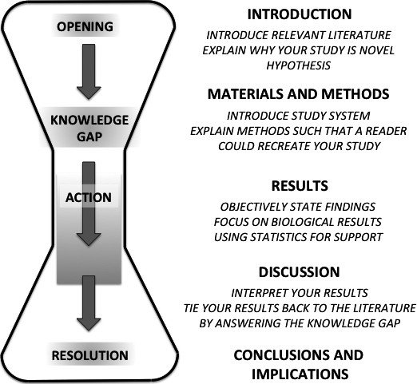

# (PART) Writing {-}

# Reporting research {#ReportingResearch}

You already understand that writing is a major component of this lab (as well as the lab in PSYC 302 - *Research Methods and Design in Psychology*). This chapter provides some context and a general framework for doing well in this writing component of the lab. There are no practical exercises in this chapter, only information about how to go about writing in Psychology. Subsequent sections (Chapters \@ref(WritingIntroductions)-\@ref(WritingGeneralDiscussionSections)) provide more detail.

<br/><br/>

## The broader context {#TheBroaderContext}

There is a ***lot*** of writing that takes place in academia. Psychology is no exception. This section provides a general picture of what is happening at the university, particularly Psychology.

This lab in PSYC 302 introduces you to what can be conceptualized as two interlinking circles of *research* and *education* that you are already part of by virtue of having initiated the pursuit of an undergraduate degree in Psychology. One of these circles, *education*, is very (dare we say, *painfully*) clear to undergraduate students because the students form an integral part of this circle. But the complementary circle, *research*, often remains hidden to undergraduates, at least most of the time. However, the *research* circle occupies the majority of time that professors and graduate students spend in their jobs. This is especially true at at large, research-intensive universities like Texas A&M.^[Some universities are much more teaching focused. They tend to charge more in tuition.]

We will describe these circles below, starting with the one you are most familiar with: the *education* circle. Note that the circle described below is characterized by a particular "flavor" that is quite unique to Psychology. It would be unusual to find this kind of undergraduate integration in other academic disciplines.

<br/><br/>

### The education circle {#EducationCircles}

The education circle (simplified a bit) is what undergraduates see mostly in their classes. It goes like this. First, undergraduate students obtain textbooks for the class, and during the semester, they read the textbook and gain knowledge through that as well as lectures and activities. Second, (at least in most major Psychology programs in the US), these same students participate in laboratory research for course credit. You probably have experienced being one of these participants. Third, researchers outside the classroom (i.e., professors and graduate students in the department) take that data gained from the experiment participation, analyze it, and try to publish it, ideally in prestigious peer-reviewed journals, but sometimes in other venues. This written output in academic journals forms the backbone of what is called *primary research*. Fourth, another group of writers sift through the primary research, and summarize it for textbooks in such a way that it is readable for most undergraduates and much of the lay public. Those textbooks get published, and we're back to the first step above, where students obtain textbooks. This is the *education* circle in a nutshell.

It is important to note that the rhetoric used to communicate within this education circle is primarily aimed towards the lay public. Although the language is typically formal, it contains very little technical, academic jargon. One probably needs a high-school education to understand it, but not much more. However, the language in the *research* circle (described below) is very different.

Here is an example of such writing, from the a recently finished open-educational-resource textbook on developmental psychology [@ParisRicardoRymondJohnson2018]:

>Piaget has been criticized for overemphasizing the role that physical maturation plays in cognitive development and in underestimating the role that culture and interaction (or experience) plays in cognitive development. Looking across cultures reveals considerable variation in what children are able to do at various ages. Piaget may have underestimated what children are capable of given the right circumstances. (p. 33)

<br/><br/>

You have seen this kind of writing before if you have read any textbook before. We can assume that includes absolutely all of you. What you may ***not*** have seen before is the kind of writing described next.

<br/><br/>

### The research circle {#ResearchCircle}

The research cycle spins off of the third step above, where professors and graduate students perform research. As you might imagine, there are several steps here as well, which we will now simplify. First, researchers "begin" by staying (or becoming) up-to-date on a given research topic, and then figuring out which questions related to that topic have not yet been answered. Researchers will usually then do their creative best to envision a study to carry out in order to answer a gap identified in the extant research record.^[In fact, the *Introduction* sections to research papers are, in an indirect way, just a summary of this research-gap identification processes.] Second, researchers run the experiments they have envisioned (often preceded with the application for and [hopefully] successful procurement of grant funds to facilitate the research). In Psychology, the participants in these experiments are often, but not nearly always, undergraduate psychology students in basic Psychology courses.^[This unusual level of student integration was referred to above as something that is almost unique to the field of Psychology.] Third, after the collection of this data, the researchers analyze it, usually with statistics. Fourth, they write their results up in a formal paper and submit it to a journal for publication. At this stage, it may get accepted, rejected, or somewhere in between (e.g., "revise and resubmit"). If and when the paper is published, it feeds back in to the *education* circle where it initially departed.^[Note that this research doesn't just feed the *education* circle in the form of resource material for textbook writers; rather, it also feeds other researchers within the *research* circle itself, naturally. In fact, this latter function is probably its primary purpose.] This completes the *research* circle.

We haven't yet had a chance to create a diagram of these circles. Instead, we will rely on your imagination for the time being. However, there is a related image from the *Understanding Science* website at the University of California Museum of Paleontology [-@UCMuseumOfPaleontology]. You can see this below, as Figure \@ref(fig:BigPictureOfScience).

<br/><br/>

```{r BigPictureOfScience, fig.cap='The overall process of research (courtesy of the *University of California Museum of Anthropology*. The image is copyrighted. Please contact them at understandingscience@berkeley.edu if you wish to reproduce the image.).', echo=F, out.width="750px"}

```

<br/><br/>

This is a much more complex visualization than the two-circle description we provided above. Indeed, it's a more comprehensive depiction of the scientific process. Nonetheless, you may picture yourself as a student beneficiary, gaining knowledge in the blue circle, but also contributing data to experments in upper half of the central, green circle. Thus, it is in the interaction between the blue and green circles that Psychology students (you) find themselves in.

But the main take-away in this sub-section is that the purpose of this class is to bring you closer to not only the green circle, but also the pinkish and violet  circles.

<br/><br/>

### The research genre {#ResearchGenre}

However, the particular style of language used within the *research* circle is definitely ***NOT*** intended to be read by the lay public, even those who are fairly educated. Rather, it is quite full of not only jargon that the uninitiated will probably not understand, but also of quite specialized concepts that are not widely understood, like the inferential statistics that are the focus of this class.

<br/><br/>

Here is an example excerpt from the *Introduction* to an article [@BarkerSemenovMichaelsonProvanSnyderMunakata2014] in the journal *Frontiers in Psychology*, an open-access journal in the field.

>To accomplish [complex decision-making] tasks, children must engage executive functions (EFs), the cognitive control processes that regulate thought and action in support of goal-directed behavior. EFs develop dramatically during childhood ..., and support a number of higher-level cognitive processes, including planning and decision-making, maintenance and manipulation of information in memory, inhibition of unwanted thoughts, feelings, and actions, and flexible shifting from one task to another. Researchers have used a variety of laboratory tasks to measure child EFs, including table-top behavioral tasks (e.g., the classic marshmallow test, card-sorting tasks) and computerized tasks (e.g., Go/No-go, Flanker), many of which tap multiple aspects of EF. Over the past decade, EFs have emerged as critical, early predictors of success across a range of important outcomes, including school readiness in preschoolers..., as well as academic performance at school entry... and beyond. (p. 1)

<br/><br/>

And that's just from the *Introduction*, the least jargon-laced section of a paper. 

Below is an example from the *Method* section of the same paper. It has more jargon in it.

>Children completed a computerized flanker task... assessing their ability to resolve conflicting visual information by appropriately responding to a central stimulus while ignoring flanking stimuli. The Flanker task is a commonly-used measure of externally-directed EF in 6-year-olds ... and has been shown to be sensitive to some interventions targeting EF in this age group... During the task, children were instructed to indicate the orientation (left or right pointing) of a centrally-presented target stimulus, via a corresponding button press. (p. 6)

<br/><br/>

And finally, the following is from the *Results* section, which is full of jargon:

>Weekly and annual/typical estimates of how children spent their time... were marginally correlated, for both structured activities (*r* = 0.24; *p* < 0.06) and less-structured activities (*r* = 0.23; *p* < 0.071). We thus generated composite scores across weekly and annual/typical estimates to provide a more accurate and reliable measure of children's time. Each composite measure (for structured time, and separately for less-structured time) was formed by summing z-scored time in prior-week activities with z-scored ratings from the parent survey of annual/typical child activities, within each participant. (p. 7)

<br/><br/>

Clearly, this is not intended for the layperson. Rather, it is intended to be read by other experts in the field.

<br/><br/>

## Purpose of writing in this class {#PurposeOfThisClass}

If you are an undergraduate at Texas A&M, you already know that all undergraduate majors at Texas A&M must take two courses that relate either to written (two "W" courses) or to both written and oral communication (one "W" and one "C" course). The link to this requirement is [here](https://writingcenter.tamu.edu/Students/W-C-Courses). 

The Department of Psychological and Brain Sciences has elected to have majors complete two "W" courses. These two courses are PSYC 301 (*Elementary Statistics for Psychology*) and PSYC 302 (*Research Methods and Design in Psychology*). The focus of PSYC 301 is on understanding statistics, whereas the focus of PSYC 302 is on research methods and experimental design (which in turn assumes an understanding of statistics). But both involve analyzing data and subsequently writing up research based on those analyses.

The purpose of this lab (as well as that of PSYC 302 if you are at Texas A&M) is to train you in the skills required to engage in some way with the outer, research circle described directly above in Section \@ref(ResearchCircle). This includes not only the statistics reported in the last quoted excerpt above, but also the style, jargon, and most importantly, the specialized concepts represented across all three excerpts.

The advantages of such training are at least twofold. First, you will gain valuable knowledge into statistics, which is a life skill. You are bombarded every day with statistics in the news, online, etc. Statistics is the form of math (the math of uncertainty) that allows us to make important decisions based on limited information. All fields use it, from science to business to policy to engineering. Also, without this skill, it is easy for others to deceive you.

Second, if you even believe that you *might* one day go to graduate school, you will need these skills in in great measure. As we mentioned before, it isn't only professors who are involved heavily in the research circle; graduate students are there as well.

In this particular lab (i.e., if you are using this particular lab manual), you will be writing a single paper that is broken up into four separate assignments. These separate assignments are roughly broken up into the chapters that follow this one (\@ref(WritingIntroductions)-\@ref(WritingGeneralDiscussionSections)), which in turn correspond to the traditional sections of of a research paper (described below in Section \@ref(OrganizationOfAPAResearchReports)).

But first, a general introduction to scientific writing is in order.

<br/><br/>

## The genre of science {#TheGenreOfScience}

The first thing you should understand about research reports in Psychology (and in science in general) is that they are very, very standardized. This is very characteristic of the genre. Creativity is reserved for the **content** of the report, **not the form***. There is a reason for this. Namely, researchers need to read through dozens, or hundreds of research reports to gather the knowledge they need in order to do their job (i.e., more research). Thus, the more that the information is conveyed in a predictable format, the easier it is to gather the information.

This contrasts a great deal with the composition background that many students arrive with when they get to the university, having gained that knowledge during their secondary (high-school) education. In those contexts, students are usually introduced to reading and writing through the genre of higher literature, where creativity in ***both*** form and content is emphasized. In this genre, some of the great writers flaunted conventions to great effect. William Faulkner did this with the narrative from Benjy Compson, the first chapter in *The Sound and the Fury*. It is difficult to read (at least at first) because the writing is from the perspective of a man who has mental retardation and little sense of chronological time. Another example is Molly's monologue in James Joyce's novel *Ulysses*. It is the last sentence of the novel. It is dozens of pages long, and contains no punctuation whatsoever. A more recent, popular example of this is the 2000 movie *Memento*, where the narrative runs chronologically backwards in ostensibly unrelated snippets, which is meant to reflect the experiences of a man (portrayed by the actor Guy Pierce) trying to solve the violent crime that led to his anterograde amnesia (the inability to form new memories). It is a disorienting movie, to say the least.

All of these are considered high artistic achievements (especially the first two), but they are notoriously difficult to follow. Yet importantly, there ***is a benefit to getting through them***, which is the sense of having stepped into the unique minds of these characters.

But let's go back to the topic at hand: research reporting.

<br/><br/>

In direct contrast, it is quite difficult to imagine how flaunting the conventions of narrative would somehow be of any use whatsoever in research reporting. For instance, no researcher needs or even wants to step into the minds of other researchers or their participants. The goal of scientific reporting is strictly the conveyance of information. Thus, something very different is true of writing conventions among researchers: Creativity in content is paramount (i.e., finding ways to answer questions), whereas creativity in form (e.g., flaunting narrative conventions) is eschewed. In fact, you might see at this point how codifying the narrative conventions quite narrowly would lend quite an advantage to readers of research reports. If narrow enough, constraints on expression could actually help readers predict what kind of information will be conveyed, in what order, in what form, and with which specific labels. 

This is no different than, say, a manager at a private company that wants quarterly results in a certain format. She wants to interpret it right away instead of having to figure out *how* the information is being conveyed this time by some subordinate who chooses to doing things different every time. This would be a tremendous waste of her time.

Indeed, this standardization has already been taken care of for you by the American Psychological Association (APA). This will be explained next.

<br/><br/>

## Style guides {#StyleGuides}

So this brings us to what is called a *style guide*. A style guide is a set of conventions (usually written down in a manual) that a particular industry recommends writers follow for communication. With respect to research reporting, for instance, any particular style guide will recommend specific conventions for organizing information in papers, for citing sources, for wording, and for the reporting of statistics, among many other constraints. Examples of style guides include *The Chicago Manual of Style* (aka *Turabian*), *MLA* (the *Modern Language Association*), *AMA* (the *American Medical Association*), and *CSE* (the *Council of Science Editors*). There are many.

<br/><br/>

### APA style {#ApaStyle}

But the style guide that has taken hold in Psychology (and many other fields) is that of the *American Psychological Association*. The style they recommend is called [APA style](https://en.wikipedia.org/wiki/APA_style), and is detailed in a manual called [The Publication Manual of the American Psychological Association](https://apastyle.apa.org/manual/). To obtain a personal copy of the manual, it must be purchased. However, university libraries always have multiple copies. There are multiple copies available in the stacks at the *Evans Library* at Texas A&M, but they are often checked out. There are at least two copies in the 1st Floor Annex of Evans, however. For what it's worth, the map to this location is displayed below in Figure \@ref(fig:LocationOfAPAManualInEvansLibrary1stFloorAnnex).

<br/><br/>

```{r LocationOfAPAManualInEvansLibrary1stFloorAnnex, fig.cap='Location of reserve copies at the Evans Library (1st Floor Annex) at Texas A&M of the *Publication Manual of the American Psychological Association, 6th ed.*.', echo=F, out.width="750px"}

```

<br/><br/>

Unfortunately, the APA does not appear to make the electronic version of the manual available to university libraries.

Chances are, however, that you would seldom need to consult this manual in person. Many people get by with using some combination of online sources and reference-management software (e.g., *EndNote*, *Mendeley*, *Zotero*, *BibDesk*)^[Also be aware of the dangers of citation generators. The Online Writing Lab at Purdue University has [good information](https://owl.purdue.edu/owl/research_and_citation/using_citation_machines_responsibly.html) on this.] to figure out how to conform to APA style in their research reports. Currently, *EndNote* is available for free to students at Texas A&M - College Station, through the [Texas A&M Software Center](https://sell.tamu.edu/index.php). Unfortunately, *EndNote* does not work with *Google Docs*.^[recall that we suggested students use *Google Docs* back at the very beginning of this manual in Section \@ref(Software).] It seems that a new reference manager does though. The parent organization is called [F1000](https://f1000.com/), and it has a tool called [F1000Workspace](https://f1000workspace.com/?lg) that has an [Add-on](https://chrome.google.com/webstore/detail/f1000/daojhpgpccggokldfgfdmeckecckheej) for *Google Docs*.

That said, this class will focus very little on citing sources in APA format. You really won't have much use for a reference manager. The primary reasons that you will need to understand APA style are the following:

- The overall structure of a research paper  
- General APA guidelines
- How to report statistics

<br/><br/>

We will start with the overall structure.

<br/><br/>

#### Organization of APA research reports {#OrganizationOfAPAResearchReports}

The basic skeleton of a research report in APA format is as follows:

- ***I***ntroduction;
- ***M***ethods;
- ***R***esults; ***a***nd
- ***D***iscussion.

<br/><br/>

This is sometimes called ***IMRaD*** structure (or often just ***IMRAD***), an acronym based on the first letter of each major section (above, plus the coordinating conjunction). This structure has become dominant in the sciences during the last 50 years (@SollaciPereria2004). [Here](https://en.wikipedia.org/wiki/IMRAD) is a Wikipedia link on the format.

There is a rhetorical "shape" to the overall structure of the IMRaD report as well. It has an hourglass shape. The ***Introduction*** (the first few sentences, in particular) starts "wide", in the most general way possible for the topic at hand. Paragraph-by-paragraph, the topic narrows progressively until the end of the *Introduction* is reached, at which point the research hypothesis is stated in one way or another.

The scope of the ***Method*** and ***Results*** sections are quite "narrow," referring strictly to the experiment(s) unique to the current research.

The ***Discussion*** section begins "narrowly," by referring back to the results of the study, but then progressively "widens" in scope as it places the results of the current study into the broader context set up at the beginning of the *Introduction*. All this usually concludes by pointing to possible, future directions that the current research could go in.

Figure \@ref(fig:HourglassImageFromTurbekEtAl2016) below is reproduced from an article by Turbek et al. [-@TurbekChockDonahueHavrillaOliverioPolutchkoShoemakerVimerati2016]. (The figure refers to biology, but you can just replace *BIOLOGICAL* with *PSYCHOLOGICAL*).

<br/><br/>

```{r HourglassImageFromTurbekEtAl2016, fig.cap='The hourglass shape of the IMRaD research paper (from Figure 1, p. 420, of @TurbekChockDonahueHavrillaOliverioPolutchkoShoemakerVimerati2016.', echo=F, out.width="600px"}

```

<br/><br/>

A more common skeleton is as follows since most research reports consist of more than one study and/or experiment:

- Introduction
- Study/Experiment 1
  - Method
  - Results
  - Discussion
- Study/Experiment 2 
  - Method
  - Results
  - Discussion
- Study/Experiment ...*n*
  - Method
  - Results
  - Discussion
- General Discussion

<br/><br/>

The rhetorical shape of this structure is not that much different from the simpler hourglass approach above. The main difference is that only the *General Discussion* widens to the maximum extent at the end, whereas the study-specific *Discussion* sections usually only broaden out enough to justify the experiment that follows (if any). 

<br/><br/>

In this class you will be producing one of these reports. Ultimately, it will take the following form:

- Introduction
- Methods
- Study/Experiment 1
  - Results
  - Discussion
- Study/Experiment 2 
  - Results
  - Discussion
- General Discussion

<br/><br/>

We will review how to write each section in Chapters \@ref(WritingIntroductions)-\@ref(WritingGeneralDiscussionSections).

<br/><br/>

#### General APA guidelines {#GeneralAPAGuidelines}

There are also some basic, over-arching formatting guidelines for all APA papers. These are easy to enumerate:

- document 
  - double-spaced
  - 1-inch margins all the way around
- header
  - a shortened version of the title of your paper, in all caps, flush **right**, at 1/2-inch down
  - a page number to the right of this title
    - example: "MEMORY LOSS IN APHASIC BILINGUALS 7" (i.e., page 7)
- headings (i.e., *Introduction*, *Method*, *Results*, *Discussion*, *General Discussion*)
  - centered
- paragraphs
  - aligned flush on the left margin, and ragged on the right margin (i.e., ***NOT*** "justified")
  - indented 5 spaces for each new paragraph
- font
  - *Times New Roman*
  - size 12
- text
  - almost all numbers rounded to 2 decimal places (e.g., 4.66666 to 4.67)
    - (you will see some minor exceptions here, like "All *F*s $\leq$ 1")
  - all statistical letters (and only letters) go in italics (e.g., *t*, *r*, *F*, *p*)
- grammar
  - Method and Results section should be reported in the past tense
  - Introduction and Discussion can use more present tense
  
<br/><br/>

Note that in the papers for this class, we will not ask you to include a title page nor an abstract. Writing starts on the body of the paper (i.e., beginning with the introduction).

<br/><br/>

#### How to report statistics {#HowToReportStatistics}

The reporting of statistics is consistent across descriptive statistics and inferential tests.

<br/><br/>

##### Descriptive statistics {#ReportingDescriptiveStatistics}

These are usually reported in parentheses in text. When this is the case, they are indicated with specific abbreviations. For example:

>"The typical scores for the low-income group were higher (*M* = 32.81, *SD* = 5.6, *n* = 42) than the high-income group, whose scores were typically lower (*M* = 24.52, *SD* = 6.4, *n* = 28)"

<br/><br/>

Sometimes however, they are reported in the text itself. This often happens when authors are discussing the numbers themselves instead of the constructs. For example:

>"The mean of 32.81 for the low-income group was calculated in the context of a positive skew, whereas the mean of 24.52 for the high-income group was not."

<br/><br/>

But in general, one should try to keep descriptive statistics in parentheses so that they do not interfere with the prose too much. That is, if you omit the descriptive statistics in parentheses when you read out loud, your listener can still understand what you're saying. Thus, the first example passage above could be coherently read aloud as follows:

>"The typical scores for the low-income group were higher than the high-income group, whose scores were typically lower."

<br/><br/>

In short, the information outside the parentheses should be vital to the prose, and the information inside the parentheses should not be vital to the prose.

<br/><br/>

Standard APA abbreviations for typical statistics covered in this class are as follows:

- mean: *M*
- standard deviation: *SD*
- total sample size: *N*
- sub-group sample size: *n*
- median: *Mdn*
- z-score: *z*

<br/><br/>

Other descriptive statistics do not get abbreviations, as far as we know, as they are rarely reported this way.

<br/><br/>

##### Inferential statistics {#ReportingInferentialStatistics}

Inferential statistics are reported with a consistent pattern in APA. The pattern is as follows, expressed as a quasi-formula:

$[$*test-letter*$]$(df) = $[$obtained-value$]$, *p* [= OR < OR >] $[$p-value$]$

<br/><br/>

- **test-letter**: this is usually a single, italicized roman or greek letter that represents the particular inferential test that was run. Examples that are relevant for this class include the following:

  - *$\chi^2$* (for a chi-square test)
  - *t* (for a *t*-test)
  - *z* (for a one-sample *z*-test)
  - *r* (for a Pearson's *r* correlation coefficient)
  - *F* (for an ANOVA)
- **(df)**: This refers to the degrees of freedom. It is *not* in italics. There will be one value here, except in two cases. For *F* tests, there will be two numbers, and for one-sample *z*-tests, there will be no number here. Sometimes this will be reported as a subscript of the letter (referring to the test type) coming before it. This is not actually an APA recommendation from the APA style guide, so you **should not** subscript the degrees of freedom.
- **=**: This always precedes the obtained value of the inferential test. there are no exceptions.
- **obtained-value**: This is the number that gets calculated from the test formula. It is a signal-to-noise ratio that varies from test to test.
- **a comma**: This always comes after the obtained value of the test statistic, and separates this number from the *p*-value
- ***p***: This letter *p* (always in italics) identifies the number to the right of it as the *p*-value
- ***[= OR < OR >]***: That is, either ***=***, or ***<***, or ***>***. One (*and only one*) of those three symbols must occur in this location, depending on whether the *p*-value is exactly the number to the right (***=***), less than that number (***<***), or greater than that number (***>***).
- ***p-value***: This is the *p*-value, an number between 0 and 1.^[When multiplied by 100, the *p*-value is the number of times out of 100 that you would expect to get the obtained value that you did (or one that is more extreme) if you not only repeated the experiment/study an infinite number of times, but the null hypothesis were also underlyingly true.]

<br/><br/>

That looks like a ***lot*** of information (and it is), but the actual, written form that it takes is quite concise. Here are some more concrete (albeit fabricated) examples:

- Chi-square  
  - $\chi^2 (1)=5.2,p<.05$  
- *t*-test  
  - $t(28)=2.43,p=.022$  
- Pearson's *r*  
  - $r(48)=.18,p>.05$  
- ANOVA  
  - $F(2,12)=4.94,p=.027$   
- *z*-test  
  - $z=14.60,p<.05$  

<br/><br/>

## Issues not extensively covered {#IssuesNotExtensivelyCovered}

There are a few issues that are keys to good writing, but that we do not cover extensively in this manual due to a lack of space.

<br/><br/>

### Critical thinking {#CriticalThinking}

It is sad that we do not cover this here, as it is the backbone of good research writing. If you cannot think clearly, you cannot write clearly.^[That said, just because someone may be a good critical thinker does not necessarily mean that they are a good writer.] The task of teaching critical thinking lies just too far beyond the scope of this manual.

However, there are good outside sources on critical-thinking skills. We will cover these under Section \@ref(OutsideHelpOnWritingUpResearch) below.

<br/><br/>

### "Grammar", clarity, and mechanics {#MechanicsOfWriting}

#### A note on "grammar" {#ANoteOnGrammar}

There is a whole host of writing issues that have to do with sentence structure, word choice, punctuation, etc. Chances are that teachers have been bothering you for many years on these "deficiencies" in your writing, perhaps even calling it "bad grammar."

The lead author of this manual (Bolger) is a linguist, so he cannot bring himself to allow the the term "grammar" to refer to writing. For trained linguists, [grammar](https://en.wikipedia.org/wiki/Grammar)  is the mental system that leverage [duality of patterning](https://en.wikipedia.org/wiki/Double_articulation) to allow humans (uniquely) to combine smaller linguistic elements into larger and larger units (according to specific rules at each level) in order to communicate increasingly complex meanings accurately to other humans.^[Students at Texas A&M can learn more about this if they take PSYC 346 - *Psychology of Language*, which Dr. Bolger teaches occasionally, if you haven't already guessed.]. All humans, with very few exceptions, acquire most of their native grammar by age 5, and pretty much all of it by age 8 or so. The acquisition process is nearly unstoppable among humans.^[You can stop it, but you would need to deprive a child of virtually all linguistic input, as was the unbelievably sad story of [Genie](https://en.wikipedia.org/wiki/Genie_(feral_child), which you may have read about in your first Psychology class. Otherwise, children will find a way to acquire language, as anyone who made it through Kindergarten has]

When teachers have referred to your "bad grammar," therefore, they were really referring largely to what linguists would consider an, as-yet incomplete mastery of the formal dialect of English (used in academia). This is a dialect of English that must be learned either in school, or through lots of reading of formal English, or (usually) both. But this is a continuous process, and you are undoubtedly in the throes of it.

It is at this point that we will no longer use the term "grammar" for this writing issue that keeps rearing its ugly head on your teacher's feedback to you. Rather, we will simply call it what it is: *mastering formal English*.

<br/><br/>

#### Mastering formal English {#MasteringFormalEnglish}

So you can see that we are not just shamelessly trying to get you to study the psychology of language.^[Well, maybe a little.] Rather, you should conceptualize becoming a better writer in academic English as a form of foreign-language learning, especially of vocabulary. As such, it is not out of reach as the expression "You have bad grammar" might imply. Rather, you just need to learn some additional vocabulary, along with a few other minor modifications to a language you already know very, very well (i.e., English, in our case).

<br/><br/>

##### Learning the vocabulary {#LearningFormalEnglishVocabulary}

The bulk of the learning task here is acquiring formal vocabulary, which for historical reasons having mostly to do with the [1066 Norman Invasion in England](https://en.wikipedia.org/wiki/Norman_conquest_of_England), emphasizes latinate as opposed to germanic roots.^[*Latinate* roots are words that have their origins in Latin (which were adopted into English mostly through Old French after 1066), whereas *germanic* roots are words that have their origins in the germanic dialects spoken about 1,500 years ago in the area currently occupied by the Netherlands and northwest Germany. In the 5th or 6th century, people from these areas invaded the British Isles and either displaced or assimilated the ancient Celtic-speaking people who had for hundreds of years been ruled by the Roman Empire (which had recently collapsed in this area around the early 5th century). The British Isles were ripe for invasion, and [Germanic tribes took advantage](https://en.wikipedia.org/wiki/Anglo-Saxon_settlement_of_Britain). English is a direct descendant of these old germanic dialects. In fact, most of the words you use in daily life are of germanic origin (e.g., *ask*), whereas the words you use to write formally emphasize more latinate words (e.g., *inquire*). Of course, the Vikings didn't want to be totally left out of the invasion spree, so they invaded the British Isles a couple of hundred years later, and also left a linguistic mark on English.] To view a comparison of of germanic and latinate roots in English, go [here](https://en.wikipedia.org/wiki/List_of_Germanic_and_Latinate_equivalents_in_English). The germanic/latinate pattern that characterizes the informal/formal split in English should be obvious.

It is well beyond the scope of this manual to delineate the differences between the informal and formal vocabulary of English. However, the link above gives you some insight. And we will provide some links at the end of this chapter.

<br/><br/>

##### Learning the style {#LearningTheStyleOfFormalEnglish}

It isn't just the vocabulary of formal English that is different from informal English. Rather, it is also the style. For instance, there are far more subordinate clauses in formal English than there are in informal English. Formal English is more ***complex*** than informal English. Compare the following:

Formal:

>Due to the fact that there is a Thursday football game, non-essential university staff are encouraged to leave early on that day.

<br/><br/>

The first clause there is a subordinate clause that can't itself form a complete sentence.

Informal:

>There's gonna be a football game on Thursday. So employees that don't need to be here should leave early.

<br/><br/>

In this case, both clauses (before and after the comma) form complete sentences. They are independent clauses.

More importantly, academic English is also highly ***hedged***. Hedging is the process of backing off from over-confidence (or feigned confidence) in your claims. For example, it would be more common in academic English to say something like, "The results here are fairly clear," instead of "The results here are indisputable." Consumers of such research understand how to *subtract out* the hedging in order to match the original researchers' original level of confidence.

This is actually a wise strategy that protects researchers. There is a famous expression: "Extraordinary claims require extraordinary evidence," which is a major tenet of science (see [here](https://rationalwiki.org/wiki/Extraordinary_claims_require_extraordinary_evidence)). Academics often try to steer away from extraordinary claims since it is safer, professionally, to come up with too much evidence for a relatively weak claim than insufficient evidence for a relatively strong claim. 

This is also the source of some confusion for writers first getting used to this genre. Most of you, to be sure, were told at some point to make your writing *strong.* For instance, you were probably told at some point to have a *strong thesis statement*, or to write a *strong hook* as your first sentence. This approach to writing might be appropriate for journalism, or business, but it is ***not appropriate*** for science. 

This is not to say that scientific writing is *weak*. On the contrary, it is strong in general, but it is subtly strong. Again, it places more emphasis on conveying strong evidence, and away from the form of the writing itself.

For example, Here is the first line of the paper from @WatsonCrick1953, an article that relayed the discovery of DNA, thereby changing biological science forever:

>"We wish to suggest a structure for the salt of deoxyribose nucleic acid (D.N.A.). This structure has novel features which are of considerable biological interest."

<br/><br/>

They could have said:

>!!!!!!!! We just nailed down the basic chemistry of not only how life perpetuates itself, but also how life forms evolve! This is going to change the world!

<br/><br/>

But they didn't. Instead, they used expressions like "wish to suggest" and "considerable biological interest."

zzzzzzzzz.

This is unfortunate in at least one way. Namely, the lay public does not necessarily understand how scientists are going about their business, and instead interpret weak claims (when they happen to come across them) as just that: weak claims.^[To be perfectly honest, the lay public usually only encounters this style of rhetoric in the media, for instance, when scientists are interviewed for magazine/internet articles or news segments. For better or worse, scientists tend to carry the understated rhetoric of the written scientific genre into the public sphere (which also includes university classrooms, by the way).] Moreover, they don't usually understand how to interpret the relative weight of evidence (e.g., small *p*-values or large effect sizes). As a result, they may interpret a paper (or interview) that is quite persuasive to other scientists, as un-persuasive.

That unfortunate aspect of the genre aside, you still need to abide by it. Maybe it will change one day, but for now, you will be expected to understate your case a bit when you report your own research, and trust your (educated) reader to infer the true strength of your research (or lack thereof).

Traditionally, writing in the sciences and Psychology has also tended to be ***impersonal***, avoiding the use of the pronouns *I*, *we*, or *you*, preferring instead formal pronouns like *one*, or avoiding pronouns altogether by using the passive voice (e.g., "Responses were submitted online" instead of "Participants submitted responses online."). However, this is changing. There is much more use at least of *we* in science these days. In this class in fact, **you should feel free to use the pronoun** ***we***. However, avoid using *I* or *you*.^[... at least until you have a lot of status in your field]. This will allow you to make your writing more concrete in the mind of the reader as you would otherwise need to use a lot of passive voice, which can make reading difficult since it conveys weak imagery (e.g., "The survey was sent out" [weak imagery] versus "We sent the survey out" [stronger imagery], or much more famously ["Mistakes were made"](https://en.wikipedia.org/wiki/Mistakes_were_made) versus "We made mistakes").

But just as in the case of vocabulary, the specific stylistic differences between informal and formal English are quite numerous, and beyond the scope of this manual. But we do have some links to some outside help at the end of this chapter.

<br/><br/>

### Pacing the writing process {#PacingTheWritingProcess} 

There are other causes of "bad grammar" that don't have to do with one's knowledge, *per se*, of the dialect of formal, academic English. Most importantly, you can utter language (orally) faster than you can write it or type it. This is simply a biological fact. Predictably then, our working memory is designed naturally to work with the spoken language (which is naturally *acquired* starting at birth, and not *learned* in school like reading and writing are). One consequence of this is that it is quite easy for us to forget what we were writing and/or how we wanted to write it ***while*** we are writing it. As a result, it is not uncommon that writing often becomes disjointed, failing to connect well with what preceded it or follows it in print. 

It also often results in clarity problems or awkward constructions, like misplaced modifiers:

>Since they had to answer the survey in less than 10 minutes, our results are sometimes incomplete.

(Obviously, your results didn't take the survey. Rather, your participants did.)

<br/><br/>

Good writers recognize the discrepancy between the speed, on the one hand, of uttering thoughts through language (or just generating thoughts), versus writing them out, on the other. They are also aware of the writing problems that can arise from this discrepancy. As a result, they develop strategies to check and double-check (*revising") their writing (ultimately, without getting bogged down in micro-editing, which can also impede your writing).

<br/><br/>

```{block, type="rmdwarning"}
**WARNING**: Writing at the last minute is only going to exacerbate such working-memory errors as you go into panic mode. Start writing ***early***, at a thoughtful pace, to circumvent this kind of writing crisis. In fact, you can only learn how to write efficiently this way if you practice it. So again, start ***early***!
```

<br/><br/>

Another strategy to deal with this discrepancy is to break the writing process up into different stages, starting with pre-writing. This is mentioned at the end of [this page](https://owl.purdue.edu/owl/general_writing/the_writing_process/prewriting/index.html) on pre-writing strategies from the renowned [Online Writing Lab](https://owl.purdue.edu/owl/purdue_owl.html) at Purdue University (which we will often reference in this manual). However, the thought process that would go into this differs depending on the section you are writing. So we will return to this within each writing assignment (Chapters \@ref(WritingIntroductions)-\@ref(WritingGeneralDiscussionSections)).

<br/><br/>

## Outside help on writing up research {#OutsideHelpOnWritingUpResearch}

One of the oldest, online sources for help on research writing is the [Online Writing Lab](https://owl.purdue.edu/owl/purdue_owl.html), or *OWL*, at Purdue University.

[Writing the Scientific Paper](https://wac.colostate.edu/resources/writing/guides/scientific-paper/)

<br/><br/>

### Research papers in APA format

[Main Body from Wikihow](https://www.wikihow.com/Write-an-APA-Style-Paper#Creating-the-Main-Body_sub)

[Headings and seriation](https://owl.purdue.edu/owl/research_and_citation/apa_style/apa_formatting_and_style_guide/apa_headings_and_seriation.html)

<br/><br/>

### Writing up research {#WritingUpResearch}

[Dr. Jeffrey Kahn's](https://my.ilstu.edu/~jhkahn/apastats.html) summary of how to report individual inferential tests.

[Here](https://owl.purdue.edu/owl/subject_specific_writing/writing_in_the_social_sciences/writing_in_psychology_experimental_report_writing/index.html) is a link to OWLs general tutorial on writing an experiment research report- general outline]

[Template for apa paper in Google Docs](https://docs.google.com/document/d/1AohmuMrMQvqLcYjWM7LaQvtfPQPglfePdXk4899HfXY/template/preview?usp=drive_web)

[Formatting the body of an APA paper](https://writingcommons.org/formatting-the-first-main-body-page-apa)
