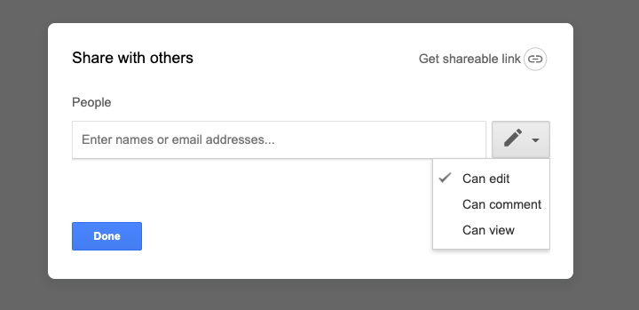

# Writing introductions {#WritingIntroductions}

This chapter covers how to write the first part of an empirical research paper in the field of Psychology. The chapter culminates with *Writing Assignment #1* (Section \@ref(WritingAssignment1)), which will be the first of four writing assignments for this course.

<br/>

## The purpose of the *Introduction* {#PurposeOfTheIntroduction}

The primary purpose of an *Introduction* in a research report is to justify the study that is about to be reported as something either worth publishing (to reviewers before publication) or reading (to the general science community after publication). There are other purposes, but they are secondary. Introductions do this by ultimately identifying a research gap that needs to be filled. This gap is usually identified clearly near the end of the introduction, just before the introduction of the study in the *Method* section.

In line with our earlier statement in Section \@ref(TheGenreOfScience) that writing in the sciences is very standardized (recall the *hourglass* analogy), the overall organizational structure of the *Introduction* is extremely predictable. For original research papers, there really is only one kind of structures to introductions: the general-to-specific pattern.^[There are some other patterns, like the problem-solution pattern, but they are much less common.]

<br/>

## Structure of introductions {#StructureOfIntroductions}

Introductions almost always follow a general-to-specific pattern of development in three parts. In part 1, the author starts off by introducing the topic. In part 2, the author covers a series of topics arranged from general to specific. This narrowing continues until the author reaches part 3, which will consist of minimally a research question, and possibly a research hypothesis.

The vast majority of part 2 (the part that lies between the beginning and end) is a literature review, which explains what researchers have studied before, and crucially (near the end), what they haven't. 

<br/>

```{block2, type="rmdnote", echo=T}
***NOTE***: Although you will not be required in this lab to do a proper literature review (there simply is no time), we will ask you to follow a general-to-specific structure in your *Introduction*. Instead of previous literature, you will use various strategies to write this section. These will be covered in the instructions for the main writing assignment (*Writing Assignment 1* in Section \@ref(WritingAssignment1). Note also that you ***can*** do a literature review if you so choose, but it is not required.
```

<br/>

Below we will provide several real-world examples of these three different components of the *Introduction*.

<br/>

## Examples of introductions {#ExamplesOfIntroductions}

Even though you probably won't be doing a proper literature review for this class, you should see how one normally develops. After all, all the real-world examples of this type of writing will include literature reviews, so there really is no way around this.

<br/>

### Examples of opening sentences {#ExamplesOfOpeningSentencesOfIntroductions}

You were probably told by a teacher back in the day that you should have a good *hook* in your essay in order to get the reader's attention. This is partially true of IMRaD papers, but usually in a more "boring" sort of way.

To illustrate that this is the case, we will randomly select the first five papers that appear in the journal *Frontiers in Psychology*, when we restrict the search to papers that have already been published (on 07 August 2019) and fall under the category *Most viewed*.^[We did exclude one on precognition, due to personally held principles on not covering absurd topics.] They are as follows:

<br/>

Lilienfeld et al. [-@LilienfeldSauvigneLynnCautinLatzmanWaldman2015]:  

>The goal of this article is to promote clear thinking and clear writing among students and teachers of psychological science by curbing terminological misinformation and confusion.

<br/>

Schäfer, Sedlmeier, Städler, and Huron [-@SchaferSedlmeierStadlerHuron2013]:  

>Why do people listen to music?

<br/>

Lakens [-@Lakens2013], which you might want to read yourself since it is relevant to this class:  

>Effect sizes are the most important outcome of empirical studies.

<br/>

Beetz, Uvnäs-Moberg, Julius, and Kotrschal [-@BeetzUvnasmobergJuliusKotrschal2012]:  

>During the last decade it has become more widely accepted that pet ownership and animal assistance in therapy and education may have a multitude of positive effects on humans.

<br/>

And finally, Barker et al. [-@BarkerSemenovMichaelsonProvanSnyderMunakata2014]:  

>Executive functions (EFs) in childhood predict important life outcomes.

<br/>

You can see how psychologists are not using colorful hooks. These are not like newspaper headlines. Instead, these initial sentences are pretty dull, and even sometimes (deliberately) commonplace (e.g., "Why do people listen to music?").

This doesn't seem to be an explicit recommendation on the part of the APA. Our guess that the reason for this is that scientists do not want to come across as salespeople. Doing so would alert wise reviewers (in peer-reviewed research) to the possibility that these authors are attempting to persuade them with strategies (e.g., colorful writing) other than the presenting sheer merit of their work in an objective manner. Another likely reason is that researchers do not typically scan research papers randomly for interesting things to read. Rather, they search in a deliberate manner across large databases for papers related to their own research. Catchy hooks serve no purpose for a paper that is deliberately sought rather than encountered by chance. Instead, such language distracts researchers, and is therefore discouraged in general. 

Nonetheless, you can also see from the examples given above that the authors ***do*** highlight the main topic of the paper. They get right to the point, sometimes directly, sometimes indirectly, but always right to the point.

There are practice exercises on this in section \@ref(PWEFI1OpeningSentence) below.

<br/>

### Examples of the literature review {#ExamplesOfTheLiteratureReview}

<!-- Add note about calling this the "topic funnel" -->

After the opening sentence, most introductions evolve quickly into an extensive literature review. Although we will not be covering the *literature* part of the literature review in this class due to time constraints, we will cover the structure of the review. Specifically, underlying this literature review is almost always progress from general topics to more specific ones. It is a better idea to see this than to keep explaining it.

The following excerpt consists of the first two paragraphs of the *Introduction* in Kaufman, Yaden, Hyde, and Tsukuyama [-@KaufmanYadenHydeTsukayama2019]. For readability, we omitted all references to outside work, and replaced them with ellipses (i.e., ...).

>We all have, within each of us, both a light and a dark side. We all vary, however, in the extent to which we consistently exhibit light vs. dark patterns of thoughts, feelings and behaviors in our daily lives. For over the past 15 years, there has been a flurry of empirical research on a number of “dark traits” that are associated with ethically, morally, and socially aversive beliefs and behaviors... There is an emerging consensus that the “dark core” (or so-called “heart of darkness”) of these dark traits consists of an antagonistic social strategy characterized by high levels of interpersonal manipulation and callous behavior...
>
>While there are some newcomers on the dark trait scene (e.g., sadism and spitefulness), the most studied and validated dark traits are indexed by the now infamous “Dark Triad” of personality: narcissism, Machiavellianism, and subclinical psychopathy... Since the initial paper proposing a Dark Triad of personality..., research on the topic has increased every year, with two thirds of the publications on the Dark Triad appearing in 2014 and 2015 alone... While each of the three members of the Dark Triad have unique features and correlates..., there is enough overlap among these socially aversive personalities that researchers have argued that they “should be studied in concert”...

<br/>

If you had to summarize each of these paragraphs into a single sentence, you would see that the second is more specific than the first. Here are our summaries:

1. Scientists have found that everyone, to varying degrees, feels, thinks, and behaves anti-socially at times according to a basic set of dark traits.  
2. The "Dark Triad" is the most studied subset of these basic, dark traits, and we should continue to study this subset as a single group.  

<br/>

As single phrases, the summary might go as follows: 

A. Universal bad behavior among humans and its core personality correlates  
B. The reliability of the *dark triad* as a subset of this core  

<br/>

Clearly, the latter is more specific than the former in both cases.

<br/>

There is an exercise on writing progressively more specific paragraphs below in section \@ref(PWEFI1GeneralToSpecific).

<br/>

The take-home message from these examples is the organization, not the content. If you look outside this manual for help on writing literature reviews (or just reading literature reviews in journal articles yourself), you will see a lot of tutorials on how to refer to outside sources (e.g., summarizing, paraphrasing, citing). This is because the typical *Introduction* in Psychology consists of summaries of other studies or at least references to them (as in the two passages above). In fact, you can write an introduction that is almost purely summaries of other studies sequenced from most general to most specific. This is quite common actually.

But it is not what you will be doing.

For this class, due to a lack of time, you will not be summarizing outside research in your *Introduction*. Rather, you will use different strategies to write a general-to-specific introduction. These strategies will be covered in the instructions for the first writing assignment for this class, located down below in Section \@ref(WritingAssignment1).

But that will have to wait. The next section is about the very end of the *Introduction*.

<br/>

<!-- add something about the research space -->

### Examples of research questions and hypotheses {#ExamplesOfResearchQuestionsAndHypotheses}

Before you read further, you should review the main textbook [@lsj], Chapter 9, especially Section 9.1, which explains in detail how a ***research*** *hypothesis* and a ***statistical*** *hypothesis* are two different things. In writing up research, we *always* state our research hypothesis (or hypotheses), but only rarely state our statistical hypotheses explicitly. This is because, unlike research hypotheses, statistical hypotheses are always clear ***implicitly*** once you understand how they work. Thus, since research reports are written with other researchers in mind (who understand statistics), there is little reason to write them out in the report.

But again, writing out either a research ***question*** or a research ***hypothesis*** is a requirement in your writing. So that is what we will discuss below.

<br/>

Eventually, the progressive narrowing of topics along the progression of the *Introduction* culminates in a *research space*. This is a gap in the research, some area of inquiry that has not yet been addressed.^[Replication studies (which are despairingly rare) do not create a unique research spaces, *per se*. But such cases could easily be justified as simply a lack of sufficient replication up to that point in time.]

The author typically claims at this point that their research project (to be reported subsequently) will go some way to filling this space. This is then followed by a brief description of the study and a research question or hypothesis.

Below is a three-paragraph example from the end of the *Introduction* of @SteinmayrWeidingerSchwingerSpinath2019 [pp. 3-4], where the different components that make up the end of the introduction are quite explicit. The example here starts at paragraph ten of the introduction on page 3.

>... Taken together, although previous work underlines the important roles of expectancy and value components of motivation for school students’ academic achievement, hitherto, we know little about the relative importance of expectancy components, task values, goals, and achievement motives in different domains when all of them are assessed at the same level of specificity as the achievement criteria (e.g., achievement motives in math → math grades; ability self-concept for school → GPA).
>
>**The Present Research**
>
>The goal of the present study was to examine the relative importance of several of the most important achievement motivation constructs in predicting school students’ achievement. We substantially extend previous work in this field by considering (1) diverse motivational constructs, (2) students’ intelligence and their prior achievement as achievement predictors in one sample, and (3) by assessing all predictors on the same level of specificity as the achievement criteria. Moreover, we investigated the relations in three different domains: school in general, math, and German. Because there is no study that assessed students’ goal orientations and achievement motives besides their ability self-concept and task values on the same level of specificity as the achievement criteria, we could not derive any specific hypotheses on the relative importance of these constructs, but instead investigated the following research question (RQ):
>
>RQ. What is the relative importance of students’ domain-specific ability self-concepts, task values, goal orientations, and achievement motives for their grades in the respective domain when including all of them, students’ intelligence and prior achievement simultaneously in the analytic models?

<br/>

It's not difficult to see that the first paragraph of the excerpt highlights a gap in the research. the second paragraph explains how the current research will fill that gap. And the third paragraph is even explicitly labeled as a research question.

Note that their study was more exploratory than confirmatory, and as a result, it was difficult for them to formulate specific research hypotheses. Instead, they opted for a *research question*.^[Exploratory studies are all well and good (especially if the authors are honest about it), but they do tend to be less preferred by journals than more confirmatory approaches.]

<br/>

Here is an example of a true research hypothesis (coming from a more confirmatory study) from the end of the *Introduction* by @DongLiuJiaLiLi2018 [p. 2]. Note that it is worded as a statement, not a question.

>Based on previous literature..., we hypothesized that the effect of the cues were simultaneously interactive during trust judgments, and the effect of facial expression would be susceptible to social context, while the effect of facial gender would be stable in different settings.

<br/>

This is the kind of research hypothesis you should really aim for, though the research-question approach (as opposed to research-hypothesis approach) might be unavoidable in this lab, given the parameters of the research project we ask you to carry out.

<br/>

Taking a typical example of a research project in this class, a research ***question*** might be as follows:

>We wanted to find out how satisfaction with sleep relates to satisfaction with grades.

<br/>

But a research ***hypothesis*** would look more like the following:

>We predict that satisfaction with sleep will correlate positively with satisfaction with grades.

<br/>

So you can see how research hypotheses are preferred in the world of research, but sometimes, if there are no great grounds for predictions one way or another, a research question will suffice as a minimum requirement. Again, this has nothing to do with statistical hypotheses, which will ***always*** be part of a study involving inferential statistics.

Down below are practice exercises on writing research questions (section \@ref(PWEFI1ResearchQuestion)) and writing research hypotheses (section \@ref(PWEFI1ResearchHypothesis)).

So we just highlighted the three components of the introduction. We will now point you to some outside sources of writing introductions, followed by some practice exercises, and finally, *Writing Assignment #1*.

<br/>

<!-- add something on impact statements -->

## Outside help on introductions {#OutsideHelpOnIntroductions}

@WortmanwunderKiefer2012
<br/>
https://writing.colostate.edu/guides/page.cfm?pageid=1561&guideid=83
<br/>
@Bazerman2010
<br/>
https://writing.colostate.edu/textbooks/informedwriter/chapter15.pdf
<br/>
@Driscoll2011
<br/>
https://wac.colostate.edu/books/writingspaces2/driscoll--introduction-to-primary-research.pdf

<br/>

### Opening sentences {#OutsideHelpOnIntroductionsOpeningSentences}

There really isn't too much to say here other than you need to make a general statement related to your topic. However this is an [entertaining page from Writing Commons on writing hooks](https://youtu.be/Rnq17dyxyu4)

<!-- there should be more here -->

<br/>

## Practice writing exercise 1 {#PWEFI1}

<!-- PWEFI is an acronym for "Practice Writing Assignment for Introductions" -->
 
These practice exercises work best in pairs. Form a pair (or a triad if necessary). Since you will be working in pairs or triads, we will simplify here and just call these *working groups*.^[... but not *lab groups* since that could be confused with the research groups you are in.] Come up with a name for your group (e.g., *SoccerHeads*, or *TheHellaCoolPair*^[The head author of this manual is from Northern California, where *hella* is common.]). 

<br/>

### Setting up your groups and docs {#PWEFI1SettingUpGroupsAndDocs}

You can form these working groups now.

Once in your working groups, ***one*** of you should start a Google Doc in your own Google Drive. Figure \@ref(fig:CreatingANewGoogleDoc) below shows you the two steps you need to take in Google Drive to start a new Google Doc.

<br/>

```{r CreatingANewGoogleDoc, fig.show="hold", out.width="50%", fig.align="left", fig.cap="Creating a new Google Doc.", echo=F}
knitr::include_graphics(c("images/WriteIntros/CreateNewDocumentInGoogleDrive.png", "images/WriteIntros/ChooseGoogleDocOption.png"))
```

<br/>

Title the Google Doc as follows: **[YOUR GROUP NAME] Chapter \@ref(WritingIntroductions) Exercise 1**, where [YOUR GROUP NAME] is replaced by the group name you chose above (excluding the square brackets). So for example: **SoccerHeads Chapter \@ref(WritingIntroductions) Exercises.** Note that there is no *Save* button in Google Docs. It's saved automatically as you go.

Next, ***share*** the document with the other member(s) of your working group (the *share* button is at the upper right in Google Docs). Be sure not only to use their university email ID, but also to grant them editing privileges (i.e., *Can edit*). For good measure, make sure that all members of the group are logged **out** of outside Google accounts (e.g., JohnDoe AT gmail DOT com^[This strange approach to writing email addresses was used in order to avoid prevent the markdown file from inserting it as an actual email address.]). Being logged in to outside Google accounts can cause strange access problems.

Also, critically, share it with your TA, using their university gmail. Also give them *Can edit* privileges.

Do this now. 

See Figure \@ref(fig:CanEditPrivilegesInGoogleDocs) below for what we mean by editing privileges in Google Docs.

<br/>

```{r CanEditPrivilegesInGoogleDocs, fig.cap="Sharing a Google Doc with *Can Edit* privileges.", echo=F, out.width="600px"}

```

<br/>

You are now ready to start the practice writing exercises.

<br/>

<!-- genre-based instruction -->
<!-- joint construction -->
<!-- peer review, across dyads -->
<!-- based on comments, re-write -->
<!-- individual -->
<!-- peer again  -->
<!-- compare back to above sections -->
<!-- re-write -->

### Opening sentence {#PWEFI1OpeningSentence}

These exercises are short. But use them to practice not only how to start a research report, but also how to use appropriate academic language, as well as how to use Google Docs to collaborate and give feedback. Consider these a set of warm-up exercises.

But first, type the following heading in: *Opening Sentence*.

<br/>

#### Write two opening sentences {#PWEFI1OpeningSentenceWriteTwo}

Let's say you're creating a survey about quality of life in student dormitories in the first year of college. Referring back to the opening sentences in section \@ref(ExamplesOfOpeningSentencesOfIntroductions) as guides, work together on two possible opening sentences (on paper) to start the paper on dormitory life.^[Working on a Google Doc together can be a little disconcerting at first since you will see others working on the same electronic document as you. But you will get used to it.]

<br/>

```{block2, type="rmdnote", echo=T}
***NOTE***: This topic is a random suggestion. You can choose any topic to write on as a lab. However, everyone in the lab should agree upon the topic. Avoid uncomfortable topics that might make some students feel both uncomfortable and  unwilling to let everyone know that they are uncomfortable with it. The topic should be quite benign. Your TA will act as a consultant here.
```

<br/>

#### Feedback across working groups {#PWEFI1OpeningSentenceGroupFeedback}

When done writing your sentences, someone from your group should raise their hand. Look for another working group that also has a hand up. Get their university emails and share your Google Doc with them electronically (i.e., *share* it with them in Google Drive). When you add them, add them with commenting (*Can comment*) privileges. They will reciprocate, giving you commenting privileges on theirs. Read that group's sentences (as they will yours). 

Do any of the sentences use overly ornate or "catchy" language? Add comments to their paper, where you deem it worthwhile. Be professional; your TA is monitoring this.

When finished commenting, place a final comment near the end of your counterpart working group's sentences that says, "We are done commenting."

<br/>

#### Class review {#PWEFI1OpeningSentenceClassReview}

Very briefly, discuss this as a class. 

<br/>

#### Revise opening sentences {#PWEFI1OpeningSentenceRevise}

Afterwards, insert comments in your own document where you feel necessary (*Insert* > *Comment*). There's also an icon in the toolbar for this ().^[The Google icons used in this paragraph were provided by Google (https://google.github.io/material-design-icons/) and covered under the [Apache License 2.0](https://www.apache.org/licenses/LICENSE-2.0.html). You are free to re-use these icons in your own work, but do not sell them.] You can also reply to other comments, or *resolve* them (if you, in fact, resolved them). Note that if you resolve it, it will disappear from your screen, but you can always retrieve it by clicking the *Open comment history* at the upper right (; Note: you may have to *Show the menus* by clicking the down arrow  at the upper right to reveal these options). Also, come up with a final, polished sentence that you would be comfortable using later on.

<br/>

### Research question {#PWEFI1ResearchQuestion}

This is actually the third main element of the *Introduction*, but we are practicing it second in the practice exercises since this will make sense of the subsequent block of exercises in Section \@ref(PWEFI1GeneralToSpecific).

<br/>

#### Write up research question {#PWEFI1ResearchQuestionWriteOne}

First, type in the following heading: *Research Question*.

Now, think of a research **question** on the the dormitory topic that you might pose (being careful to distinguish between research *questions* and research *hypotheses*). Use the examples (of research *questions*) provided above in section \@ref(ExamplesOfResearchQuestionsAndHypotheses) as guides. Type in your research question together in your working group.

<br/>

#### Feedback across working groups {#PWEFI1ResearchQuestionWorkingGroupFeedback}

When finished typing in your research question, check in with your counterpart working group. If they're finished too, look at what they wrote. Give them constructive comments. 

For example, evaluate whether it is more specific than the opening sentence; it should be. Is it a research question that others would be interested in? Give them advice as comments on their document.

Show the other group when you are finished by typing in "We are done commenting" close to the end of their writing.

<br/>

#### Class review {#PWEFI1ResearchQuestionClassReview}

Briefly, discuss this as a class. This will take somewhat longer than the last class review since more goes in to formulating a good research question.

<br/>

#### Revise research question {#PWEFI1ResearchQuestionRevise}

After the class review, either insert, or reply-to, or resolve comments in your own document where you feel necessary. Work with your partner(s) to come up with a final, polished version of the research question that you would be comfortable using later on.

<br/>

### Research Hypothesis {#PWEFI1ResearchHypothesis}

This is the an alternative, or second part, to the third and last element of the introduction, but we're doing it before we do the middle of the introduction (below) in order to make that exercise more productive. The hypothesis goes **either** in the exact same place as the research question (if no research question is explicitly stated), **or** right after the research question (when the research question is explicitly stated). Importantly, it is a more specific version of the research question, thus continuing the general-to-specific progression of the *Introduction*.

<br/>

#### Write up research hypothesis {#PWEFI1ResearchHypothesisWriteOne}

First, write in the following heading for this section: *Research Hypothesis*.

For the dormitory topic, together with the other members of your working group, generate a specific hypothesis, but this time using the *hypotheses* in section \@ref(ExamplesOfResearchQuestionsAndHypotheses) as guides (**not** the *research questions*). Type the hypothesis in to this section.

<br/>

#### Feedback across working groups {#PWEFI1ResearchHypothesisWorkingGroupFeedback}

When you are done, check in with your counterpart working-group. If they're finished too, have a look at their research hypothesis. Give them constructive feedback via the commenting function. 

For example, does their hypothesis make specific predictions that could be confirmed or disconfirmed by inferential statistics? Or was their hypothesis still a bit vague in this respect?

Again, indicate when you are finished by typing in a final comment near the end: "We are done commenting."

<br/>

#### Class review {#PWEFI1ResearchHypothesisReview}

Briefly, discuss this as a class. This might take a little bit longer than the class review on research questions since a research hypothesis is more specific.

<br/>

#### Revise research hypothesis {#PWEFI1ResearchHypothesisRevise}

After the class review, either insert, or reply-to, or resolve comments in your own document where you feel necessary. Work with your partner(s) to come up with a final, polished version of the research hypothesis that you would be comfortable using later on.

<br/>

### General-to-specific paragraphs {#PWEFI1GeneralToSpecific}

This practice exercises is a very simplified version of what you would be doing in your own papers (*Writing Assignment #1* in (section \@ref(WritingAssignment1) below). The section between the opening sentence in your paper and the research questions or hypotheses forms the bulk of the writing in that assignment, ultimately occupying about a 1.5 to 2 pages.

However, most introductions in IMRaD reports are much more extensive. A randomly chosen article from cognitive science [@DambacherKliegl2007] looks to have an average-sized *Introduction*. It is about 1,300 words long, which translates to about 5.5 pages (*Times New Roman*, font size 12, double-spaced).

Back to the current in-lab assignment.

<br/>

#### Write an "in-between" paragraph {#PWEFI1GeneralToSpecificWriteParagraph}

First, write the following heading in to your Google Doc: *In-between paragraph*. **Importantly** place this just above the heading that you already have: *Research Question*. You will write below this heading. In the end, all of the paragraphs will be correctly ordered (albeit incomplete when compared to what your full introductions will look like in Assignment #1).

This time, write separately (in different paragraphs; it doesn't matter whether your above or below). Write a 3-4 sentence paragraph that will be more specific than the opening sentence, but more general than both the research question and the research hypothesis. You can talk about a general sentiment that you suspect is shared by students in that environment, or a news story that is relevant, or an anecdote (a story that occurred), or whatever.

<br/>

#### Feedback across working groups {#PWEFI1GeneralToSpecificWorkingGroupFeedback}

When you are finished, check in with your counterpart working group. If they are done, have a look at their document. 
Is each paragraph of 3-4 sentences more specific than the opening sentence, yet broader than the research question/hypothesis? Could you rank each of the paragraphs in terms of their specificity? If so, would they fit together in an introduction that was progressively moving from general to specific? If not, could you modify them to make it so? Provide comments in their document where appropriate.

Yet again, indicate when you are finished by typing in a final comment near the end: "We are done commenting."

<br/>

#### Class review {#PWEFI1GeneralToSpecificReview}

Briefly, discuss this as a class. The TA will ask for a few examples. This will take significantly longer than the previous class reviews since there is much more writing involved.

<br/>

#### Revise in-between paragraphs {#PWEFI1GeneralToSpecificRevise}

Afterwards, either insert, or reply-to, or resolve comments in your own document where you feel necessary. Come up with a final version of your paragraphs. If you were able to determine whether one paragraph was more specific than the other, move the more general one above, and the more specific one below that. Try to formulate a transition sentence between the two, and place it at the end of the upper paragraph.

If you have time, try to come up with a final sentence or two that identifies a gap in your knowledge. Normally, this is a gap **in the research**. But since we are not doing actual literature reviews, you should insert what you believe to be a gap in your **own** knowledge.

This gap won't follow directly from the other paragraphs, though we expect that in your own paper submissions, the gap **will** emerge naturally from the preceding paragraphs.

<br/>

## Practice writing exercise 2 {#PWEFI2}

Here, you can repeat the practice above, but with a topic of your group's choice. However, it would probably be better to do this in one fell swoop. That is, do the following all at once:

- Write an opening statement about the topic  
- Write a couple of more specific paragraphs  
- Write a research question  
- Write a research hypothesis

<br/>

Start a new Google Doc to carry this out. You may want to work with a different counterpart working group as well.

<br/>

Congratulations! You're done with the practice assignments for writing *Introductions*!

Your TA might ask you to download this document as a .pdf onto your lab computer, and then upload the .pdf as your attendance assignment for the day.

<br/>

Moving on, below is your first major writing assignment.

<br/>

## Writing Assignment #1 {#WritingAssignment1}

### General Instructions {#GeneralInstructionsOnWritingAssignment1}

Fair warning: This writing assignment isn't designed exactly like a normal *Introduction*. There just isn't time for each of you to do a literature review on your topics. This is also not the main topic of the class; statistics is. However, your *Introductions* will be written "from the top of your head," (i.e., just including your ideas, musings, anecdotes, hopes, news stories, internet stories, etc.) but organized from general to specific. 

<!-- add section where it specifies that it must be related to the group project. some students didn't understand this in fall 19 -->

It should be about 1.5 to 2 pages long, double-spaced, Times New Roman, 12 font. **Do** give it a title related to the topic, but do **not** include a header called *Introduction*. The introduction in an APA paper doesn't have a header.^[The first main header comes under *Methods*] 

**Also, do NOT put your name on it**. It will be submitted for anonymous peer review through Peerceptiv, and including your name makes it non-anonymous. Your TAs will know exactly who you are since it is submitted electronically, and Peerceptiv indicates who you are (to the TAs and the instructor only).

<br/>

### Specific Instructions {#SpecificInstructionsOnWritingAssignment1}

The canonical *Introduction* proceeds as follows:

1. It begins with a very general, commponplace statement that is clearly related to the topic, but not that informative overall;  

2. It weaves previous research (via summaries) into a narrative that progressively becomes more specific as the paper proceeds (though **you** will be substituting anecdotes, news stories, personal impressions, etc. for the literature review);  

3. Near the end of this narrowing, the introduction identifies a research "gap" (a gap in scientific knowledge in genuine scientific papers; a gap in your own knowledge for this assignment);  

4. It is usually convenient to tail this gap off with the research question at this point (i.e., "What are some interesting questions that emerge from this gap?");  

5. This research question is then followed by a brief description of how the researcher proposes to address these questions, namely, a very short description of the methods of the study (in your case, your survey);  

6. Finally, at the end of the *Introduction* is a prediction or two. These predictions may be *weak* or *strong*. A *weak* prediction is not "weak" in the grading/assessment sense. Rather, *weak* here simply means that the researcher does not necessarly commit to a particular outcome. In fact, a weak prediction may be the most appropriate (and get a higher grade) if in fact you don't have a good reason to make a *strong* prediction. A *strong* prediction is one that commits to variables coming out one way or another in the study. This is usually desirable in the real world of science, but is not really expected of assignments like this one.

<br/>

There is an example of such a paper in **Appendix A**. That paper starts off by broadly introducing the topic of the anti-vaccination movement. It then starts broadly by talking about the historical development of the polio epidemic. It gets a little more specific by describing how the vaccination era brought polio under control in the 1950s and 1960s. This is followed by a specific event in 1998 that seems to have triggered the beginnings of an anti-vaccination movement. Finally, it gets even more specific by pondering what sort of psychology underlies someone who engages in this kind of thinking. A lack of understanding of this kind of conspiracy thinking is identified as a reseach gap, even though that lack of understanding may or may not apply only to the author.^[And this is okay since we are not requiring a bonafide literature review, one of the purposes of which is to assure the reader that the researcher is not trying to *re-invent the wheel*.] This is followed by a brief description of the study that was designed to help fill that gap. The author ends the *Introduction* by making some weak predictions about the outcome of the survey, along with the potential impact or meaning of the study.

The rubric that will be used to evaluate this assignment is in **Appendix B**.

<br/>

```{block2, type="rmdtip", echo=T}
***TIP***: We suggest that you write this as a Google Doc as well (in your university Google account only). The reason is that before you upload it to Peerceptiv (and ultimately Turnitin for the final draft), you can "Name (the) current version." Google Docs allows versioning, which is a way of taking a snapshot of the document along with a timestamp. This is useful for many reasons, among which is when you want to provide evidence to your professor that you actually had something done when you said you did. This is much, much more difficult with documents that are written on individual computers. To create a version, just click *File* > *Version history* > *Name current version*. Give it a name like *YourName_PSYC301_Introduction_RoughDraft*. You can see the process of saving a version below in Figure \@ref(fig:SaveNamedVersionInGoogleDocs)
```

<br/>

```{r SaveNamedVersionInGoogleDocs, fig.show="hold", out.width="50%", fig.align="left", fig.cap="Saving a named version of a Google Doc.", echo=F, out.width="600px"}
knitr::include_graphics(c("images/WriteIntros/VersionHistoryInitiate.png", "images/WriteIntros/VersionHistoryFinish.png"))
```

<br/>

### Uploading the rough draft {#UploadingRoughDraftOfWritingAssignment1}

When you have your rough draft ready to submit, double-check that your name has been removed, and that there is no heading named *Introduction*. The blind peer review in Peerceptiv doesn't really work if you reveal your identity.

On the day that you are supposed to upload your draft to Peerceptiv (via eCampus only!!), you must do so by 6:00 am. It doesn't matter if your lab starts later in the day; everyone uploads by 6:00 am.^[The reasons for this are twofold: First, it is really difficult and complicated to create separate assignments for each section of each lab. Second, we don't want you to submit at the last minute, only to drive in to campus at high speed because you are late.] If you submit it late, but within the first 24 hours of the initial due date/time, then you will get half credit for the assignment. That is, if you would normally have gotten 24 points out of 30, you would get 12 points out of 30. This is called a *grace period* by Peerceptiv.

After the grace period, there is almost no chance that your assignment will get reviewed by one of your peers. As a result, Peerceptiv won't let you upload it. However, you still need to submit it (It's a requirement of *W* courses at Texas A&M that you submit a rough and final draft). This means that you will need to email it to your TA, who will then give you direct feedback (but again, your maximum score would be 15/30). However, for **each** additional 24-hour period after the initial grace-period expires, you lose 10% off your **final** draft. And even if you are down to 0 points, you still must submit a final draft for feedback before you can submit a final draft. Again, these are rules for the *W* courses at Texas A&M.

<br/>

```{block2, type="rmdnote", echo=T}
**NOTE**: You may be able to submit your paper directly from Google Docs by copying the unique URL for the document (e.g., https://docs.google.com/document/d/15ApECWiuvoWgQysyQaKKWfNierx-yULT5udKVXdIj9B), but we are not quite certain. If that does not work, you can always download the Google Doc as a .pdf (*File* > *Download* > *PDF Document (.pdf)*), then upload it to Peerceptiv from your computer. That will *always* work.
```

<br/>

```{block2, type="rmdtip", echo=T}
***TIP***: Do you want a painless point for extra credit? Well just take a screenshot of the Peerceptiv screen after you submit your document. The screen will say *Document Submitted*. (see page 12 of the [.pdf linked here](https://www.peerceptiv.com/wp-content/uploads/2019/01/User-Guide_rev-Jan-15-2019.pdf) for what this should look like.). Upload this to the appropriate extra-credit assignment in eCampus.
```

<br/>

The [Peerceptiv Student User Videos](https://peerceptiv.zendesk.com/hc/en-us/articles/360026540253-Peerceptiv-Student-User-Videos) have several links to how-to videos. You should watch all of them (there are only four currently). The third one, *Login and Submission* is the most important when you have finished your rough draft.

<br/>

After you have uploaded your draft, further instructions for Peerceptiv will be given to you in class.

<br/>

### Uploading the final draft 

Your final draft must be an honest attempt to revise your rough draft according to feedback from your peers in Peerceptiv, as well as possibly that of your TA (TAs will spot-review certain peer reviews to make sure the peer reviews proceed accurately and honestly).

On the day that the final draft is due (a week after the rough draft), the same time deadline is in effect: 6 am. However, instead of uploading to Peerceptiv, you will be uploading the document to Turnitin. For the final draft, late penalties accrue at a rate of 10% per day. This is **on top** of any penalties from the rough draft.

It is easier to "upload" ("sideload"? Cloud-to-cloud) a Google Doc into Turnitin as it is explicitly one of the three upload options on the upload screen:

- Choose from this computer  
- Choose from Dropbox  
- **Choose from Google Drive**

<br/>

```{block2, type="rmdwarning", echo=T}
***WARNING***: For Google Drive, there may be a screen that asks you whether you grant permission to Turnitin to interact with your Google Drive. Please note that if that happens (it probably will), that IS ***NOT*** THE UPLOAD PROCESS. Only ***AFTER*** you give Turnitin permission to interact with your Google account, can you ***THEN*** upload.
```

<br/>

```{block2, type="rmdtip", echo=T}
***TIP***: The 1 point of extra credit also applies to Turnitin for the final draft. However, Turnitin goes about things differently. They send you an email when you have successfully submitted. So what **you** need to do this time is either take a screenshot of the email, or (to save space) save your email as a .pdf. But each email software program is a little bit different in how it goes about printing/exporting/saving files to .pdf format. We will have to leave this to you if you want to do this. But it is an important skill if you do not already know how to do it.
```

<br/>