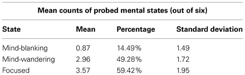
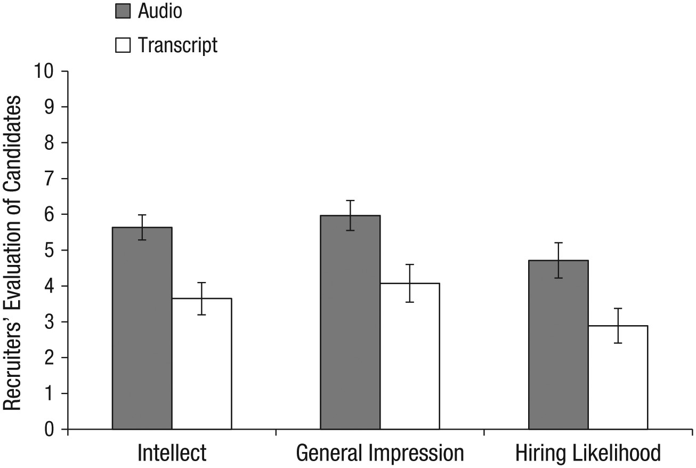
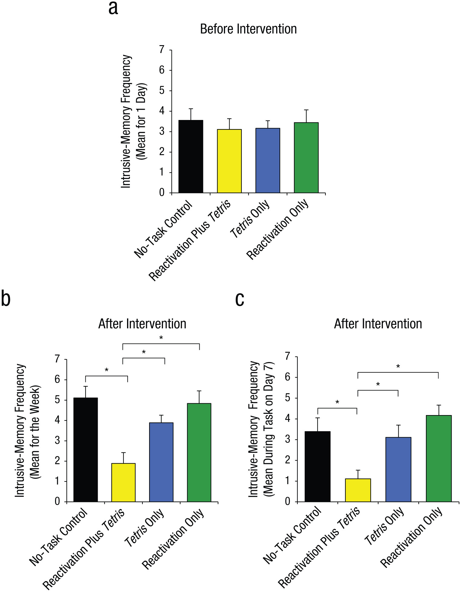
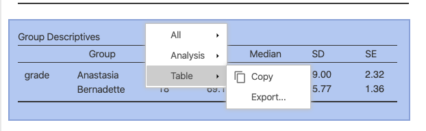
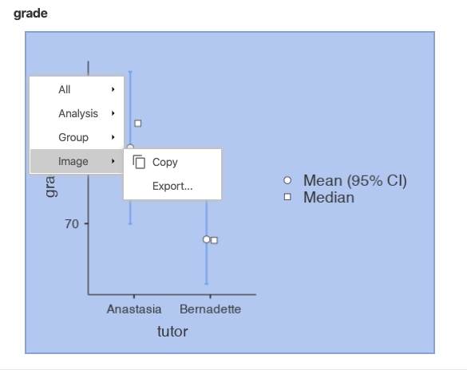

# Writing *Results* sections {#WritingResultsSections}

<!-- This chapter is divided into  -->

## A note on Writing Assignments 3 and 4 {#NoteOnWritingAssignments3And4}

First, it is important to realize that the *Results* and *Discussion* sections are separate sections of an IMRaD paper. However, unlike Writing Assignments #1 and #2, Writing Assignment #3 (detailed in section \@ref(WritingAssignment3) at the end of Chapter \@ref(WritingDiscussionSections)) requires you to write both a *Results* and a *Discussion*  section. In short, Assignment #3 will subtitled *Study 1*, and will include the *Results* and *Discussion*  sections for your *t*-test and your ANOVA analyses (and Assignment #4 in turn, subtitled "Study 2," will consist of your correlation and regression analyses). This will be explained further in Chapter \@ref(WritingDiscussionSections).

For now, the current chapter will focus on how *Results* sections are structured. It will end with some links to outside resources on writing these sections, as well as a series of writing activities.

<br/>

In short, the *Results* section simply reports the results of whatever analysis you carried out. Much, much, much more often than not in Psychology, this means reporting your statistical analyses.

<br/>

## Structure of *Results* sections {#StructureOfResultsSections}

To be honest, the structure of a *Results* section is minimal, pretty much only providing a separate paragraph or two for each relevant analysis. That said, the section is also very formulaic (meaning that most *Results* sections go about conveying statistics in very, very similar fashion)

The principle requirements in writing this section are five-fold:

1. Creating a separate paragraph or two for each analysis;
2. Reporting the statistics in appropriate APA format;
3. Properly formatting tables;
4. Properly formatting figures; and
5. Making sure that the primary text is in plain English

To add to point #5 above, it would be incorrect to think that one could write out a *Results* section in bullet-point format. That is not allowed. The *Results* section contains legitimate paragraphs, with real sentences. However, embedded in those sentences (often between commas or  within parentheses or square brackets) are statistical results as numbers (e.g., "$t(32)=4.25,p<.05$"). But a reader should be able to cross out the numbers and read the sentences as normal, human sentences.

We will exemplify this below with one of the three passages.

<br/>

### Examples of *Results* sections {#ExamplesOfResultsSections}

#### Example 1 {#ExamplesOfResultsSections1}

Here is an example from Experiment 1 of Ward and Wegner [-@WardWegner2013], who were looking at *mind-blanking*, or "an extreme decoupling of perception and attention, one in which attention fails to bring any stimuli into conscious awareness" (p. 1). Experiment 1 here is about establishing mind-blanking as a mental state distinct from other mental states, namely: mind-wandering and being focused. Participants were probed with questions about their mental states at random while reading from the first six chapters of Leo Tolstoy's *War and Peace*.

<br/>

>Results
Participants reported experiencing all three mental states: mind-blanking, mind-wandering, and being focused, with a mean response time for each mental state probe of 3.14 s. Means and standard deviations for each mental state are presented in Table 1 [represented in figure \@ref(fig:WardWegner2013Table1) below]. Each mean represents the number of times each mental state was reported out of a total of 6 possible probes. Each percentage represents the percentage of mental state probes that were responded to with an answer of “yes,” indicating that the identified mental state was being experienced immediately prior to the appearance of the probe. Each probe asked about only one mental state at a time; thus, any answer of “no” could indicate that the participant was experiencing either of the two other mental states (e.g., a participant answering “no” to a focus-probe could have been either mind-blanking or mind-wandering).
>
>
>
>

```{r WardWegner2013Table1, fig.cap="(Not a figure, but rather a table) Table 1. Means and SDs of conscious states in Experiment 1, from @WardWegner2013", echo=F, out.width="600px"}



```

>
>We also tested for correlations between mental states. Mind-wandering was negatively correlated with being focused, $r_{(23)}=-0.71,p<0.001$. Mind-blanking, on the other hand, was uncorrelated with both mind-wandering, $r_{(23)}=-0.06, p=0.80$, and being focused, $r_{(23)}=-0.26, p=0.24$.

<br/>

Irrespective of the quality of this study, there are a few key points worth noting. First, notice that this *Results* section begins with a summary of certain general statistics that may or may not impinge on other findings. For instance, in the case here, if the researchers here *had*, in fact, found that there were differences in the average time it took for participants to evaluate each probe type, then that might suggest that the the different mental states are not equally available for introspection, or that that the various states do not have clear definitional boundaries. 

Second, key statistics are summarized in either a table or a figure. These help the reader organize information quickly. In the past when graphical options were either difficult to produce (mid 20th century and before), or limited in sophistication (latter half of the 20th century), tables were resorted to quite commonly. However, good graphics are now fairly easy to use. That, coupled with the fact that humans are better at taking information in visually, one should first resort to a graph if possible, and only resort to a table when the information does not lend itself to graphing in either complexity (i.e., too simple or too complex) or importance. I suppose here, the researchers thought that the information was too simple to waste time producing a graph.

(Also note that tables and figures have specific formatting guidelines that are not transparently adhered to in the *Frontiers in...* collection of journals. See section \@ref(FormattingTablesInAPA) below for more information on formatting tables in APA, and section \@ref(FormattingFiguresInAPA) for figures.)

Third, note that there are statistical tests reported. This is a *sine qua non* of the *Results* section if there there are statistics in your study. Consult section \@ref(ReportingInferentialStatistics) for more details here on how to report particular statistics.

Fourth, notice how all statistics are reported between or after commas. The reason for this is that the reader should be able to mentally "delete" the reporting of statistics and read the rest as prose. Commas are an option here, as well as parentheses (which are a more explicit convention to achieve this effect). Parentheses are used more explicitly to this effect in the examples below (sections \@ref(ExamplesOfResultsSections2) and \@ref(ExamplesOfResultsSections3)).

One interesting, but quite minor thing about the report above is that the researchers subscripted the degrees of freedom (e.g., "$r_{(23)}=-0.26, p=0.24$". This is a convention that you see often outside of Psychology (apparently among statisticians themselves), and sometimes within Psychology.^[In fact, there is an internally consistent logic behind subscripting degrees of freedom. In linear regression, it is common to use subscripts (even in Psychology) to refer to specific instances of whatever the subscript is attached to. For instance $X_{1_i}$ would be the score on variable $X_1$ (as opposed to variable $X_2$) for participant *i* (e.g., "Joe"). The degrees of freedom work the same way, in that they refer to specific distributions as defined by the degrees of freedom. So in the same way, $t_{32}$ or $t_{(32)}$ would refer to a *t*-distribution as defined by 32 degrees of freedom, which is different from, say, a *t*-distribution as defined by 20 degrees of freedom. Nonetheless, the APA, for whatever reason, does not explicitly advocate subscripting degrees of freedom. Credit goes to Brenton Wiernik at the University of South Florida for pointing out the notational consistency of reporting degrees of freedom as subscripts.] But technically, it is not APA format as it is not specifically mentioned in the APA style guide at all. See the examples below, where the researchers do not subscript the degrees of freedom. In sum, do not subscript your degrees of freedom, unless your professor (or a journal) asks you to. Also note that this is about the most minor quibble one might bring up in APA formatting.

<br/>

#### Example 2 {#ExamplesOfResultsSections2}

Below is the *Results* section from a study by Schroeder and Epley [-@SchroederEpley2015] that looked at how fake and real job recruiters evaluate written vs. spoken job-application pitches. That is, fake job applicants gave spoken and written pitches on why they should be hired These pitches were then evaluated by either fake or real recruiters as to their quality. No single recruiter received both the spoken and written pitches from the same candidate. Below, we provide the *Results* section of the final study (*Experiment 4*) with 39 professional recruiters.

<br/>

>Results
>
>The pattern of evaluations by professional recruiters replicated the pattern observed in Experiments 1 through 3b (see Fig. 7). In particular, the recruiters believed that the job candidates had greater intellect -- were more competent, thoughtful, and intelligent -- when they listened to pitches (*M* = 5.63, *SD* = 1.61) than when they read pitches (*M* = 3.65, *SD* = 1.91), *t*(37)^[Recall that there were 39 professional recruiters. So the degrees of freedom for a n independent-samples *t*-test is N-2, or 37 in this case] = 3.53, *p* < .01, 95% CI of the difference = [0.85, 3.13], *d* = 1.16. The recruiters also formed more positive impressions of the candidates—rated them as more likeable and had a more positive and less negative impression of them -- when they listened to pitches (*M* = 5.97, *SD* = 1.92) than when they read pitches (*M* = 4.07, *SD* = 2.23), *t*(37) = 2.85, *p* < .01, 95% CI of the difference = [0.55, 3.24], *d* = 0.94. Finally, they also reported being more likely to hire the candidates when they listened to pitches (*M* = 4.71, *SD* = 2.26) than when they read the same pitches (*M* = 2.89, *SD* = 2.06), *t*(37) = 2.62, *p* < .01, 95% CI of the difference = [0.41, 3.24], *d* = 0.86.
>
>
>
>

```{r SchroederEpley2015Figure7, fig.cap="Fig. 7. Results from Experiment 4: professional recruiters’ ratings of the job candidates’ intellect, their general impressions of the candidates, and their likelihood of hiring the candidates. Results are shown separately for the audio and transcript conditions. Error bars represent ±1 SEM.", echo=F, out.width="600px"}



```

>...
>
>Finally, the recruiters did not spend significantly different amounts of time engaging with the stimuli in the audio condition (*M* = 173.85s, *SD* = 145.97) and the transcript condition (*M* = 137.86s, *SD* = 197.49), *t*(37) = 0.65, *p* = .52, *d* = 0.21. Although 6 recruiters did not complete the memory test, those who did complete it wrote similar amounts about the candidates in the audio condition (*M* = 53.94 words, *SD* = 30.06) and the transcript condition (*M* = 58.67 words, *SD* = 15.07), *t*(31) = −0.55, *p* = .59, *d* = 0.20.

<br/>

There are a couple of interesting characteristics of this particular write-up that should be noted. First, as noted previously, one should present statistics in either parentheses or between commas. This is so that the prose that remains is readable as normal text. Below, we present the first paragraph in the example above with the parentheticals and comma-offset sections replaced with ellipses [i.e., ...]):

<br/>

>The pattern of evaluations by professional recruiters replicated the pattern observed in Experiments 1 through 3b... In particular, the recruiters believed that the job candidates had greater intellect -- were more competent, thoughtful, and intelligent -- when they listened to pitches... than when they read pitches.... The recruiters also formed more positive impressions of the candidates—rated them as more likeable and had a more positive and less negative impression of them -- when they listened to pitches... than when they read pitches... Finally, they also reported being more likely to hire the candidates when they listened to pitches... than when they read the same pitches...

<br/>

Second, notice that the figure in this case isn't allowed to "speak for itself." More broadly, the rule is that no table or figure can be "dropped in cold" to a manuscript. If you insert a table or a figure into a manuscript, that table or figure is mentioned nearby in the main text (as well as described, preferably). 

Finally, notice that they report statistics pretty comprehensively. Namely, not only do they report the descriptive statistics in parentheses:

<br/>

>(*M* = 5.63, *SD* = 1.61)

<br/>

but then in addition to the test statistics itself, they also report the 95% confidence intervals (between square brackets) and effect sizes:

<br/>

>*t*(37) = 3.53, *p* < .01, 95% CI of the difference = [0.85, 3.13], *d* = 1.16.

<br/>

#### Example 3 {#ExamplesOfResultsSections3}

<!-- This example from speech-language therapy might be better: @article{vonKosstorkildsenHitchinsMyhrumWie2019 -->

The following (abridged) *Results* section comes from Experiment 2 in James et al. [-@JamesBonsallHoppittTunbridgeGeddesMiltonHolmes2015]. In this study the researchers tested the promise of a therapy in which potentially intrusive memories of a experimental traumatic event (a 12-minute traumatic film) are (hopefully) blocked by means of pairing reactivation of those traumatic memories (of the film) with a visuo-spatial task (Tetris) that requires a relatively heavy allocation of working memory. There were two groups initially: an experimental group that watched the films and received the therapy, and a control group that was identical but did not receive the therapy. Each group was tested in several ways on intrusive-memory activation, once at 24 hours after the film viewing, and once at 7 days after the film viewing.

After having found that the therapy worked in this limited context, the researchers wanted to to test whether either the intrusive-memory-activation task or the Tetris task had independent effects on the outcomes. Thus, they added two more groups: a Tetris-only group, and a reactivating-only group. They compared the four groups using One-Way ANOVAs.

They reported their results as follows:

<br/>

>Results
>
>Groups were matched at baseline for age and gender, as well as self-report-questionnaire scores for trait anxiety, depression, and trauma history. Mood deterioration during film viewing, postfilm distress, attention to the film, demand ratings, and diary compliance were also matched (see the Supplemental Material).
>
>***Intrusive memories preintervention***
>
>First, prior to the intervention (over the first 24 hr after viewing the film: Day 0), we confirmed that the four groups experienced a similar number of intrusive memories, *F*(3, 68) = 0.16, *p* = .92 (Fig. 4a).
>
>
>

```{r JamesEtAl2015Fig4, fig.cap="Fig. 4. Results from Experiment 2: mean number of intrusive memories recorded in the diary during the first 24 hr following viewing of the experimental trauma film (i.e., preintervention; a), mean number of intrusive memories recorded in the diary across totaled over the 7-day period after the intervention (b), and mean score on the intrusion-provocation task on Day 7 (c). In each graph, results are shown separately for the four groups. Asterisks indicate that results for the reactivation-plus-Tetris group were significantly different from results for the other three groups (*p < .01). Error bars represent +1 SEM.", echo=F, out.width="600px"}



```
>
>***Intrusive memories postintervention***
>
>Second, and critically, for the 7-day diary postintervention, there was a significant difference between groups in overall intrusion frequency in daily life, *F*(3, 68) = 3.80, *p* = .01, $\eta_p^2=.14$. (Fig. 4b). Planned comparisons demonstrated that relative to the no-task control group, only those in the reactivation-plus-Tetris group, *t*(22.63) = 2.99, *p* = .007, *d* = 1.00, experienced significantly fewer intrusive memories; this finding replicated Experiment 1. Critically, as predicted by reconsolidation theory, the reactivation-plus-Tetris group had significantly fewer intrusive memories than the Tetris-only group, *t*(27.96) = 2.52, *p* = .02, *d* = 0.84, as well as the reactivation-only group, *t*(25.68) = 3.32, *p* = .003, *d* = 1.11. Further, there were no significant differences between the no-task control group and the reactivation-only group, *t*(32.23) = 0.22, *p* = .83, or between the no-task control group and the Tetris-only group, *t*(30.03) = 1.01, *p* = .32.
>
>Third, a similar pattern was seen on a convergent measure—the frequency of IPT intrusions on Day 7 in the laboratory, for which there was an overall significant difference between groups, *F*(3, 68) = 5.57, *p* = .002, $\eta_p^2=.20$ (Fig. 4c; Day 7). Planned comparisons showed that there was a significantly lower intrusion score in the reactivation-plus-Tetris group compared with the no-task control group, *t*(68) = 2.92, *p* = .005, *d* = 0.97, which replicated the results of Experiment 1. Critically, in line with reconsolidation theory, the reactivation-plus-Tetris group also differed significantly from both the reactivation-only group, *t*(68) = 3.92, *p* < .001, *d* = 1.31, and the Tetris-only group, *t*(68) = 2.56, *p* = .01, *d* = 0.85. Further, the reactivation-only group, *t*(68) = 1.00, *p* = .32, and the Tetris-only group, *t*(68) = 0.36, *p* = .72, did not differ significantly from the no-task control group.

<br/><br>

The example above was chosen because is it is an example of a One-Way ANOVA (an *F*-test) with planned comparisons as follow-ups (*t*-tests). This corresponds to what you will be doing with your ANOVA (the nominal, predictor variable with more than two levels). Notice that some of the degrees of freedom have decimal values [e.g., *t*(22.63)...]. This has to do with choosing *t*-tests that corrected for heterogeneous variance (e.g., *Welch's t*). 

It is also a good example of how figures are discussed in text. Figure 4 in the original (reproduced here as figure \@ref(fig:JamesEtAl2015Fig4)) comes in three parts. Each part (4a, 4b, and 4c) is described in the text immediately surrounding the figure.

<!-- ADD A BIT HERE ABOUT HOW THIS EXAMPLE IS THE ONLY ONE THAT USES SMALL PHRASES TO REFER BACK TO THE INTRODUCTION -->

<br/><br>

#### Examples from earlier {#ExamplesFromEarlierChapters}

Earlier in this lab manual in the chapters on specific statistical tests, we provided you with examples of *Results* sections.

For the independent-samples *t*-test, you can see examples in sections \@ref(IndSamplesDrHarpoReporting) and \@ref(IndSamplesConspiracyReporting) in Chapter \@ref(ComparingTwoMeans).

<br/><br>

<!-- For the One-Way ANOVAS, you can see -->
<!-- ***MORE MORE MORE*** -->

<br/><br>

#### Example in Appendix E {#ExampleInAppendixE}

Finally, there is an example in Appendix E of a *Results* section, written with the same data as the *Method* section in Appendix C [@FettigLopezfuentesVillarreal2019].

<br/>

### Formatting tables in APA {#FormattingTablesInAPA}

For now, you do not need to know that much about formatting tables properly in APA. The only reason for this is that the output from jamovi is close enough. 

<br/>

To export the table from jamovi, right- or control-click the table itself, and choose *Table* > *Copy*. Then you can paste it right in to your word processor. See figure \@ref(fig:HowToCopyTableFromJamovi) below.

```{r HowToCopyTableFromJamovi, fig.cap="How to copy a table from jamovi.", echo=F, out.width="600px"}

```

<br/>

However, the table caption is not available as part of the pasted object (nor as part of the image, if you choose *Table* > *Export*, an option that is less word-processor friendly).

To insert a caption in MS Word, select the table, then choose *Insert* > *Caption*. Table captions go above the table, so make sure that the *Position* option is set to *Above selected item*. None of this seems to work with the online version of Office 365.

To do this in Google Docs, you need to install an Add-on called *Captionizer*. Once you install it, you put the cursor somewhere inside the table, go to *Add-ons* > *Captionizer* > *Tables* > *Number this table*. The caption will appear at the top where it should be.

<br/>

Give the table a caption title that describes well what the table contains. In the table embedded in figure \@ref(fig:WardWegner2013Table1) above, the caption is quite simple, but adequate and to the point: 

>*Table 1. Means and SDs of conscious states in Experiment 1*.

<br/><br>

### Formatting figures in APA {#FormattingFiguresInAPA}

As was the case with tables, there is no reason to go in to too much detail about APA formatting guidelines for figures; the output from jamovi is sufficient.

<br/>

One difference is that it seems it's better to export (to file) an image of the figures in jamovi rather than copy-and-pasting them. One then inserts an image into the word processor. 

To do this, simply right- or control-click the image in jamovi and select *image* > *export*. Find a file location on your computer that you will remember, and select *.png* for a file format, and give the file a name (e.g., *image1.png*). This stage is depicted in Figure \@ref(fig:HowToExportImageFromJamovi) below.


```{r HowToExportImageFromJamovi, fig.cap="How to export an image from jamovi.", echo=F, out.width="600px"}

```

<br/>

In MS Word, choose *Insert* > *Pictures* > *Picture from File*. Then find the location where you saved the image and double-click it.

In Google Docs, choose *Insert* > *Image* > *Upload from computer*, and double-click the image.

<br/>

For captioning, nearly the same procedures apply as above.

In MS Word, select the image and choose *Insert* > *Caption*. But this time make sure that the *Position* option is set to ***Below*** *selected item* instead of *Above*.

In Google Docs, select the image and go to *Add-ons* > *Captionizer* > *Images* > *Number selected image*. The default is to put the caption below the image. However, it is also the default to label it *image 1*. You can either write over the word *Image* with *Figure*, or change the default. To change the default, choose *Add-ons* > *Captionizer* > *Options*. Under *Options for Images*, change *Image* to *Figure*. Then click *Make default* at the bottom.

<br/>

As far as the title of the caption is concerned, the same simple rule applies: simple and to the point.

Figure 7 from Schroeder and Epley [-@SchroederEpley2015], reproduced as Figure \@ref(fig:SchroederEpley2015Figure7) above, is more complex than the much simpler table (figure \@ref(fig:WardWegner2013Table1)) from Ward and Wegner [-@WardWegner2013]:

>Fig. 7. Results from Experiment 4: professional recruiters’ ratings of the job candidates’ intellect, their general impressions of the candidates, and their likelihood of hiring the candidates. Results are shown separately for the audio and transcript conditions. Error bars represent ±1 SEM.

However, it abides by the same rules. All of the critical information in the figures is described in as concise a manner as possible.

The same is true in the caption from Figure 4 (embedded in Figure \@ref(fig:JamesEtAl2015Fig4)) from James et al. [-@JamesBonsallHoppittTunbridgeGeddesMiltonHolmes2015]. This is an even more complex caption. However, we will not reproduce it here. The reader can refer back to it.

<br/><br>

<!-- ## Outside help on *Results* sections {#OutsideHelpOnResultsSections} -->


<!-- ### Formatting tables {#OutsideHelpOnTablesInResultsSections} -->

<!-- ### Formatting figures {#OutsideHelpOnFiguresInResultsSections} -->


<br/><br>

## Practice writing exercise {#PWEFR} 
<!-- PWEFR stands for "Practice Writing Exercise For Results" -->

This writing exercise relates to part of Writing Assignment #3 in your lab (see section \@ref(WritingAssignment3)), but just the first part: Results.

<br/>

### Forming groups {#PWEFRFormingGroups}

Form working dyads (or triads) like you did for the first two exercises of this type. Work with someone from your own research group again, if you can. 

<br/>

Come up with a unique nickname for your group and open a Google Doc as you did before, but give it the following name: **[YOUR GROUP NICKNAME] Chapter \@ref(WritingResultsSections) Exercise**. Then share the document with the other members of your working group, as well as your TA.

Shortly, you will be ready to start the practice writing exercises for the *Results* section. But first, you are going to need to get some statistical output ready (in order to have something to write about).

<br/>

### Get the statistical output ready {#PWEFRGetStatisticalOutputReady}

The first thing you will need to do here is to get your data analyzed in jamovi.

#### Get your data {#PWEFRGetYourData}

Recall that you have two nominal predictors in for your data: one with two levels and one with three or more levels (preferably not more than 5 levels). The former will be used for the independent-samples *t*-test, and the latter for the One-Way ANOVA.

In this analysis, your outcome variable for both the *t*-test and the One-Way ANOVA is the composite variable that you calculated. If you were not able to calculate a composite variable, then you can use one of your three outcome variables for this writing exercise.

<br/>

#### Do your analyses {#PWEFRDoYourAnalyses}

Conduct an independent-samples *t*-test as spelled out in section \@ref(DoingIndSamplesTTest) in Chapter \@ref(ComparingTwoMeans).

Then conduct a One-Way ANOVA as illustrated in section \@ref(OnewayAnovaClinicalTrialData) of Chapter \@ref(ComparingSeveralMeans).

For the *t*-test, use Welch's option that does **not** assume equal variances. In the ANOVA, test for equality of variances using Levene's test.

Also be sure to include post-hoc tests for the ANOVA. Use the Holm correction.

Finally, include not only descriptives, but also plots for both the *t*-test and the ANOVA. jamovi will give you dot plots with error bars. These are superior to bar charts (even with error bars) since they take up far less unused space.

Note that the limits of the "error bars" on the dot plot that jamovi provides actually form the confidence interval. It is common to refer to these as *error bars*. However, that term is slightly misleading since the bars themselves usually do not directly represent the standard error (which is sort of implied by the term), but rather the 95% confidence interval, which for $N>30$ is approximately $\overline{X} \pm 1.96 \times SE_{mean}$.^[jamovi will be more exact than 1.96, of course. The formula that jamovi uses is actually based on the *t*-distribution, not the *z*-distribution $\overline{X} \pm t_{95\%}(N-2) \times SE_{mean}$]

<br/>

#### Save your figures {#PWEFRSaveYourFigures}

If you just created graphs, then you should save the output of those graphs to your hard drive. See section \@ref(FormattingFiguresInAPA) for instructions on how to do this. Make sure you not only give thee files transparent names (e.g., *TTestFigure.png* and *ANOVAFigure.png*), but that you also remember where you put them.

<br/>

#### Insert figures into document {#PWEFRInsertFiguresIntoDoc}

Next, insert those images into your Google Doc. Leave a few blank at the top, then insert the figure for the *t*-test. Then leave a few more blank lines, and insert the figure for the ANOVA. 

You can refer back to section \@ref(FormattingFiguresInAPA) for instructions on how to do this, as well as how to insert a caption by installing the *Captionizer* Add-on in Google Docs.

If a figure is not appropriate for some reason, you can insert a table instead using the instructions laid out in section \@ref(FormattingTablesInAPA).

<br/>

### Writing {#PWEFRWriting}

The rest of this writing exercise is actually about writing. But before you begin, type in the *Results* header at the top.

<br/>

#### Simple description of the figures or tables {#PWEFRDescriptionOfTheFiguresOrTables}

Simply describe what the figure seems to be showing without referring to means, standard deviations, or any of the statistical tests. Be sure to mention the figures/tables by number when describing your data.

In other words, generate a simple story from your data. Here are some suggestions:

- Report the results from the perspective of your participants (e.g., *The participants reported having...*, *They showed a preference for...*, etc.)
- Use *hedged* wording here (e.g., *seems as if*, *looks like*, etc.) 

- Alternatively, let your variables "do the talking." (this would be like examples 1 and 3 above in sections \@ref(ExamplesOfResultsSections1) and \@ref(ExamplesOfResultsSections3), respectively. Here, you would use wording such as *The mean for group X on sleep satisfaction was lower than...*, or *As predicted, sleep satisfaction seemed to be different across the three groups, with group X showing...*.

- Generally speaking though, readers find it more engaging when participants *do* things than when *data* "do" things. In this case, you can really exploit more active verbs like *reported*, *showed*, *rated*, *indicated*, *felt*, *preferred*, *experienced*, etc.

The goal is to end up with a skeleton of the *Results* section that looks something like our comment at the end of example 2 above (section \@ref(ExamplesOfResultsSections2)), the one where we inserted ellipses (...) instead of the statistics.

You should begin with the two-level factor (the *t*-test) and then finish with the factor with 3+ levels (the ANOVA). 

You should refer to the figures/tables by their type and number, and those tables/figures should have captions (above tables, but below figures). If there are two figures, the figure for the *t*-test will be *Figure 1* and the figure for the ANOVA will be *Figure 2*. The same is true if there are two tables. However, if there is one table and one figure, then you will have *Table 1* and *Figure 1*. Tables and figures are enumerated separately in APA manuscripts.

Everything you write here should be in formal, but simple English. Do not try anything fancy here. The *Results* sections already tends to be densely packed with information (which we will proceed to do later), but this plain-English part should be quite simple to read.

<br/>

##### Feedback across working groups {#PWEFRDescriptionOfTheFiguresOrTablesFeedbackAcrossGroups}

As before, someone from your group should raise their hand, and look for another working group that also has a hand up (this should *not* be another pair from within your research group unless that is the only option). Get their university emails and share your Google Doc with them electronically (i.e., *share* it with them in Google Drive). When you add them, add them with commenting (*Can comment*) privileges. They will reciprocate, giving you commenting privileges on theirs. Read that group's passages (as they will yours). 

Give the other groups helpful comments with respect to how well their prose describes their figures (or tables) and how easy it is to directly connect their description with the exact figures/tables (i.e., do they explicitly refer to the figures/tables in their prose?). 

When finished commenting, place a final comment near the end of your counterpart working group's sentences that says, "We are done commenting."

<br/>

##### Class review {#PWEFRDescriptionOfTheFiguresOrTablesDiscussAsClass}

As a class, discuss any issues that came up that might benefit from an expert's perspective (that of your TA).

<br/>

##### Revise {#PWEFRDescriptionOfTheFiguresOrTablesRevise}

Take about 10 minutes to revise (as a pair) any issues that came up either in your counterpart-group's comments or during class discussion.

<br/>

#### Add statistical results {#PWEFRAddStatisticalResults}

Now, you are going to add some descriptive and inferential statistics to the results you have already written.

<br/>

##### Add descriptive statistics {#PWEFRAddDescriptiveStatistics}

Begin by providing the descriptive statistics, namely, means and standard deviations for each level of each variable. For example:

> Men showed a greater preference for violent video games (*M* = 4.5, *SD* = 1.2, *n* = 13) than women (*M* = 2.5, *SD* = .96, *n* = 21).

Do this for every level of every nominal variable that you have. The reporting pattern will not vary here, by the way, only the statistics themselves. More specifically, you can choose among several ways to report these descriptive statistics, but you need to stick to that form throughout. Finally, note that the symbols *M*, *SD*, and *n* are all in italics.

Example 2 above (section \@ref(ExamplesOfResultsSections2)) above illustrates the points above.

<br/>

##### Add inferential statistics {#PWEFRAddInferentialStatistics}

Next, after each mention of any kind of comparison across groups, insert a statement as to whether the difference was statistically significant along with the the 95% confidence interval (itself expressed between square brackets), and the effect size (Cohen's *d*). Here's are two examples, one statistically significant; the other not:

> This difference, tested with an independent-samples *t*-test, was statistically significant, *t*(32) = 3.5, *p* < .001, 95% CI of the difference = [0.95, 2.53], *d* = .55.

or

> However, an independent-samples *t*-test showed that this difference was not statistically significant, *t*(32) = 1.56, *p* > .05, 95% CI of the difference = [-1.5, 1.34], *d* = .55.

<br/>

Notice the use of "However" at the beginning. This was used since the main text had probably highlighted a difference in means (there almost always is).

Thus, 

>Men reported having more reservations about same-sex marriage. However, an independent-samples *t*-test showed that this difference was not statistically significant, *t*(32) = 1.56, *p* > .05, 95% CI of the difference = [-1.5, 1.34], *d* = .55.

<br/>

You can also report these within parentheses or brackets, though using square brackets seems to be better since degrees of freedom are already reported in parentheses:^[You can see how enclosing everything in regular parentheses is slightly more confusing with the degrees of freedom **also** in parentheses: "This difference was statistically significant using an independent-samples *t*-test (*t*(32) = 3.5, *p* < .001)."]

> Analyzed using an independent-samples *t*-test, this difference was statistically significant [*t*(32) = 3.5, *p* < .001, 95% CI of the difference = [0.95, 2.53], *d* = .55].

<br/>

Thus, our suggestion is that you use either commas or square brackets to set off the inferential statistics.

<br/>

The sentence structure can get redundant here, so try to mix the language up a bit. For example:

> The comparison between these groups was statistically significant [*t*(32) = 3.5, *p* < .001, 95% CI of the difference = [0.95, 2.53], *d* = .55] using an independent-samples *t*-test.

or

> This difference, compared using an independent-samples *t*-test, reached statistical significance [*t*(32) = 3.5, *p* < .001, 95% CI of the difference = [0.95, 2.53], *d* = .55].

or

> An independent-samples *t*-test showed that these two groups were statistically significant [*t*(32) = 3.5, 95% CI of the difference = [0.95, 2.53], *p* < .001, *d* = .55].

etc.

<br/>

Below is an example for an *F*-test (where the effect size is captured by a statistic called $\eta^2$, pronounced "eta squared," where *eta* rhymes perfectly with *beta*):

> A One-Way ANOVA showed that there were one or more significant differences across the four groups [*F*(2,45) = 6.53, *p* = .02, $\eta^2=.79$]

<br/>

```{block2, type="rmdnote", echo=T}
**NOTE**: It may be difficult for you to find a way to type in $\eta^2$. Therefore, feel free to just write "eta-squared," as in the following: [*F*(2,45) = 6.53, *p* = .02, eta-squared = .79]. But if you want to try, in Google Docs go to *Insert* > *Special characters*, then type in *eta* into the search box. Choose the eta that doesn't have diacritics attached to it, and click it. it should show up in your document. Then type a 2 adjacent to right of the eta symbol, highlight the 2, and go to *Format* > *Text* > *Superscript*.
```

<br/>

Speaking of *F*-tests, if you have a significant *F*-test, you will want to follow up any One-Way ANOVAs with subsequent post-hoc comparisons. This is covered in section 13.5 of Navarro and Foxcroft [-@lsj]. 

Below is an example of this:

> A One-Way ANOVA showed that there were one or more significant differences across the four groups [*Welch's F*(2, 45) = 6.53, *p* = .02]. Post-hoc comparisons (using the Games-Howell correction for unequal variances) showed that freshmen were significantly more passionate about volunteer work than all the class levels above them (all *p*s > .05 for all three comparisons), but that sophomores, juniors, and seniors were not different from each other at all (all three *p*s > .05).

<br/>

However, if you do **not** have a significant *F*-test, then there is no need (or justification, for that matter) to run any multiple comparisons between the levels of that variable.

<br/>

Example 3 above (section \@ref(ExamplesOfResultsSections3), after the figure) provides an example of multiple comparisons after the omnibus,^[You will often hear the term *omnibus* ANOVA. This term simply emphasizes the fact that the *F*-test itself is blind to which differences among its 3+ means rendered it significant overall. To figure out which ones made it significant, you need post-hoc, or planned, multiple comparisons. Another interesting etymological note is that the bus you might ride to and from school in was traditionally an abbreviation of *omnibus*, a vehicle for carrying lots of people. The analogy here is that the omnibus *F*-test carries within it a number of possible comparisons, as a bus holds a number of passengers.] One-Way ANOVA. Note however, that the researchers there used something called *planned comparisons*, which are different from *post-hoc* comparisons. Navarro and Foxcroft [-@lsj] cover this in a footnote in section 13.5.2, and then more extensively in Chapter 14, section 14.9.

However, that write-up is still a good model.

<br/>

##### Feedback across working groups {#PWEFRAddStatisticalResultsFeedbackAcrossGroups}

Work with your counterpart group again. 

But this time, give the other group feedback on details, namely:

- Did they report the descriptive statistics in the right way? (see section \@ref(ReportingDescriptiveStatistics))
- Did they report their inferential statistics in the right way? (see section \@ref(ReportingInferentialStatistics))
- Is the text of the *Results* section readable as plain-English sentences if you delete (mentally) the statistics?
  - That is, are all the statistics set off by commas, parentheses, or square brackets?

When finished commenting, place a final comment near the end of your counterpart working group's sentences that says, "We are done commenting."

<br/>

##### Class review {#PWEFRAddStatisticalResultsDiscussAsClass}

As a class, discuss any issues that came up that might benefit from an your TA's perspective.

<br/>

##### Revise {#PWEFRAddStatisticalResultsRevise}

As a group, take about 10 minutes to fix any issues that came up either via the comments from your counterpart group, or during class discussion.

<!-- genre-based instruction -->
<!-- joint construction -->
<!-- peer review, across dyads -->
<!-- based on comments, re-write -->
<!-- individual -->
<!-- peer again  -->
<!-- compare back to above sections -->
<!-- re-write -->


