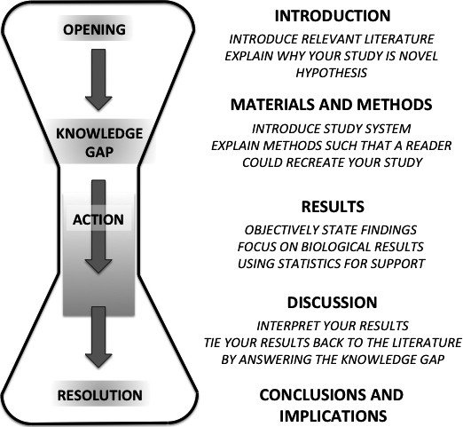

# Writing *General Discussion* sections {#WritingGeneralDiscussionSections}

First, a note on Writing Assignment #4.

<br/>

<!-- Check to see if I included the part about including stats in the Design & Analysis part of Method -->

## A note on Writing Assignment 4 {#NoteOnWritingAssignments4}

As noted in section \@ref(NoteOnWritingAssignments3And4), Writing Assignments #3 and #4 are different from the first two in that they encompass more than one section of the IMRaD style paper. That is, they both contain *Results* and *Discussion* sections, whereas Assignments #1 and #2 only contained on section each (the *Introduction* and the *Method*, respectively).

However, there is also a difference between Writing Assignments #3 and #4. Specifically, the latter contains both less and more than the former.

Although the *Results* sections are about equal across the two assignments,^[There is merely a switch to correlation and simple regression from the independent samples *t*-test and the One Way ANOVA] the *Discussion* section for Writing Assignment #4 will be shorter. This is because there is no subsequent study to transition to since the next section is the *General Discussion*. Therefore, the *Discussion* section that follows the *Results* section in Assignment #4 consists of simply the *review* (see section ) and the *comparison*, with neither a *transition* nor a *preview* (see the Appendix with the *Discussion* rubric for reference here). 

And as just implied, Assignment #4 has an extra section, the *General Discussion*. These differences between Assignments #3 and #4 were also mentioned at the end of section \@ref(StructureOfMultipleStudyDiscussionSections). But it is time to turn our attention to writing the *General Discussion*.

<br/>

First, we talk about the general organizational pattern of the *General Discussion* within the broader context of the paper. Then we provide some guidance as to what kind of content to put in this final section of the IMRaD paper.

<br/>

## Structure of *General Discussion* sections {#StructureOfGeneralDiscussionSections}

In an abstract, organizational sense, the *General Discussion* is the mirror image of the *Introduction.* Recall that the *Introduction* progresses from general to specific (see section \@ref(StructureOfIntroductions)). Simply put, the *General Discussion* proceeds from specific to general.^[This specific-to-general progression is also true of *Discussion* (not *General Discussion*) sections in single-study papers]

For what it's worth, this completes what is informally referred to as the "hourglass" structure of IMRaD papers. This was mentioned earlier in section \@ref(OrganizationOfAPAResearchReports). We will reproduce the figure from the end of that section here as Figure \@ref(fig:HourglassImageFromTurbekEtAl2016b) below:

<br/>

```{r HourglassImageFromTurbekEtAl2016b, fig.cap='The hourglass shape of the IMRaD research paper (from Figure 1, p. 420, of @TurbekChockDonahueHavrillaOliverioPolutchkoShoemakerVimerati2016.', echo=F, out.width="600px"}

```

<br/>

If the paper consists of multiple studies, then the *General Discussion* forms the bottom of the hourglass (not the *Discussion*).^[The image is simplified, and more relevant to a single-study paper.] 
Figure \@ref(fig:HourglassImageFromTurbekEtAl2016b) also suggests that there is a separate *Conclusion* section (or here, *Conclusions and Implications*). You may see this as well in some papers, but it is optional, and perhaps only merited in very long papers as a strategy to help readers organize very long stretches of prose. In our case, we will include any conclusions and/or implications within the *General Discussion*.

<br/>

## Contents of *General Discussion* sections {#ContentsOfGeneralDiscussionSections}

Overall, the *General Discussion* is going to evaluate the entire paper, focusing mostly on what was predicted to happen versus what did happen, the extent to which the current study answers the questions it set out to answer, and what might come next in the research process. But the first part of the *General Discussion* is quite predictably a synthesis.

<br/>

### Synthesizing {#ContentsOfGeneralDiscussionSectionsSynthesizing}

The synthesis is comprised of a summary followed by an comparison of the overall predictions of the paper against those findings. However, example 2 below (section \@ref(ContentsOfGeneralDiscussionSectionsSynthesizingExample2)) bucks this trend across studies to some degree.

Sometimes, these are reversed, where the predictions of the paper (from the *Introduction* are) summarized, then compared against the findings from the studies.

<br/>

#### Summarizing {#ContentsOfGeneralDiscussionSectionsSummarizing}

Whatever may lie ahead in the *General Discussion*,^[or *Discussion* in a single-study paper] one thing will always come somewher near the beginning of this section: Namely, the authors will summarize the previous *Results* and *Discussion* sections into one summary, usually in one somewhat concise paragraph.

Thus, there may be a bit of repetition here from earlier sections (though not word-by-word, which would be awkward). The point of this is to prepare the reader for a comparison of the overall predictions of the study against the overall findings.

<br/>

#### Comparing {#ContentsOfGeneralDiscussionSectionsComparing}

Roughly parallel to what is written in individual *Discussion* sections in a multiple-study IMRaD paper, the summary of findings is followed by a comparison of those findings against what was predicted (usually indicated at the end of the *Introduction*). Except this time, it's the findings overall that are compared against the predictions overall. In other words, the *General Discussion* addresses the "big picture," whereas the individual *Discussion* sections had addressed the "smaller picture" of that particular portion of the study.

Note that often, however, a review of the predictions will be followed by a summary the findings. The choice of order here is stylistic, and up to the author(s).

The question the researchers usually have to ask themselves at this point is as follows:

<br/>

>Did our findings in general support, in general, the main prediction(s) we made at the outset?

<br/>

There is much more for the researcher to discuss. However, we will temporarily stop here in order to illustrate the writing concepts described above.

<br/>

```{block2, type="rmdnote", echo=T}
**NOTE**: Note that due to [publication bias](https://en.wikipedia.org/wiki/Publication_bias) in science (and particularly in psychological science), most of the primary research articles that you read will have *Discussion* or *General Discussion* sections that confirm the predictions of the study in one way or another. This is not really as it should be since well-conducted studies that find null effects ought also be commonly published.

But they are not.

An unfortunate, mild^[There are much, much more severe side effects of this, like the *file-drawer effect* and replication failures. But we do not dicuss these here as they would be tangential.] side effect of this state of the field is that there are few examples to turn to when writing up *General Discussion* sections where there is a failure to find what was predicted (e.g., failures to reject the null hypothesis). That said, there are plenty of such sections that discuss findings that were *surprising* relative to the predictions made (e.g., the researchers thought the outcome would be significant in one direction, but it was significant in the other direction).
```

<br/>

Since there are so many possibilities when it comes to content for the *General Discussion*, we will provide examples as we go. That is, for each content possibility in the *General Discussion*, we will provide an immediate example or two.

<br/>

##### Example 1 {#ContentsOfGeneralDiscussionSectionsSynthesizingExample1}

We begin with the summary of findings. Below is that very section from the paper we cited earlier by Guekes, Gaskell, and Zwitserlood [-@GeukesGaskellZwitserlood2015] in Chapter \@ref(WritingDiscussionSections), first mentioned in section \@ref(ExampleOfDicsussionSections2). We included the final paragraph of the *Discussion* of *Experiment 3* to illustrate that unlike the *Discussion* sections of *Experiment 1* and *Experiment 2*, there is no transition this time since the subsequent section (after *Experiment 3*) is the *General Discussion*. No transition is required. We also added boldface to highlight where the summaries of each of the summaries begins.

<br/>

>**Experiment 3**...
>
>*Materials and Method*...
>
>*Results*...
>
>*Discussion*...
>
>...Results show that in Group 1, the Stroop effect was not present in the block that was administered immediately after learning but only on the second day. In Group 2, with both Stroop blocks on the second day, the effect was present already in the first Stroop block. These results lead to two important conclusions: First, the novel word effect can be observed even when no German color words are included in the Stroop blocks. Second, the differing results between the two groups indicate that, in the absence of the native-language words, the effect arises only after a period that allows memory consolidation.
>
>**General Discussion**
>
>In three experiments, we tested the semantic links of novel color words that had been associated with color concepts through lexical association with native language (German) color words. To assess which conditions are necessary for semantic learning, the learning and test phases were realized such that they minimized semantic processing. **In Experiment 1**, novel words were associated with native-language color words until almost perfect discrimination performance. They were then entered into the Stroop task together with German color words. We observed substantial novel word Stroop effects both immediately after learning and 1 day later. A significant three-way interaction indicated that the reduction of the effect from Day 1 to Day 2 in the German words contrasted significantly with a simultaneous increase of the effect in the novel words, thus suggesting an influence of memory consolidation. **In Experiment 2**, learning intensity was considerably reduced and neutral control stimuli were added to the Stroop blocks. We again observed substantial Stroop-congruency effects directly after learning and 24 h later. A detailed analysis including the control condition showed that interference made up a significant portion of the novel-word Stroop effect. **In Experiment 3**, we repeated Experiment 1, but crucially removed the German words from the Stroop task, so that the novel words were now tested without any L1 context from the learning phase. The novel-word Stroop effect was now not observed immediately after learning, but only 24 h later. Results from a second group that had a different time course of Stroop blocks showed that the delayed emergence of the effect in Group 1 is not due to a simple build-up or training effect from one block to the next. Rather, it must be related to the temporal distance between learning and test--that is, to memory consolidation.

<br/>

In the example above (directly under *General Discussion*), even if you don't understand exactly what was said, you can see the summaries of each of the experiments: *In Experiment 1*..., *In Experiment 2*..., and *In Experiment 3*... Importantly, note that the very last sentence of this paragraph contains a strong hint regarding how they are going to interpret their findings in light of their predictions, which were at least partly focused on memory consolidation. 

From the *Introduction*:

>A further aim of our study was to test whether the establishment and availability of such semantic links depends on an opportunity for memory consolidation. [@GeukesGaskellZwitserlood2015, p. 3]

<br/>

Recall that we claimed that authors will always compare their overall findings against their overall expectations. And this is indeed the case here. But it doesn't happen immediately in this case. Rather, the authors here address a couple of qualifications to their findings. This takes place over the two paragraph subsequent to the first one in the *General Discussion*. However, in the fourth paragraph of the *General Discussion* [@GeukesGaskellZwitserlood2015, p. 13], the authors do return to the main issue of memory consolidation, and  how overall results relate.

<br/>

>Perhaps the most interesting aspect of our results is that the opportunity for consolidation affected Stroop performance, and that this consolidation effect was further moderated by context, that is, by the presence of German color word trials in the Stroop task. This impact of memory consolidation on the integration of novel words fits with data from word-learning studies on the learning of word forms only... or on the acquisition of form and meaning... The data from Experiment 3 in particular demonstrate that memory consolidation is relevant for associating novel words with meaning, not only for integrating novel word forms into lexical networks. This is consistent with the [Complementary Learning Systems] account of word-learning....

<br/>

##### Example 2 {#ContentsOfGeneralDiscussionSectionsSynthesizingExample2}

The second example we use [@SchneiderCarbon2017], excerpted below, was also referenced earlier in Chapter \@ref(WritingDiscussionSections), section \@ref(ExampleOfDicsussionSections3). So you are already familiar with it. It was the study about selfies.

But before we provide you with this example, it is important to understand something about this paper. Specifically, it was not meant to evaluate theory or compare models, but rather to provide information about a phenomenon that, hitherto, little was known about.

Here are couple of excerpts from earlier in the paper that point to this characteristic of the research. The first is from the very first two sentences of the paper:

<br/>

>Taking selfies is now becoming a standard human habit. However, as a social phenomenon, research is still in the fledgling stage and the scientific framework is sparse. [@SchneiderCarbon2017, p. 1]

<br/>

The second is from later in the *Introduction*:

>The aim of the present study was to provide fundamental information what impact a change of perspective has on a variety of higher-order variables that are relevant for expressing personality and for mating. To the authors' knowledge, there is no systematic investigation of how viewing perspective affects the perception of higher cognitive variables (such as personality variables) on basis of faces, especially for more selfie-style conditions. [@SchneiderCarbon2017, p. 3]

<br/>

This fundamental approach in the paper sets up how the *General Discussion* is structured. In essence, the results of the experiments (and not their implications for theory) ***are*** the fundamental objects of study to be covered in the *General Discussion*.

With this understanding in mind, it is instructive to read the few two sentences of the *General Discussion* in Schneider and Carbon [-@SchneiderCarbon2017]:

<br/>

>**General Discussion**
>
>The main goal of this study was to reveal the impact of perspective on persons depicted via selfies. In two studies, we revealed clear effects of perspective on higher cognitive processes (namely the perception of person-related variables on the basis of facial depictions)... [@SchneiderCarbon2017, p.12]

<br/>

This summary is obviously much shorter than the equivalent summary (summarized first above) by Geukes, Gaskell, and Zwitserlood [-@GeukesGaskellZwitserlood2015]. But it is actually not the end of the summary. But what directly follows these first two sentences is instead a reminder to the reader of the nature of this study as phenomenon description instead of theory evaluation. It reads like a miniaturized version of the *Introduction*:

<br/>

>... Research on selfies has revealed that persons who shoot selfies want to express their mood, their personality and even their lifestyle via selfies, so they try to optimize this information by intuitively adapting the camera position... Previous work documented that in cases of classical portraits there were a lot of compositional suggestions and artificial rules which were applied to gain pictures of high appeal... However, scientific research is quite far from achieving consistent results about the meaningfulness and effects of these rules in general... In contrast, regarding the social phenomenon of taking selfies, one may find only a small number of suggestions, often in a relative unsystematic way, for taking the “best” selfie... and some photographic rules like the “high-angle shot”... However, there is little knowledge about whether and how exactly these aspects may have an impact on the perception of a given face. Moreover, there are some hints toward a general deviation from known photographic principles in selfies... and the impact of a typical selfie-style perspective has yet to be investigated. [@SchneiderCarbon2017, p.12]

<br/>

The next two paragraphs do just that: They summarize the findings overall. In order not to belabor the point, below we quote only the first part of the each paragraph:

<br/>

>Accordingly, our results suggest that perspective has a significant impact on the perception of the beholder, especially for attractiveness, helpfulness, sympathy, intelligence, and associated body weight: Study 1 investigated the impact of...  [@SchneiderCarbon2017, p.12]

<br/>

And here is the opening to the second such paragraph:

<br/>

>In Study 2, we investigated the effect of more selfie-style viewing perspectives (typical combination of camera rotation and camera pitch) and only found... [@SchneiderCarbon2017, p.12]

<br/>

The paragraph that follows is about how the authors interpreted their findings, but without much reference to theory since there isn't much in the first place (with ordering elements boldfaced):

<br/>

>How can the complex data pattern be interpreted? **First of all:** Perspective has a significant impact on the perception of higher-cognitive variables (such as person-related variables) on the basis of faces. **Secondly:** Effects of perspective were in contrast to some past findings... suggesting that selfies constitute an own class of pictorial presentations of a person... Furthermore, our results highlight the importance of the visibility of certain features in facial stimuli, per se (e.g., regarding the perception of dominance, our results underline the visibility of the neck as an important cue to masculinity and dominance). **Thirdly:** Interestingly, for most of the variables effects were significant for the 30° head turn (left and right hemiface) images, but not the 15° head turn images. We have at least two reasons for this discrepancy in mind: On the one hand, the 15° rotation is just too similar to the frontal condition, at least to detect any differences from the frontal view by means of the given experimental setting with limited sample sizes which were only capable of revealing effect sizes of small to medium effect sizes but not, for example, very small effects. On the other hand, referring to research papers which systematically varied other kinds of rotation, e.g., planar rotations, we also observed a certain range of rotations for which essential variables did not change... **Fourthly:** In contrast to the common standpoint that we are able to make meaningful suggestions about “how to take the perfect selfie,” our results indicate that we are a long way from having any clear references. [@SchneiderCarbon2017, p.12]

<br/>

Again, the important inference from the example presented above is that although it is the norm to provide predictions in the *Introduction* and then to compare one's findings against those predictions in the *General Discussion* (or *Discussion*), that is not true in all cases. In this study, there were few predictions to begin with since the phenomenon is generally under-investigated so far. So the study was quite exploratory. 

The authors were very explicit (and deliberately repetitive, it seems) about this, making sure both to inform and remind the reader that this was the case. This makes sense. The default expectation in research is that any new research be based on past research. If it is not, it will need extra justification before reviewers will consider it for publication. 

<br/>

### Clarifying {#ContentsOfGeneralDiscussionSectionsClarifying}

For the purposes of this manual, we will label the next section of the *General Discussion* the *Clarification*. It turns out to be difficult to find a single English word that describes this section well.

The word *clarification* should be interpreted liberally here to apply to various approaches the researchers might take in their write-up. This is a very diverse and usually challenging section to write as it serves as a guide to the reader as to how to interpret the findings, both within the current study and in the broader context of research. In other words, "How should I interpret what I just read, and how and what exactly does it ultimately contribute to the world of science?"

<br/>

```{block2, type="rmdnote", echo=T}
**NOTE**: Importantly, note that the scope of the discussion broadens here. This fits with the description made earlier (section \@ref(StructureOfGeneralDiscussionSections)) of the *General Discussion* proceeding from specific to general, like the bottom of an hourglass.
```

<br/>

Content that might be included here encompasses (but is not limited to) the following, depending on the exact outcomes of the study:

- Helping the reader interpret results  
  - *Were any of the studies more informative than the others?*  
  - *Or do they sum up as equal contributors to a general finding?*  
  - *Did any of them qualify the interpretation of any of the others?*  

- Application to previous research  
  - *Do the studies support previous research? If so, do they support a particular theory/model over others?*  
  - *Do they fail to support any previous research? If so, do they point to new directions in theory/modeling?*  
  - *Do other studies in the literature corroborate your findings? If so, which and how?*  
  - *Do other studies contradict your findings? If so, how? Is there a resolution?*  
  - *Were there any surprises? What does this mean for the field?*

- Limitations  
  - *Are there important limitations to the study that the reader should be aware of?*^[It is scientifically unwise to over-sell your study in terms of its soundness.]  
  - *If so, how generally does the current study apply to previous research?*
  - *Can these limitations be overcome in future studies? If so, how?*  

<br/>

As just noted above, there is a great deal of diversity in terms of how the researchers go about clarifying aspects of their overall study.

We will provide merely two examples so as not to make this section stretch on indefinitely. They are from the the now familiar studies by both Geukes, Gaskell, and Zwitserlood [-@GeukesGaskellZwitserlood2015] and Schneider and Carbon [-@SchneiderCarbon2017].

<br/>

#### Example 1 {#ContentsOfGeneralDiscussionSectionsClarifyingExample1}

Immediately after paragraph four, reproduced above, Geukes, Gaskell, and Zwitserlood [-@GeukesGaskellZwitserlood2015] tie in their results to previous research, along with corroboration from another study. The beginnings of each of these threads is boldfaced so that they are easier to identify.

<br/>

>**Finally, how can our immediate but context-dependent effect be reconciled with what is known about neural correlates of learning and retrieval?** Figure 6 [not shown here] illustrates how learning context may moderate effects of memory consolidation in semantic word learning. We assume that the employed training regime results in an immediate hippocampal association between the German (L1) word and its novel counterpart. This novel association means that the L1 word provides a mediating link in memory between the novel (L2) word and the color semantics. So, even prior to an opportunity for consolidation (provided by sleep, in our case), Stroop effects can be obtained, as long as the L1 word is present in the Stroop task as a contextual cue that “primes” or temporarily strengthens this indirect association. **In fact, there is direct evidence for the involvement of the hippocampus during associative learning of the type implemented here: Breitenstein et al. (2005) used event-related fMRI while participants learned novel words in the scanner.** Correlated amplitude changes between the hippocampus and neocortical regions were observed, in line with the overall evidence for the importance of the hippocampus in the formation of arbitrary associations in memory....

<br/>

Clearly, the first part of the passage ties in the research to previous research, and the second part identifies another experiment that showed similar results, thereby corroborating the current findings, and strengthening the current researchers' case.

<br/>

#### Example 2 {#ContentsOfGeneralDiscussionSectionsClarifyingExample2}

Returning to the *General Discussion* from Schneider and Carbon [-@SchneiderCarbon2017], the authors note some limitations of the study after conveying their general findings. The first weakness is followed by a call for future research. whereas the second weakness is followed by a rebuttal to that self-identified weakness. The major turning points of the paragraph are boldfaced.

<br/>

>**We would also like to mention some limitations of this study**: Past research revealed that direct vs. averted gazes have a direct impact on the perception of a given face... More precisely,... an averted gaze has a negative effect on the perception of attractiveness. However, the effect of the combination of averted head plus direct gaze vs. frontal face plus averted gaze across different viewing perspectives on the perception of higher cognitive variables (like those we used) has not yet been investigated. **In this study, we did not investigate such a combination**, which would incidentally be very much in accord with some Renaissance portraits like La Gioconda by Leonardo da Vinci.... Future research should address such further settings to enrich the existing knowledge base on selfies. **Another weakness** of the present study is that we neither could control the actual size of the presented face on the monitor nor the actual viewing distance. Moreover, we must expect that display color, contrast and brightness were not at the same level across all participants. This might affect the perception of a face dramatically. **However**, the fact that we could replicate the height-weight illusion... makes it conjecturable that other effects were relative stable. Similarly, other studies... used relatively unstandardized images that could not be controlled along those variables, and though [sic] revealed consistent results.

<br/>

### Concluding {#ContentsOfGeneralDiscussionSectionsConcluding}

The last part of the *General Discussion* (indeed, the last part of the entire paper) is usually either a nod to possible future directions of research, or a quick summary of the overall import of the study, or both. Whatever it turns out to be, it will be the broadest statement yet about the study, thereby completing the hourglass shape of the paper.

We get an example of each from each of our continuing examples.

<br/>

#### Example 1 {#ContentsOfGeneralDiscussionSectionsConcludingExample1}

Geukes, Gaskell, and Zwitserlood [-@GeukesGaskellZwitserlood2015] provide an example of a *General Discussion* that ends with a statement as to the overall meaning of the study for the field. In this case, there is no direct statement with respect to future directions, except to suggest that "careful experimental manipulations" are in order for future studies investigating such phenomena.

<br/>

>In sum, our results stress that careful experimental manipulations are necessary to fully capture the intricate learning and memory processes involved in the acquisition of novel meaningful words. The brain recruits multiple resources to immediately associate newly learned material with well-established knowledge. The context in which learning takes place, and the particular aspects that the learning situation provides or focuses upon, are important for the immediacy of effects that indicate the integration of newly learned words. A stable and strong integration in existing semantic networks, diagnosed by automatic effects in suitable tasks, seems to require consolidation, to become less dependent on contextual cues from the learning situation. [@GeukesGaskellZwitserlood2015]

<br/>

#### Example 2 {#ContentsOfGeneralDiscussionSectionsConcludingExample2}

Schneider and Carbon [-@SchneiderCarbon2017] provide a slightly different ending to their paper. In it, they place their study in the context of possible future research.

>Despite all the back draws [sic] you always face with standardized and systematically varied material, such experimental material can test already small effects which might be tested with more ecologically valid material in the field later on. We hope that our study contributes to the understanding on how perspective can change the assessment of higher cognitive variables. This will help to sensitize selfie-ists how [sic] powerful the use of perspective might be in conveying their inner states.

<br/>

### Example in Appendix I {#ExampleInAppendixI}

There is an example in Appendix I of a *General Discussion*. It is actually a write-up of the results from Fettig, López Fuentes, and Villarreal [-@FettigLopezfuentesVillarreal2019]. For  the sake of completeness, it also includes *Study 2*, which is then followed by the *General Discussion*. Thus, this example mirrors what is expected for Writing Assignment #4.

<br/>

## Practice writing exercise {#PWEFGD}
<!-- PWEFGD is an acronym for "Practice Writing Assignment for General Discussion" -->

This writing exercise relates to part of Writing Assignment #4 in your lab (see section \@ref(WritingAssignment4)), but mostly just the last part: the *General Discussion*.

<br/>

### Getting ready {#PWEFGDGettingReady}

#### Form groups {#PWEFGDFormingGroups}

Form working dyads (or triads) like you did for prior exercises of this type. Work with someone from your own research group again, if you can. 

<br/>

Come up with a unique nickname for your group and open a Google Doc as you did before, but give it the following name: **[YOUR GROUP NICKNAME] Chapter  \@ref(WritingGeneralDiscussionSections) Exercise**. Then share the document with the other members of your working group, as well as your TA.

<br/>

#### Establish *counter*-findings {#PWEFGDEstablishFindingsCounterToYourActualFindings}

Like last time (section \@ref(PWEFDEstablishFindingsCounterToYourActualFindings)), review your current findings (either the statistical output in jamovi, or any current working draft you have of your *Results* section).

Again, for these exercises, you will write as if you obtained exactly the opposite results that you did in your actual analysis. If you **did** get statistically significant results on your correlation, pretend as if you had **not**. Likewise, you you did **not** get statistically significant results on your correlation, pretend as if you actually **did**. The same goes for your simple regression, but treat the correlation and regression separately.

After doing this, some of you may need to discuss null findings. You will need to be creative here.

<br/>

#### Create Study 2 outline {#PWEFGDCreateOutlineOfResultsAndDiscussionForStudy2}

You obviously have not yet written anything for Study 2 yet. Nor should you for this writing exercise, which is about the *General Discussion*.

Instead, come up with an outline, with your partner(s), concerning roughly what your *Results* and *Discussion* **would** say if you had to write it all out.

You will use this to help you write a *General Discussion* below.

<br/>

### Writing {#PWEFGDWriting}

The writing you will in the sections that follow is about the *General Discussion*. So write that header at the top of your document, centered.

<br/>

#### Part 1: Synthesizing

In this section, you are going to review what you expected to find among all your variables, and compare your *counter*-findings with these predictions. The focus here is on the variables as a set, not so much the invidual vairables (which you did already in previous *Discussion* sections). That is, try to discuss them as a group.

We have provided examples above of this (sections \@ref(ContentsOfGeneralDiscussionSectionsSynthesizingExample1) and \@ref(ContentsOfGeneralDiscussionSectionsSynthesizingExample2)). But these are both a bit long-winded. It might be better to consult Appendix I for an example here. Note that the example there is based off the *actual* results, which failed to reject the null hypothesis in all cases.

That said, the beginning of any *General Discussion* or *Discussion* section in almost any IMRaD paper will have an example here.

<br/>

##### Feedback across working groups {#PWEFGDSynthesizingFeedbackAcrossGroups}

Just like before, find a group from another research study and give them *Can comment* access to your document (as well as giving your TA *Can Edit* privileges).

Give the other group helpful comments on how they referred back to their original hypotheses (you will need to just trust them on this), as well as how well they tie in their current results into either support or lack of support for the original predictions. Is everything clear? Does anything look ambiguous? Do they do a good job of treating all their results as a set? Or are they treating them like they might have in the individual *Discussion* sections that preceded the *General Discussion*?

Like before, when you are done commenting, place a final comment near the end of the document you are commenting on that says, "We are done commenting."

<br/>

##### Class review {#PWEFGDSynthesizingClassReview}

Get together as a class and discuss any issues that came up that might benefit from your TA's perspective.

<br/>

##### Revise {#PWEFGDSynthesizingRevise}

Take about 10 minutes to revise (as a pair) any issues that came up either in the comments of your counterpart group or during class discussion that you just finished.

<br/>

#### Part 2: Clarifying

This section may be challenging to write. We provided examples above in sections \@ref(ContentsOfGeneralDiscussionSectionsClarifyingExample1) and \@ref(ContentsOfGeneralDiscussionSectionsClarifyingExample2). Chances are that the latter of the two examples (falling under "limitations" of the study) is going to be more appropriate since the surveys in this class are so quickly put together that there are bound to be weaknesses here that you noticed after sending the survey out.

In fact, it would not surprise us at all if this were by far the dominant clarification strategy among you.

Nonetheless, there are alternatives. You may want to consider developing such strategies as the following:

- connections with previous studies,^[We realize how unlikely this is since there was no time in this class to look into supporting research.]  
- which "study" (*Study 1* or *Study 2*) was the stronger of the pair and what that says. Alternatively, which statistical test showed the most promise^[Clearly, you would probably be making these "stories" up since you are working off of *counter* findings.]  
- conflicts among findings within the paper and possible resolutions  
- conflicts with past research or expectations, and possible explanations  
- corroboration from outside findings or even anectdotal perceptions or news stories^[Understand however, that doing this would be restricted to this class since we allowed you use these in the *Introduction*. In the scientific world, anecdotes are next to worthless as data.]  

But whatever strategy you choose, remember that the main point is to inform the public of what you have studied and what you have found. Irrespective of whether you had statistically significant results or not, the public should "walk away" from reading your article being more informed than they were when they began reading your article. You have sort of a scientific responsibility here. Both overestimating and understimating the importance of your study can mislead the public.

<br/>

##### Feedback across working groups {#PWEFGDClarifyingFeedbackAcrossGroups}

Provide the other working group some feedback as to whether their clarification is convincing or not. If not, can you think of another way to go about clarifying their results? Is there another strategy that might bear more fruit?

When done, place a final comment near the end of the document you are commenting on that says, "We are done commenting on the *Clarification*."

<br/>

##### Class review {#PWEFGDClarifyingClassReview}

This would be a really good opportunity to tap into the creativity and expertise of your TA. To the same extent that you read textbooks, they read IMRaD papers. Therefore, this classroom discussion should take longer in order to flesh out some creative possibilities here.

<br/>

##### Revise {#PWEFGDClarifyingRevise}

Take about 10 minutes to revise this section to maximize its potential to be a convincing qualitative analysis of your overall findings.

<br/>

##### Part 3: Concluding

This is undoubtedly the easiest of all the sections to write, and many authors do not take it very seriously. Nonetheless, it is almost always there, at least in papers in Psychology.

Most of you have probably developed ideas already on how you might have carried out your own study more effectively, again, an artifact of having been asked to put together a survey so hastily.

Still, you have have some other ideas on how to conclude the paper. If your findings (in the current activity, *counter*-findings) were significant (as we imagine many of yours were), then you should think of tweaks (small changes) that you might apply to your current study to improve its resolution, or even discover something else that is related. Try to be imaginitive here, though the bar is rather low in this section since the primary work occurred already in the clarification section.

Whatever choice you make here, however, the paper should end on a pretty general note, either a general synopsis, or a look forward to future research.

<br/>

##### Feedback across working groups {#PWEFGDFinalizingFeedbackAcrossGroups}

Look at your counterpart group's final section and think about how you might have ended it. Give them some ideas, as they will to you.

Let them know when you are done with a comment in the document itself.

<br/>

##### Class review {#PWEFGDFinalizingClassReview}

This would also be a good opportunity to share different strategies here. The emphasis here would be less on TA expertise, and more on the collective creative thinking of individual groups.

<br/>

##### Revise {#PWEFGDFinalizingRevise}

Take about five minutes to revise this section of the paper.

<br/>

## Writing Assignment #4 {#WritingAssignment4}

### General Instructions {#GeneralInstructionsOnWritingAssignment4}

Writing Assignment #4 will consist of the *Results* and *Discussion* sections of *Study 2*. In fact, you will use those very headers:

>**Study 2**
>
>*Results*
>
>*Discussion*

In this sense, it is very much like Writing Assignment #3.

However, there will be two pretty signficant changes. 

First, the *Discussion* for Study 2 in Writing Assignment #4 will leave out the transition and the preview. There is no need for them since the subsequent section is the *General Discussion*.^[In a strange sense, the lack of a transition here is a signal that the next section must be the *General Discussion*.]

Second, the paper will also include the *General Discussion*. Therefore, the final document will ultimately have the following headers:

>**Study 2**
>
>*Results*
>
>*Discussion*
>
>**General Discussion**

<br/>

```{block2, type="rmdnote", echo=T}
**NOTE**:  To repeat, do NOT put your name on this assignment. It will be submitted Peerceptiv for anonymous review; including your name on it makes it non-anonymous.
```

<br/>

And as you did with Assignments #2 and #3, you should add the Study 2 to the current, full version of your paper (with the *Introduction*, *Method*, and *Study 1*). If reviewers can refer back in your study to key areas, it will be easier for them to review the current assignment.

<!-- For Spring 2020, the section below will be deleted here and put one chapter earlier. -->

You should also not be afraid to modify your *Introduction* to cohere better with your *Discussion* sections and *General Discussion*. We understand that you wrote the *Introduction* at the very beginning of the semester, without understanding, really, what was coming up. You may now have a better sense of you should have been predicting with your study, and you should feel free to make modifications there.^[This should not be confused with *HARK-ing* ("hypothesizing after results are known").You should understand that changing one's **hypothesis** according the research results is considered a *QRP* (a questionable reserch practice). That is **not** what we are suggesting here. Rather, we are suggesting that you go back and make yourself clearer as to what you *should* (past tense) have been predicting in the first place. This is clarification, not HARKing.]

Also, if you are so inclined, you can modify the *Method* section to be more specific about the statistical design of your study (under *Design and Analysis*). This would be for self-edification and personal satisfaction, however, as it's not likely that your peer-reviewers would refer back to that.

<br/>

### Specific Instructions {#SpecificInstructionsOnWritingAssignment4}

As noted above, Writing Assignment #4 will consist not only of the *Results* and *Discussion* sections for Study 2, but also the *General Discussion*. 

But for the current assignment, the first header should say *Study 2*, and should be centered at the top of the page.

<br/>

#### *Results* {#SpecificInstructionsOnWritingAssignment4Results}

Your *Results* section should summarize the statistical analyses carried out using both the correlation between your composite variable and one of your continuous, predictor variables, and then a simple correlation between your composite variable and the other continuous, predictor variable.

The analyses should be done in separate paragraphs. Be sure to use sentences that function in plain English if you removed the statistics from them.

As just implied, the reported statistics should be inserted into the prose as parentheticals or set off by commas, semicolons, etc. Your reader should be able to use those cues to delete the statistics (mentally) and read the *Results* section as regular prose.

The reported statistics should, of course, be in APA format. You can refer to the examples we have provided in Chapter \@ref(WritingResultsSections) [sections \@ref(ExamplesOfResultsSections1), \@ref(ExamplesOfResultsSections2), and \@ref(ExamplesOfResultsSections3)], or the example provided in Appendix I. 

You can also look up the general format for descriptive statistics in section \@ref(ReportingDescriptiveStatistics), and for inferential statistics in section \@ref(ReportingInferentialStatistics).

Finally, you can refer to handouts provided in the main class.

For descriptive statistics, always report the mean, the standard deviation, and the sample size of the group. For inferential statistics, be sure to include the test statistics (along with the *p*-value, naturally), as well as the 95% confidence intervals (if available). The effect sizes for the correlation and regression are the test statistics themselves (the correlation coefficient and the regression coefficient, respectively). Thus, there is no reason in Study 2 to report effect sizes.

Each analysis should be accompanied by a Figure (a scatterplot in this case). Do not use tables here. In this case, you can use the *Correlation matrix* function under *Plot* in the *Correlation Matrix* analysis under *Regression* in jamovi. Or you can use the plotting function available under *Exploration* > *scatr* > *Scatterplot*. You do not need to worry for the correlation that the axes will be in their raw values, though you should note this^[Recall that Pearson's *r* is simply a simple regression where both variables have been standardized into *z*-scores.]

Refer to Assignment #3 in Chapter \@ref(WritingDiscussionSections) section \@ref(SpecificInstructionsOnWritingAssignment3Results) for instructions on how to insert figure captions.

Again, be sure to include in the prose of the *Results* direct reference to the figures that are in this section (e.g., "As depicted in Figure...").

There is a rubric in Appendix F for the *Results* section. This has not changed.

<br/>

#### *Discussion* {#SpecificInstructionsOnWritingAssignment4Discussion}

In short, **this** *Discussion* section should briefly mention the relevant questions or predictions made at the end of the *Introduction* (i.e., the continuous predictor variables). This should be followed by a summary of how the results on that particular question/prediction came out (without using statistics), and whether they supported or disconfirmed any prediction made, or whether the outcome was unresolved.

However, unlike in Writing Assignment #3 (for Study 1), there is no transition for this *Discussion* section since the next section is the *General Discussion*. Once you have written out what you need for the *review* and *comparison*, you are done.

There is a rubric in Appendix H for the *Results* section. However, the third and fourth criteria in that rubric (i.e., the *Transition* and the *Preview*) do not apply to the last study in a multi-study design.

<br/>

#### *General Discussion* {#SpecificInstructionsOnWritingAssignment4GeneralDiscussion}

In this section, the last of your paper, you should strategize to write it out in three sections. As spelled out in the bulk of this chapter, you should *synthesize* your findings (see section \@ref(ContentsOfGeneralDiscussionSectionsSynthesizing)), then *clarify* them (for lack of a better term; see section \@ref(ContentsOfGeneralDiscussionSectionsClarifying)), and then *conclude* your study (see section \@ref(ContentsOfGeneralDiscussionSectionsConcluding)).

In short, to *synthesize* your findings, you both summarize your findings as a set, and compare that summary to the expectations you set up at the end of the *Introduction*.

To *clarify* your study, you tell your reader not only the best way to intepret the current study, but also the best way to place the ultimate findings into the wider world of science. That is, perhaps they need to be qualified, or extended, or taken with a grain of salt. Whatever your opinion here, you should let your reader know.

To *conclude* your study, you should somehow point to a future direction of your research, or warn others about the lessons you learned, or simply state flatly your general finding for the reader to remember, or some combination of the above. Be sure your study ends on the most general note possible.

There is a rubric for the *General Discussion* in Aappendix J.

Naturally, the three rubrics (F, H, and J) will be combined (ignoring the 3rd and 4th criteria in Appendix H) to evaluate this assignment.

You can also find an example of this assignment in Appendix I, something we wrote based on the data from this class project from Fettig, López Fuentes, and Villarreal [-@FettigLopezfuentesVillarreal2019], students who formed a research group in the PSYC 301 class during Spring, 2019.