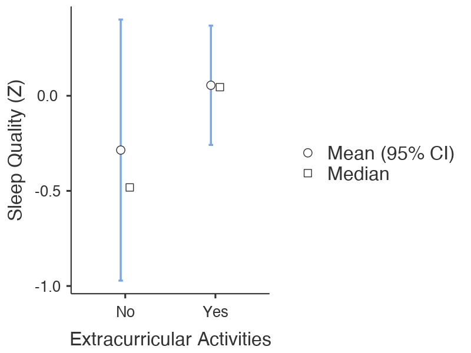
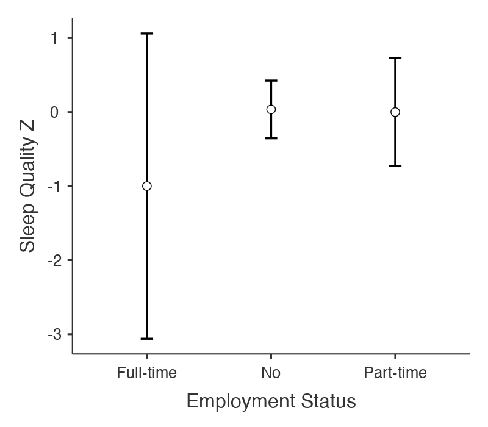
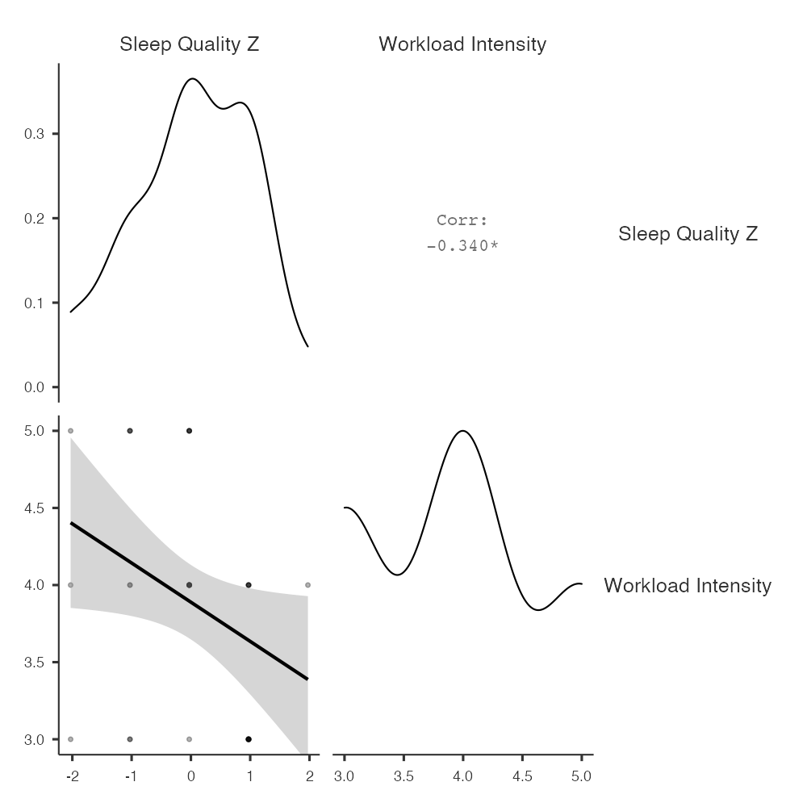
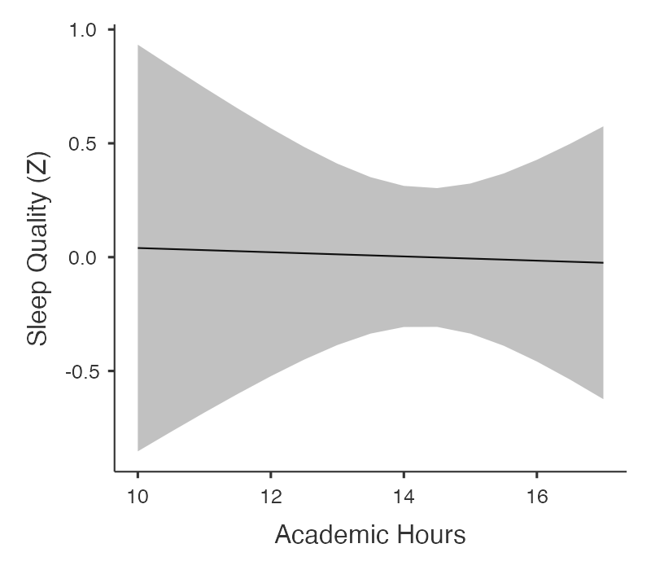

# E: *Results* example {-}

```{block2, type="rmdwarning", echo=T}
**WARNING**: This document will be uploaded to Turnitin. It will also have been read by your classmates. Therefore, it is a very bad idea to copy this to modify to use in your own *Results* section. Doing so would be a form of plagiarism. 
```

<br/>

```{block2, type="rmdtip", echo=T}
**TIP**: As noted in Chapter \@ref(WritingMethodSections), section \@ref(PWEFM1ParticipantsReviseSubsection), the proper way to use the example we have provided below is to paraphrase it. To do this, read through the example, section by section. For each section, read for meaning. Make sure you understand it. Then minimize it in your screen and bring up the document that you are writing. **Critically**, **walk away for a few minutes**. Wash a couple of dishes; dust off a shelf, write a text message to a friend; do some jumping jacks; whatever, but actively **do** something totally unrelated to writing this section. Then return after 2-3 minutes, and write out the relevant section in your own words, according to the content you remember reading from the example passage (adjusted for your own content, naturally). The cognitive reality here is that you will remember the content after 2-3 minutes, but you will have forgotten both the ordering of information and the exact wording of the original [The first evidence of this was found by Sachs [-@Sachs1967]]. This way, there is very little chance that you will plagiarize.
```

<br/>

The survey design and data for the example *Results* sections below are adapted from a classroom project by Fettig, López Fuentes, and Villarreal [-@FettigLopezfuentesVillarreal2019].

<br/>

>**Study 1**
>
>**Results**
>
>In this portion of the study, we looked at the effects on overall sleep quality from two categorical variables. The first was whether students were involved in extracurricular activities. This was answered as either *Yes* or *No* in the survey, and therefore had two levels. The second was their employment status, and could be answered as *No* (not employed), *Part-time*, or *Full-time*. Therefore, it had three levels. The variable *Extracurricular Activities* was analyzed using an independent-samples *t*-test, and the variable *Employment Status* was analyzed using a One-Way ANOVA. For the *t*-test, we used Welch's test, which is corrected for heterogeneity of variance, whereas in the One-Way ANOVA, we tested the assumption of homogeneity of variance with Levene's Test.
>
>*Extracurricular Activities*
>
>The results of the analysis of *Extracurricular Activities* on *Sleep Quality* is represented in Figure 1 below.
>
>
```{r, fig.cap="Figure 1. The effect of extracurricular activities on sleep quality. Error bars represent the 95% confidence interval. Sleep quality is on a standardized scale. (*NOTE: In the 7th edition of the APA Style Manual, the figure label should actually go above the figure (unlike here), followed on the next line by a description in italics, followed below that by the figure itself)*", echo=F, out.width="600px"}

```
>
>
>Although participants who reported being involved in extracurricular activities indicated that their sleep quality was better overall (*M* = 0.0522, *SD* = 0.891, *n* = 31) than their counterparts who reported not being involved in extracurricular activities (*M* = -0.285, *SD* = 0.858, *n* = 6), the difference was non-significant, *Welch's* *t*(7.25) = -0.885, *p* = .405, *d* =-0.384, 95% CI of the difference in means [-1.35, 0.87]. It seems that whatever differences there were between the groups may have been due to chance.
>
>*Employment Status*
>
>The results of the analysis of *Employment Status* on *Sleep Quality* is represented in Figure 2 below.
>
>
```{r, fig.cap="Figure 2. The effect of employment status on sleep quality. Error bars represent the 95% confidence interval. Sleep quality is on a standardized scale. (*NOTE: In the 7th edition of the APA Style Manual, the figure label should actually go above the figure (unlike here), followed on the next line by a description in italics, followed below that by the figure itself)*", echo=F, out.width="600px"}

```
>
>
>There seems to be a trend for participants who are working full time to report having lower sleep quality (*M* = -0.798, *SD* = not available, *n* = 1) than either the participants who were not working at all (*M* = 0.0124, *SD* = 0.915, *n* = 28) or who were working part-time (*M* = 0.0563, *SD* = 0.831, *n* = 8). However, there were no significant differences among the groups, *F*(2,34) = 0.504, *p* = 0.609, partial eta-squared = 0.029. Thus, although there were some trends in the data, nothing was statistically significant.
>
>We also ran post-hoc comparisons$^{\dagger\dagger}$ using the Holm correction. There was no significant difference between those who reported working full time and those who reported not working at all, *t*(34) = -0.886, *p* = 1. Nor was there any significant difference between full-timers and those who reported working part time, *t*(34) = -0.897, *p* = 1. Finally, there was no significant difference between the part-timers and those who reported not working at all, *t*(34) = -0.122, *p* = 1.]
>
>In fact, as is clear to see, there was only one participant who indicated they were working full time. These results cannot be trusted since there is no within-group variance associated with a factor level with an *n* of 1.
>
>If we drop that level and re-run the analysis between the students either working part time or not at all, we also get no statistically significant effect, *F*(1,34) = 0.00772, *p* = 0.931, partial eta-squared = 0.
>
>**Discussion**...


```{block2, type="rmdtip", echo=T}
$\dagger\dagger$ **NOTE**: Since there was no significant difference in the omnibus test, this paragraph would **not normally** appear in the *Results* section at all. But please recall that you are required to report them whether or not your omnibus *F*-test was significant. This is to keep the writing burdens equal across research groups, whether or not they got a significant effect in the omnibus test.
```


<br/>

---

<br/>

```{block2, type="rmdtip", echo=T}

**NOTE**: The example below pertains only to *Writing Assignment 4*.

``` 

---

>**Study 2**
>
>**Results**
>
>For study two, we examined how the following two variables affected *Sleep Quality*: 1) the number of units taken at the university (*Academic Hours*); and 2) the intensity of one's overall workload situation (*Workload Intensity*), which included academic as well as non-academic workload. As explained in the *Method* section, the former, *Academic Hours*, was measured simply in academic units, whereas the latter, *Workload Intensity*, was measured on a Likert scale from 1 to 5, with 1 indicating *not intense at all* and 5 representing *very intense*.
>
>The intensity of overall student workload is analyzed first.
>
>*Workload Intensity*
>
>We used Pearson's *r* to uncover the relation between *Sleep Quality* and *Workload Intensity*. This relation can be seen below in Figure 3 below.
>
>
```{r, fig.cap="Figure 3. The effect of *Workload Intensity* on *Sleep Quality*. Both *Sleep Quality* and *Workload Intensity* are on standardized scales. (*NOTE: In the 7th edition of the APA Style Manual, the figure label should actually go above the figure (unlike here), followed on the next line by a description in italics, followed below that by the figure itself)*", echo=F, out.width="600px"}

```
>
>This relation was statistically significant, *r*(34) = -.34, *p* = .043, 95% CI [-.60, -.013]. Simply put, as one's overall workload increases, one's quality of sleep declines. 
>
>*Academic Hours*
>
>The outcome variable *Sleep Quality* was regressed on *Academic Hours* using a simple linear regression. The results can be seen in Figure 4 below.
>
>
```{r, fig.cap="Figure 4. *Workload Intensity* regressed on *Academic Hours*. (*NOTE: In the 7th edition of the APA Style Manual, the figure label should actually go above the figure (unlike here), followed on the next line by a description in italics, followed below that by the figure itself)*", echo=F, out.width="600px"}

```
>
>*Sleep Quality* (standardized) is predicted to be at 0.133 if a "student"^[Note that the value at the intercept is meaningless in this study since there are, almost by definition, no active students taking 0 units.] were taking no credits at all. This intercept is not significantly different from zero, *b* = 0.133, *t*(34) = 0.097, *p* = .92, 95% CI [-2.66, 2.93]. This suggests, albeit rather oddly, that if a student did not register for any academic units at all, their quality of sleep would not be distinguishable from the average.
>
>Standardized *Sleep Quality* did decrease by a miniscule amount (*b*=.0093, 95% CI [-0.203, 0.185]) for every extra academic unit taken (starting in this sample of students at 10 units). This tiny drop in quality of sleep was, unsurprisingly, not statistically significant, *t*(34) = -0.097, *p* = .92. In general then, the quality of sleep that students report seems not to be affected at all by their courseload.
>
>**Discussion**...