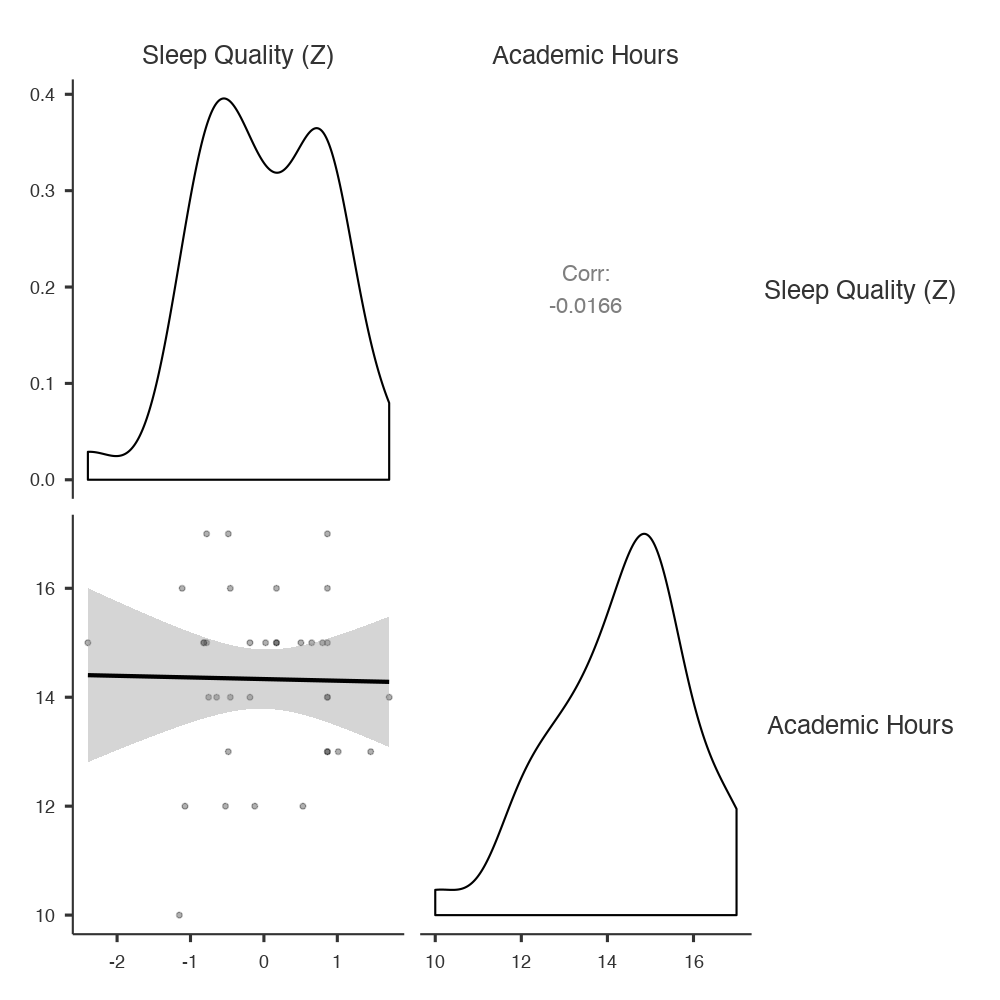
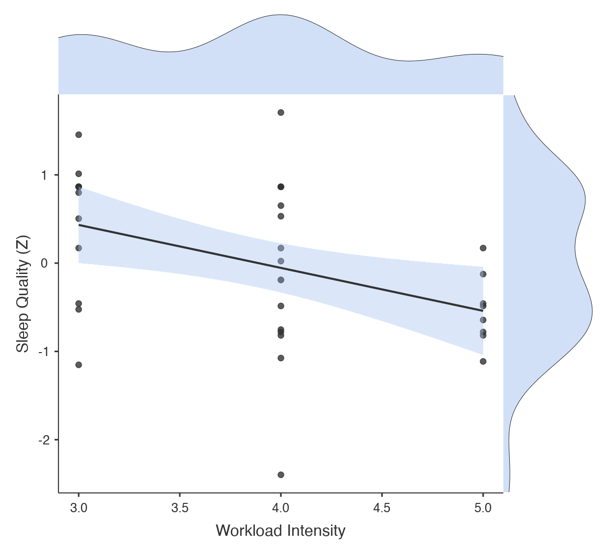

# I: *General Discussion* example {-}

```{block2, type="rmdwarning", echo=T}
**WARNING**: This document will be uploaded to Turnitin. It will also have been read by your classmates. Therefore, it is a very bad idea to copy this to modify to use in your own *General Discussion* section. Doing so would be a form of plagiarism. 
```

<br/>

```{block2, type="rmdtip", echo=T}
**TIP**: As noted in Chapter \@ref(WritingMethodSections), section \@ref(PWEFM1ParticipantsReviseSubsection), the proper way to use the example we have provided below is to paraphrase it. To do this, read through the example, section by section. For each section, read for meaning. Make sure you understand it. Then minimize it in your screen and bring up the document that you are writing. **Critically**, **walk away for a few minutes**. Wash a couple of dishes; dust off a shelf, write a text message to a friend; do some jumping jacks; whatever, but actively **do** something totally unrelated to writing this section. Then return after 2-3 minutes, and write out the relevant section in your own words, according to the content you remember reading from the example passage (adjusted for your own content, naturally). The cognitive reality here is that you will remember the content after 2-3 minutes, but you will have forgotten both the ordering of information and the exact wording of the original [The first evidence of this was found by Sachs [-@Sachs1967]]. This way, there is very little chance that you will plagiarize.
```

<br/>

The survey design and data for the example section below is adapted from a classroom project by Fettig, López Fuentes, and Villarreal [-@FettigLopezfuentesVillarreal2019]. The example starts with the *Results* and *Discussion* for *Study 2*, and then provides a *General Discussion* at the end.

<br/>

>**Introduction**...
>
>**Method**... [see Appendix C]
>
>**Study 1**...
>
>*Results*... [see Appendix E]
>
>*Discussion*... [see Appendix G]
>
>**Study 2**
>
>*Results*
>
>The analyses in this section concerned the correlation between overall sleep quality and the number of academic hours (course load) being taken by the students, on the one hand, and how well the same variable is predicted by workload intensity on the other. The number of academic hours taken was simply a sum of the credit hours they were taking at the time, whereas workload intensity was measured on a Likert scale.
>
>*Course load*
>
>Figure 3 below depicts the relationship between sleep quality and the number of academic course hours taken by the student at the time. 
>
>
```{r, fig.cap="Figure 3. The effect of current academic hours activities on sleep quality. Gray areas represent the 95% confidence interval. Sleep quality is on a standardized scale.", echo=F, out.width="600px"}

```
>
>
>This relationship was analyzed with Pearson's *r* correlation coefficient. We found there to be no correlation between sleep quality and the number of hours being taken by the student, *r*(34) = -0.017, *p* = 0.92, 95% CI [-0.343, 0.314], $R^2 = 0.00029$. Thus, it appears that there seems to be very little connection between sleep quality and academic course load. This is quite easily discernable from Figure 3 above.
>
>*Overall Workload*
>
>The second analysis was a simple regression between the dependent variable, *Sleep Quality* and the overall intensity of the student's workload (academic, professional, and extracurricular): *Workload Intensity*. This relationship is shown below in Figure 4.
>
>
```{r, fig.cap="Figure 4. Sleep quality as predicted by Workload Intensity, with density plots in the margins for both variables. Gray areas represent the 95% confidence interval. Sleep quality is on a standardized scale.", echo=F, out.width="600px"}

```
>
>
>The simple regression analysis showed that as overall workload intensity increased, sleep quality decreased. This was statistically significant, *b* = -0.49, *t*(34) = 2.64, *p* = 0.012, 95% CI [-0.861, -0.112], $R^2 = 0.17$. Apparently, it is not so much the number of academic hours that predicts sleep quality, but rather the overall amount of work (academic, professional, and extracurricular) that predicts it.
>
>
>**Discussion**
>
>In our second study, we analyzed intensity of workload in not only a specific domain of student life, course load, but also workload intensity overall, across academics, work, and extracurricular activities. We had expected to find that what is true at the higher level (the effect of overall "work"-load intensity on sleep quality) must also be true, somehow, at the lower level (the effect of academic intensity on sleep quality). That is, what is true of the whole must also be true of the part.
>
>That is not what we found here in the least. In fact, there seems to be a striking difference between the part and the whole. That is, there is arguably no relation at all between academic course load (measured in academic hours) and sleep quality (where the variance accounted for was as close to zero as one could possible expect); whereas there is a relatively weak, but statistically significant relation between overall work load (measured with a Likert item) and overall sleep quality (where the variance accounted for was about 17%). Apparently, it is the combination of work-load factors that leads to sleep-quality issues, not any one of the factors in isolation. 
>
>
>**General Discussion**
>
>At the outset of this study, we predicted that if students are given a chance to indicate their levels of daily student stress on a continuum rather than as categories, there would be a greater chance of connecting these stressors to sleep quality. 
>
>This was true at one level. That is, we did not find any effects in Study 1, where both independent variables were categorical in nature. But we did find an effect in Study 2, where both independent variables were on continuous scales. Thus, at least at one level, it is true that perhaps we need scales with finer resolution in order to detect the relations between daily student stressors and sleep quality.
>
>However, Study 2 also showed us that it was not merely the difference between categorical and continuous scales of measurement that led to differences in detecting the relation between daily student stressors and overall sleep quality. Rather, it was the difference between the part and the whole. That is, although both questions in Study 2 were given on continuous scales, the first (academic course load) was yet another sub-component of overall daily stressors, whereas the second (overall work load) asked students to indicate their combined stress level across all domains of their daily student life (academic, work, and extracurricular). Only the latter was significant, which compromises the notion that it was categorical versus continuous scales that mattered most in this study.
>
>Instead, what seems to be true is that it was not, in fact, this difference across scales of measurement that mattered, but rather the whole versus the components of the construct. Critically, the second question in Study 2 combined the three previous questions (i.e., both from Study 1, and the first from Study 2) into one. None of the first three turned out to be statistically significant, whereas the last question did. In the end, this suggest that what matters most is *what* you are measuring, not *how* you are doing it.
>
>As it should be easy to infer, a major weakness of this study was its initial premise: namely, that what matters most in studies of psychological phenomena is quantitative precision. Quantitative resolution is indeed important at some level. We do not dispute this. But it is subordinate to the importance of finding measures that truly address the phenomenon under scrutiny. If we had restricted ourselves to the subcomponents of overall daily workload without ever asking our last, single question regarding overall workload, we might never have found how they must be combined in order to arrive at a measure that can predict sleep quality.
>
>All that said, it is also possible (indeed likely) that a composite variable of three continuous variables, each of which addressed the workload subcomponents, would have given us a similar, or even better connection with overall sleep quality. Naturally, this was not possible in the current study since two of the three variables here were categorical.
>
>In the future, we hope that our study might serve as a lesson to future researchers who get too drawn in by issues of statistical measurement. That is, make sure that your statistical measures follow your construct development, and not the other way around. In other words, do not put the cart before the horse.